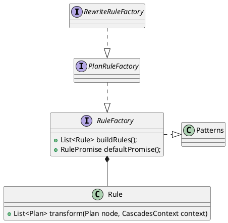
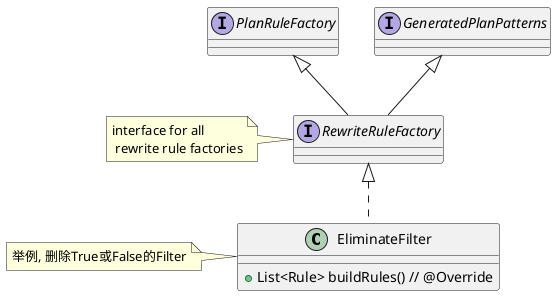

```java
// interface for all plan rule factories.
public interface PlanRuleFactory extends RuleFactory {
}

// interface for all rule factories for build some rules.
public interface RuleFactory extends Patterns {
    List<Rule> buildRules();

    @Override
    RulePromise defaultPromise();
}

public abstract class Rule {
    private final RuleType ruleType;
    private final Pattern<? extends Plan> pattern;
    private final RulePromise rulePromise;

    public abstract List<Plan> transform(Plan node, CascadesContext context) throws TransformException;
}
```

## Rewrite Rule



```java
// interface for all rewrite rule factories.
public interface RewriteRuleFactory extends PlanRuleFactory, GeneratedPlanPatterns {
    @Override
    default RulePromise defaultPromise() {
        return RulePromise.REWRITE;
    }
}
```