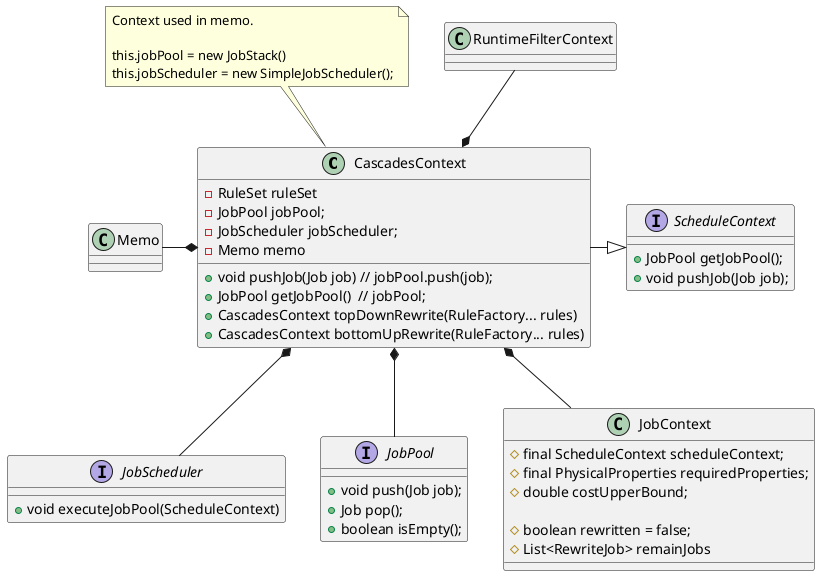
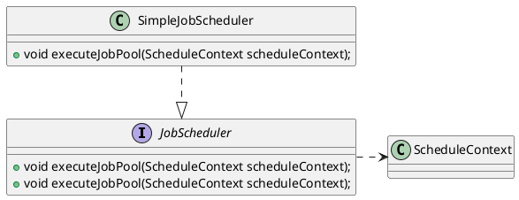

Doris的新查询优化是基于Cascades框架实现的，其中`CascadesContext`是执行过程重要的上下文信息。
```java
public class CascadesContext implements ScheduleContext {
    // in analyze/rewrite stage, the plan will storage in this field
    private Plan plan;
    // in optimize stage, the plan will storage in the memo
    private Memo memo;
    private final StatementContext statementContext;

    private final CTEContext cteContext;
    private final RuleSet ruleSet;
    private final JobPool jobPool;
    private final JobScheduler jobScheduler;
    private JobContext currentJobContext;
    // subqueryExprIsAnalyzed: whether the subquery has been analyzed.
    private final Map<SubqueryExpr, Boolean> subqueryExprIsAnalyzed;
    private final RuntimeFilterContext runtimeFilterContext;
    private Optional<Scope> outerScope = Optional.empty();
    private Map<Long, TableIf> tables = null;

    private boolean isRewriteRoot;
    private volatile boolean isTimeout = false;

    // current process subtree, represent outer plan if empty
    private final Optional<CTEId> currentTree;
    private final Optional<CascadesContext> parent;
}

public interface ScheduleContext {
    JobPool getJobPool();
    void pushJob(Job job);
}

public class JobContext {
    // use for optimizer
    protected final ScheduleContext scheduleContext;
    protected final PhysicalProperties requiredProperties;
    protected double costUpperBound;

    // use for rewriter
    protected boolean rewritten = false;
    protected List<RewriteJob> remainJobs = Collections.emptyList();
}
```


在Cascades框架中，计划的搜索空间表示为Memo，Nereids将执行过程中的各种变换抽象为Job,各种Job存放在JobPool中
```java
public interface JobPool {
    void push(Job job);
    Job pop();
    boolean isEmpty();
}

// LIFO implementation of {@link JobPool}.
public class JobStack implements JobPool {
    Stack<Job> stack = new Stack<>();
}
```
其中，CascadesContext构造的是`JobStack`,并抽象出`JobScheduler`进行Job的调度，实现从JobPool中取Job并执行
```java
// Scheduler to schedule jobs in Nereids.
public interface JobScheduler {
    void executeJobPool(ScheduleContext scheduleContext);
}
```
## Job
Nereids将执行过程中的各种变换抽象为Job，例如RBO阶段`PlanTreeRewriteJob`实现重写，`DeriveStatsJob`实现统计信息计算,DPHyp实现`JoinOrderJob`，CBO代价计算的`CostAndEnforcerJob`等，上述各种Job存放在JobPool中，这里的变换规则抽象为Rule(提供transform虚接口，负责变换的类实现该接口完成相应功能)，一些列的Rule组成了RuleSet。
```java
public abstract class Job implements TracerSupplier {
    protected JobType type;
    protected JobContext context;
    protected boolean once;
    // Doris支持disable_nereids_rules会话级参数
    // 可以,分割输入多个rule实现disable一系列Rule
    protected final Set<String> disableRules;

    // 执行Job
    public abstract void execute();
}
```
```java
public abstract class Rule {
    private final RuleType ruleType;
    private final Pattern<? extends Plan> pattern;
    private final RulePromise rulePromise;

    // 对应变换的类实现接口完成相应变换功能
    public abstract List<Plan> transform(Plan node,
        CascadesContext context) throws TransformException;
}
```

```plantuml
class JobStack {
    - Stack<Job> stack
}

interface JobPool {
    + void push(Job job);
    + Job pop();
    + boolean isEmpty();
}


abstract class Job {
    # JobType type;
    # JobContext context;
    # boolean once;
    # final Set<String> disableRules;
    + abstract void execute();
}

class Rule {
    + List<Plan> transform(Plan node, CascadesContext context)
}

JobStack -down.|> JobPool

JobStack -right-* Job

Rule -up-* RuleSet
Job  -right..> RuleSet


PlanTreeRewriteJob -down.|> Job
DeriveStatsJob -down.|> Job
JoinOrderJob -down.|> Job
CostAndEnforcerJob -down.|> Job
```


## JobScheduler
`Job`存储在`JobPool`中，`JobScheduler`进行`Job`调度，从`JobPool`中取`Job`并执行。`CascadesContext`中创建的是`SimpleJobScheduler`，实现串行执行Job。

```java
// Single thread, serial scheduler
public class SimpleJobScheduler implements JobScheduler {
    void executeJobPool(ScheduleContext scheduleContext);
}

// Scheduler to schedule jobs in Nereids.
public interface JobScheduler {
    void executeJobPool(ScheduleContext scheduleContext);
}

public interface ScheduleContext {
    JobPool getJobPool();
    void pushJob(Job job);
}
```
