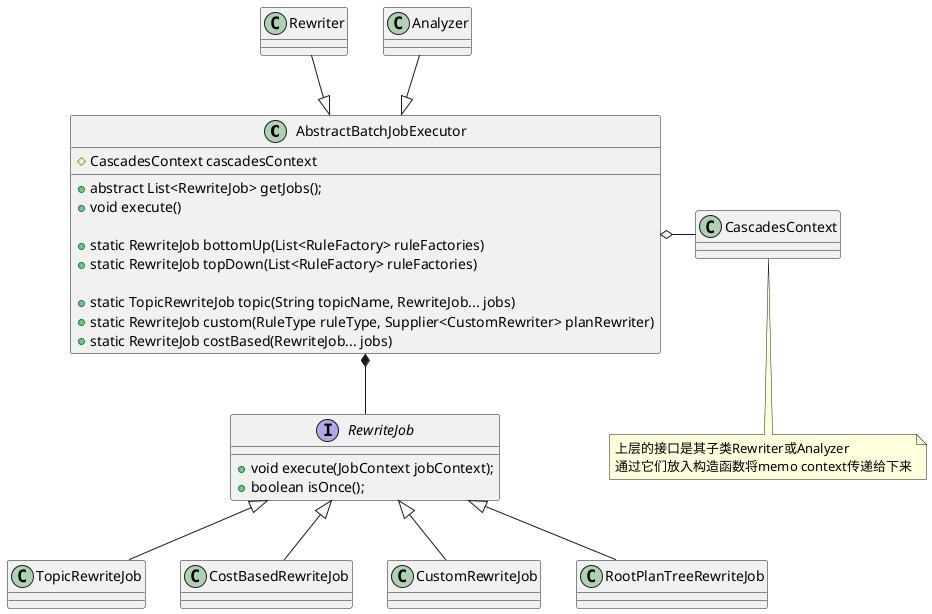
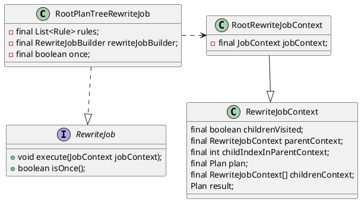
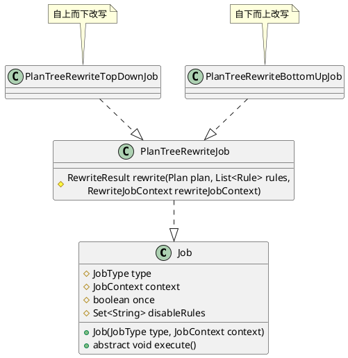

```java
public interface RewriteJob {
    void execute(JobContext jobContext);
    boolean isOnce();
}

public class TopicRewriteJob implements RewriteJob {}

public class CostBasedRewriteJob implements RewriteJob {}

public class CustomRewriteJob implements RewriteJob {
    private final RuleType ruleType;
    private final Supplier<CustomRewriter> customRewriter;
}

public class RootPlanTreeRewriteJob implements RewriteJob {}
```

```java
/**
 * Base class for executing all jobs.
 * Each batch of rules will be uniformly executed.
 */
public abstract class AbstractBatchJobExecutor {
    protected CascadesContext cascadesContext;
    // 获取需要执行的一系列Job
    public abstract List<RewriteJob> getJobs();
    
    // 将待处理规则(表示为RewriteJob)并对外提供execute接口来执行任务
    public void execute() {
        for (int i = 0; i < getJobs().size(); i++) {
            JobContext jobContext = cascadesContext.getCurrentJobContext();
            RewriteJob currentJob = getJobs().get(i);
            if (currentJob instanceof CostBasedRewriteJob) {
                List<RewriteJob> remainJobs = getJobs().subList(i + 1, getJobs().size()).stream()
                        .filter(j -> !(j instanceof CostBasedRewriteJob))
                        .collect(Collectors.toList());
                jobContext.setRemainJobs(remainJobs);
            }
            do {
                jobContext.setRewritten(false);
                currentJob.execute(jobContext);
            } while (!currentJob.isOnce() && jobContext.isRewritten());
        }
    }
}
```

借助`RootPlanTreeRewriteJob`
```java
public class RootPlanTreeRewriteJob implements RewriteJob {
    private final List<Rule> rules;
    private final RewriteJobBuilder rewriteJobBuilder;
    private final boolean once;

    public RootPlanTreeRewriteJob(List<Rule> rules,
                RewriteJobBuilder rewriteJobBuilder, boolean once) {
        this.rules = Objects.requireNonNull(rules, "rules cannot be null");
        this.rewriteJobBuilder = Objects.requireNonNull(
                rewriteJobBuilder, "rewriteJobBuilder cannot be null");
        this.once = once;
    }

    // 函数式编程接口
    public interface RewriteJobBuilder {
        Job build(RewriteJobContext rewriteJobContext, JobContext jobContext, List<Rule> rules);
    }
}
```



`PlanTreeRewriteTopDownJob`和`PlanTreeRewriteBottomUpJob`实现对外提供`topDown`和`bottomUp`两个接口


`PlanTreeRewriteJob`实现了`rewrite`接口,通过`Job`获取可用的规则，调用`transform`进行变换。
```java
public abstract class Job implements TracerSupplier {
    protected JobType type;
    protected JobContext context;
    protected boolean once;
    protected final Set<String> disableRules;
    List<Rule> getValidRules(...) {}
}

public abstract class PlanTreeRewriteJob extends Job {
    private final RewriteJobContext rewriteJobContext;
    private final List<Rule> rules;
    protected RewriteResult rewrite(Plan plan, List<Rule> rules, RewriteJobContext rewriteJobContext) {
                        .......
        List<Rule> validRules = getValidRules(rules);
        for (Rule rule : validRules) {
            Pattern<Plan> pattern = (Pattern<Plan>) rule.getPattern();
            if (pattern.matchPlanTree(plan)) {
                List<Plan> newPlans = rule.transform(plan, cascadesContext);
            }
            ......
        }
    }
}
```

## BottomUp
```java
public class RootPlanTreeRewriteJob implements RewriteJob {
    private final List<Rule> rules;
    private final RewriteJobBuilder rewriteJobBuilder;
    private final boolean once;
}
```
```java
public class PlanTreeRewriteBottomUpJob extends PlanTreeRewriteJob {

}
```

## TopDown
```java
public class PlanTreeRewriteTopDownJob extends PlanTreeRewriteJob {
    private final RewriteJobContext rewriteJobContext;
    private final List<Rule> rules;
}
```

## Optimize
### Derive Stat
```java
public class DeriveStatsJob extends Job {

}
```

### DPHyp

```java
public class JoinOrderJob extends Job {
    private final Group group;
    private final Set<NamedExpression> otherProject = new HashSet<>();
}
```

### OptimizeGroupJob
```java
public class OptimizeGroupJob extends Job {
    private final Group group;
}
```


