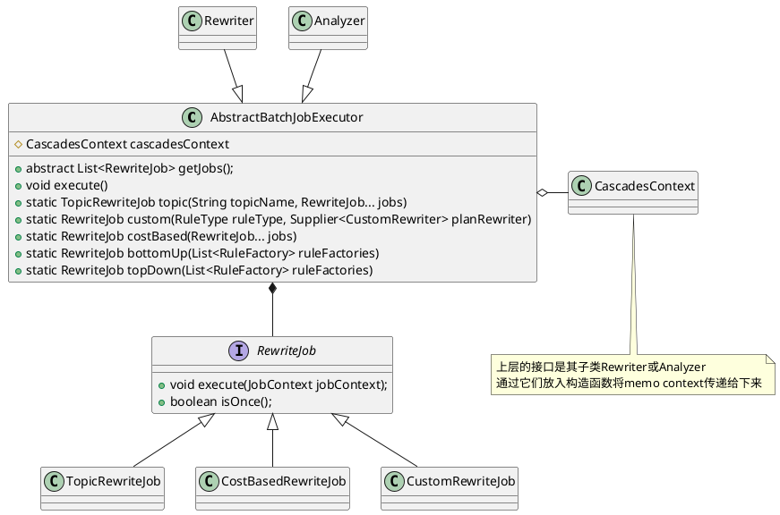
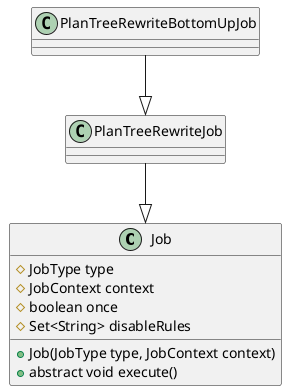

```java
public interface RewriteJob {
    void execute(JobContext jobContext);
    boolean isOnce();
}

public class TopicRewriteJob implements RewriteJob {}

public class CostBasedRewriteJob implements RewriteJob {}

public class CustomRewriteJob implements RewriteJob {
    private final RuleType ruleType;
    private final Supplier<CustomRewriter> customRewriter;
}
```

```java
/**
 * Base class for executing all jobs.
 * Each batch of rules will be uniformly executed.
 */
public abstract class AbstractBatchJobExecutor {
    protected CascadesContext cascadesContext;
    // 获取需要执行的一系列Job
    public abstract List<RewriteJob> getJobs();
    
    // 将待处理规则(表示为RewriteJob)并对外提供execute接口来执行任务
    public void execute() {
        for (int i = 0; i < getJobs().size(); i++) {
            JobContext jobContext = cascadesContext.getCurrentJobContext();
            RewriteJob currentJob = getJobs().get(i);
            if (currentJob instanceof CostBasedRewriteJob) {
                List<RewriteJob> remainJobs = getJobs().subList(i + 1, getJobs().size()).stream()
                        .filter(j -> !(j instanceof CostBasedRewriteJob))
                        .collect(Collectors.toList());
                jobContext.setRemainJobs(remainJobs);
            }
            do {
                jobContext.setRewritten(false);
                currentJob.execute(jobContext);
            } while (!currentJob.isOnce() && jobContext.isRewritten());
        }
    }
}
```

## BottomUp

```java
public interface TracerSupplier {
    EventProducer getEventTracer();
}

public abstract class Job implements TracerSupplier {
    protected JobType type;
    protected JobContext context;
    protected boolean once;
    protected final Set<String> disableRules;
}

public abstract class PlanTreeRewriteJob extends Job {
    private final RewriteJobContext rewriteJobContext;
    private final List<Rule> rules;
}

public class PlanTreeRewriteBottomUpJob extends PlanTreeRewriteJob {

}
```
## TopDown
```java
public class PlanTreeRewriteTopDownJob extends PlanTreeRewriteJob {
    private final RewriteJobContext rewriteJobContext;
    private final List<Rule> rules;
}
```