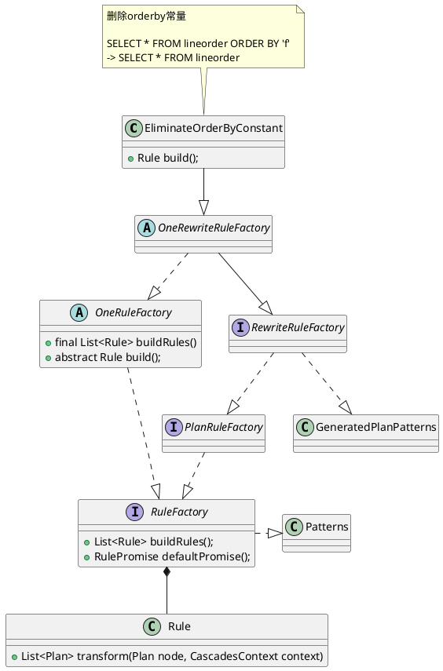
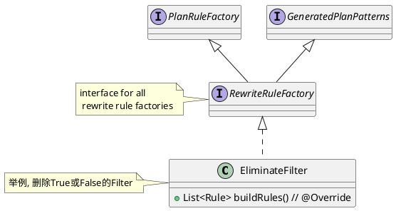

Doris支持会话级参数
```shell
# disable多个Rule
SET disable_nereids_rules="rule1,rule2";
```


```java
// abstract class for all rule factories build one rule used in rewrite stage
public abstract class OneRewriteRuleFactory
        extends OnePlanRuleFactory implements RewriteRuleFactory {
}

// abstract class for all rule factories build one plan rule.
public abstract class OnePlanRuleFactory extends OneRuleFactory
        implements PlanRuleFactory {
}

// abstract class for all rule factories build one rule.
public abstract class OneRuleFactory implements RuleFactory {
    @Override
    public final List<Rule> buildRules() {
        return ImmutableList.of(build());
    }

    public abstract Rule build();
}

// interface for all plan rule factories.
public interface PlanRuleFactory extends RuleFactory {
}

// interface for all rule factories for build some rules.
public interface RuleFactory extends Patterns {
    List<Rule> buildRules();

    @Override
    RulePromise defaultPromise();
}

public abstract class Rule {
    private final RuleType ruleType;
    private final Pattern<? extends Plan> pattern;
    private final RulePromise rulePromise;

    public abstract List<Plan> transform(Plan node, CascadesContext context) throws TransformException;
}
```

## Rewrite Rule



```java
// interface for all rewrite rule factories.
public interface RewriteRuleFactory extends PlanRuleFactory, GeneratedPlanPatterns {
    @Override
    default RulePromise defaultPromise() {
        return RulePromise.REWRITE;
    }
}
```