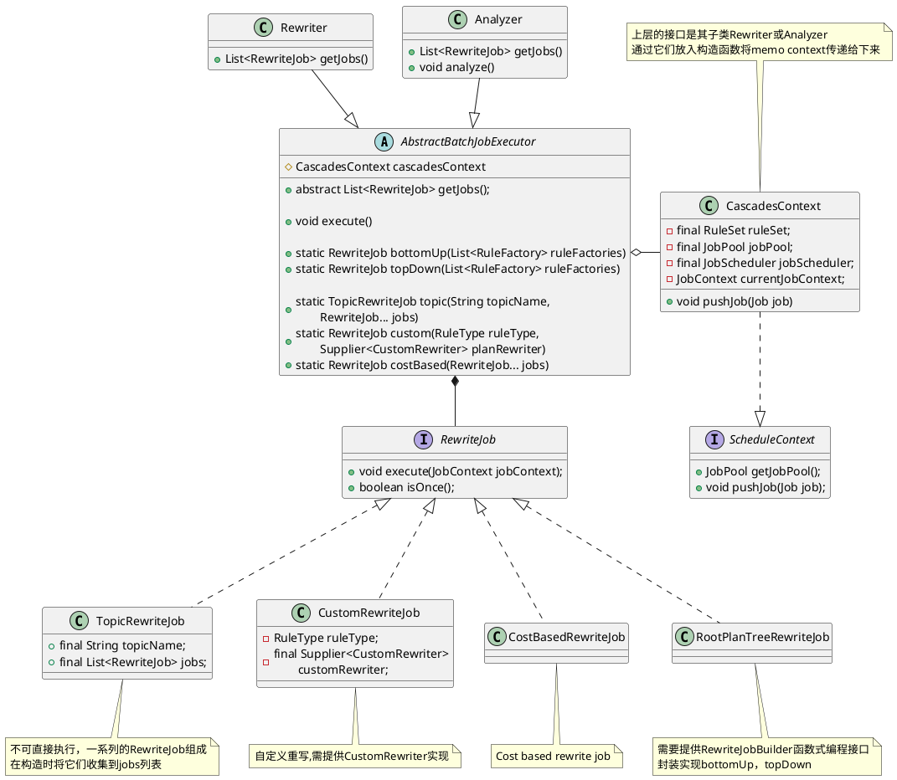
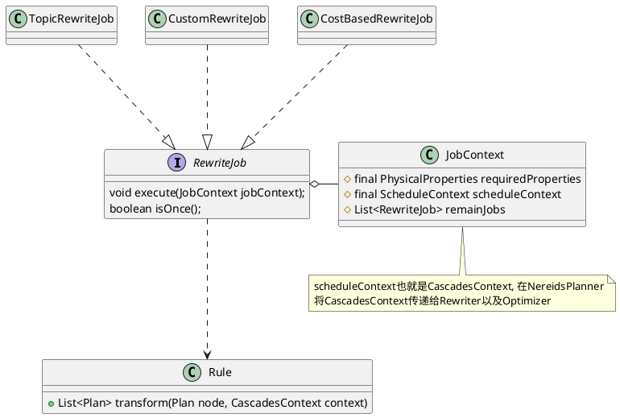
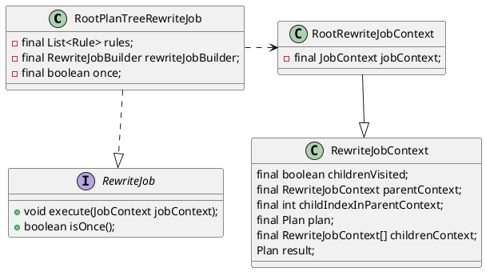
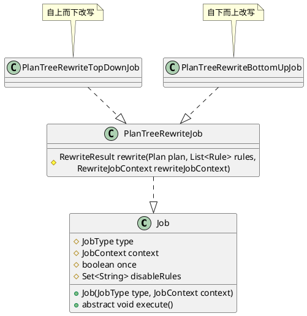

rewite的调用入口来自`NereidsPlanner`的`rewrite`
```java
public class NereidsPlanner extends Planner {
                ......
    private void rewrite() {
        Rewriter.getWholeTreeRewriter(cascadesContext).execute();
        NereidsTracer.logImportantTime("EndRewritePlan");
    }
                ......
}
```
`Rewriter`继承`AbstractBatchJobExecutor`，`Rewriter`提供一系列RewriteJob并实现`getJobs()`接口，其父类`AbstractBatchJobExecutor`实现`execute()`实现Job执行采用统一逻辑。

```java
public class Rewriter extends AbstractBatchJobExecutor {
    private final List<RewriteJob> rewriteJobs;

            .....
    @Override
    public List<RewriteJob> getJobs() {
        return rewriteJobs;
    }
            ......
}

// Base class for executing all jobs.
// Each batch of rules will be uniformly executed.
public abstract class AbstractBatchJobExecutor {
    protected CascadesContext cascadesContext;

    public void execute() {
            ......
    }

    public abstract List<RewriteJob> getJobs();
}
```

# Job执行



```java
// Base class for executing all jobs.
// Each batch of rules will be uniformly executed.
public abstract class AbstractBatchJobExecutor {
    // 也就是CascadesContext, 在NereidsPlanner
    // 将CascadesContext传递给Rewriter以及Optimizer
    protected CascadesContext cascadesContext;
    // 获取需要执行的一系列Job，子类负责完成实现
    public abstract List<RewriteJob> getJobs();
    
    // 将待处理规则(表示为RewriteJob)并对外提供execute接口来执行任务
    public void execute() {
        for (int i = 0; i < getJobs().size(); i++) {
            JobContext jobContext = cascadesContext.getCurrentJobContext();
            RewriteJob currentJob = getJobs().get(i);
            if (currentJob instanceof CostBasedRewriteJob) {
                List<RewriteJob> remainJobs = getJobs()
                        .subList(i + 1, getJobs().size()).stream()
                        .filter(j -> !(j instanceof CostBasedRewriteJob))
                        .collect(Collectors.toList());
                jobContext.setRemainJobs(remainJobs);
            }
            do {
                jobContext.setRewritten(false);
                currentJob.execute(jobContext);
            } while (!currentJob.isOnce() && jobContext.isRewritten());
        }
    }
}
```

# Rewrite Job

```java
public interface RewriteJob {
    void execute(JobContext jobContext);
    boolean isOnce();
}
```

## TopicRewriteJob
```java
// 不可直接执行，一系列的RewriteJob组成
// 在构造时将它们收集到jobs列表
public class TopicRewriteJob implements RewriteJob {
    public final String topicName;
    public final List<RewriteJob> jobs;

                ....
    @Override
    public void execute(JobContext jobContext) {
        throw new AnalysisException("should not execute topic rewrite job "
            + topicName + " directly.");
    }
}
```

## Custom Rewrite

Custom实际上就是调用指定的函数接口。
```plantuml

class CustomRewriteJob {
    void execute(JobContext context)
}

interface CustomRewriter {
    + Plan rewriteRoot(Plan plan, JobContext jobContext);
}

interface RewriteJob {
    + void execute(JobContext jobContext);
    + boolean isOnce();
}
CustomRewriteJob .|> RewriteJob
CustomRewriter -up-* CustomRewriteJob
```

```java
public class CustomRewriteJob implements RewriteJob {
    private final RuleType ruleType;
    private final Supplier<CustomRewriter> customRewriter;

    public CustomRewriteJob(Supplier<CustomRewriter> rewriter, RuleType ruleType) {
            .....
    }

    @Override
    public void execute(JobContext context) {
        Set<String> disableRules = Job.getDisableRules(context);
        if (disableRules.contains(ruleType.name().toUpperCase(Locale.ROOT))) {
            return;
        }
        Plan root = context.getCascadesContext().getRewritePlan();
        Plan rewrittenRoot = customRewriter.get().rewriteRoot(root, context);
        context.getCascadesContext().setRewritePlan(rewrittenRoot);
    }

    @Override
    public boolean isOnce() {
        return false;
    }
}

// 函数式编程接口
public interface CustomRewriter {
    Plan rewriteRoot(Plan plan, JobContext jobContext);
}
```


## CostBasedRewrite
```java
public class CostBasedRewriteJob implements RewriteJob {

}
```
## RootPlanTreeRewrite
`PlanTreeRewriteTopDownJob`和`PlanTreeRewriteBottomUpJob`实现对外提供`topDown`和`bottomUp`两个接口。



借助`RootPlanTreeRewriteJob`
```java
public class RootPlanTreeRewriteJob implements RewriteJob {
    private final List<Rule> rules;
    private final RewriteJobBuilder rewriteJobBuilder;
    private final boolean once;

    public RootPlanTreeRewriteJob(List<Rule> rules,
                RewriteJobBuilder rewriteJobBuilder, boolean once) {
        this.rules = Objects.requireNonNull(rules, "rules cannot be null");
        this.rewriteJobBuilder = Objects.requireNonNull(
                rewriteJobBuilder, "rewriteJobBuilder cannot be null");
        this.once = once;
    }

    protected RewriteResult rewrite(Plan plan, List<Rule> rules, RewriteJobContext rewriteJobContext) {
                        .......
        List<Rule> validRules = getValidRules(rules);
        for (Rule rule : validRules) {
            Pattern<Plan> pattern = (Pattern<Plan>) rule.getPattern();
            if (pattern.matchPlanTree(plan)) {
                List<Plan> newPlans = rule.transform(plan, cascadesContext);
            }
            ......
        }
    }

    // 函数式编程接口
    public interface RewriteJobBuilder {
        Job build(RewriteJobContext rewriteJobContext, JobContext jobContext, List<Rule> rules);
    }
}
```



`PlanTreeRewriteJob`实现了`rewrite`接口,通过`Job`获取可用的规则，调用`transform`进行变换。
```java
public abstract class Job implements TracerSupplier {
    protected JobType type;
    protected JobContext context;
    protected boolean once;
    protected final Set<String> disableRules;
    List<Rule> getValidRules(...) {}
}

public abstract class PlanTreeRewriteJob extends Job {
    private final RewriteJobContext rewriteJobContext;
    private final List<Rule> rules;

}
```

## BottomUp
```java
public class RootPlanTreeRewriteJob implements RewriteJob {
    private final List<Rule> rules;
    private final RewriteJobBuilder rewriteJobBuilder;
    private final boolean once;
}
```
```java
public class PlanTreeRewriteBottomUpJob extends PlanTreeRewriteJob {

}
```

## TopDown
```java
public class PlanTreeRewriteTopDownJob extends PlanTreeRewriteJob {
    private final RewriteJobContext rewriteJobContext;
    private final List<Rule> rules;
}
```


