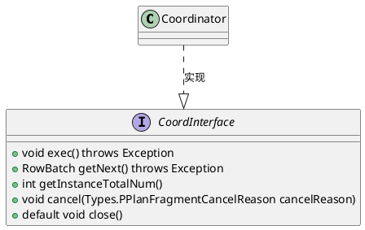

```plantuml
@startuml
class Coordinator {

}

interface CoordInterface {
    + void exec() throws Exception
    + RowBatch getNext() throws Exception
    + int getInstanceTotalNum()
    + void cancel(Types.PPlanFragmentCancelReason cancelReason)
    + default void close()
}

Coordinator -down.|> CoordInterface : 实现
@enduml
```
