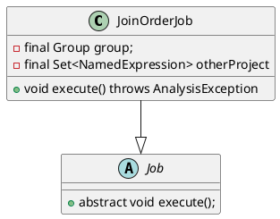
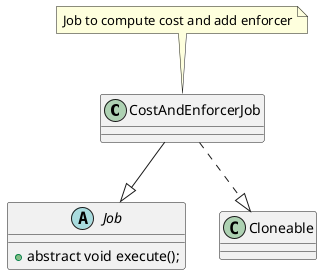

optimize的入口通过`NereidsPlanner`的`optimize`
```java
private void optimize() {
    new Optimizer(cascadesContext).execute();
}
```
优化逻辑封装在`Optimizer`,接下来了解其实现
```java
public class Optimizer {
    private final CascadesContext cascadesContext;

    public Optimizer(CascadesContext cascadesContext) {
        this.cascadesContext = Objects.requireNonNull(cascadesContext,
                "cascadesContext cannot be null");
    }

    // execute optimize, use dphyp or cascades according to join number and session variables.
    public void execute() {
        // 1. init memo
        cascadesContext.toMemo();

        // 2. stats derive
        cascadesContext.pushJob(new DeriveStatsJob(cascadesContext.getMemo().getRoot().       
                getLogicalExpression(), cascadesContext.getCurrentJobContext()));
        cascadesContext.getJobScheduler().executeJobPool(cascadesContext);
        serializeStatUsed(cascadesContext.getConnectContext());
        
        // 3. DPHyp optimize
        int maxJoinCount = cascadesContext.getMemo().countMaxContinuousJoin();
        cascadesContext.getStatementContext().setMaxContinuousJoin(maxJoinCount);
        boolean isDpHyp = getSessionVariable().enableDPHypOptimizer
                || maxJoinCount > getSessionVariable().getMaxTableCountUseCascadesJoinReorder();
        cascadesContext.getStatementContext().setDpHyp(isDpHyp);
        cascadesContext.getStatementContext().setOtherJoinReorder(false);
        if (!getSessionVariable().isDisableJoinReorder() && isDpHyp
                && maxJoinCount <= getSessionVariable().getMaxJoinNumberOfReorder()) {
            //RightNow, dphyper can only order 64 join operators
            dpHypOptimize();
        }

        // 4. Cascades optimize
        cascadesContext.pushJob(
                new OptimizeGroupJob(cascadesContext.getMemo().getRoot(), cascadesContext.getCurrentJobContext()));
        cascadesContext.getJobScheduler().executeJobPool(cascadesContext);
    }
}
```

# Derive Stat
```java
public class DeriveStatsJob extends Job {

}
```

## DPHyp
在`Optimizer`的`execute`可以看到`dpHypOptimize`的调用入口
```java
public void execute() {
            ....
    // DPHyp optimize
    int maxJoinCount = cascadesContext.getMemo().countMaxContinuousJoin();
    cascadesContext.getStatementContext().setMaxContinuousJoin(maxJoinCount);
    boolean isDpHyp = getSessionVariable().enableDPHypOptimizer
            || maxJoinCount > getSessionVariable().getMaxTableCountUseCascadesJoinReorder();
    cascadesContext.getStatementContext().setDpHyp(isDpHyp);
    cascadesContext.getStatementContext().setOtherJoinReorder(false);
    if (!getSessionVariable().isDisableJoinReorder() && isDpHyp
            && maxJoinCount <= getSessionVariable().getMaxJoinNumberOfReorder()) {
        //RightNow, dphyper can only order 64 join operators
        dpHypOptimize();
    }
            ......
}
```
可见，使用DPHyp和下面几个参数相关
```sql
SET enable_dphyp_optimizer = true;
max_table_count_use_cascades_join_reorder

set disable_join_reorder = true
max_join_number_of_reorder
```


Optimizer的`dpHypOptimize()`是DPHyp的入口
```java
private void dpHypOptimize() {
    Group root = cascadesContext.getMemo().getRoot();
    cascadesContext.pushJob(new JoinOrderJob(root, cascadesContext.getCurrentJobContext()));
    cascadesContext.getJobScheduler().executeJobPool(cascadesContext);
    // after DPHyp just keep logical expression
    cascadesContext.getMemo().removePhysicalExpression();
    cascadesContext.getStatementContext().setOtherJoinReorder(true);
}
```




## OptimizeGroupJob

```java
public class OptimizeGroupJob extends Job {
    private final Group group;
}
```
```
OptimizeGroupExpressionJob
CostAndEnforcerJob
```
