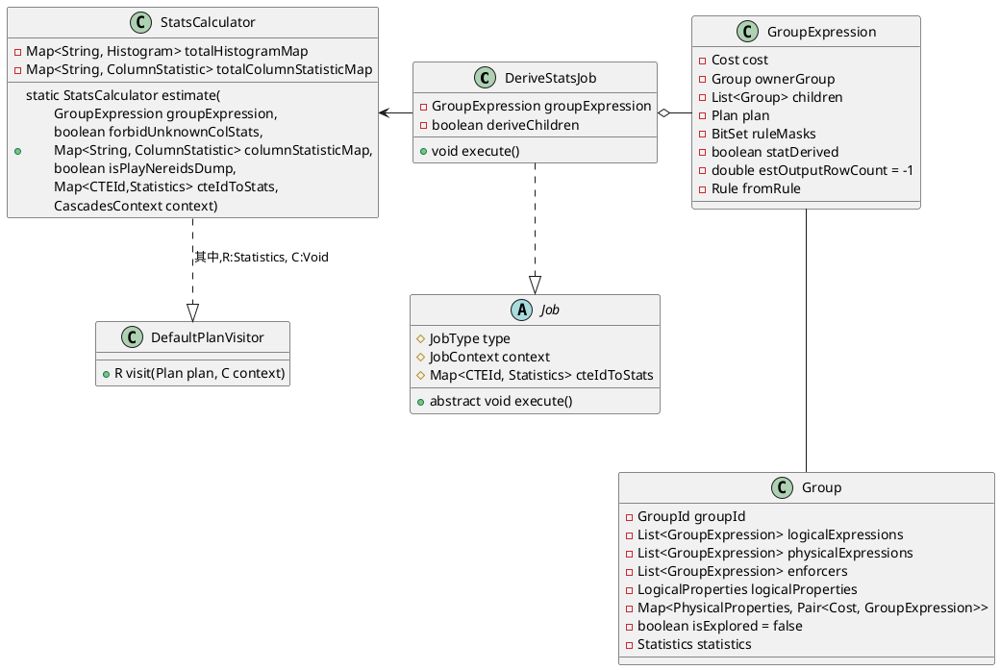
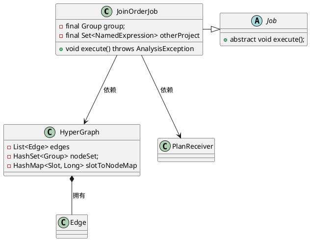
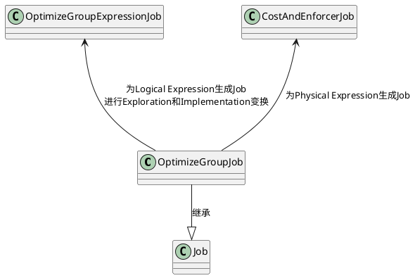
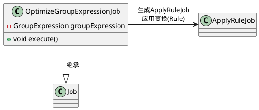
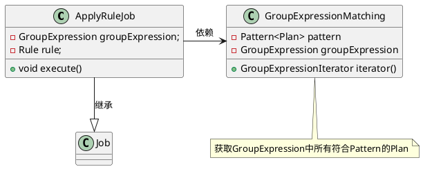
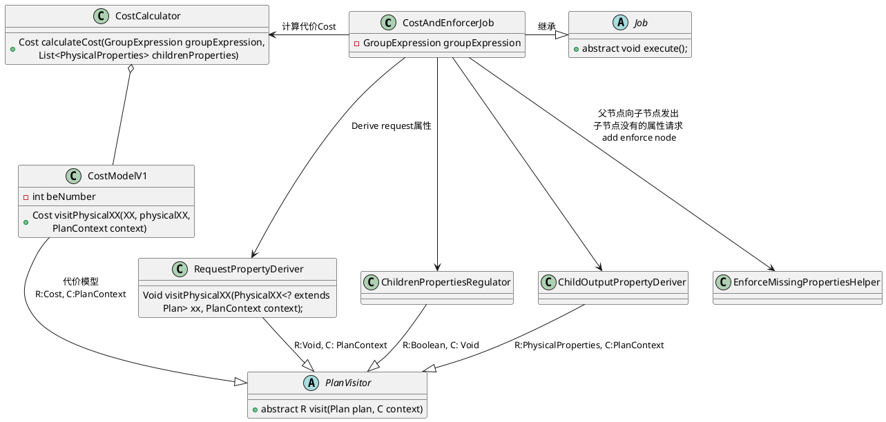
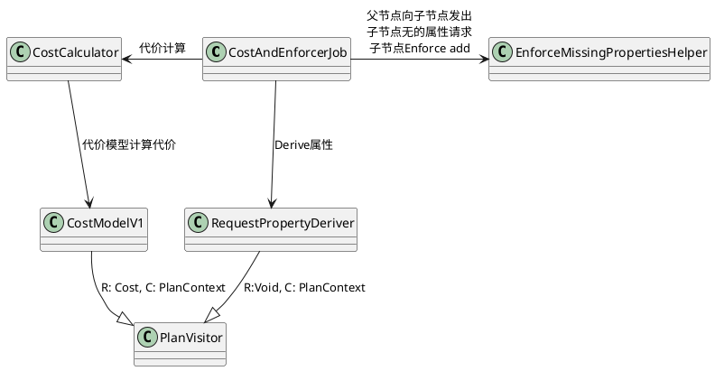

完成rewrite，开始optimize的入口通过`NereidsPlanner`的`optimize`，这部分是CBO(基于代价的优化)
```java
private void optimize() {
    new Optimizer(cascadesContext).execute();
}
```
优化逻辑封装在`Optimizer`,接下来了解其实现
```java
public class Optimizer {
    private final CascadesContext cascadesContext;

    public Optimizer(CascadesContext cascadesContext) {
        this.cascadesContext = Objects.requireNonNull(cascadesContext,
                "cascadesContext cannot be null");
    }

    public void execute() {
        // 1. init memo
        cascadesContext.toMemo();

        // 2. stats derive
        cascadesContext.pushJob(new DeriveStatsJob(cascadesContext.getMemo().getRoot().       
                getLogicalExpression(), cascadesContext.getCurrentJobContext()));
        cascadesContext.getJobScheduler().executeJobPool(cascadesContext);
        serializeStatUsed(cascadesContext.getConnectContext());
        
        // 3. DPHyp optimize
        int maxJoinCount = cascadesContext.getMemo().countMaxContinuousJoin();
        cascadesContext.getStatementContext().setMaxContinuousJoin(maxJoinCount);
        boolean isDpHyp = getSessionVariable().enableDPHypOptimizer
                || maxJoinCount > getSessionVariable().getMaxTableCountUseCascadesJoinReorder();
        cascadesContext.getStatementContext().setDpHyp(isDpHyp);
        cascadesContext.getStatementContext().setOtherJoinReorder(false);
        if (!getSessionVariable().isDisableJoinReorder() && isDpHyp
                && maxJoinCount <= getSessionVariable().getMaxJoinNumberOfReorder()) {
            //RightNow, dphyper can only order 64 join operators
            dpHypOptimize();
        }

        // 4. Cascades optimize
        cascadesContext.pushJob(new OptimizeGroupJob(cascadesContext.getMemo().getRoot(),
                cascadesContext.getCurrentJobContext()));
        cascadesContext.getJobScheduler().executeJobPool(cascadesContext);
    }
}
```

# Derive Stat

`Optimizer::execute`是Derive统计信息的入口
```java
public void execute() {
                ......
    // 2. stats derive
    cascadesContext.pushJob(new DeriveStatsJob(
        // Root Group的第一个Logical Group Expression
        cascadesContext.getMemo().getRoot().getLogicalExpression(),
        cascadesContext.getCurrentJobContext()));
    cascadesContext.getJobScheduler().executeJobPool(cascadesContext);
    serializeStatUsed(cascadesContext.getConnectContext());
                ......
}
```


```java
public class DeriveStatsJob extends Job {

}
```
## Derive Stats Job

自下而上derive stat,
```java
public void execute() {
    // 如果stat已经derive直接返回，在StatsCalculator::estimate完成统计信息计算
    // 将groupExpression.setStatDerived(true)
    if (groupExpression.isStatDerived() || groupExpression.isUnused()) {
        return;
    }

    countJobExecutionTimesOfGroupExpressions(groupExpression);
    // 1. 孩子还没derive，为子GroupExpression生成DeriveStatsJob计算孩子统计信息
    //    由于Job处理是stack模式，现生成当前GroupExpression的DeriveStatsJob
    //    再为子GroupExpression生成DeriveStatsJob，实现自下而上计算统计信息
    if (!deriveChildren && groupExpression.arity() > 0) {
        // 1.1 生成当前GroupExpression的DeriveStatsJob
        pushJob(new DeriveStatsJob(groupExpression, true, context, cteIdToStats));

        // 1.2 为子GroupExpression生成DeriveStatsJob生成DeriveStatsJob
        List<Group> children = groupExpression.children();
        for (int i = children.size() - 1; i >= 0; i--) {
            Group childGroup = children.get(i);

            List<GroupExpression> logicalExpressions = childGroup.getLogicalExpressions();
            for (int j = logicalExpressions.size() - 1; j >= 0; j--) {
                GroupExpression logicalChild = logicalExpressions.get(j);
                if (!logicalChild.isStatDerived()) {
                    pushJob(new DeriveStatsJob(logicalChild, context, cteIdToStats));
                }
            }

            List<GroupExpression> physicalExpressions = childGroup.getPhysicalExpressions();
            for (int j = physicalExpressions.size() - 1; j >= 0; j--) {
                GroupExpression physicalChild = physicalExpressions.get(j);
                if (!physicalChild.isStatDerived()) {
                    pushJob(new DeriveStatsJob(physicalChild, context, cteIdToStats));
                }
            }
        }
    } else {
        // 2. 进行当前GroupExpression的统计信息估算
        StatsCalculator statsCalculator = StatsCalculator.estimate(groupExpression,
                context.getCascadesContext().getConnectContext().getSessionVariable().getForbidUnknownColStats(),
                context.getCascadesContext().getConnectContext().getTotalColumnStatisticMap(),
                context.getCascadesContext().getConnectContext().getSessionVariable().isPlayNereidsDump(),
                cteIdToStats,
                context.getCascadesContext());
                ......
        if (groupExpression.getPlan() instanceof Project) {
            double parentRowCount = groupExpression.getOwnerGroup().getStatistics().getRowCount();
            groupExpression.children().forEach(g -> g.setStatistics(
                    g.getStatistics().withRowCountAndEnforceValid(parentRowCount))
            );
        }
    }
}
```

## 统计信息计算
Doris借助`StatsCalculator`实现统计信息的计算，它对外提供了静态接口
```java
// 统计信息估算
public static StatsCalculator estimate(GroupExpression groupExpression,
        boolean forbidUnknownColStats,
        Map<String, ColumnStatistic> columnStatisticMap,
        boolean isPlayNereidsDump,
        Map<CTEId, Statistics> cteIdToStats, CascadesContext context) {
    StatsCalculator statsCalculator = new StatsCalculator(groupExpression,
        forbidUnknownColStats, columnStatisticMap, isPlayNereidsDump,
        cteIdToStats, context);
    // 调用estimate进行估算
    statsCalculator.estimate();
    return statsCalculator;
}
```
接下来，看下`StatsCalculator::estimate`
```java
private void estimate() {
    Plan plan = groupExpression.getPlan();
    // 1. 调用Plan的accept来计算统计信息，其中PlanVisitor是StatsCalculator
    //    下面以LogicalJoin为例来了解其执行流程
    Statistics stats = plan.accept(this, null);
    Statistics originStats = groupExpression.getOwnerGroup().getStatistics();

    // 暂时主要梳理主逻辑，这部分统计信息更新，原理todo
    if (originStats == null || originStats.getRowCount() > stats.getRowCount()) {
        groupExpression.getOwnerGroup().setStatistics(stats);
    } else {
        if (originStats.getRowCount() > stats.getRowCount()) {
            stats.updateNdv(originStats);
            groupExpression.getOwnerGroup().setStatistics(stats);
        } else {
            originStats.updateNdv(stats);
        }
    }
    groupExpression.setEstOutputRowCount(stats.getRowCount());
    groupExpression.setStatDerived(true);
}
```

以`LogicalJoin`为例来了解统计信息计算流程，上面可以看到统计信息计算调用了`Plan::accept`,`LogicalJoin::accept`的实现如下
```java
@Override
public <R, C> R accept(PlanVisitor<R, C> visitor, C context) {
    // 统计信息计算，调用了StatsCalculator::visitLogicalJoin接口
    return visitor.visitLogicalJoin(this, context);
}
```

`StatsCalculator::visitLogicalJoin`调用调用`JoinEstimation::estimate`完成统计信息计算的职责。
```java
@Override
public Statistics visitLogicalJoin(LogicalJoin<? extends Plan, ? extends Plan> join, Void context) {
    return JoinEstimation.estimate(groupExpression.childStatistics(0),
            groupExpression.childStatistics(1), join);
}
```
其他的Plan的统计信息计算和上面的过程类似，找到Plan中的accept接口实现，之后在`StatsCalculator`找对应的接口。

# DPHyp
基于DP的bottom-up枚举, 典型代表DPhyp算法，其优势在于可以高效的产生bushy tree。在`Optimizer`的`execute`可以看到`dpHypOptimize`的调用入口
```java
public void execute() {
            ....
    // 3. DPHyp optimize
    int maxJoinCount = cascadesContext.getMemo().countMaxContinuousJoin();
    cascadesContext.getStatementContext().setMaxContinuousJoin(maxJoinCount);
    boolean isDpHyp = getSessionVariable().enableDPHypOptimizer
        	// cascade优化最大表数量max_table_count_use_cascades_join_reorder(默认10)
        	// JOIN表数量>10采用dphyper
            || maxJoinCount > getSessionVariable().getMaxTableCountUseCascadesJoinReorder();
    cascadesContext.getStatementContext().setDpHyp(isDpHyp);
    cascadesContext.getStatementContext().setOtherJoinReorder(false);
    if (!getSessionVariable().isDisableJoinReorder() && isDpHyp
            && maxJoinCount <= getSessionVariable().getMaxJoinNumberOfReorder()) {
        // max_join_number_of_reorder默认值是63
        // 
        //RightNow, dphyper can only order 64 join operators
        dpHypOptimize();
    }
            ......
}
```
可见，使用DPHyp和下面几个参数相关
```sql
-- 开启DPHyp优化,默认开启
SET enable_dphyp_optimizer = true;
-- cascade优化最大采用的表数量，默认值10
SET max_table_count_use_cascades_join_reorder =10

-- 关闭所有的自动Join Reorder算法，默认是False
SET disable_join_reorder = true
-- Join reorder算法最大的表数量, 默认63
SET max_join_number_of_reorder = 63
```

Optimizer的`dpHypOptimize()`是DPHyp的入口
```java
private void dpHypOptimize() {
    Group root = cascadesContext.getMemo().getRoot();
    cascadesContext.pushJob(new JoinOrderJob(
        root, cascadesContext.getCurrentJobContext()));
    cascadesContext.getJobScheduler().executeJobPool(cascadesContext);
    // after DPHyp just keep logical expression
    cascadesContext.getMemo().removePhysicalExpression();
    cascadesContext.getStatementContext().setOtherJoinReorder(true);
}
```


可见，DPHyp optimize通过`JoinOrderJob`实现优化，`JoinOrderJob`是一种Job，其主要实现在`execute()`
```java
public void execute() throws AnalysisException {
    GroupExpression rootExpr = group.getLogicalExpression();
    int arity = rootExpr.arity();
    // DPHyp算法是自下而上的, 先optimize孩子
    // 由于Root Group肯定不会是Join因而不对rootExpr进行optimize
    for (int i = 0; i < arity; i++) {
        rootExpr.setChild(i, optimizePlan(rootExpr.child(i)));
    }

    CascadesContext cascadesContext = context.getCascadesContext();
    cascadesContext.pushJob(
            new DeriveStatsJob(group.getLogicalExpression(),
                cascadesContext.getCurrentJobContext()));
    cascadesContext.getJobScheduler().executeJobPool(cascadesContext);
}

private Group optimizePlan(Group group) {
    // 检查当前Group是否可以执行DPHyp优化
    if (group.isValidJoinGroup()) {
        return optimizeJoin(group);
    }

    GroupExpression rootExpr = group.getLogicalExpression();
    int arity = rootExpr.arity();
    for (int i = 0; i < arity; i++) {
        rootExpr.setChild(i, optimizePlan(rootExpr.child(i)));
    }
    return group;
}
```


# Cascades optimize

理解这部分需要先建立几个概念：搜索空间，Group和GroupExpression以及Task

Cascades Optimizer在搜索的过程中，其搜索的空间是一个关系代数算子树所组成的森林，而保存这个森林的数据结构就是Memo。Memo中两个最基本的概念就是Group以及 Group Expression(对应关系代数算子)。每个Group中保存的是逻辑等价的Group Expression，而Group Expression的子节点是由Group组成。
<center>
    
</center>
使用Memo存储下面两棵树，可以避免存储冗余的算子(如Scan A 以及 Scan B),上面的 Memo 提取出以下两棵等价的算子树
<center>
    
</center>


搜索优化过程被拆分为一些固定的步骤，每个步骤用task来描述，task之间有依赖和调用关系，当一个线程独立执行时，可以把所有task组织为一个stack，形成task间的递归调用。
<center>
    
</center>

利用转换规则生成等价表达式分为两个阶段：
1. Exploration，探索和补全计划空间，生成逻辑等价的表达式，例如`a INNER JOIN b`和`b INNER JOIN a`。
2. Implementation,将逻辑算子转换成物理算子。例如`Join(A,B)-> HashJoin(A, B)`。

```
-> Optimize Group是整个递归的入口，带有Optimization Goal(cost limit + physical props)
   实际就是对group所包含的expr，依次调用Optimize Expr
   /* 注: 关于goal的描述参看上篇文章中Volcano optimizer的算法部分 */
   -> Optimize Expr
      -> apply transformation rule生成新expr，针对新expr，递归调用Optimize Expr
         apply transformation rule也可能生成新group，对新group，调用Explore Group
         -> Explore Group，就是在group内调用Explore Expr，生成该group内更多的expr
      -> apply implementation rule转换为物理operator，再基于该operator的cost/input requirement
         形成新的Optimization Goal,递归到children group，调用Optimize Group
```

Doris中`Optimizer::execute`实现中可以Cascades optimize的调用入口，最初先生成的OptimizeGroupJob。

```java
public void execute() {
                ......
    // 4. Cascades optimize
    cascadesContext.pushJob(
            new OptimizeGroupJob(cascadesContext.getMemo().getRoot(),
            cascadesContext.getCurrentJobContext()));
    cascadesContext.getJobScheduler().executeJobPool(cascadesContext);
}
```
对于Job的执行调用的是`execute`接口，可以看到`OptimizeGroupJob::execute()`的实现

```java
@Override
public void execute() {
    if (group.getLowestCostPlan(context.getRequiredProperties()).isPresent()) {
        return;
    }

    // 1. Group还没Explore生成OptimizeGroupExpressionJob进行Exploration和Implementation
    //    当前接口结束，调用group.setExplored(true)设置相关标志,不重复生成Job
    if (!group.isExplored()) {
        List<GroupExpression> logicalExpressions = group.getLogicalExpressions();
        for (int i = logicalExpressions.size() - 1; i >= 0; i--) {
            context.getCascadesContext().pushJob(
                    new OptimizeGroupExpressionJob(logicalExpressions.get(i), context));
        }
    }

    // 2. 对Physical Expression生成CostAndEnforcerJob计算代价和enforce属性
    List<GroupExpression> physicalExpressions = group.getPhysicalExpressions();
    for (int i = physicalExpressions.size() - 1; i >= 0; i--) {
        context.getCascadesContext().pushJob(
            new CostAndEnforcerJob(physicalExpressions.get(i), context));
    }

    // 3. 对Group设置Explored标志
    group.setExplored(true);
}
```
## Optimize GroupExpression

Cascades将变换统一抽象为一系列的Rule其中
- Logical -> Logical等价变换称为Exploration
- 逻辑算子 -> 物理算子的变化称为Implementation


```java
@Override
public void execute() {
    // 分别获取相应的Rule集合，之后通过ApplyRuleJob进行变换
    List<Rule> implementationRules = getRuleSet().getImplementationRules();
    List<Rule> explorationRules = getExplorationRules();

    // 1. 先执行Exploration变换规则(Logical to Logical)
    for (Rule rule : getValidRules(groupExpression, explorationRules)) {
        pushJob(new ApplyRuleJob(groupExpression, rule, context));
    }

    // 2. 再应用Implementation变换规则(Logical to Physical)
    for (Rule rule : getValidRules(groupExpression, implementationRules)) {
        pushJob(new ApplyRuleJob(groupExpression, rule, context));
    }
}

private List<Rule> getExplorationRules() {
        ......
}
```

## ApplyRuleJob



ApplyRuleJob也是一种Job，其主要的实现是`ApplyRuleJob::execute`，该接口实现在GroupExpression上应用给定的Rule。每个Rule都有自己的Pattern，Pattern用于描述 Group Expression的局部特征，只有满足了相应Pattern的Group Expression才能够应用该Rule。

```java
@Override
public void execute() throws AnalysisException {
    // 当前GroupExpression已经完成当前变换，直接返回
    // 当前接口执行完,调用groupExpression.setApplied(rule)进行设置
    if (groupExpression.hasApplied(rule) || groupExpression.isUnused()) {
        return;
    }
    countJobExecutionTimesOfGroupExpressions(groupExpression);

    // 1. 获取所有满足Pattern的Plan
    GroupExpressionMatching groupExpressionMatching
            = new GroupExpressionMatching(rule.getPattern(), groupExpression);
    for (Plan plan : groupExpressionMatching) {
        // 2. 对Plan应用变换
        List<Plan> newPlans = rule.transform(plan, context.getCascadesContext());
        // 3. 将新生成的Plan插入Memo
        for (Plan newPlan : newPlans) {
            CopyInResult result = context.getCascadesContext()
                    .getMemo()
                    .copyIn(newPlan, groupExpression.getOwnerGroup(), false);

            if (!result.generateNewExpression) {
                // 3.1 不是新生成的expr，继续
                continue;
            }

            // 3.2 新生成的expr，对该表达式优化
            //     逻辑算子生成OptimizeGroupExpressionJob
            //     物理算子生成CostAndEnforcerJob
            GroupExpression newGroupExpression = result.correspondingExpression;
            newGroupExpression.setFromRule(rule);
            if (newPlan instanceof LogicalPlan) {
                pushJob(new OptimizeGroupExpressionJob(newGroupExpression, context));
            } else {
                pushJob(new CostAndEnforcerJob(newGroupExpression, context));
            }

            // 3.3 如果没有生成统计信息，生成DeriveStatsJob来derive stat
            //     由于是Job调度是stask模式,LIFO后进先出
            //     因此先DeriveStatsJob(计算统计信息) -> CostAndEnforcerJob(计算代价)
            pushJob(new DeriveStatsJob(newGroupExpression, context));
        }
    }

    // rule规则已应用到groupExpression设置状态,不再重复执行
    groupExpression.setApplied(rule);
}
```

## 代价计算和Enforce属性


```java
public class CostAndEnforcerJob extends Job implements Cloneable {
    // GroupExpression to optimize
    private final GroupExpression groupExpression;

}
```



### 代价计算
`CostCalculator::calculateCost`实现计算Plan的代价。
```java
public static Cost calculateCost(GroupExpression groupExpression,
        List<PhysicalProperties> childrenProperties) {
    PlanContext planContext = new PlanContext(groupExpression);
    if (childrenProperties.size() >= 2
            && childrenProperties.get(1).getDistributionSpec()
                instanceof DistributionSpecReplicated) {
        planContext.setBroadcastJoin();
    }

    // 调用物理算子的accept计算代价,其中, CostModelV1是其visitor
    // 以PhysicalHashJoin了解其调用流程
    CostModelV1 costModelV1 = new CostModelV1();
    return groupExpression.getPlan().accept(costModelV1, planContext);
}
```

例如，`PhysicalHashJoin`的`accept`接口来了解代价计算的主流程
```java
    public <R, C> R accept(PlanVisitor<R, C> visitor, C context) {
        // 调用CostModelV1::visitPhysicalHashJoin计算hash Join代价
        return visitor.visitPhysicalHashJoin(this, context);
    }
```

### 父属性Derive
`RequestPropertyDeriver::getRequestChildrenPropertyList`
```java
public class RequestPropertyDeriver extends PlanVisitor<Void, PlanContext> {
    private final PhysicalProperties requestPropertyFromParent;
    private List<List<PhysicalProperties>> requestPropertyToChildren;

    public RequestPropertyDeriver(JobContext context) {
        this.requestPropertyFromParent = context.getRequiredProperties();
    }

    public List<List<PhysicalProperties>> getRequestChildrenPropertyList(
            GroupExpression groupExpression) {
        requestPropertyToChildren = Lists.newArrayList();
        // 调用Plan的accept
        groupExpression.getPlan().accept(this, new PlanContext(groupExpression));
        return requestPropertyToChildren;
    }
}
```

## 参考资料
1. [揭秘TiDB新优化器：Cascades Planner 原理解析](https://cn.pingcap.com/blog/tidb-cascades-planner/)
2. [知乎：The Cascades Framework for Query Optimization](https://zhuanlan.zhihu.com/p/365085770)
