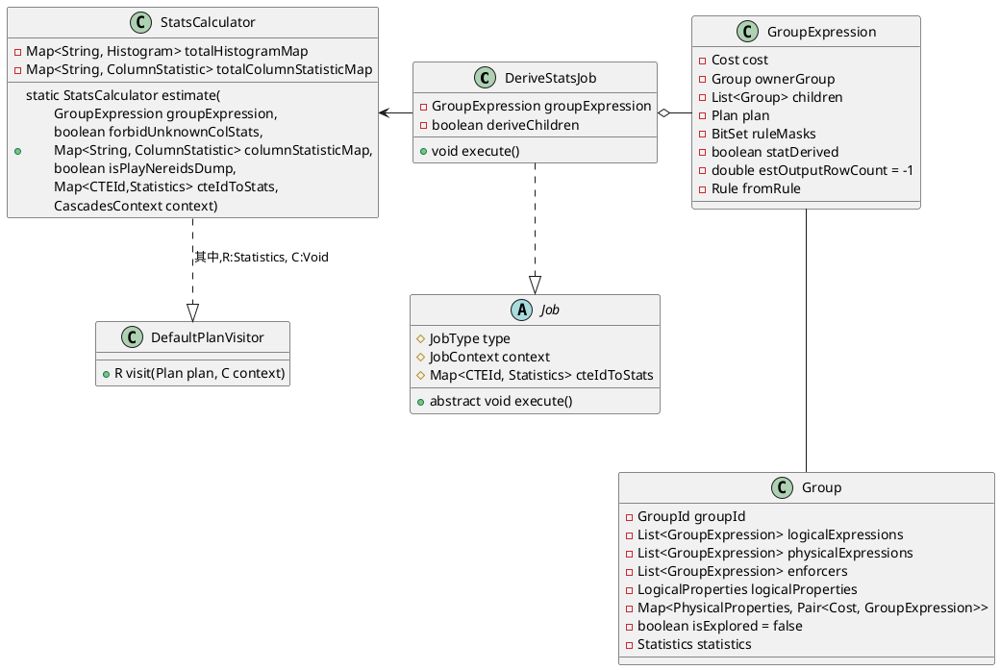
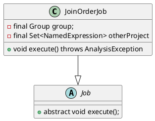
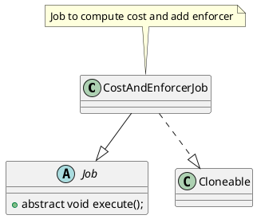

optimize的入口通过`NereidsPlanner`的`optimize`
```java
private void optimize() {
    new Optimizer(cascadesContext).execute();
}
```
优化逻辑封装在`Optimizer`,接下来了解其实现
```java
public class Optimizer {
    private final CascadesContext cascadesContext;

    public Optimizer(CascadesContext cascadesContext) {
        this.cascadesContext = Objects.requireNonNull(cascadesContext,
                "cascadesContext cannot be null");
    }

    public void execute() {
        // 1. init memo
        cascadesContext.toMemo();

        // 2. stats derive
        cascadesContext.pushJob(new DeriveStatsJob(cascadesContext.getMemo().getRoot().       
                getLogicalExpression(), cascadesContext.getCurrentJobContext()));
        cascadesContext.getJobScheduler().executeJobPool(cascadesContext);
        serializeStatUsed(cascadesContext.getConnectContext());
        
        // 3. DPHyp optimize
        int maxJoinCount = cascadesContext.getMemo().countMaxContinuousJoin();
        cascadesContext.getStatementContext().setMaxContinuousJoin(maxJoinCount);
        boolean isDpHyp = getSessionVariable().enableDPHypOptimizer
                || maxJoinCount > getSessionVariable().getMaxTableCountUseCascadesJoinReorder();
        cascadesContext.getStatementContext().setDpHyp(isDpHyp);
        cascadesContext.getStatementContext().setOtherJoinReorder(false);
        if (!getSessionVariable().isDisableJoinReorder() && isDpHyp
                && maxJoinCount <= getSessionVariable().getMaxJoinNumberOfReorder()) {
            //RightNow, dphyper can only order 64 join operators
            dpHypOptimize();
        }

        // 4. Cascades optimize
        cascadesContext.pushJob(
                new OptimizeGroupJob(cascadesContext.getMemo().getRoot(), cascadesContext.getCurrentJobContext()));
        cascadesContext.getJobScheduler().executeJobPool(cascadesContext);
    }
}
```

# Derive Stat

`Optimizer::execute`是Derive统计信息的入口
```java
public void execute() {
                ......
    // 2. stats derive
    cascadesContext.pushJob(new DeriveStatsJob(
        // Root Group的第一个Logical Group Expression
        cascadesContext.getMemo().getRoot().getLogicalExpression(),
        cascadesContext.getCurrentJobContext()));
    cascadesContext.getJobScheduler().executeJobPool(cascadesContext);
    serializeStatUsed(cascadesContext.getConnectContext());
                ......
}
```


```java
public class DeriveStatsJob extends Job {

}
```
## Derive Stats Job
自底向上derive stat,
```java
public void execute() {
    // 如果stat已经derive直接返回，在StatsCalculator::estimate完成统计信息计算
    // 将groupExpression.setStatDerived(true)
    if (groupExpression.isStatDerived() || groupExpression.isUnused()) {
        return;
    }

    countJobExecutionTimesOfGroupExpressions(groupExpression);
    // 1. 孩子还没derive，为子GroupExpression生成DeriveStatsJob计算孩子统计信息
    if (!deriveChildren && groupExpression.arity() > 0) {
        pushJob(new DeriveStatsJob(groupExpression, true, context, cteIdToStats));

        List<Group> children = groupExpression.children();
        for (int i = children.size() - 1; i >= 0; i--) {
            Group childGroup = children.get(i);

            List<GroupExpression> logicalExpressions = childGroup.getLogicalExpressions();
            for (int j = logicalExpressions.size() - 1; j >= 0; j--) {
                GroupExpression logicalChild = logicalExpressions.get(j);
                if (!logicalChild.isStatDerived()) {
                    pushJob(new DeriveStatsJob(logicalChild, context, cteIdToStats));
                }
            }

            List<GroupExpression> physicalExpressions = childGroup.getPhysicalExpressions();
            for (int j = physicalExpressions.size() - 1; j >= 0; j--) {
                GroupExpression physicalChild = physicalExpressions.get(j);
                if (!physicalChild.isStatDerived()) {
                    pushJob(new DeriveStatsJob(physicalChild, context, cteIdToStats));
                }
            }
        }
    } else {
        // 2. 进行当前GroupExpression的统计信息估算
        StatsCalculator statsCalculator = StatsCalculator.estimate(groupExpression,
                context.getCascadesContext().getConnectContext().getSessionVariable().getForbidUnknownColStats(),
                context.getCascadesContext().getConnectContext().getTotalColumnStatisticMap(),
                context.getCascadesContext().getConnectContext().getSessionVariable().isPlayNereidsDump(),
                cteIdToStats,
                context.getCascadesContext());
                ......
        if (groupExpression.getPlan() instanceof Project) {
            double parentRowCount = groupExpression.getOwnerGroup().getStatistics().getRowCount();
            groupExpression.children().forEach(g -> g.setStatistics(
                    g.getStatistics().withRowCountAndEnforceValid(parentRowCount))
            );
        }
    }
}
```

## 统计信息计算
Doris借助`StatsCalculator`实现统计信息的计算，它对外提供了静态接口
```java
// 统计信息估算
public static StatsCalculator estimate(GroupExpression groupExpression,
        boolean forbidUnknownColStats,
        Map<String, ColumnStatistic> columnStatisticMap,
        boolean isPlayNereidsDump,
        Map<CTEId, Statistics> cteIdToStats, CascadesContext context) {
    StatsCalculator statsCalculator = new StatsCalculator(groupExpression,
        forbidUnknownColStats, columnStatisticMap, isPlayNereidsDump,
        cteIdToStats, context);
    // 调用estimate进行估算
    statsCalculator.estimate();
    return statsCalculator;
}
```
接下来，看下`StatsCalculator::estimate`
```java
private void estimate() {
    Plan plan = groupExpression.getPlan();
    // 1. 调用Plan的accept来计算统计信息，其中PlanVisitor是StatsCalculator
    //    下面以LogicalJoin为例来了解其执行流程
    Statistics stats = plan.accept(this, null);
    Statistics originStats = groupExpression.getOwnerGroup().getStatistics();

    // 暂时主要梳理主逻辑，这部分统计信息更新，原理todo
    if (originStats == null || originStats.getRowCount() > stats.getRowCount()) {
        groupExpression.getOwnerGroup().setStatistics(stats);
    } else {
        if (originStats.getRowCount() > stats.getRowCount()) {
            stats.updateNdv(originStats);
            groupExpression.getOwnerGroup().setStatistics(stats);
        } else {
            originStats.updateNdv(stats);
        }
    }
    groupExpression.setEstOutputRowCount(stats.getRowCount());
    groupExpression.setStatDerived(true);
}
```

以`LogicalJoin`为例来了解统计信息计算流程，上面可以看到统计信息计算调用了`Plan::accept`,`LogicalJoin::accept`的实现如下
```java
@Override
public <R, C> R accept(PlanVisitor<R, C> visitor, C context) {
    // 统计信息计算，调用了StatsCalculator::visitLogicalJoin接口
    return visitor.visitLogicalJoin(this, context);
}
```

`StatsCalculator::visitLogicalJoin`调用调用`JoinEstimation::estimate`完成统计信息计算的职责。
```java
@Override
public Statistics visitLogicalJoin(LogicalJoin<? extends Plan, ? extends Plan> join, Void context) {
    return JoinEstimation.estimate(groupExpression.childStatistics(0),
            groupExpression.childStatistics(1), join);
}
```
其他的Plan的统计信息计算和上面的过程类似，找到Plan中的accept接口实现，之后在`StatsCalculator`找对应的接口。

# DPHyp
在`Optimizer`的`execute`可以看到`dpHypOptimize`的调用入口
```java
public void execute() {
            ....
    // DPHyp optimize
    int maxJoinCount = cascadesContext.getMemo().countMaxContinuousJoin();
    cascadesContext.getStatementContext().setMaxContinuousJoin(maxJoinCount);
    boolean isDpHyp = getSessionVariable().enableDPHypOptimizer
            || maxJoinCount > getSessionVariable().getMaxTableCountUseCascadesJoinReorder();
    cascadesContext.getStatementContext().setDpHyp(isDpHyp);
    cascadesContext.getStatementContext().setOtherJoinReorder(false);
    if (!getSessionVariable().isDisableJoinReorder() && isDpHyp
            && maxJoinCount <= getSessionVariable().getMaxJoinNumberOfReorder()) {
        //RightNow, dphyper can only order 64 join operators
        dpHypOptimize();
    }
            ......
}
```
可见，使用DPHyp和下面几个参数相关
```sql
SET enable_dphyp_optimizer = true;
max_table_count_use_cascades_join_reorder

set disable_join_reorder = true
max_join_number_of_reorder
```

Optimizer的`dpHypOptimize()`是DPHyp的入口
```java
private void dpHypOptimize() {
    Group root = cascadesContext.getMemo().getRoot();
    cascadesContext.pushJob(new JoinOrderJob(root, cascadesContext.getCurrentJobContext()));
    cascadesContext.getJobScheduler().executeJobPool(cascadesContext);
    // after DPHyp just keep logical expression
    cascadesContext.getMemo().removePhysicalExpression();
    cascadesContext.getStatementContext().setOtherJoinReorder(true);
}
```




## OptimizeGroupJob


```java
public class OptimizeGroupJob extends Job {
    private final Group group;
}
```

```java
OptimizeGroupExpressionJob
CostAndEnforcerJob
```
