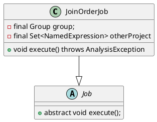
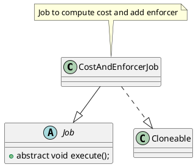

# Job抽象
Nereids中含Analyze，Rewrite和CBO阶段的优化都被统一抽象为了Job类，并提供了一些公共的接口，如`pushJob`,`getRuleSet`以及`getValidRules`等，对外提供了纯虚`void execute()`，由子类负责实现完成相应职责。
```plantuml
abstract class Job {
    # JobType type;
    # JobContext context;
    # boolean once;
    # final Set<String> disableRules;

    + abstract void execute()
    
    + void pushJob(Job job)
    + RuleSet getRuleSet()
    + boolean isOnce()
    + List<Rule> getValidRules(GroupExpression groupExpression, List<Rule> candidateRules)
}

class JobContext {
    # final PhysicalProperties requiredProperties
    # final ScheduleContext scheduleContext
    # List<RewriteJob> remainJobs
}
note bottom: scheduleContext也就是CascadesContext, 在NereidsPlanner\n将CascadesContext传递给Rewriter以及Optimizer

JobContext -up-*Job
```

```java
// Abstract class for all job using for analyze and optimize query plan
public abstract class Job implements TracerSupplier {
    protected JobType type;
    protected JobContext context;
    protected boolean once;
    // Doris支持disable_nereids_rules会话级参数
    // 可以,分割输入多个rule实现disable一系列Rule
    protected final Set<String> disableRules;

    // 执行Job
    public abstract void execute();

    
    public void pushJob(Job job) {
        context.getScheduleContext().pushJob(job);
    }
    public RuleSet getRuleSet() {
        return context.getCascadesContext().getRuleSet();
    }
    public boolean isOnce() { return once; }
    // 从候选Rules中找出valid的Rule
    public List<Rule> getValidRules(GroupExpression groupExpression,
            List<Rule> candidateRules);
}

public class JobContext {
    // use for optimizer
    protected final ScheduleContext scheduleContext;
    protected final PhysicalProperties requiredProperties;
    protected double costUpperBound;

    // use for rewriter
    protected boolean rewritten = false;
    protected List<RewriteJob> remainJobs = Collections.emptyList();
}
```

# Optimize

## Derive Stat
```java
public class DeriveStatsJob extends Job {

}
```

## DPHyp
在`Optimizer`的`execute`可以看到`dpHypOptimize`的调用入口
```java
public void execute() {
            ....
    // DPHyp optimize
    int maxJoinCount = cascadesContext.getMemo().countMaxContinuousJoin();
    cascadesContext.getStatementContext().setMaxContinuousJoin(maxJoinCount);
    boolean isDpHyp = getSessionVariable().enableDPHypOptimizer
            || maxJoinCount > getSessionVariable().getMaxTableCountUseCascadesJoinReorder();
    cascadesContext.getStatementContext().setDpHyp(isDpHyp);
    cascadesContext.getStatementContext().setOtherJoinReorder(false);
    if (!getSessionVariable().isDisableJoinReorder() && isDpHyp
            && maxJoinCount <= getSessionVariable().getMaxJoinNumberOfReorder()) {
        //RightNow, dphyper can only order 64 join operators
        dpHypOptimize();
    }
            ......
}
```
可见，使用DPHyp和下面几个参数相关
```sql
SET enable_dphyp_optimizer = true;
max_table_count_use_cascades_join_reorder

set disable_join_reorder = true
max_join_number_of_reorder
```


Optimizer的`dpHypOptimize()`是DPHyp的入口
```java
private void dpHypOptimize() {
    Group root = cascadesContext.getMemo().getRoot();
    cascadesContext.pushJob(new JoinOrderJob(root, cascadesContext.getCurrentJobContext()));
    cascadesContext.getJobScheduler().executeJobPool(cascadesContext);
    // after DPHyp just keep logical expression
    cascadesContext.getMemo().removePhysicalExpression();
    cascadesContext.getStatementContext().setOtherJoinReorder(true);
}
```




## OptimizeGroupJob

```java
public class OptimizeGroupJob extends Job {
    private final Group group;
}
```
```
OptimizeGroupExpressionJob
CostAndEnforcerJob
```