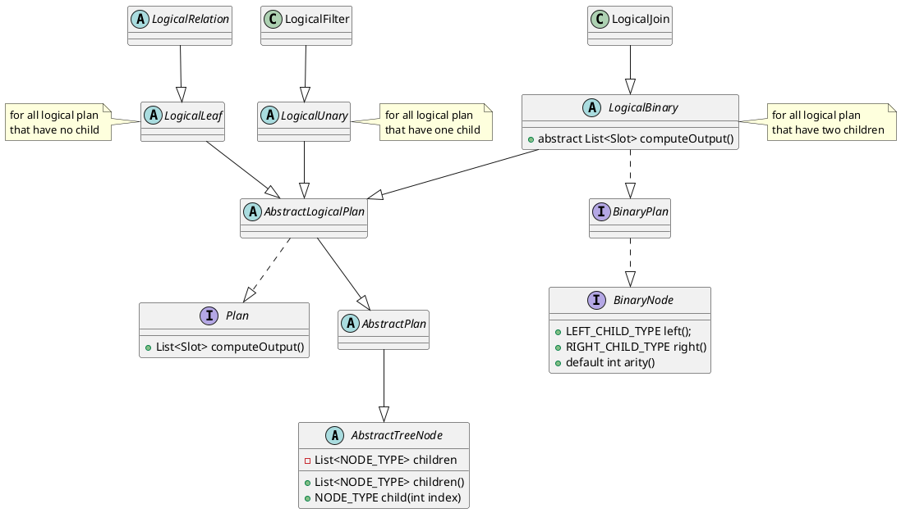
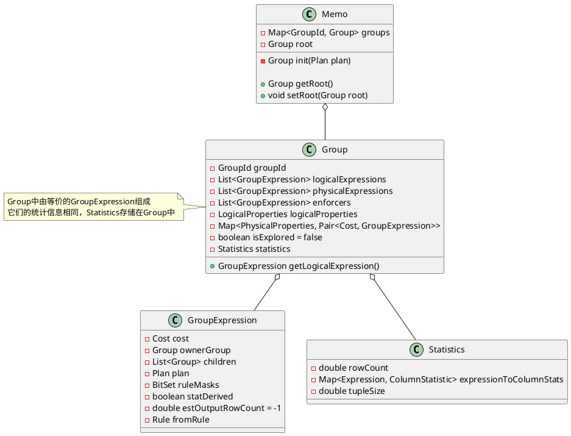
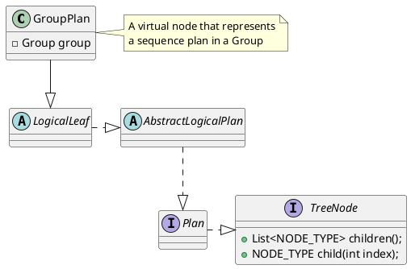

完成`rewrite`后，在`optimize`时，即`Optimizer::execute()`进行Memo的初始化
```java
    public void execute() {
        // 1. init memo
        cascadesContext.toMemo();
            ......
    }
}
```

# 逻辑算子

# Memo
构造Memo时调用init接口初始化Memo。
```java
public Memo(Plan plan) {
        root = init(plan);
}
```

构造Memo调用`Memo::init`进行初始化

```java
private Group init(Plan plan) {
    // 1. 递归第对其孩子初始化
    initialize children recursively
    List<Group> childrenGroups = new ArrayList<>(plan.arity());
    for (Plan child : plan.children()) {
        childrenGroups.add(init(child));
    }

    plan = replaceChildrenToGroupPlan(plan, childrenGroups);
    // 2. plan + 其子节点Plan表示的Group, 创建GroupExpression
    GroupExpression newGroupExpression = new GroupExpression(plan, childrenGroups);
    // 3. 创建Group
    Group group = new Group(groupIdGenerator.getNextId(), newGroupExpression, plan.getLogicalProperties());

    // 4. 将创建的Group放在Memo的groups HashMap中
    groups.put(group.getGroupId(), group);
    groupExpressions.put(newGroupExpression, newGroupExpression);
    return group;
}

private Plan replaceChildrenToGroupPlan(Plan plan, List<Group> childrenGroups) {
    if (childrenGroups.isEmpty()) {
        return plan;
    }
    List<Plan> groupPlanChildren = childrenGroups.stream()
            .map(GroupPlan::new)
            .collect(ImmutableList.toImmutableList());
    return plan.withChildren(groupPlanChildren);
}
```
