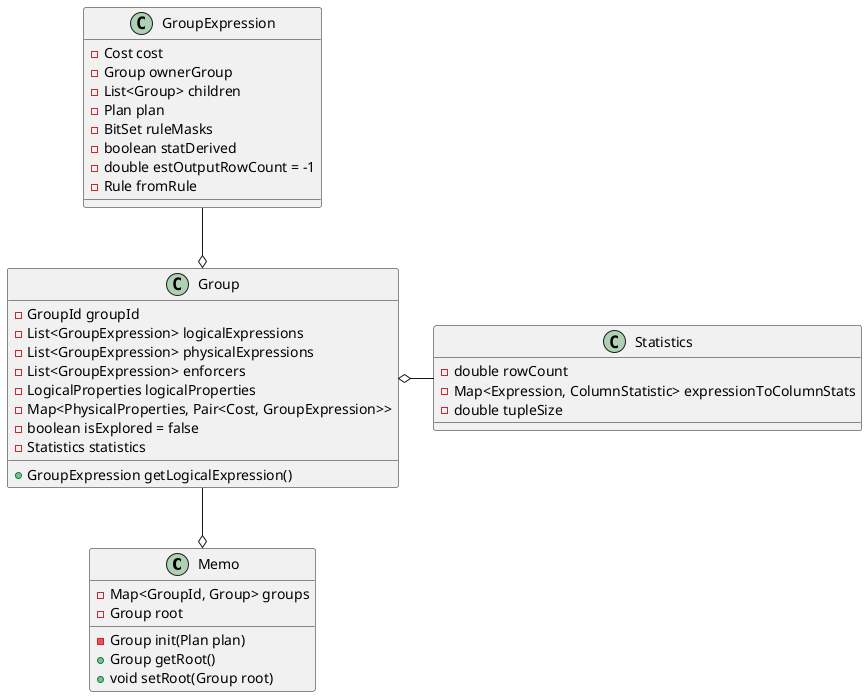

完成`rewrite`后，在`optimize`时，即`Optimizer::execute()`进行Memo的初始化
```java
    public void execute() {
        // 1. init memo
        cascadesContext.toMemo();
            ......
    }
}
```

构造Memo时调用init接口初始化Memo。
```java
public Memo(Plan plan) {
        root = init(plan);
}
```


