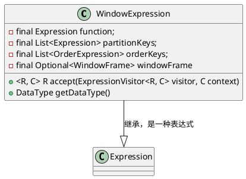
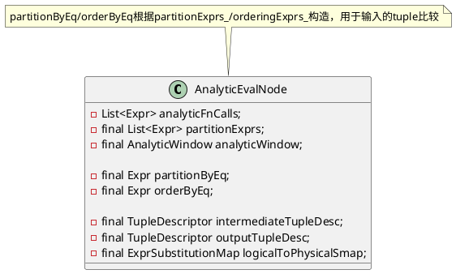

# 窗口
窗口在parser中的标签是
```
primaryExpression
                ......
    (OVER windowSpec)? #functionCall
                ......
```
```java
// org.apache.doris.nereids.glue.LogicalPlanAdapter
visitFunctionCall
    withWindowSpec // 处理窗口函数，创建WindowExpression表达
        new WindowExpression
```
经过语法解析，窗口表达为`WindowExpression`结构。




```java
// Check and standardize Window expression
class CheckAndStandardizeWindowFunctionAndFrame extends OneRewriteRuleFactory {
    // 借助WindowFunctionChecker接口实现
}
// 
class WindowFunctionChecker extends DefaultExpressionVisitor<Expression, Void>
abstract class DefaultExpressionRewriter<C> extends ExpressionVisitor<Expression, C>
```

```java
/**
 * extract window expressions from LogicalProject#projects and Normalize LogicalWindow
 */
public class ExtractAndNormalizeWindowExpression
        extends OneRewriteRuleFactory implements NormalizeToSlot {}
```

```java
// LogicalWindow ->  PhysicalWindow
public class LogicalWindowToPhysicalWindow extends OneImplementationRuleFactory {

// PhysicalWindow -> AnalyticEvalNode
public PlanFragment visitPhysicalWindow(PhysicalWindow<? extends Plan> physicalWindow,
            PlanTranslatorContext context)
```

```java
/**
 * extract window expressions from LogicalProject#projects and Normalize LogicalWindow
 */
public class ExtractAndNormalizeWindowExpression extends OneRewriteRuleFactory implements NormalizeToSlot
```
```C++
class Rank extends WindowFunction
```