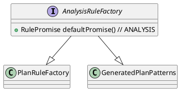

```plantuml
class Analyzer {
    + List<RewriteJob> getJobs()
    + void analyze()

    - List<RewriteJob> buildAnalyzeViewJobs(Optional<CustomTableResolver> customTableResolver)
    - List<RewriteJob> buildAnalyzeJobs(Optional<CustomTableResolver> customTableResolver)
}
note top : analyze实际上就是执行execute,实现执行相关的Job

abstract class AbstractBatchJobExecutor {
    + abstract List<RewriteJob> getJobs()
    + void execute()
}

Analyzer -down-|> AbstractBatchJobExecutor : 继承
```