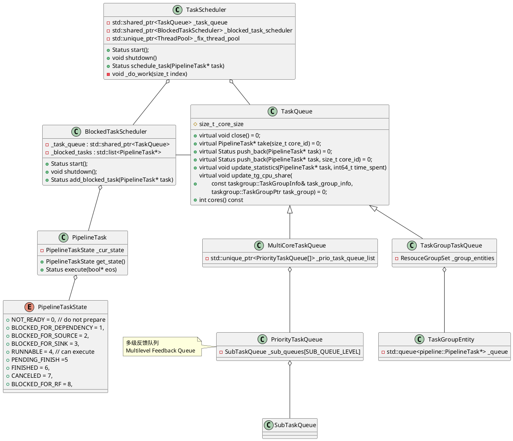
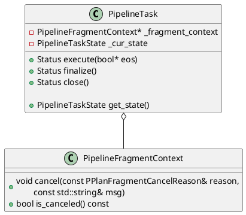
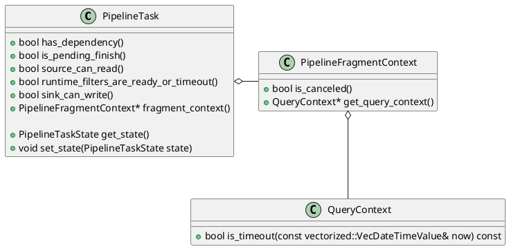
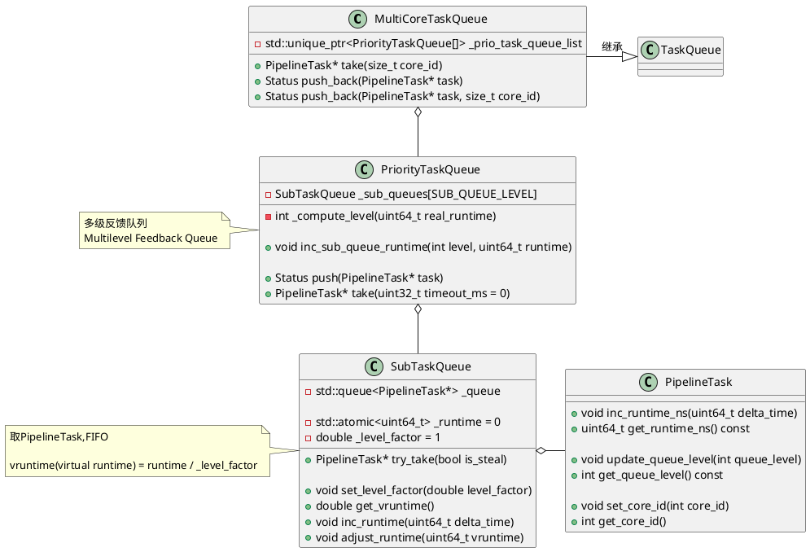
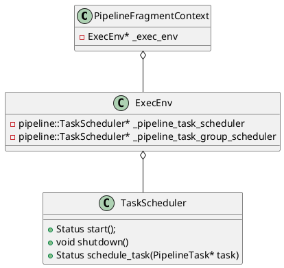

Doris的Be的代码入口在`be/src/service/doris_main.cpp`，这里实现了`main`函数，

```C++
int main(int argc, char** argv) {
			......
    // init exec env
    auto exec_env = doris::ExecEnv::GetInstance();
    doris::ExecEnv::init(exec_env, paths);
    doris::TabletSchemaCache::create_global_schema_cache();
    	......
}
```

其中，`doris::ExecEnv::init(exec_env, paths)`调用`init_pipeline_task_scheduler`，从而初始化了Pipeline Task Scheduler，相关的调用逻辑如下：

```C++
Status ExecEnv::init(ExecEnv* env, const std::vector<StorePath>& store_paths) {
    return env->_init(store_paths);
}

Status ExecEnv::_init(const std::vector<StorePath>& store_paths) {
		......
    // 创建和初始化Pipeline TaskScheduler
    RETURN_IF_ERROR(init_pipeline_task_scheduler());
}
```

# Pipeline调度
Pipeline调度模块的主要职责是实现PipelineTask的调度和执行，内部维护了两个任务队列，实现任务调度和出让时间

- 执行队列，抽象为`TaskQueue`接口，`TaskScheduler`后台线程从其中取出任务来执行，`TaskScheduler`内部后台运行了`cores`个后台线程(该参数由默认值为0的`pipeline_executor_size`配置参数决定，如果用户没有设置，和CPU核心数一致)。
- 阻塞队列，抽象为`BlockedTaskScheduler`，其内部后台运行了一个`_schedule`线程，从本地的任务队列中取出任务检查任务是否可以执行，如果可以执行将其放入`TaskQueue`等待调度执行。

<center>
    
</center>

PipelineTask主要的类图


## 初始化TaskScheduler
```C++
Status ExecEnv::init_pipeline_task_scheduler() {
    // 配置参数pipeline_executor_size默认为0
    auto executors_size = config::pipeline_executor_size;
    if (executors_size <= 0) {
        // 系统文件/proc/cpuinfo中processor的数量
        executors_size = CpuInfo::num_cores();
    }

    // TODO pipeline task group combie two blocked schedulers.
    auto t_queue = std::make_shared<pipeline::MultiCoreTaskQueue>(executors_size);
    auto b_scheduler = std::make_shared<pipeline::BlockedTaskScheduler>(t_queue);
    _pipeline_task_scheduler =
            new pipeline::TaskScheduler(this, b_scheduler, t_queue, "WithoutGroupTaskSchePool");
    RETURN_IF_ERROR(_pipeline_task_scheduler->start());

    auto tg_queue = std::make_shared<pipeline::TaskGroupTaskQueue>(executors_size);
    auto tg_b_scheduler = std::make_shared<pipeline::BlockedTaskScheduler>(tg_queue);
    _pipeline_task_group_scheduler =
            new pipeline::TaskScheduler(this, tg_b_scheduler, tg_queue, "WithGroupTaskSchePool");
    RETURN_IF_ERROR(_pipeline_task_group_scheduler->start());

    return Status::OK();
}
```

接下来，了解一下`TaskScheduler::start`，这里会创建执行线程和轮询线程。

```C++
Status TaskScheduler::start() {
    int cores = _task_queue->cores();
    // Must be mutil number of cpu cores
    ThreadPoolBuilder(_name).set_min_threads(cores)
            .set_max_threads(cores).set_max_queue_size(0)
            .build(&_fix_thread_pool);
    _markers.reserve(cores);
 
    // 创建cores个worker线程,去任务并执行
    // 线程执行函数是TaskScheduler::_do_work
    for (size_t i = 0; i < cores; ++i) {
        _markers.push_back(std::make_unique<std::atomic<bool>>(true));
        // i被当作core_id从TaskQueue中取任务
        RETURN_IF_ERROR(_fix_thread_pool->submit_func(
            std::bind(&TaskScheduler::_do_work, this, i)));
    }

    // 创建Schedule Thread检查任务状态
    return _blocked_task_scheduler->start();
}
```

`BlockedTaskScheduler::start`创建轮询线程，检查Task是否可以执行。

```C++
Status BlockedTaskScheduler::start() {
    // 创建轮询线程，线执行函数是BlockedTaskScheduler::_schedule
    RETURN_IF_ERROR(Thread::create("BlockedTaskScheduler",
           "schedule_blocked_pipeline", [this]() { this->_schedule(); },
            &_thread));
    while (!this->_started.load()) {
        std::this_thread::sleep_for(std::chrono::milliseconds(5));
    }
    return Status::OK();
}
```

## 执行线程



```C++
void TaskScheduler::_do_work(size_t index) {
    const auto& marker = _markers[index];
    while (*marker) {
        auto* task = _task_queue->take(index);
        if (!task) continue;
        task->set_task_queue(_task_queue.get());
        auto* fragment_ctx = task->fragment_context();
        signal::query_id_hi = fragment_ctx->get_query_id().hi;
        signal::query_id_lo = fragment_ctx->get_query_id().lo;
        bool canceled = fragment_ctx->is_canceled();

        // 1. PENDING_FINISH或cancle, close task并设置task state
        auto check_state = task->get_state();
        if (check_state == PipelineTaskState::PENDING_FINISH) {
            _try_close_task(task, canceled ?
				PipelineTaskState::CANCELED : PipelineTaskState::FINISHED);
            continue;
        }

        if (canceled) {
            fragment_ctx->send_report(true);
            _try_close_task(task, PipelineTaskState::CANCELED);
            continue;
        }

        // 2. 执行task
        bool eos = false;
        auto status = Status::OK();
        try {
            status = task->execute(&eos);
        } catch (const Exception& e) {
            status = e.to_status();
        }

        task->set_previous_core_id(index);
        if (!status.ok()) {
            task->set_eos_time();
            // 2.1 执行失败，cancel所有的子计划
            fragment_ctx->cancel(PPlanFragmentCancelReason::INTERNAL_ERROR,
                                 status.to_string());
            fragment_ctx->send_report(true);
            _try_close_task(task, PipelineTaskState::CANCELED);
            continue;
        }

        // 2.2 任务执行完成, 调用finalize
        if (eos) {
            task->set_eos_time();
            status = task->finalize();
            if (!status.ok()) {
                // finalize失败, cancel所有的子计划
                fragment_ctx->cancel(PPlanFragmentCancelReason::INTERNAL_ERROR,
                                     "finalize fail:" + status.to_string());
                _try_close_task(task, PipelineTaskState::CANCELED);
            } else {
                _try_close_task(task, PipelineTaskState::FINISHED);
            }
            continue;
        }

        auto pipeline_state = task->get_state();
        switch (pipeline_state) {
        case PipelineTaskState::BLOCKED_FOR_SOURCE:
        case PipelineTaskState::BLOCKED_FOR_SINK:
        case PipelineTaskState::BLOCKED_FOR_RF:
        case PipelineTaskState::BLOCKED_FOR_DEPENDENCY:
            // 3. block Task,将其添加到blocked task队列
            _blocked_task_scheduler->add_blocked_task(task);
            break;
        case PipelineTaskState::RUNNABLE:
            // 4. worker将task再次入队
            _task_queue->push_back(task, index);
            break;
        default:
            DCHECK(false) << "error state after run task, " << get_state_name(pipeline_state);
            break;
        }
    }
}
```

## 轮询线程

`PipelineTask`轮询调度，主要实现判断Task是否可以执行，如果可以执行将其放到`_task_queue`等调度线程调度执行，这里也会实现一些状态切换。

```C++
void BlockedTaskScheduler::_schedule() {
    _started.store(true);
    std::list<PipelineTask*> local_blocked_tasks;
    int empty_times = 0;

    while (!_shutdown) {
        // 将_blocked_tasks移动到local_blocked_tasks局部变量
        {
            std::unique_lock<std::mutex> lock(this->_task_mutex);
            local_blocked_tasks.splice(local_blocked_tasks.end(), _blocked_tasks);
            if (local_blocked_tasks.empty()) {
                while (!_shutdown.load() && _blocked_tasks.empty()) {
                    _task_cond.wait_for(lock, std::chrono::milliseconds(10));
                }

                if (_shutdown.load()) break;
                local_blocked_tasks.splice(local_blocked_tasks.end(), _blocked_tasks);
            }
        }

        auto origin_local_block_tasks_size = local_blocked_tasks.size();
        auto iter = local_blocked_tasks.begin();
        vectorized::VecDateTimeValue now = vectorized::VecDateTimeValue::local_time();
        while (iter != local_blocked_tasks.end()) {
            auto* task = *iter;
            auto state = task->get_state();
            if (state == PipelineTaskState::PENDING_FINISH) {
                // should cancel or should finish
                if (task->is_pending_finish()) {
                    iter++;
                } else {
                    _make_task_run(local_blocked_tasks, iter, PipelineTaskState::PENDING_FINISH);
                }
            } else if (task->fragment_context()->is_canceled()) {
                if (task->is_pending_finish()) {
                    task->set_state(PipelineTaskState::PENDING_FINISH);
                    iter++;
                } else {
                    _make_task_run(local_blocked_tasks, iter);
                }
            } else if (task->query_context()->is_timeout(now)) {
                task->fragment_context()->cancel(PPlanFragmentCancelReason::TIMEOUT);
                if (task->is_pending_finish()) {
                    task->set_state(PipelineTaskState::PENDING_FINISH);
                    iter++;
                } else {
                    _make_task_run(local_blocked_tasks, iter);
                }
            } else if (state == PipelineTaskState::BLOCKED_FOR_DEPENDENCY) {
                if (task->has_dependency()) {
                    iter++;
                } else {
                    _make_task_run(local_blocked_tasks, iter);
                }
            } else if (state == PipelineTaskState::BLOCKED_FOR_SOURCE) {
                if (task->source_can_read()) {
                    _make_task_run(local_blocked_tasks, iter);
                } else {
                    iter++;
                }
            } else if (state == PipelineTaskState::BLOCKED_FOR_RF) {
                if (task->runtime_filters_are_ready_or_timeout()) {
                    _make_task_run(local_blocked_tasks, iter);
                } else {
                    iter++;
                }
            } else if (state == PipelineTaskState::BLOCKED_FOR_SINK) {
                if (task->sink_can_write()) {
                    _make_task_run(local_blocked_tasks, iter);
                } else {
                    iter++;
                }
            } else {
                _make_task_run(local_blocked_tasks, iter);
            }
        }

        if (origin_local_block_tasks_size == 0 ||
            local_blocked_tasks.size() == origin_local_block_tasks_size) {
            empty_times += 1;
        } else {
            empty_times = 0;
        }

        if (empty_times != 0 && (empty_times & (EMPTY_TIMES_TO_YIELD - 1)) == 0) {
#ifdef __x86_64__
            _mm_pause();
#else
            sched_yield();
#endif
        }
        if (empty_times == EMPTY_TIMES_TO_YIELD * 10) {
            empty_times = 0;
            sched_yield();
        }
    }
}
```

## Task状态切换

状态定义：

```C++
enum class PipelineTaskState : uint8_t {
    NOT_READY = 0, 				// do not prepare
    BLOCKED_FOR_DEPENDENCY = 1,
    BLOCKED_FOR_SOURCE = 2,
    BLOCKED_FOR_SINK = 3,
    RUNNABLE = 4, 			// can execute
    PENDING_FINISH = 5,		// compute task is over,but still hold resource.
    					  // like some scan and sink task
    FINISHED = 6,
    CANCELED = 7,
    BLOCKED_FOR_RF = 8,
};
```

状态切换：

```C++
/**
 * PipelineTaskState indicates all possible states of a pipeline task.
 * A FSM is described as below:
 *
 *                 |-----------------------------------------------------|
 *                 |---|                  transfer 2    transfer 3       |   transfer 4
 *                     |-------> BLOCKED ------------|                   |---------------------------------------> CANCELED
 *              |------|                             |                   | transfer 5           transfer 6|
 * NOT_READY ---| transfer 0                         |-----> RUNNABLE ---|---------> PENDING_FINISH ------|
 *              |                                    |          ^        |                      transfer 7|
 *              |------------------------------------|          |--------|---------------------------------------> FINISHED
 *                transfer 1                                   transfer 9          transfer 8
 * BLOCKED include BLOCKED_FOR_DEPENDENCY, BLOCKED_FOR_SOURCE and BLOCKED_FOR_SINK.
 *
 * transfer 0 (NOT_READY -> BLOCKED): this pipeline task has some incomplete dependencies
 * transfer 1 (NOT_READY -> RUNNABLE): this pipeline task has no incomplete dependencies
 * transfer 2 (BLOCKED -> RUNNABLE): runnable condition for this pipeline task is met (e.g. get a new block from rpc)
 * transfer 3 (RUNNABLE -> BLOCKED): runnable condition for this pipeline task is not met (e.g. sink operator send a block by RPC and wait for a response)
 * transfer 4 (RUNNABLE -> CANCELED): current fragment is cancelled
 * transfer 5 (RUNNABLE -> PENDING_FINISH): this pipeline task completed but wait for releasing resources hold by itself
 * transfer 6 (PENDING_FINISH -> CANCELED): current fragment is cancelled
 * transfer 7 (PENDING_FINISH -> FINISHED): this pipeline task completed and resources hold by itself have been released already
 * transfer 8 (RUNNABLE -> FINISHED): this pipeline task completed and no resource need to be released
 * transfer 9 (RUNNABLE -> RUNNABLE): this pipeline task yields CPU and re-enters the runnable queue if it is runnable and has occupied CPU for a max time slice
 */
```

# 多级反馈队列

`MultiCoreTaskQueue`对外提供了两个添加Task的接口
```C++
// TaskScheduler or BlockedTaskScheduler添加Task
Status push_back(PipelineTask* task)

// TaskScheduler的worker线程添加Task
// core_id是PipelineTask在_prio_task_queue_list的index
Status push_back(PipelineTask* task, size_t core_id)
```



## vRuntime计算

`PriorityTaskQueue`有`SUB_QUEUE_LEVEL = 6`个`SubTaskQueue`组成，

```C++
// A Multilevel Feedback Queue
class PriorityTaskQueue {
private:
    static constexpr auto LEVEL_QUEUE_TIME_FACTOR = 2;
    static constexpr size_t SUB_QUEUE_LEVEL = 6;
    SubTaskQueue _sub_queues[SUB_QUEUE_LEVEL];
}
```

每个`SubTaskQueue`持有一个vruntime影响其调度的优先级，每个`PipelineTask`在`execute`过程中会计算其`time_spent`作为runtime来更新vruntime。

```C++
// runtime是PipelineTask执行期间消耗的真实的时间
// vruntime(也就是virtual runtime) = runtime / _level_factor
double get_vruntime() { return _runtime / _level_factor; }
void inc_runtime(uint64_t delta_time) {
    _runtime += delta_time;
}

// 当队列是空时，用PriorityTaskQueue中SubTaskQueue中最小vruntime
// 即_queue_level_min_vruntime)调整其vrutime
// 避免空的队列拥有太高的优先级
// 参见PriorityTaskQueue::push
void adjust_runtime(uint64_t vruntime) {
    this->_runtime = vruntime * _level_factor;
}
```

`PipelineTask::execute`会调用`_task_queue->update_statistics`，对于`MultiCoreTaskQueue`其相关实现如下

```C++
void MultiCoreTaskQueue::update_statistics(PipelineTask* task, int64_t time_spent) override {
    task->inc_runtime_ns(time_spent);
    _prio_task_queue_list[task->get_core_id()]
        .inc_sub_queue_runtime(task->get_queue_level(), time_spent);
}

void PriorityTaskQueue::inc_sub_queue_runtime(int level, uint64_t runtime) {
    // SubTaskQueue的_runtime增加runtime
    _sub_queues[level].inc_runtime(runtime);
}
```


## Push Task

```C++
 // TaskScheduler或BlockedTaskScheduler添加Task
Status MultiCoreTaskQueue::push_back(PipelineTask* task) {
    // 计算core_id,PipelineTask在worker thread拿出execute后
    // 调用set_previous_core_id设置了previous_core_id
    int core_id = task->get_previous_core_id();
    if (core_id < 0) {
        // 轮询调度
        core_id = _next_core.fetch_add(1) % _core_size;
    }
    return push_back(task, core_id);
}

// TaskScheduler的worker线程添加Task
// core_id是PipelineTask在_prio_task_queue_list的index
Status MultiCoreTaskQueue::push_back(PipelineTask* task, size_t core_id) {
    task->put_in_runnable_queue();
    return _prio_task_queue_list[core_id].push(task);
}
```

之后调用`PriorityTaskQueue::push`添加一个`PipelineTask`。

```C++
Status PriorityTaskQueue::push(PipelineTask* task) {
    // 计算level等级
    auto level = _compute_level(task->get_runtime_ns());
    std::unique_lock<std::mutex> lock(_work_size_mutex);

    // 更新SubTaskQueue中最小vruntime，避免其拥有太高的优先级
    if (_sub_queues[level].empty() &&
        _queue_level_min_vruntime > _sub_queues[level].get_vruntime()) {
        _sub_queues[level].adjust_runtime(_queue_level_min_vruntime);
    }

    // 在SubTaskQueue的_queue尾部追加一个Task
    _sub_queues[level].push_back(task);
    _total_task_size++;
    _wait_task.notify_one();
    return Status::OK();
}
```

`PriorityTaskQueue`通过`_compute_level`计算level将其放进`_sub_queues`。其中每个`SubTaskQueue`对应有一个`_queue_level_limit`时间，`runtime`从做到右遍历，小于`_queue_level_limit[i]`落入对应的level。

```C++
// 1s, 3s, 10s, 60s, 300s
uint64_t _queue_level_limit[SUB_QUEUE_LEVEL - 1] = {
    1000000000, 3000000000, 10000000000,
    60000000000, 300000000000
};
```

```C++
int PriorityTaskQueue::_compute_level(uint64_t runtime) {
    for (int i = 0; i < SUB_QUEUE_LEVEL - 1; ++i) {
        // runtime小于_queue_level_limit[i]则落入该层级
        if (runtime <= _queue_level_limit[i]) {
            return i;
        }
    }
    // 落入最后一个层级
    return SUB_QUEUE_LEVEL - 1;
}
```


## Take Task

```C++
PipelineTask* MultiCoreTaskQueue::take(size_t core_id) {
    PipelineTask* task = nullptr;
    while (!_closed) {
        // 1. 尝试从core_id对应的PriorityTaskQueue中取PipelineTask
        task = _prio_task_queue_list[core_id].try_take(false);
        if (task) {
            task->set_core_id(core_id);
            break;
        }

        // 2. 第1步取PipelineTask失败
        //    尝试轮询从core_id之后的队列再取PipelineTask
        task = _steal_take(core_id);
        if (task) {
            break;
        }

        // 3. 第2步取PipelineTask失败
        //    尝试等待WAIT_CORE_TASK_TIMEOUT_MS之后再取PipelineTask
        task = _prio_task_queue_list[core_id].take(
            	WAIT_CORE_TASK_TIMEOUT_MS /* timeout_ms */);
        if (task) {
            task->set_core_id(core_id);
            break;
        }
    }
   
    if (task) {
        // 如果取到PipelineTask，更新其信息用于Profile
        task->pop_out_runnable_queue();
    }
    return task;
}
```

上述3步取`PipelineTask`都是调用`PriorityTaskQueue::try_take_unprotected`来取`PipelineTask`。

```C++
PipelineTask* PriorityTaskQueue::try_take_unprotected(bool is_steal) {
    if (_total_task_size == 0 || _closed) return nullptr;

    double min_vruntime = 0;
    int level = -1;
    // 找到vruntime最小的SubTaskQueue的level
    // 可见非空的vruntime小的SubTaskQueue优先级高
    for (int i = 0; i < SUB_QUEUE_LEVEL; ++i) {
        double cur_queue_vruntime = _sub_queues[i].get_vruntime();
        if (!_sub_queues[i].empty()) {
            if (level == -1 || cur_queue_vruntime < min_vruntime) {
                level = i;
                min_vruntime = cur_queue_vruntime;
            }
        }
    }
    _queue_level_min_vruntime = min_vruntime;

    // 从SubTaskQueue::_queue的头部取出一个Task
    auto task = _sub_queues[level].try_take(is_steal);
    if (task) {
        task->update_queue_level(level);
        _total_task_size--;
    }
    return task;
}
```


```C++
Status PipelineFragmentContext::submit() {
			......
    auto* scheduler = _exec_env->pipeline_task_scheduler();
    if (get_task_group()) {
        scheduler = _exec_env->pipeline_task_group_scheduler();
    }
			......
}
```



