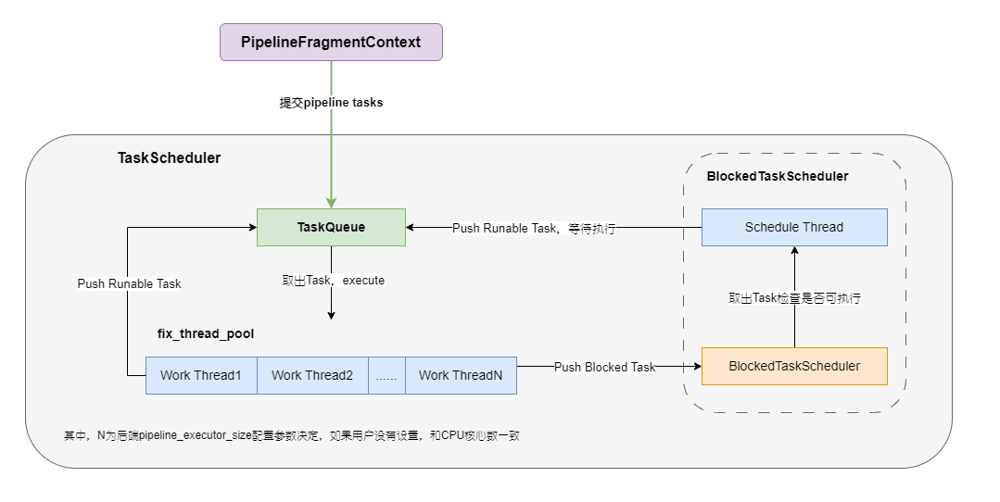

Doris的Be的代码入口在`be/src/service/doris_main.cpp`，这里实现了`main`函数，

```C++
int main(int argc, char** argv) {
			......
    // init exec env
    auto exec_env = doris::ExecEnv::GetInstance();
    doris::ExecEnv::init(exec_env, paths);
    doris::TabletSchemaCache::create_global_schema_cache();
    	......
}
```

其中，`doris::ExecEnv::init(exec_env, paths)`调用`init_pipeline_task_scheduler`，从而初始化了Pipeline Task Scheduler，相关的调用逻辑如下：

```C++
Status ExecEnv::init(ExecEnv* env, const std::vector<StorePath>& store_paths) {
    return env->_init(store_paths);
}

Status ExecEnv::_init(const std::vector<StorePath>& store_paths) {
		......
    // 创建和初始化Pipeline TaskScheduler
    RETURN_IF_ERROR(init_pipeline_task_scheduler());
}
```

# Pipeline调度
Pipeline调度模块的主要职责是实现PipelineTask的调度和执行，内部维护了两个任务队列，实现任务调度和出让时间

- 执行队列，抽象为`TaskQueue`接口，`TaskScheduler`后台线程从其中取出任务来执行，`TaskScheduler`内部后台运行了`cores`个后台线程(该参数由默认值为0的`pipeline_executor_size`配置参数决定，如果用户没有设置，和CPU核心数一致)。
- 阻塞队列，抽象为`BlockedTaskScheduler`，其内部后台运行了一个`_schedule`线程，从本地的任务队列中取出任务检查任务是否可以执行，如果可以执行将其放入`TaskQueue`等待调度执行。

<center>
    
</center>

PipelineTask主要的类图


## 初始化TaskScheduler
```C++
Status ExecEnv::init_pipeline_task_scheduler() {
    // 配置参数pipeline_executor_size默认为0
    auto executors_size = config::pipeline_executor_size;
    if (executors_size <= 0) {
        // 系统文件/proc/cpuinfo中processor的数量
        executors_size = CpuInfo::num_cores();
    }

    // TODO pipeline task group combie two blocked schedulers.
    auto t_queue = std::make_shared<pipeline::MultiCoreTaskQueue>(executors_size);
    auto b_scheduler = std::make_shared<pipeline::BlockedTaskScheduler>(t_queue);
    _pipeline_task_scheduler =
            new pipeline::TaskScheduler(this, b_scheduler, t_queue, "WithoutGroupTaskSchePool");
    RETURN_IF_ERROR(_pipeline_task_scheduler->start());

    auto tg_queue = std::make_shared<pipeline::TaskGroupTaskQueue>(executors_size);
    auto tg_b_scheduler = std::make_shared<pipeline::BlockedTaskScheduler>(tg_queue);
    _pipeline_task_group_scheduler =
            new pipeline::TaskScheduler(this, tg_b_scheduler, tg_queue, "WithGroupTaskSchePool");
    RETURN_IF_ERROR(_pipeline_task_group_scheduler->start());

    return Status::OK();
}
```

接下来，了解一下`TaskScheduler::start`，这里会创建执行线程和轮询线程。

```C++
Status TaskScheduler::start() {
    int cores = _task_queue->cores();
    // Must be mutil number of cpu cores
    ThreadPoolBuilder(_name).set_min_threads(cores)
            .set_max_threads(cores).set_max_queue_size(0)
            .build(&_fix_thread_pool);
    _markers.reserve(cores);
 
    // 创建cores个worker线程,去任务并执行
    // 线程执行函数是TaskScheduler::_do_work
    for (size_t i = 0; i < cores; ++i) {
        _markers.push_back(std::make_unique<std::atomic<bool>>(true));
        // i被当作core_id从TaskQueue中取任务
        RETURN_IF_ERROR(_fix_thread_pool->submit_func(
            std::bind(&TaskScheduler::_do_work, this, i)));
    }

    // 创建Schedule Thread检查任务状态
    return _blocked_task_scheduler->start();
}
```

`BlockedTaskScheduler::start`创建轮询线程，检查Task是否可以执行。

```C++
Status BlockedTaskScheduler::start() {
    // 创建轮询线程，线执行函数是BlockedTaskScheduler::_schedule
    RETURN_IF_ERROR(Thread::create("BlockedTaskScheduler",
           "schedule_blocked_pipeline", [this]() { this->_schedule(); },
            &_thread));
    while (!this->_started.load()) {
        std::this_thread::sleep_for(std::chrono::milliseconds(5));
    }
    return Status::OK();
}
```

## 执行线程


```C++
void TaskScheduler::_do_work(size_t index) {
    const auto& marker = _markers[index];
    while (*marker) {
        auto* task = _task_queue->take(index);
        if (!task) continue;
        task->set_task_queue(_task_queue.get());
        auto* fragment_ctx = task->fragment_context();
        signal::query_id_hi = fragment_ctx->get_query_id().hi;
        signal::query_id_lo = fragment_ctx->get_query_id().lo;
        bool canceled = fragment_ctx->is_canceled();

        // 1. PENDING_FINISH或cancle, close task并设置task state
        auto check_state = task->get_state();
        if (check_state == PipelineTaskState::PENDING_FINISH) {
            _try_close_task(task, canceled ?
				PipelineTaskState::CANCELED : PipelineTaskState::FINISHED);
            continue;
        }

        if (canceled) {
            fragment_ctx->send_report(true);
            _try_close_task(task, PipelineTaskState::CANCELED);
            continue;
        }

        // 2. 执行task
        bool eos = false;
        auto status = Status::OK();
        try {
            status = task->execute(&eos);
        } catch (const Exception& e) {
            status = e.to_status();
        }

        task->set_previous_core_id(index);
        if (!status.ok()) {
            task->set_eos_time();
            // 2.1 执行失败，cancel所有的子计划
            fragment_ctx->cancel(PPlanFragmentCancelReason::INTERNAL_ERROR,
                                 status.to_string());
            fragment_ctx->send_report(true);
            _try_close_task(task, PipelineTaskState::CANCELED);
            continue;
        }

        // 2.2 任务执行完成, 调用finalize
        if (eos) {
            task->set_eos_time();
            status = task->finalize();
            if (!status.ok()) {
                // finalize失败, cancel所有的子计划
                fragment_ctx->cancel(PPlanFragmentCancelReason::INTERNAL_ERROR,
                                     "finalize fail:" + status.to_string());
                _try_close_task(task, PipelineTaskState::CANCELED);
            } else {
                _try_close_task(task, PipelineTaskState::FINISHED);
            }
            continue;
        }

        auto pipeline_state = task->get_state();
        switch (pipeline_state) {
        case PipelineTaskState::BLOCKED_FOR_SOURCE:
        case PipelineTaskState::BLOCKED_FOR_SINK:
        case PipelineTaskState::BLOCKED_FOR_RF:
        case PipelineTaskState::BLOCKED_FOR_DEPENDENCY:
            // 3. block Task,将其添加到blocked task队列
            _blocked_task_scheduler->add_blocked_task(task);
            break;
        case PipelineTaskState::RUNNABLE:
            // 4. worker将task再次入队
            _task_queue->push_back(task, index);
            break;
        default:
            DCHECK(false) << "error state after run task, " << get_state_name(pipeline_state);
            break;
        }
    }
}
```

## 轮询线程

```C++
void BlockedTaskScheduler::_schedule() {
    _started.store(true);
    std::list<PipelineTask*> local_blocked_tasks;
    int empty_times = 0;

    while (!_shutdown) {
        {
            std::unique_lock<std::mutex> lock(this->_task_mutex);
            local_blocked_tasks.splice(local_blocked_tasks.end(), _blocked_tasks);
            if (local_blocked_tasks.empty()) {
                while (!_shutdown.load() && _blocked_tasks.empty()) {
                    _task_cond.wait_for(lock, std::chrono::milliseconds(10));
                }

                if (_shutdown.load()) {
                    break;
                }

                DCHECK(!_blocked_tasks.empty());
                local_blocked_tasks.splice(local_blocked_tasks.end(), _blocked_tasks);
            }
        }

        auto origin_local_block_tasks_size = local_blocked_tasks.size();
        auto iter = local_blocked_tasks.begin();
        vectorized::VecDateTimeValue now = vectorized::VecDateTimeValue::local_time();
        while (iter != local_blocked_tasks.end()) {
            auto* task = *iter;
            auto state = task->get_state();
            if (state == PipelineTaskState::PENDING_FINISH) {
                // should cancel or should finish
                if (task->is_pending_finish()) {
                    iter++;
                } else {
                    _make_task_run(local_blocked_tasks, iter, PipelineTaskState::PENDING_FINISH);
                }
            } else if (task->fragment_context()->is_canceled()) {
                if (task->is_pending_finish()) {
                    task->set_state(PipelineTaskState::PENDING_FINISH);
                    iter++;
                } else {
                    _make_task_run(local_blocked_tasks, iter);
                }
            } else if (task->query_context()->is_timeout(now)) {
                LOG(WARNING) << "Timeout, query_id=" << print_id(task->query_context()->query_id)
                             << ", instance_id="
                             << print_id(task->fragment_context()->get_fragment_instance_id());
                task->fragment_context()->cancel(PPlanFragmentCancelReason::TIMEOUT);

                if (task->is_pending_finish()) {
                    task->set_state(PipelineTaskState::PENDING_FINISH);
                    iter++;
                } else {
                    _make_task_run(local_blocked_tasks, iter);
                }
            } else if (state == PipelineTaskState::BLOCKED_FOR_DEPENDENCY) {
                if (task->has_dependency()) {
                    iter++;
                } else {
                    _make_task_run(local_blocked_tasks, iter);
                }
            } else if (state == PipelineTaskState::BLOCKED_FOR_SOURCE) {
                if (task->source_can_read()) {
                    _make_task_run(local_blocked_tasks, iter);
                } else {
                    iter++;
                }
            } else if (state == PipelineTaskState::BLOCKED_FOR_RF) {
                if (task->runtime_filters_are_ready_or_timeout()) {
                    _make_task_run(local_blocked_tasks, iter);
                } else {
                    iter++;
                }
            } else if (state == PipelineTaskState::BLOCKED_FOR_SINK) {
                if (task->sink_can_write()) {
                    _make_task_run(local_blocked_tasks, iter);
                } else {
                    iter++;
                }
            } else {
                // TODO: DCHECK the state
                _make_task_run(local_blocked_tasks, iter);
            }
        }

        if (origin_local_block_tasks_size == 0 ||
            local_blocked_tasks.size() == origin_local_block_tasks_size) {
            empty_times += 1;
        } else {
            empty_times = 0;
        }

        if (empty_times != 0 && (empty_times & (EMPTY_TIMES_TO_YIELD - 1)) == 0) {
#ifdef __x86_64__
            _mm_pause();
#else
            sched_yield();
#endif
        }
        if (empty_times == EMPTY_TIMES_TO_YIELD * 10) {
            empty_times = 0;
            sched_yield();
        }
    }
    LOG(INFO) << "BlockedTaskScheduler schedule thread stop";
}
```


```C++
Status PipelineFragmentContext::submit() {
			......
    auto* scheduler = _exec_env->pipeline_task_scheduler();
    if (get_task_group()) {
        scheduler = _exec_env->pipeline_task_group_scheduler();
    }
			......
}
```

# 多级反馈队列

```C++
// A Multilevel Feedback Queue
class PriorityTaskQueue {
private:
    static constexpr auto LEVEL_QUEUE_TIME_FACTOR = 2;
    static constexpr size_t SUB_QUEUE_LEVEL = 6;
    SubTaskQueue _sub_queues[SUB_QUEUE_LEVEL];
}
```


