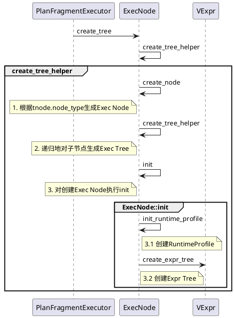

生成Exec Tree和Expr Tree是相同的逻辑，将这部分的实现统一归纳。

# 创建Exec树



删除一些状态判断处理，了解主要执行逻辑
```C++
Status ExecNode::create_tree(RuntimeState* state, ObjectPool* pool,
        const TPlan& plan, const DescriptorTbl& descs, ExecNode** root) {
    int node_idx = 0;
    // 创建Exec Tree
    RETURN_IF_ERROR(create_tree_helper(state, pool, plan.nodes,
            descs, nullptr, &node_idx, root));
    return Status::OK();
}


Status ExecNode::create_tree_helper(RuntimeState* state, ObjectPool* pool,
        const std::vector<TPlanNode>& tnodes, const DescriptorTbl& descs,
        ExecNode* parent, int* node_idx, ExecNode** root) {
    const TPlanNode& tnode = tnodes[*node_idx];
    int num_children = tnodes[*node_idx].num_children;
    ExecNode* node = nullptr;
    // 1. 根据tnode.node_type创建ExecNode
    RETURN_IF_ERROR(create_node(state, pool, tnodes[*node_idx], descs, &node));

    // 2. 利用创建的ExecNode, 构建ExecNode树
    if (parent != nullptr) {
        parent->_children.push_back(node);
    } else {
        *root = node;
    }

    // 3. 递归地处理孩子
    for (int i = 0; i < num_children; i++) {
        ++*node_idx;
        RETURN_IF_ERROR(create_tree_helper(state, pool,
                tnodes, descs, node, node_idx, nullptr));
    }

    // 4. init Exec:创建RuntimeProfile, 创建Expr Tree
    RETURN_IF_ERROR(node->init(tnode, state));
    return Status::OK();
}


Status ExecNode::create_node(RuntimeState* state, ObjectPool* pool,
        const TPlanNode& tnode, const DescriptorTbl& descs, ExecNode** node) {
    switch (tnode.node_type) {
                ......
    case TPlanNodeType::ANALYTIC_EVAL_NODE:
        *node = pool->add(new vectorized::VAnalyticEvalNode(
            pool, tnode, descs));
        return Status::OK();
    default: { ...... }

    return Status::OK();
}
```