# 前端和后端对接

`Coordinator::exec`

```java
public void exec() throws Exception {
		....
        if (enablePipelineEngine) {
            sendPipelineCtx();
        } else {
            sendFragment();
        }
        ......
}
```


后端调用执行计算的入口
```C++
void PInternalServiceImpl::exec_plan_fragment(
        google::protobuf::RpcController* controller,
        const PExecPlanFragmentRequest* request,
        PExecPlanFragmentResult* response,
        google::protobuf::Closure* done) {
    bool ret = _light_work_pool.try_offer([this, controller, request, response, done]() {
        _exec_plan_fragment_in_pthread(controller, request, response, done);
    });
    if (!ret) {
        offer_failed(response, done, _light_work_pool);
        return;
    }
}
```
对于Pipeline之后调用
```C++
Status FragmentMgr::exec_plan_fragment(const TPipelineFragmentParams& params)
```

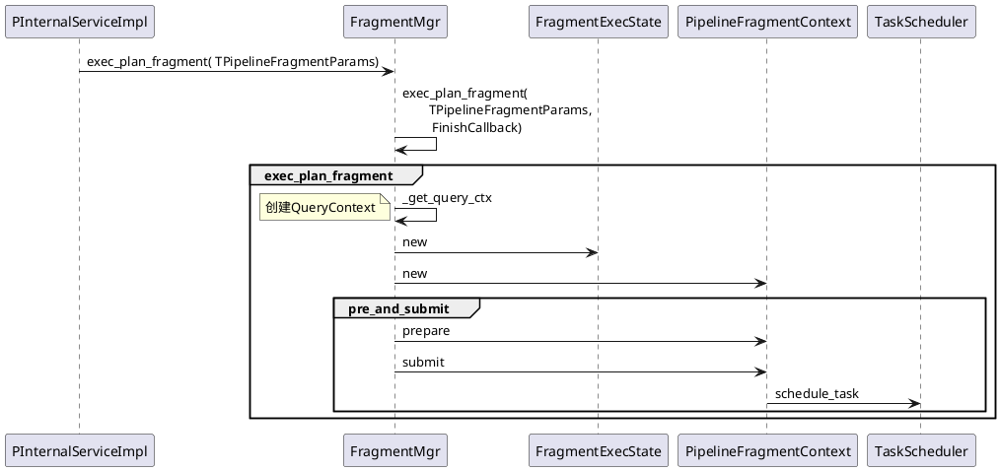
## PipelineFragment prepare

```C++
Status PipelineFragmentContext::prepare(
        const doris::TPipelineFragmentParams& request, const size_t idx) {
    const auto& local_params = request.local_params[idx];
    _runtime_profile.reset(new RuntimeProfile("PipelineContext"));
    auto* fragment_context = this;

    // 1. 创建并初始化RuntimeState
    _runtime_state = RuntimeState::create_unique(
            local_params, request.query_id,
            request.fragment_id, request.query_options,
            _query_ctx->query_globals, _exec_env);
    _runtime_state->set_query_ctx(_query_ctx.get());
    _runtime_state->set_query_mem_tracker(_query_ctx->query_mem_tracker);
    _runtime_state->runtime_filter_mgr()->init();
    _runtime_state->set_be_number(local_params.backend_num);
                ......
    auto* desc_tbl = _query_ctx->desc_tbl;
    _runtime_state->set_desc_tbl(desc_tbl);

    // 2. 创建用于构建Pipeline的ExecNode
    RETURN_IF_ERROR_OR_CATCH_EXCEPTION(ExecNode::create_tree(
            _runtime_state.get(), _runtime_state->obj_pool(),
            request.fragment.plan, *desc_tbl, &_root_plan));

    // 3. 设置exchangenode的sender数量
    //    在VExchangeNode::prepare根据num_senders
    //    初始化PipSenderQueue的_num_remaining_senders
    std::vector<ExecNode*> exch_nodes;
    _root_plan->collect_nodes(TPlanNodeType::EXCHANGE_NODE, &exch_nodes);
    for (ExecNode* exch_node : exch_nodes) {
        int num_senders = find_with_default(request.per_exch_num_senders, exch_node->id(), 0);
        static_cast<vectorized::VExchangeNode*>(exch_node)->set_num_senders(num_senders);
    }

    // 4. 调用Exec Tree所有prepare
    RETURN_IF_ERROR(_root_plan->prepare(_runtime_state.get()));
    
    // 5. 收集ScanNode并设置scan ranges
    std::vector<ExecNode*> scan_nodes;
    std::vector<TScanRangeParams> no_scan_ranges;
    _root_plan->collect_scan_nodes(&scan_nodes);
    for (int i = 0; i < scan_nodes.size(); ++i) {
        ExecNode* node = scan_nodes[i];
        if (typeid(*node) == typeid(vectorized::NewOlapScanNode) ||
            typeid(*node) == typeid(vectorized::NewFileScanNode) ||
            typeid(*node) == typeid(vectorized::NewOdbcScanNode) ||
            typeid(*node) == typeid(vectorized::NewEsScanNode) ||
            typeid(*node) == typeid(vectorized::VMetaScanNode) ||
            typeid(*node) == typeid(vectorized::NewJdbcScanNode)) {
            auto* scan_node = static_cast<vectorized::VScanNode*>(scan_nodes[i]);
            auto scan_ranges = find_with_default(local_params.per_node_scan_ranges,
                    scan_node->id(),no_scan_ranges);
            const bool shared_scan = find_with_default(local_params.per_node_shared_scans, 
                    scan_node->id(), false);
            scan_node->set_scan_ranges(scan_ranges);
            scan_node->set_shared_scan(_runtime_state.get(), shared_scan);
        } else {
            ScanNode* scan_node = static_cast<ScanNode*>(node);
            auto scan_ranges = find_with_default(local_params.per_node_scan_ranges,
                    scan_node->id(), no_scan_ranges);
            scan_node->set_scan_ranges(scan_ranges);
        }
    }

    _runtime_state->set_per_fragment_instance_idx(local_params.sender_id);
    _runtime_state->set_num_per_fragment_instances(request.num_senders);

    // 6. 创建Sink并执行Sink的init和prepare
    if (request.fragment.__isset.output_sink) {
        RETURN_IF_ERROR_OR_CATCH_EXCEPTION(DataSink::create_data_sink(
                _runtime_state->obj_pool(), request.fragment.output_sink,
                request.fragment.output_exprs, request, idx, _root_plan->row_desc(),
                _runtime_state.get(), &_sink, *desc_tbl));
    }

    // 7. 递归地创建Pipeline树, 此过程在有依赖的地方生成依赖
    //    例如, HASH_JOIN_NODE和CROSS_JOIN_NODE

    // 7.1 根据_root_plan生成_root_pipeline
    _root_pipeline = fragment_context->add_pipeline();
    RETURN_IF_ERROR(_build_pipelines(_root_plan, _root_pipeline));
    if (_sink) {
        // 7.2 生成sink,并为_root_plan设置sink node
        RETURN_IF_ERROR(_create_sink(request.local_params[idx].sender_id,
                request.fragment.output_sink, _runtime_state.get()));
    }

    // 8. 根据上面生成的_pipelines, 生成PipelineTask
    //    并执行PipelineTask::prepare
    RETURN_IF_ERROR(_build_pipeline_tasks(request));

    _prepared = true;
    return Status::OK();
}
```

### 创建ExecNode
```C++
Status ExecNode::create_tree(RuntimeState* state, ObjectPool* pool,
        const TPlan& plan, const DescriptorTbl& descs, ExecNode** root) {
    int node_idx = 0;
    // 创建Exec Tree
    RETURN_IF_ERROR(create_tree_helper(state, pool, plan.nodes,
            descs, nullptr, &node_idx, root));
    return Status::OK();
}


Status ExecNode::create_tree_helper(RuntimeState* state, ObjectPool* pool,
        const std::vector<TPlanNode>& tnodes, const DescriptorTbl& descs,
        ExecNode* parent, int* node_idx, ExecNode** root) {
    const TPlanNode& tnode = tnodes[*node_idx];
    int num_children = tnodes[*node_idx].num_children;
    ExecNode* node = nullptr;
    // 1. 根据tnode.node_type创建ExecNode
    RETURN_IF_ERROR(create_node(state, pool, tnodes[*node_idx], descs, &node));

    // 2. 利用创建的ExecNode, 构建ExecNode树
    if (parent != nullptr) {
        parent->_children.push_back(node);
    } else {
        *root = node;
    }

    // 3. 递归地处理孩子
    for (int i = 0; i < num_children; i++) {
        ++*node_idx;
        RETURN_IF_ERROR(create_tree_helper(state, pool,
                tnodes, descs, node, node_idx, nullptr));
    }

    // 4. init Exec
    RETURN_IF_ERROR(node->init(tnode, state));
    return Status::OK();
}


Status ExecNode::create_node(RuntimeState* state, ObjectPool* pool,
        const TPlanNode& tnode, const DescriptorTbl& descs, ExecNode** node) {
    switch (tnode.node_type) {
                ......
    case TPlanNodeType::ANALYTIC_EVAL_NODE:
        *node = pool->add(new vectorized::VAnalyticEvalNode(pool, tnode, descs));
        return Status::OK();
    default: { ...... }

    return Status::OK();
}
```

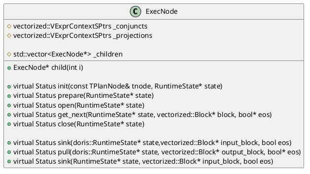

### 生成Pipeline树
通过`PipelineFragmentContext::_build_pipelines`来构建Pipeline树，主要根据`ExecNode::type()`创建`OperatorBuilder`,`OperatorBuilder`提供了`OperatorPtr build_operator()`来生成Operator，首先了解Pipeline的数据结构

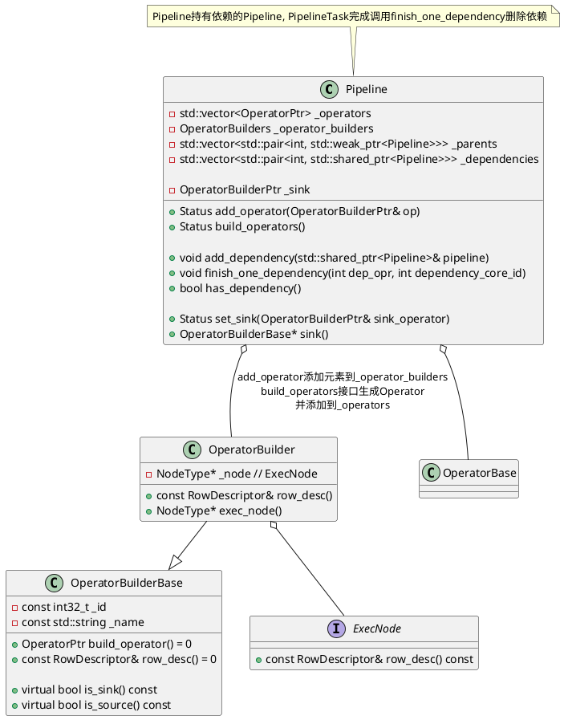


以窗口`ANALYTIC_EVAL_NODE`了解普通算子的Pipeline生成以及`HASH_JOIN_NODE`存在依赖的算子的Pipeline的生成。

```C++
Status PipelineFragmentContext::_build_pipelines(ExecNode* node, PipelinePtr cur_pipe) {
    auto node_type = node->type();
    switch (node_type) {
    case TPlanNodeType::ANALYTIC_EVAL_NODE: {
        // 1. 创建Pipeline
        auto new_pipeline = add_pipeline();
        // 2. 递归地对其子节点构建Pipeline
        RETURN_IF_ERROR(_build_pipelines(node->child(0), new_pipeline));

        OperatorBuilderPtr analytic_sink =
                std::make_shared<AnalyticSinkOperatorBuilder>(node->id(), node);
        RETURN_IF_ERROR(new_pipeline->set_sink(analytic_sink));

        OperatorBuilderPtr analytic_source =
                std::make_shared<AnalyticSourceOperatorBuilder>(node->id(), node);
        RETURN_IF_ERROR(cur_pipe->add_operator(analytic_source));
        break;
    }

    // 存在依赖的算子
    case TPlanNodeType::HASH_JOIN_NODE: {
        auto* join_node = assert_cast<vectorized::HashJoinNode*>(node);
        // 1. 为右表生成Pipeline(Build端)
        auto new_pipe = add_pipeline();
        if (join_node->should_build_hash_table()) {
            RETURN_IF_ERROR(_build_pipelines(node->child(1), new_pipe));
        } else {
            OperatorBuilderPtr builder = std::make_shared<EmptySourceOperatorBuilder>(
                    node->child(1)->id(), node->child(1)->row_desc(), node->child(1));
            new_pipe->add_operator(builder);
        }
        OperatorBuilderPtr join_sink =
                std::make_shared<HashJoinBuildSinkBuilder>(node->id(), join_node);
        RETURN_IF_ERROR(new_pipe->set_sink(join_sink));

        // 2. 为左表生成Pipeline(Prob端)
        RETURN_IF_ERROR(_build_pipelines(node->child(0), cur_pipe));
        OperatorBuilderPtr join_source =
                std::make_shared<HashJoinProbeOperatorBuilder>(node->id(), join_node);
        RETURN_IF_ERROR(cur_pipe->add_operator(join_source));

        // 3. 生成依赖(Build构建完成,再执行Prob)
        cur_pipe->add_dependency(new_pipe);
        break;
    }

    // 集合运算
    case TPlanNodeType::INTERSECT_NODE: {
        RETURN_IF_ERROR(_build_operators_for_set_operation_node<true>(node, cur_pipe));
        break;
    }
    case TPlanNodeType::EXCEPT_NODE: {
        RETURN_IF_ERROR(_build_operators_for_set_operation_node<false>(node, cur_pipe));
        break;
    }
                ......


}
```

### 生成Operator

对于`build_operator`的实现依赖宏定义进行代码生成，以`ScanOperator`为例，存在`OPERATOR_CODE_GENERATOR(ScanOperator, SourceOperator)`
```C++
#define OPERATOR_CODE_GENERATOR(NAME, SUBCLASS)                       \
    NAME##Builder::NAME##Builder(int32_t id, ExecNode* exec_node)     \
            : OperatorBuilder(id, #NAME, exec_node) {}                \
                                                                      \
    OperatorPtr NAME##Builder::build_operator() {                     \
        return std::make_shared<NAME>(this, _node);                   \
    }                                                                 \
                                                                      \
    NAME::NAME(OperatorBuilderBase* operator_builder, ExecNode* node) \
            : SUBCLASS(operator_builder, node) {};
```
例如, `ANALYTIC_EVAL_NODE`它对应的Pipeline的Sink是`AnalyticSinkOperatorBuilder`,Operator是`AnalyticSourceOperatorBuilder`
```C++
// Sink生成StreamingOperator，基类是StreamingOperator
// build_operator生成AnalyticSinkOperator，其ExecNode是VAnalyticEvalNode
// 
OPERATOR_CODE_GENERATOR(AnalyticSinkOperator, StreamingOperator)

// Source生成SourceOperator，基类是SourceOperator
// build_operator生成AnalyticSourceOperator，其ExecNode是VAnalyticEvalNode
OPERATOR_CODE_GENERATOR(AnalyticSourceOperator, SourceOperator)
```

### 生成PipelineTask
`PipelineFragmentContext::_build_pipeline_tasks`接口将`Pipeline`生成`PipelineTask`。

```C++
Status PipelineFragmentContext::_build_pipeline_tasks(
        const doris::TPipelineFragmentParams& request) {
    _total_tasks = 0;
    // 1. 生成PipelineTask
    for (PipelinePtr& pipeline : _pipelines) {
        // 1.1 生成Sink Operator
        auto sink = pipeline->sink()->build_operator();
        sink->init(request.fragment.output_sink);

        // 1.2 将Pipeline中的_operator_builders转换成Operators
        RETURN_IF_ERROR(pipeline->build_operators());

        // 1.3 生成PipelineTask,其中_operators=pipeline->_operators
        //     _source(_operators.front()), _root(_operators.back())
        auto task = std::make_unique<PipelineTask>(pipeline, _total_tasks++,
                _runtime_state.get(), sink, this, pipeline->pipeline_profile());
        sink->set_child(task->get_root());
        _tasks.emplace_back(std::move(task));
    }

    // 2. PipelineTask prepare
    for (auto& task : _tasks) {
        RETURN_IF_ERROR(task->prepare(_runtime_state.get()));
    }

    return Status::OK();
}
```
在`PipelineTask::execute`中调用Operator的`open`, `get_block`接口

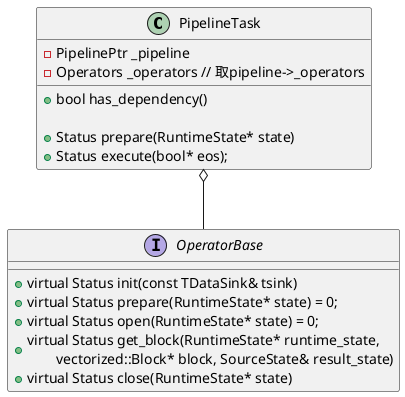

```C++
Status PipelineTask::execute(bool* eos) {
    *eos = false;
    if (!_opened) {
        // for o : _operators o->open()
        // _sink->open _opened = true
        auto st = _open();
        if (....) {
            set_state(....);
            return Status::OK();
        }
    }

    while (!_fragment_context->is_canceled()) {
        _block->clear_column_data(_root->row_desc().num_materialized_slots());
        auto* block = _block.get();

        // Pull block from operator chain
        _get_block_counter->update(1);
        RETURN_IF_ERROR(_root->get_block(_state, block, _data_state));

        *eos = _data_state == SourceState::FINISHED;
        if (_block->rows() != 0 || *eos) {
            auto status = _sink->sink(_state, block, _data_state);
            *eos = status.is<ErrorCode::END_OF_FILE>() ? true : *eos;
            if (*eos) { // just return, the scheduler will do finish work
                break;
            }
        }
    }

    return Status::OK();
}
```

## submit tasks

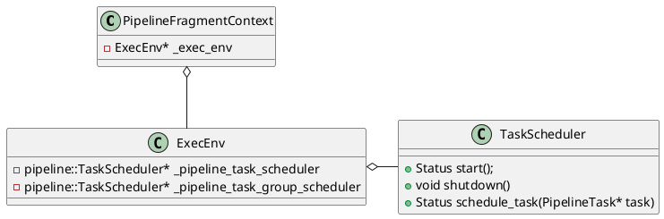

忽略异常,处理了解主流程
```C++
Status PipelineFragmentContext::submit() {
            ......
    _submitted = true;

    Status st;
    int submit_tasks = 0;
    // 1. 从_exec_env中读取TaskScheduler
    auto* scheduler = _exec_env->pipeline_task_scheduler();
    if (get_task_group()) {
        scheduler = _exec_env->pipeline_task_group_scheduler();
    }

    // 2. 提交PipelineTasks到TaskScheduler
    //    将任务放在_task_queue通过后台worker线程调度
    for (auto& task : _tasks) {
        st = scheduler->schedule_task(task.get());
        submit_tasks++;
    }
            ......
    return st;
}
```

# 后端Pipeline入口

Doris的Be的代码入口在`be/src/service/doris_main.cpp`，这里实现了`main`函数，

```C++
int main(int argc, char** argv) {
			......
    // init exec env
    auto exec_env = doris::ExecEnv::GetInstance();
    doris::ExecEnv::init(exec_env, paths);
    doris::TabletSchemaCache::create_global_schema_cache();
    	......
}
```

其中，`doris::ExecEnv::init(exec_env, paths)`调用`init_pipeline_task_scheduler`，从而初始化了Pipeline Task Scheduler，相关的调用逻辑如下：

```C++
Status ExecEnv::init(ExecEnv* env, const std::vector<StorePath>& store_paths) {
    return env->_init(store_paths);
}

Status ExecEnv::_init(const std::vector<StorePath>& store_paths) {
		......
    // 创建和初始化Pipeline TaskScheduler
    RETURN_IF_ERROR(init_pipeline_task_scheduler());
}
```

# Pipeline调度
Pipeline调度模块的主要职责是实现PipelineTask的调度和执行，内部维护了两个任务队列，实现任务调度和出让时间

- 执行队列，抽象为`TaskQueue`接口，`TaskScheduler`后台线程从其中取出任务来执行，`TaskScheduler`内部后台运行了`cores`个后台线程(该参数由默认值为0的`pipeline_executor_size`配置参数决定，如果用户没有设置，和CPU核心数一致)。
- 阻塞队列，抽象为`BlockedTaskScheduler`，其内部后台运行了一个`_schedule`线程，从本地的任务队列中取出任务检查任务是否可以执行，如果可以执行将其放入`TaskQueue`等待调度执行。

<center>
    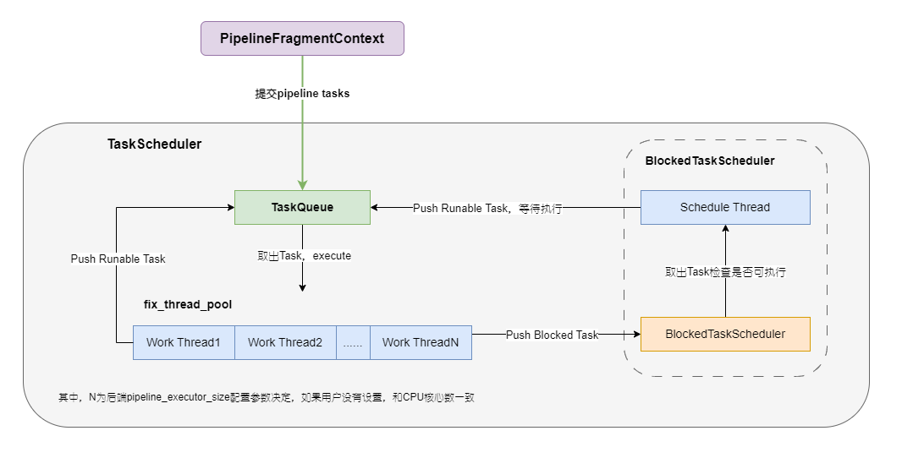
</center>

PipelineTask主要的类图
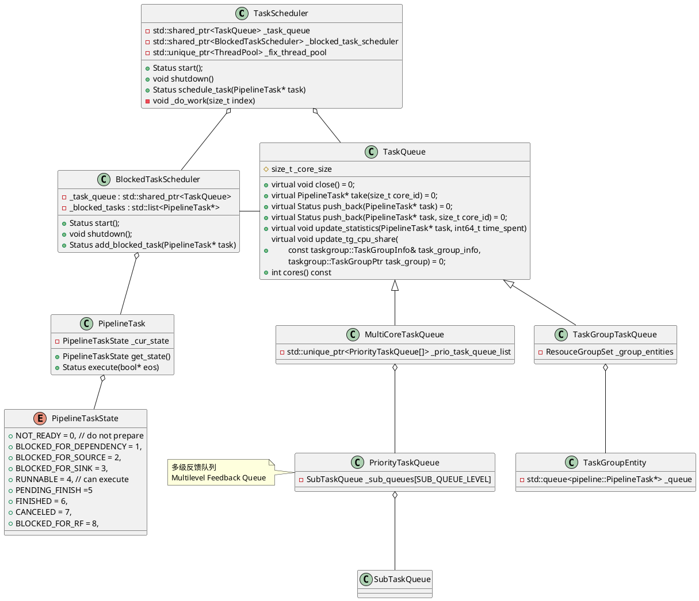

## 初始化TaskScheduler
```C++
Status ExecEnv::init_pipeline_task_scheduler() {
    // 配置参数pipeline_executor_size默认为0
    auto executors_size = config::pipeline_executor_size;
    if (executors_size <= 0) {
        // 系统文件/proc/cpuinfo中processor的数量
        executors_size = CpuInfo::num_cores();
    }

    // TODO pipeline task group combie two blocked schedulers.
    auto t_queue = std::make_shared<pipeline::MultiCoreTaskQueue>(executors_size);
    auto b_scheduler = std::make_shared<pipeline::BlockedTaskScheduler>(t_queue);
    _pipeline_task_scheduler =
            new pipeline::TaskScheduler(this, b_scheduler, t_queue, "WithoutGroupTaskSchePool");
    RETURN_IF_ERROR(_pipeline_task_scheduler->start());

    auto tg_queue = std::make_shared<pipeline::TaskGroupTaskQueue>(executors_size);
    auto tg_b_scheduler = std::make_shared<pipeline::BlockedTaskScheduler>(tg_queue);
    _pipeline_task_group_scheduler =
            new pipeline::TaskScheduler(this, tg_b_scheduler, tg_queue, "WithGroupTaskSchePool");
    RETURN_IF_ERROR(_pipeline_task_group_scheduler->start());

    return Status::OK();
}
```

接下来，了解一下`TaskScheduler::start`，这里会创建执行线程和轮询线程。

```C++
Status TaskScheduler::start() {
    int cores = _task_queue->cores();
    // Must be mutil number of cpu cores
    ThreadPoolBuilder(_name).set_min_threads(cores)
            .set_max_threads(cores).set_max_queue_size(0)
            .build(&_fix_thread_pool);
    _markers.reserve(cores);
 
    // 创建cores个worker线程,去任务并执行
    // 线程执行函数是TaskScheduler::_do_work
    for (size_t i = 0; i < cores; ++i) {
        _markers.push_back(std::make_unique<std::atomic<bool>>(true));
        // i被当作core_id从TaskQueue中取任务
        RETURN_IF_ERROR(_fix_thread_pool->submit_func(
            std::bind(&TaskScheduler::_do_work, this, i)));
    }

    // 创建Schedule Thread检查任务状态
    return _blocked_task_scheduler->start();
}
```

`BlockedTaskScheduler::start`创建轮询线程，检查Task是否可以执行。

```C++
Status BlockedTaskScheduler::start() {
    // 创建轮询线程，线执行函数是BlockedTaskScheduler::_schedule
    RETURN_IF_ERROR(Thread::create("BlockedTaskScheduler",
           "schedule_blocked_pipeline", [this]() { this->_schedule(); },
            &_thread));
    while (!this->_started.load()) {
        std::this_thread::sleep_for(std::chrono::milliseconds(5));
    }
    return Status::OK();
}
```

## 执行线程

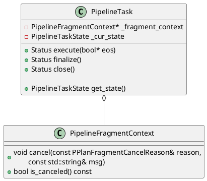

```C++
void TaskScheduler::_do_work(size_t index) {
    const auto& marker = _markers[index];
    while (*marker) {
        // 1. 从执行队列中取Task
        auto* task = _task_queue->take(index);
        if (!task) continue;
        task->set_task_queue(_task_queue.get());
        auto* fragment_ctx = task->fragment_context();
        signal::query_id_hi = fragment_ctx->get_query_id().hi;
        signal::query_id_lo = fragment_ctx->get_query_id().lo;
        bool canceled = fragment_ctx->is_canceled();

        // 2. PENDING_FINISH或cancle, close task并设置task state
        auto check_state = task->get_state();
        if (check_state == PipelineTaskState::PENDING_FINISH) {
            _try_close_task(task, canceled ?
				PipelineTaskState::CANCELED : PipelineTaskState::FINISHED);
            continue;
        }

        if (canceled) {
            fragment_ctx->send_report(true);
            _try_close_task(task, PipelineTaskState::CANCELED);
            continue;
        }

        bool eos = false;
        auto status = Status::OK();
        // 3. 实际执行task，绑定执行的线程core id
        try {
            status = task->execute(&eos);
        } catch (const Exception& e) {
            status = e.to_status();
        }
        task->set_previous_core_id(index);

        if (!status.ok()) {
            task->set_eos_time();
            // 3.1 执行失败，cancel所有的子计划
            fragment_ctx->cancel(PPlanFragmentCancelReason::INTERNAL_ERROR,
                                 status.to_string());
            fragment_ctx->send_report(true);
            _try_close_task(task, PipelineTaskState::CANCELED);
            continue;
        }

        // 3.2 任务执行完成, 调用finalize
        if (eos) {
            task->set_eos_time();
            status = task->finalize();
            if (!status.ok()) {
                // finalize失败, cancel所有的子计划
                fragment_ctx->cancel(PPlanFragmentCancelReason::INTERNAL_ERROR,
                                     "finalize fail:" + status.to_string());
                _try_close_task(task, PipelineTaskState::CANCELED);
            } else {
                _try_close_task(task, PipelineTaskState::FINISHED);
            }
            continue;
        }

        auto pipeline_state = task->get_state();
        switch (pipeline_state) {
        case PipelineTaskState::BLOCKED_FOR_SOURCE:
        case PipelineTaskState::BLOCKED_FOR_SINK:
        case PipelineTaskState::BLOCKED_FOR_RF:
        case PipelineTaskState::BLOCKED_FOR_DEPENDENCY:
            // 4. block Task,放回阻塞队列,将其添加到blocked task队列
            _blocked_task_scheduler->add_blocked_task(task);
            break;
        case PipelineTaskState::RUNNABLE:
            // 5. 放回调度队列将task再次入队
            _task_queue->push_back(task, index);
            break;
        default:
            DCHECK(false) << "error state after run task, " << get_state_name(pipeline_state);
            break;
        }
    }
}
```

## 轮询线程
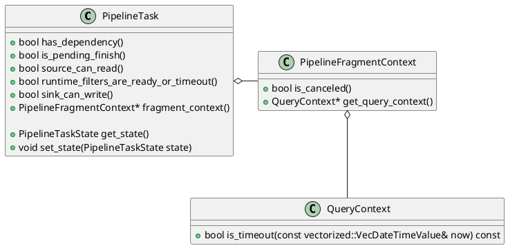
`PipelineTask`轮询调度，主要实现判断Task是否可以执行，如果可以执行将其放到`_task_queue`等调度线程调度执行，这里也会实现一些状态切换。

```C++
void BlockedTaskScheduler::_schedule() {
    _started.store(true);
    std::list<PipelineTask*> local_blocked_tasks;
    int empty_times = 0;

    while (!_shutdown) {
        // 将_blocked_tasks移动到local_blocked_tasks局部变量
        {
            std::unique_lock<std::mutex> lock(this->_task_mutex);
            local_blocked_tasks.splice(local_blocked_tasks.end(), _blocked_tasks);
            if (local_blocked_tasks.empty()) {
                while (!_shutdown.load() && _blocked_tasks.empty()) {
                    _task_cond.wait_for(lock, std::chrono::milliseconds(10));
                }

                if (_shutdown.load()) break;
                local_blocked_tasks.splice(local_blocked_tasks.end(), _blocked_tasks);
            }
        }

        auto origin_local_block_tasks_size = local_blocked_tasks.size();
        auto iter = local_blocked_tasks.begin();
        vectorized::VecDateTimeValue now = vectorized::VecDateTimeValue::local_time();
        while (iter != local_blocked_tasks.end()) {
            auto* task = *iter;
            auto state = task->get_state();
            if (state == PipelineTaskState::PENDING_FINISH) {
                // should cancel or should finish
                if (task->is_pending_finish()) {
                    iter++;
                } else {
                    _make_task_run(local_blocked_tasks, iter, PipelineTaskState::PENDING_FINISH);
                }
            } else if (task->fragment_context()->is_canceled()) {
                if (task->is_pending_finish()) {
                    task->set_state(PipelineTaskState::PENDING_FINISH);
                    iter++;
                } else {
                    _make_task_run(local_blocked_tasks, iter);
                }
            } else if (task->query_context()->is_timeout(now)) {
                task->fragment_context()->cancel(PPlanFragmentCancelReason::TIMEOUT);
                if (task->is_pending_finish()) {
                    task->set_state(PipelineTaskState::PENDING_FINISH);
                    iter++;
                } else {
                    _make_task_run(local_blocked_tasks, iter);
                }
            } else if (state == PipelineTaskState::BLOCKED_FOR_DEPENDENCY) {
                if (task->has_dependency()) {
                    iter++;
                } else {
                    _make_task_run(local_blocked_tasks, iter);
                }
            } else if (state == PipelineTaskState::BLOCKED_FOR_SOURCE) {
                if (task->source_can_read()) {
                    _make_task_run(local_blocked_tasks, iter);
                } else {
                    iter++;
                }
            } else if (state == PipelineTaskState::BLOCKED_FOR_RF) {
                if (task->runtime_filters_are_ready_or_timeout()) {
                    _make_task_run(local_blocked_tasks, iter);
                } else {
                    iter++;
                }
            } else if (state == PipelineTaskState::BLOCKED_FOR_SINK) {
                if (task->sink_can_write()) {
                    _make_task_run(local_blocked_tasks, iter);
                } else {
                    iter++;
                }
            } else {
                _make_task_run(local_blocked_tasks, iter);
            }
        }

        if (origin_local_block_tasks_size == 0 ||
            local_blocked_tasks.size() == origin_local_block_tasks_size) {
            empty_times += 1;
        } else {
            empty_times = 0;
        }

        if (empty_times != 0 && (empty_times & (EMPTY_TIMES_TO_YIELD - 1)) == 0) {
#ifdef __x86_64__
            _mm_pause();
#else
            sched_yield();
#endif
        }
        if (empty_times == EMPTY_TIMES_TO_YIELD * 10) {
            empty_times = 0;
            sched_yield();
        }
    }
}
```

## Task状态切换

状态定义：

```C++
enum class PipelineTaskState : uint8_t {
    NOT_READY = 0, 				// do not prepare
    BLOCKED_FOR_DEPENDENCY = 1,
    BLOCKED_FOR_SOURCE = 2,
    BLOCKED_FOR_SINK = 3,
    RUNNABLE = 4, 			// can execute
    PENDING_FINISH = 5,     // compute task is over,but still hold resource.
    					    // like some scan and sink task
    FINISHED = 6,
    CANCELED = 7,
    BLOCKED_FOR_RF = 8,
};
```
状态的表示意义：
- NOT_READY: The PipeLine task has not called the prepare function and is not ready for execution.
- BLOCKED: The PipeLine task is blocked, waiting for the polling thread to check.
    - The pre-pipeline has not finished running : BLOCKED_FOR_DEPENDENCY
    - SourceOperator's data is not readable, data is not ready: BLOCKED_FOR_SOURCE
    - SinkOperator's data is not writable: BLOCKED_FOR_SINK
- RUNNABLE : PipeLine's task is executable, waiting for the execution thread to perform scheduling.
- PENDING_FINISH: PipeLine's task is ready to finish, wait for other related Pipeline tasks to finish, then call close for resource recovery.
- FINISHED: The PipeLine task is finished, waiting for Shared_ptr destruct to be released.
- CANCELED: PipeLineTask that has been cancelled, waiting for Shared_ptr destructor release

状态切换：

```C++
/**
 * PipelineTaskState indicates all possible states of a pipeline task.
 * A FSM is described as below:
 *
 *                 |-----------------------------------------------------|
 *                 |---|                  transfer 2    transfer 3       |   transfer 4
 *                     |-------> BLOCKED ------------|                   |---------------------------------------> CANCELED
 *              |------|                             |                   | transfer 5           transfer 6|
 * NOT_READY ---| transfer 0                         |-----> RUNNABLE ---|---------> PENDING_FINISH ------|
 *              |                                    |          ^        |                      transfer 7|
 *              |------------------------------------|          |--------|---------------------------------------> FINISHED
 *                transfer 1                                   transfer 9          transfer 8
 * BLOCKED include BLOCKED_FOR_DEPENDENCY, BLOCKED_FOR_SOURCE and BLOCKED_FOR_SINK.
 *
 * transfer 0 (NOT_READY -> BLOCKED): this pipeline task has some incomplete dependencies
 * transfer 1 (NOT_READY -> RUNNABLE): this pipeline task has no incomplete dependencies
 * transfer 2 (BLOCKED -> RUNNABLE): runnable condition for this pipeline task is met (e.g. get a new block from rpc)
 * transfer 3 (RUNNABLE -> BLOCKED): runnable condition for this pipeline task is not met (e.g. sink operator send a block by RPC and wait for a response)
 * transfer 4 (RUNNABLE -> CANCELED): current fragment is cancelled
 * transfer 5 (RUNNABLE -> PENDING_FINISH): this pipeline task completed but wait for releasing resources hold by itself
 * transfer 6 (PENDING_FINISH -> CANCELED): current fragment is cancelled
 * transfer 7 (PENDING_FINISH -> FINISHED): this pipeline task completed and resources hold by itself have been released already
 * transfer 8 (RUNNABLE -> FINISHED): this pipeline task completed and no resource need to be released
 * transfer 9 (RUNNABLE -> RUNNABLE): this pipeline task yields CPU and re-enters the runnable queue if it is runnable and has occupied CPU for a max time slice
 */
```

# 多级反馈队列

`MultiCoreTaskQueue`对外提供了两个添加Task的接口
```C++
// TaskScheduler or BlockedTaskScheduler添加Task
Status push_back(PipelineTask* task)

// TaskScheduler的worker线程添加Task
// core_id是PipelineTask在_prio_task_queue_list的index
Status push_back(PipelineTask* task, size_t core_id)
```

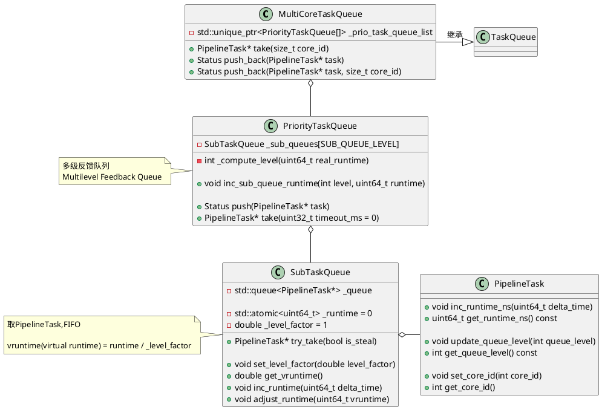

## 初始化

初始化多级反馈队列，设置level factor。
```C++
PriorityTaskQueue::PriorityTaskQueue() : _closed(false) {
    double factor = 1;
    for (int i = SUB_QUEUE_LEVEL - 1; i >= 0; i--) {
        _sub_queues[i].set_level_factor(factor);
        factor *= LEVEL_QUEUE_TIME_FACTOR;
    }
}
```

## vRuntime计算

`PriorityTaskQueue`有`SUB_QUEUE_LEVEL = 6`个`SubTaskQueue`组成，

```C++
// A Multilevel Feedback Queue
class PriorityTaskQueue {
private:
    static constexpr auto LEVEL_QUEUE_TIME_FACTOR = 2;
    static constexpr size_t SUB_QUEUE_LEVEL = 6;
    SubTaskQueue _sub_queues[SUB_QUEUE_LEVEL];
}
```

每个`SubTaskQueue`持有一个vruntime影响其调度的优先级，每个`PipelineTask`在`execute`过程中会计算其`time_spent`作为runtime来更新vruntime。

```C++
// runtime是PipelineTask执行期间消耗的真实的时间
// vruntime(也就是virtual runtime) = runtime / _level_factor
double get_vruntime() { return _runtime / _level_factor; }
void inc_runtime(uint64_t delta_time) {
    _runtime += delta_time;
}

// 当队列是空时，用PriorityTaskQueue中SubTaskQueue中最小vruntime
// 即_queue_level_min_vruntime)调整其vrutime
// 避免空的队列拥有太高的优先级
// 参见PriorityTaskQueue::push
void adjust_runtime(uint64_t vruntime) {
    this->_runtime = vruntime * _level_factor;
}
```

`PipelineTask::execute`会调用`_task_queue->update_statistics`，对于`MultiCoreTaskQueue`其相关实现如下

```C++
void MultiCoreTaskQueue::update_statistics(PipelineTask* task, int64_t time_spent) override {
    task->inc_runtime_ns(time_spent);
    _prio_task_queue_list[task->get_core_id()]
        .inc_sub_queue_runtime(task->get_queue_level(), time_spent);
}

void PriorityTaskQueue::inc_sub_queue_runtime(int level, uint64_t runtime) {
    // SubTaskQueue的_runtime增加runtime
    _sub_queues[level].inc_runtime(runtime);
}
```


## Push Task

```C++
 // TaskScheduler或BlockedTaskScheduler添加Task
Status MultiCoreTaskQueue::push_back(PipelineTask* task) {
    // 计算core_id,PipelineTask在worker thread拿出execute后
    // 调用set_previous_core_id设置了previous_core_id
    int core_id = task->get_previous_core_id();
    if (core_id < 0) {
        // 轮询调度
        core_id = _next_core.fetch_add(1) % _core_size;
    }
    return push_back(task, core_id);
}

// TaskScheduler的worker线程添加Task
// core_id是PipelineTask在_prio_task_queue_list的index
Status MultiCoreTaskQueue::push_back(PipelineTask* task, size_t core_id) {
    task->put_in_runnable_queue();
    return _prio_task_queue_list[core_id].push(task);
}
```

之后调用`PriorityTaskQueue::push`添加一个`PipelineTask`。

```C++
Status PriorityTaskQueue::push(PipelineTask* task) {
    // 计算level等级
    auto level = _compute_level(task->get_runtime_ns());
    std::unique_lock<std::mutex> lock(_work_size_mutex);

    // 更新SubTaskQueue中最小vruntime，避免其拥有太高的优先级
    if (_sub_queues[level].empty() &&
        _queue_level_min_vruntime > _sub_queues[level].get_vruntime()) {
        _sub_queues[level].adjust_runtime(_queue_level_min_vruntime);
    }

    // 在SubTaskQueue的_queue尾部追加一个Task
    _sub_queues[level].push_back(task);
    _total_task_size++;
    _wait_task.notify_one();
    return Status::OK();
}
```

`PriorityTaskQueue`通过`_compute_level`计算level将其放进`_sub_queues`。其中每个`SubTaskQueue`对应有一个`_queue_level_limit`时间，`runtime`从做到右遍历，小于`_queue_level_limit[i]`落入对应的level。

```C++
// 1s, 3s, 10s, 60s, 300s
uint64_t _queue_level_limit[SUB_QUEUE_LEVEL - 1] = {
    1000000000, 3000000000, 10000000000,
    60000000000, 300000000000
};
```

```C++
int PriorityTaskQueue::_compute_level(uint64_t runtime) {
    for (int i = 0; i < SUB_QUEUE_LEVEL - 1; ++i) {
        // runtime小于_queue_level_limit[i]则落入该层级
        if (runtime <= _queue_level_limit[i]) {
            return i;
        }
    }
    // 落入最后一个层级
    return SUB_QUEUE_LEVEL - 1;
}
```


## Take Task

```C++
PipelineTask* MultiCoreTaskQueue::take(size_t core_id) {
    PipelineTask* task = nullptr;
    while (!_closed) {
        // 1. 尝试从core_id对应的PriorityTaskQueue中取PipelineTask
        task = _prio_task_queue_list[core_id].try_take(false);
        if (task) {
            task->set_core_id(core_id);
            break;
        }

        // 2. 第1步取PipelineTask失败
        //    尝试轮询从core_id之后的队列再取PipelineTask
        task = _steal_take(core_id);
        if (task) {
            break;
        }

        // 3. 第2步取PipelineTask失败
        //    尝试等待WAIT_CORE_TASK_TIMEOUT_MS之后再取PipelineTask
        task = _prio_task_queue_list[core_id].take(
            	WAIT_CORE_TASK_TIMEOUT_MS /* timeout_ms */);
        if (task) {
            task->set_core_id(core_id);
            break;
        }
    }
   
    if (task) {
        // 如果取到PipelineTask，更新其信息用于Profile
        task->pop_out_runnable_queue();
    }
    return task;
}
```

上述3步取`PipelineTask`都是调用`PriorityTaskQueue::try_take_unprotected`来取`PipelineTask`。

```C++
PipelineTask* PriorityTaskQueue::try_take_unprotected(bool is_steal) {
    if (_total_task_size == 0 || _closed) return nullptr;

    double min_vruntime = 0;
    int level = -1;
    // 找到vruntime最小的SubTaskQueue的level
    // 可见非空的vruntime小的SubTaskQueue优先级高
    for (int i = 0; i < SUB_QUEUE_LEVEL; ++i) {
        double cur_queue_vruntime = _sub_queues[i].get_vruntime();
        if (!_sub_queues[i].empty()) {
            if (level == -1 || cur_queue_vruntime < min_vruntime) {
                level = i;
                min_vruntime = cur_queue_vruntime;
            }
        }
    }
    _queue_level_min_vruntime = min_vruntime;

    // 从SubTaskQueue::_queue的头部取出一个Task
    auto task = _sub_queues[level].try_take(is_steal);
    if (task) {
        task->update_queue_level(level);
        _total_task_size--;
    }
    return task;
}
```

# TaskGroupTaskQueue

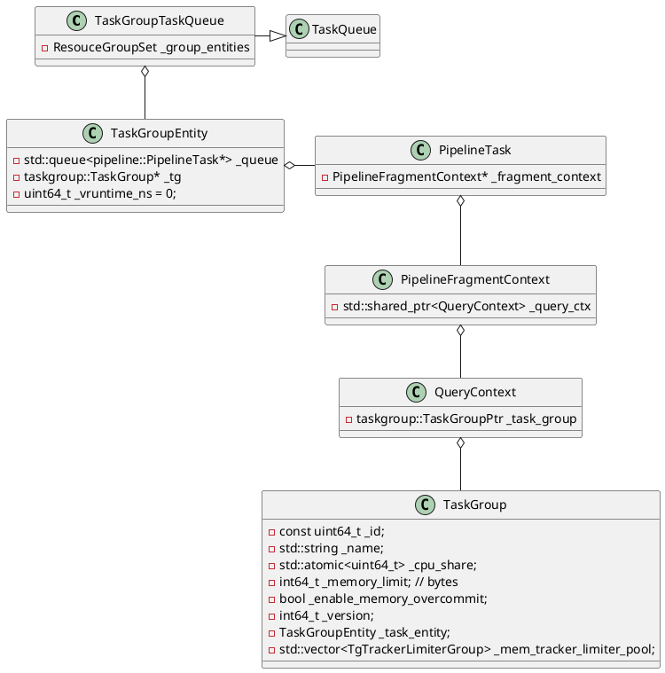

## vruntime计算
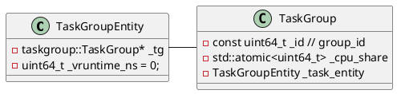
```C++
class TaskGroupTaskQueue : public TaskQueue {
            .....
private:
    // Like cfs rb tree in sched_entity
    struct TaskGroupSchedEntityComparator {
        bool operator()(const taskgroup::TGEntityPtr&, const taskgroup::TGEntityPtr&) const;
    };
    using ResouceGroupSet = std::set<taskgroup::TGEntityPtr, TaskGroupSchedEntityComparator>;
    ResouceGroupSet _group_entities;

            ......
}

bool TaskGroupTaskQueue::TaskGroupSchedEntityComparator::operator()(
        const taskgroup::TGEntityPtr& lhs_ptr,
        const taskgroup::TGEntityPtr& rhs_ptr) const {
    // 在std::set中的优先级
    //  1. vruntime
    //  2. cpu share
    //  3. task group id
    int64_t lhs_val = lhs_ptr->vruntime_ns();
    int64_t rhs_val = rhs_ptr->vruntime_ns();
    if (lhs_val != rhs_val) {
        return lhs_val < rhs_val;
    } else {
        auto l_share = lhs_ptr->cpu_share();
        auto r_share = rhs_ptr->cpu_share();
        if (l_share != r_share) {
            return l_share < r_share;
        } else {
            return lhs_ptr->task_group_id() < rhs_ptr->task_group_id();
        }
    }
}
```

vruntime计算
```C++
uint64_t TaskGroupEntity::vruntime_ns() const {
    return _vruntime_ns;
}

void TaskGroupEntity::incr_runtime_ns(uint64_t runtime_ns) {
    auto v_time = runtime_ns / _tg->cpu_share();
    _vruntime_ns += v_time;
}

// 在Push Task时调整vruntime
// push_back -> _push_back -> _enqueue_task_group
// 参见_enqueue_task_group
void TaskGroupEntity::adjust_vruntime_ns(uint64_t vruntime_ns) {
    _vruntime_ns = vruntime_ns;
}
```

在`PipelineTask`的`execute`调用`update_statistics`更新vruntime
```C++
void TaskGroupTaskQueue::update_statistics(PipelineTask* task, int64_t time_spent) {
    std::unique_lock<std::mutex> lock(_rs_mutex);
    auto* group = task->get_task_group();
    auto* entity = group->task_entity();
    auto find_entity = _group_entities.find(entity);
    bool is_in_queue = find_entity != _group_entities.end();
    if (is_in_queue) {
        _group_entities.erase(entity);
    }
    entity->incr_runtime_ns(time_spent);
    if (is_in_queue) {
        _group_entities.emplace(entity);
        // 更新_min_tg_entity和_min_tg_v_runtime_ns
        _update_min_tg();
    }
}
```
`PipelineTask`入队更新vruntime
```C++
template <bool from_worker>
void TaskGroupTaskQueue::_enqueue_task_group(taskgroup::TGEntityPtr tg_entity) {
    _total_cpu_share += tg_entity->cpu_share();

    // PipelineTask来自TaskScheduler或BlockedTaskScheduler
    if constexpr (!from_worker) {
        auto old_v_ns = tg_entity->vruntime_ns();
        auto* min_entity = _min_tg_entity.load();
        if (min_entity) {
            int64_t new_vruntime_ns = min_entity->vruntime_ns() - _ideal_runtime_ns(tg_entity) / 2;
            if (new_vruntime_ns > old_v_ns) {
                tg_entity->adjust_vruntime_ns(new_vruntime_ns);
            }
        } else if (old_v_ns < _min_tg_v_runtime_ns) {
            tg_entity->adjust_vruntime_ns(_min_tg_v_runtime_ns);
        }
    }
            ......
}

// like sched_fair.c calc_delta_fair, THREAD_TIME_SLICE maybe a dynamic value.
int64_t TaskGroupTaskQueue::_ideal_runtime_ns(
        taskgroup::TGEntityPtr tg_entity) const {
    return PipelineTask::THREAD_TIME_SLICE * _core_size *
            tg_entity->cpu_share() / _total_cpu_share;
}
```

## Push Task
```C++
// TaskScheduler或BlockedTaskScheduler向TaskQueue添加PipelineTask
Status TaskGroupTaskQueue::push_back(PipelineTask* task) {
    return _push_back<false>(task);
}

// Work Thread向TaskQueue添加PipelineTask
Status TaskGroupTaskQueue::push_back(PipelineTask* task, size_t core_id) {
    return _push_back<true>(task);
}
```

```C++
template <bool from_executor>
Status TaskGroupTaskQueue::_push_back(PipelineTask* task) {
    auto* entity = task->get_task_group()->task_entity();
    std::unique_lock<std::mutex> lock(_rs_mutex);
    entity->push_back(task);
    // 
    if (_group_entities.find(entity) == _group_entities.end()) {
        _enqueue_task_group<from_executor>(entity);
    }
    _wait_task.notify_one();
    return Status::OK();
}

template <bool from_worker>
void TaskGroupTaskQueue::_enqueue_task_group(taskgroup::TGEntityPtr tg_entity) {
    _total_cpu_share += tg_entity->cpu_share();

    // PipelineTask来自TaskScheduler或BlockedTaskScheduler
    if constexpr (!from_worker) {
        auto old_v_ns = tg_entity->vruntime_ns();
        auto* min_entity = _min_tg_entity.load();
        if (min_entity) {
            int64_t new_vruntime_ns = min_entity->vruntime_ns() - _ideal_runtime_ns(tg_entity) / 2;
            if (new_vruntime_ns > old_v_ns) {
                tg_entity->adjust_vruntime_ns(new_vruntime_ns);
            }
        } else if (old_v_ns < _min_tg_v_runtime_ns) {
            tg_entity->adjust_vruntime_ns(_min_tg_v_runtime_ns);
        }
    }
    _group_entities.emplace(tg_entity);
    _update_min_tg();
}
```

## Take task
```C++
PipelineTask* TaskGroupTaskQueue::take(size_t core_id) {
    std::unique_lock<std::mutex> lock(_rs_mutex);
    taskgroup::TGEntityPtr entity = nullptr;
    while (entity == nullptr) {
        if (_closed) return nullptr;

        if (_group_entities.empty()) {
            // 空，等待Push PipelineTask
            _wait_task.wait(lock);
        } else {
            // 根据调度规则，取出TaskGroupEntity
            entity = _next_tg_entity();
            if (!entity) {
                _wait_task.wait_for(lock,
                    std::chrono::milliseconds(WAIT_CORE_TASK_TIMEOUT_MS));
            }
        }
    }

    if (entity->task_size() == 1) {
        // TaskGroupEntity中只剩一个PipelineTask
        // PipelineTask取出后，TaskGroupEntity为空
        // 将其从_group_entities中移除并更新本地的如min task group等信息
        _dequeue_task_group(entity);
    }

    // FIFO取出PipelineTask
    return entity->take();
}

void TaskGroupTaskQueue::_dequeue_task_group(taskgroup::TGEntityPtr tg_entity) {
    _total_cpu_share -= tg_entity->cpu_share();
    _group_entities.erase(tg_entity);
    _update_min_tg();
}
```

# 参考资料
1. [DSIP-027: Support Pipeline Exec Engine](https://cwiki.apache.org/confluence/display/DORIS/DSIP-027%3A+Support+Pipeline+Exec+Engine)