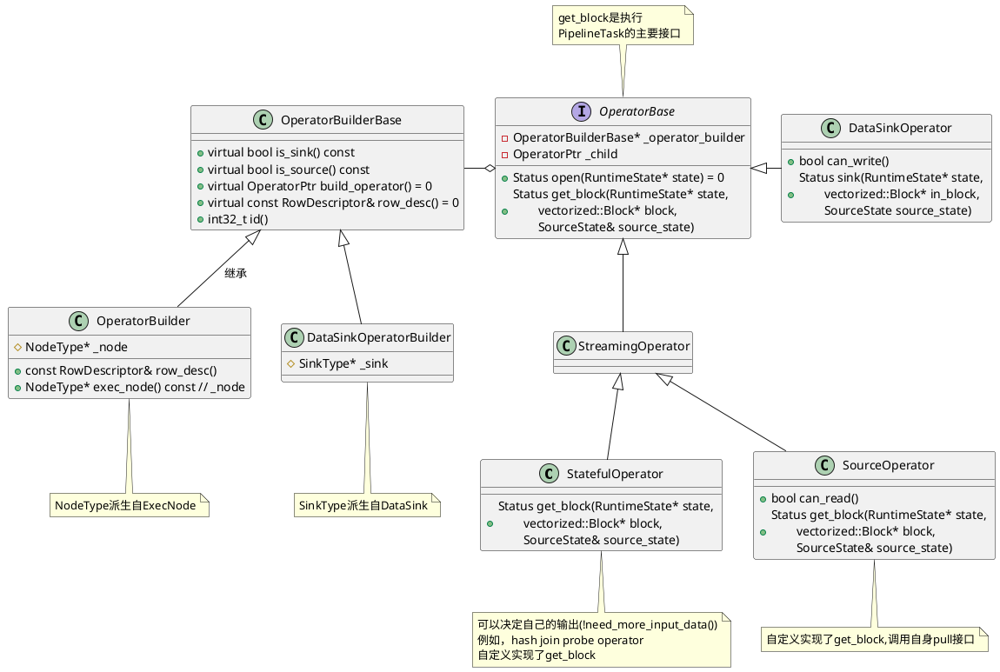
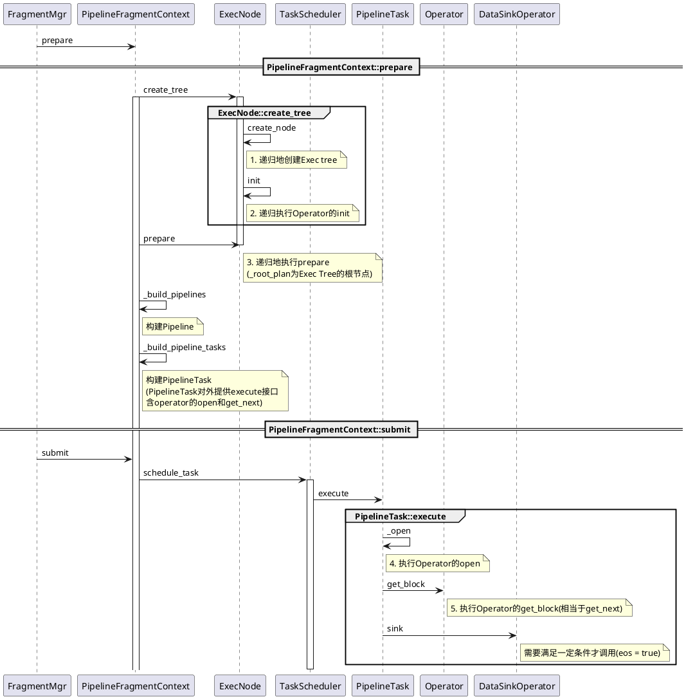

# 前端和后端对接

`Coordinator::exec`

```java
public void exec() throws Exception {
		....
        if (enablePipelineEngine) {
            sendPipelineCtx();
        } else {
            sendFragment();
        }
        ......
}
```


后端调用执行计算的入口
```C++
void PInternalServiceImpl::exec_plan_fragment(
        google::protobuf::RpcController* controller,
        const PExecPlanFragmentRequest* request,
        PExecPlanFragmentResult* response,
        google::protobuf::Closure* done) {
    bool ret = _light_work_pool.try_offer([this, controller, request, response, done]() {
        _exec_plan_fragment_in_pthread(controller, request, response, done);
    });
    if (!ret) {
        offer_failed(response, done, _light_work_pool);
        return;
    }
}
```
对于Pipeline之后调用
```C++
Status FragmentMgr::exec_plan_fragment(const TPipelineFragmentParams& params)
```


## PipelineFragment prepare

```C++
Status PipelineFragmentContext::prepare(
        const doris::TPipelineFragmentParams& request, const size_t idx) {
    const auto& local_params = request.local_params[idx];
    _runtime_profile.reset(new RuntimeProfile("PipelineContext"));
    auto* fragment_context = this;

    // 1. 创建并初始化RuntimeState
    _runtime_state = RuntimeState::create_unique(
            local_params, request.query_id,
            request.fragment_id, request.query_options,
            _query_ctx->query_globals, _exec_env);
    _runtime_state->set_query_ctx(_query_ctx.get());
    _runtime_state->set_query_mem_tracker(_query_ctx->query_mem_tracker);
    _runtime_state->runtime_filter_mgr()->init();
    _runtime_state->set_be_number(local_params.backend_num);
                ......
    auto* desc_tbl = _query_ctx->desc_tbl;
    _runtime_state->set_desc_tbl(desc_tbl);

    // 2. 创建用于构建Pipeline的ExecNode
    RETURN_IF_ERROR_OR_CATCH_EXCEPTION(ExecNode::create_tree(
            _runtime_state.get(), _runtime_state->obj_pool(),
            request.fragment.plan, *desc_tbl, &_root_plan));

    // 3. 设置exchangenode的sender数量
    //    在VExchangeNode::prepare根据num_senders
    //    初始化PipSenderQueue的_num_remaining_senders
    std::vector<ExecNode*> exch_nodes;
    _root_plan->collect_nodes(TPlanNodeType::EXCHANGE_NODE, &exch_nodes);
    for (ExecNode* exch_node : exch_nodes) {
        int num_senders = find_with_default(request.per_exch_num_senders, exch_node->id(), 0);
        static_cast<vectorized::VExchangeNode*>(exch_node)->set_num_senders(num_senders);
    }

    // 4. 调用Exec Tree所有prepare
    RETURN_IF_ERROR(_root_plan->prepare(_runtime_state.get()));
    
    // 5. 收集ScanNode并设置scan ranges
    std::vector<ExecNode*> scan_nodes;
    std::vector<TScanRangeParams> no_scan_ranges;
    _root_plan->collect_scan_nodes(&scan_nodes);
    for (int i = 0; i < scan_nodes.size(); ++i) {
        ExecNode* node = scan_nodes[i];
        if (typeid(*node) == typeid(vectorized::NewOlapScanNode) ||
            typeid(*node) == typeid(vectorized::NewFileScanNode) ||
            typeid(*node) == typeid(vectorized::NewOdbcScanNode) ||
            typeid(*node) == typeid(vectorized::NewEsScanNode) ||
            typeid(*node) == typeid(vectorized::VMetaScanNode) ||
            typeid(*node) == typeid(vectorized::NewJdbcScanNode)) {
            auto* scan_node = static_cast<vectorized::VScanNode*>(scan_nodes[i]);
            auto scan_ranges = find_with_default(local_params.per_node_scan_ranges,
                    scan_node->id(),no_scan_ranges);
            const bool shared_scan = find_with_default(local_params.per_node_shared_scans, 
                    scan_node->id(), false);
            scan_node->set_scan_ranges(scan_ranges);
            scan_node->set_shared_scan(_runtime_state.get(), shared_scan);
        } else {
            ScanNode* scan_node = static_cast<ScanNode*>(node);
            auto scan_ranges = find_with_default(local_params.per_node_scan_ranges,
                    scan_node->id(), no_scan_ranges);
            scan_node->set_scan_ranges(scan_ranges);
        }
    }

    _runtime_state->set_per_fragment_instance_idx(local_params.sender_id);
    _runtime_state->set_num_per_fragment_instances(request.num_senders);

    // 6. 创建Sink并执行Sink的init和prepare
    if (request.fragment.__isset.output_sink) {
        RETURN_IF_ERROR_OR_CATCH_EXCEPTION(DataSink::create_data_sink(
                _runtime_state->obj_pool(), request.fragment.output_sink,
                request.fragment.output_exprs, request, idx, _root_plan->row_desc(),
                _runtime_state.get(), &_sink, *desc_tbl));
    }

    // 7. 递归地创建Pipeline树, 此过程在有依赖的地方生成依赖
    //    例如, HASH_JOIN_NODE和CROSS_JOIN_NODE

    // 7.1 根据_root_plan生成_root_pipeline
    _root_pipeline = fragment_context->add_pipeline();
    RETURN_IF_ERROR(_build_pipelines(_root_plan, _root_pipeline));
    if (_sink) {
        // 7.2 生成sink,并为_root_plan设置sink node
        RETURN_IF_ERROR(_create_sink(request.local_params[idx].sender_id,
                request.fragment.output_sink, _runtime_state.get()));
    }

    // 8. 根据上面生成的_pipelines, 生成PipelineTask
    //    并执行PipelineTask::prepare
    RETURN_IF_ERROR(_build_pipeline_tasks(request));

    _prepared = true;
    return Status::OK();
}
```

### 创建ExecNode
```C++
Status ExecNode::create_tree(RuntimeState* state, ObjectPool* pool,
        const TPlan& plan, const DescriptorTbl& descs, ExecNode** root) {
    int node_idx = 0;
    // 创建Exec Tree
    RETURN_IF_ERROR(create_tree_helper(state, pool, plan.nodes,
            descs, nullptr, &node_idx, root));
    return Status::OK();
}


Status ExecNode::create_tree_helper(RuntimeState* state, ObjectPool* pool,
        const std::vector<TPlanNode>& tnodes, const DescriptorTbl& descs,
        ExecNode* parent, int* node_idx, ExecNode** root) {
    const TPlanNode& tnode = tnodes[*node_idx];
    int num_children = tnodes[*node_idx].num_children;
    ExecNode* node = nullptr;
    // 1. 根据tnode.node_type创建ExecNode
    RETURN_IF_ERROR(create_node(state, pool, tnodes[*node_idx], descs, &node));

    // 2. 利用创建的ExecNode, 构建ExecNode树
    if (parent != nullptr) {
        parent->_children.push_back(node);
    } else {
        *root = node;
    }

    // 3. 递归地处理孩子
    for (int i = 0; i < num_children; i++) {
        ++*node_idx;
        RETURN_IF_ERROR(create_tree_helper(state, pool,
                tnodes, descs, node, node_idx, nullptr));
    }

    // 4. init Exec
    RETURN_IF_ERROR(node->init(tnode, state));
    return Status::OK();
}


Status ExecNode::create_node(RuntimeState* state, ObjectPool* pool,
        const TPlanNode& tnode, const DescriptorTbl& descs, ExecNode** node) {
    switch (tnode.node_type) {
                ......
    case TPlanNodeType::ANALYTIC_EVAL_NODE:
        *node = pool->add(new vectorized::VAnalyticEvalNode(pool, tnode, descs));
        return Status::OK();
    default: { ...... }

    return Status::OK();
}
```


### 生成Pipeline树
通过`PipelineFragmentContext::_build_pipelines`来构建Pipeline树，主要根据`ExecNode::type()`创建`OperatorBuilder`,`OperatorBuilder`提供了`OperatorPtr build_operator()`来生成Operator，首先了解Pipeline的数据结构


以窗口`ANALYTIC_EVAL_NODE`了解普通算子的Pipeline生成以及`HASH_JOIN_NODE`存在依赖的算子的Pipeline的生成。

```C++
Status PipelineFragmentContext::_build_pipelines(ExecNode* node, PipelinePtr cur_pipe) {
    auto node_type = node->type();
    switch (node_type) {
    case TPlanNodeType::ANALYTIC_EVAL_NODE: {
        // 1. 创建Pipeline
        auto new_pipeline = add_pipeline();
        // 2. 递归地对其子节点构建Pipeline
        RETURN_IF_ERROR(_build_pipelines(node->child(0), new_pipeline));

        OperatorBuilderPtr analytic_sink =
                std::make_shared<AnalyticSinkOperatorBuilder>(node->id(), node);
        RETURN_IF_ERROR(new_pipeline->set_sink(analytic_sink));

        OperatorBuilderPtr analytic_source =
                std::make_shared<AnalyticSourceOperatorBuilder>(node->id(), node);
        RETURN_IF_ERROR(cur_pipe->add_operator(analytic_source));
        break;
    }

    // 存在依赖的算子
    case TPlanNodeType::HASH_JOIN_NODE: {
        auto* join_node = assert_cast<vectorized::HashJoinNode*>(node);
        // 1. 生成Build端的Pipeline
        // 1.1 递归地为右表生成Pipeline
        auto new_pipe = add_pipeline();
        if (join_node->should_build_hash_table()) {
            RETURN_IF_ERROR(_build_pipelines(node->child(1), new_pipe));
        } else {
            OperatorBuilderPtr builder = std::make_shared<EmptySourceOperatorBuilder>(
                    node->child(1)->id(), node->child(1)->row_desc(), node->child(1));
            new_pipe->add_operator(builder);
        }
        // 1.2 为new_pipe生成sink算子
        OperatorBuilderPtr join_sink =
                std::make_shared<HashJoinBuildSinkBuilder>(node->id(), join_node);
        RETURN_IF_ERROR(new_pipe->set_sink(join_sink));

        // 2. 生成Prob端的Pipeline
        // 2.1 递归地为左表生成Pipeline(Prob端)
        RETURN_IF_ERROR(_build_pipelines(node->child(0), cur_pipe));
        // 2.2 生成HashJoinProbeOperatorBuilder并添加到cur_pipe中
        OperatorBuilderPtr join_source =
                std::make_shared<HashJoinProbeOperatorBuilder>(node->id(), join_node);
        RETURN_IF_ERROR(cur_pipe->add_operator(join_source));

        // 3. 生成依赖(Build构建完成,再执行Prob)
        cur_pipe->add_dependency(new_pipe);
        break;
    }

    // 集合运算
    case TPlanNodeType::INTERSECT_NODE: {
        RETURN_IF_ERROR(_build_operators_for_set_operation_node<true>(node, cur_pipe));
        break;
    }
    case TPlanNodeType::EXCEPT_NODE: {
        RETURN_IF_ERROR(_build_operators_for_set_operation_node<false>(node, cur_pipe));
        break;
    }
                ......


}
```

### 生成Operator

对于`build_operator`的实现依赖宏定义进行代码生成，以`ScanOperator`为例，存在`OPERATOR_CODE_GENERATOR(ScanOperator, SourceOperator)`
```C++
#define OPERATOR_CODE_GENERATOR(NAME, SUBCLASS)                       \
    NAME##Builder::NAME##Builder(int32_t id, ExecNode* exec_node)     \
            : OperatorBuilder(id, #NAME, exec_node) {}                \
                                                                      \
    OperatorPtr NAME##Builder::build_operator() {                     \
        return std::make_shared<NAME>(this, _node);                   \
    }                                                                 \
                                                                      \
    NAME::NAME(OperatorBuilderBase* operator_builder, ExecNode* node) \
            : SUBCLASS(operator_builder, node) {};
```
例如, `ANALYTIC_EVAL_NODE`它对应的Pipeline的Sink是`AnalyticSinkOperatorBuilder`,Operator是`AnalyticSourceOperatorBuilder`
```C++
// Sink生成StreamingOperator，基类是StreamingOperator
// build_operator生成AnalyticSinkOperator，其ExecNode是VAnalyticEvalNode
// 
OPERATOR_CODE_GENERATOR(AnalyticSinkOperator, StreamingOperator)

// Source生成SourceOperator，基类是SourceOperator
// build_operator生成AnalyticSourceOperator，其ExecNode是VAnalyticEvalNode
OPERATOR_CODE_GENERATOR(AnalyticSourceOperator, SourceOperator)
```




### 生成PipelineTask
`PipelineFragmentContext::_build_pipeline_tasks`接口将`Pipeline`生成`PipelineTask`。

```C++
Status PipelineFragmentContext::_build_pipeline_tasks(
        const doris::TPipelineFragmentParams& request) {
    _total_tasks = 0;
    // 1. 生成PipelineTask
    for (PipelinePtr& pipeline : _pipelines) {
        // 1.1 生成Sink Operator
        auto sink = pipeline->sink()->build_operator();
        sink->init(request.fragment.output_sink);

        // 1.2 将Pipeline中的_operator_builders转换成Operators
        RETURN_IF_ERROR(pipeline->build_operators());

        // 1.3 生成PipelineTask,其中_operators=pipeline->_operators
        //     _source(_operators.front()), _root(_operators.back())
        auto task = std::make_unique<PipelineTask>(pipeline, _total_tasks++,
                _runtime_state.get(), sink, this, pipeline->pipeline_profile());
        sink->set_child(task->get_root());
        _tasks.emplace_back(std::move(task));
    }

    // 2. PipelineTask prepare
    for (auto& task : _tasks) {
        RETURN_IF_ERROR(task->prepare(_runtime_state.get()));
    }

    return Status::OK();
}
```
在`PipelineTask::execute`中调用Operator的`open`, `get_block`接口


```C++
Status PipelineTask::execute(bool* eos) {
    *eos = false;
    if (!_opened) {
        // for o : _operators o->open()
        // _sink->open _opened = true
        auto st = _open();
        if (....) {
            set_state(....);
            return Status::OK();
        }
    }

    while (!_fragment_context->is_canceled()) {
        _block->clear_column_data(_root->row_desc().num_materialized_slots());
        auto* block = _block.get();

        // Pull block from operator chain
        _get_block_counter->update(1);
        RETURN_IF_ERROR(_root->get_block(_state, block, _data_state));

        *eos = _data_state == SourceState::FINISHED;
        if (_block->rows() != 0 || *eos) {
            auto status = _sink->sink(_state, block, _data_state);
            *eos = status.is<ErrorCode::END_OF_FILE>() ? true : *eos;
            if (*eos) { // just return, the scheduler will do finish work
                break;
            }
        }
    }

    return Status::OK();
}
```

## submit tasks


忽略异常,处理了解主流程
```C++
Status PipelineFragmentContext::submit() {
            ......
    _submitted = true;

    Status st;
    int submit_tasks = 0;
    // 1. 从_exec_env中读取TaskScheduler
    auto* scheduler = _exec_env->pipeline_task_scheduler();
    if (get_task_group()) {
        scheduler = _exec_env->pipeline_task_group_scheduler();
    }

    // 2. 提交PipelineTasks到TaskScheduler
    //    将任务放在_task_queue通过后台worker线程调度
    for (auto& task : _tasks) {
        st = scheduler->schedule_task(task.get());
        submit_tasks++;
    }
            ......
    return st;
}
```

# Pipeline执行流程图
exec_plan_fragment


