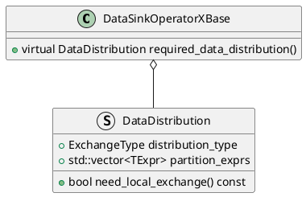

```C++
Status PipelineXFragmentContext::prepare(const doris::TPipelineFragmentParams& request) {
    					......
	if (_enable_local_shuffle()) {
        RETURN_IF_ERROR(_plan_local_exchange(request.num_buckets,
                 request.bucket_seq_to_instance_idx, request.shuffle_idx_to_instance_idx));
    }
    				......
}
```




| LocalExchanger类型   | 描述                                                         |                                  |
| -------------------- | ------------------------------------------------------------ | -------------------------------- |
| NOOP                 | 不使用LocalExchange                                          | `need_local_exchange`返回`False` |
| HASH_SHUFFLE         | 使用hash算法打散数据                                         |                                  |
| BUCKET_HASH_SHUFFLE  | 使用hash算法打散数据，并根据tablet在instance中的分布去分散数据 |                                  |
| PASSTHROUGH          | 把数据以block为单位打散到不同pipeline task中                 |                                  |
| ADAPTIVE_PASSTHROUGH | 通过自适应的方式把数据均匀打散到不同的pipeline task中        |                                  |
| BROADCAST            | 把所有数据广播到所有下游pipeline task中                      |                                  |
| PASS_TO_ONE          | 把数据发送到下游pipeline task中的任意一个                    |                                  |

