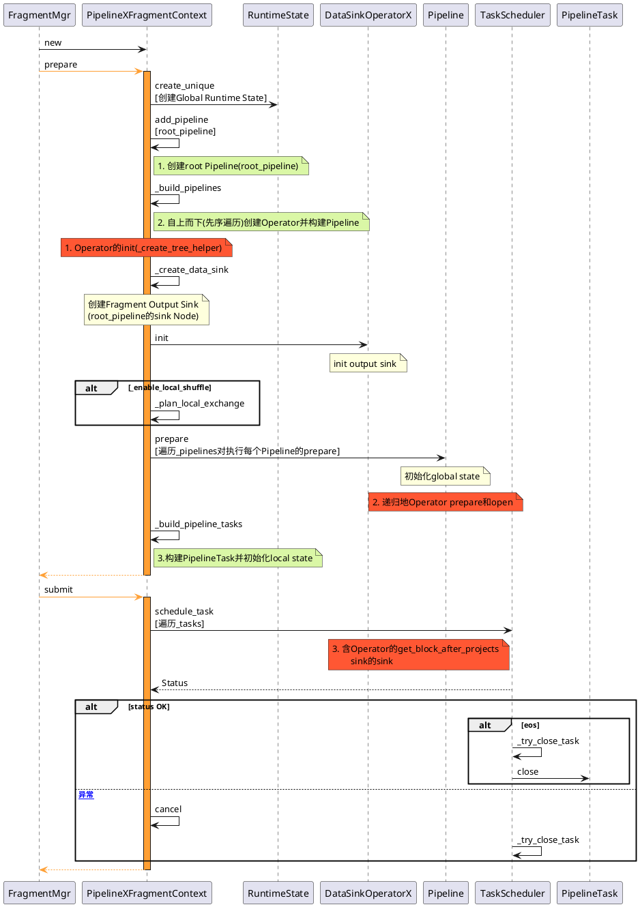
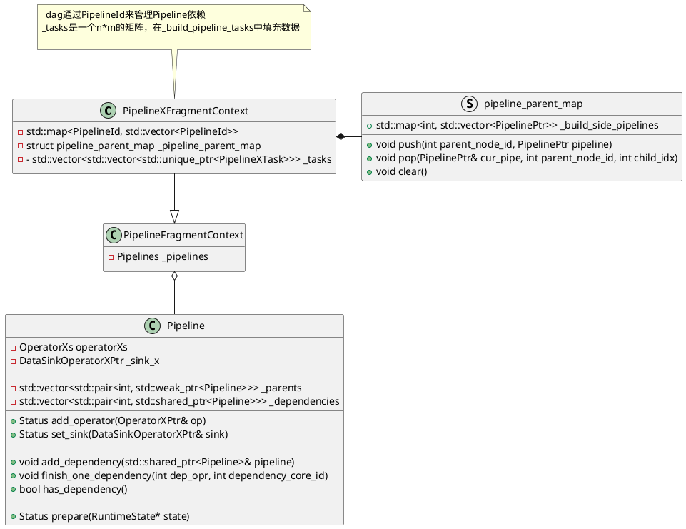
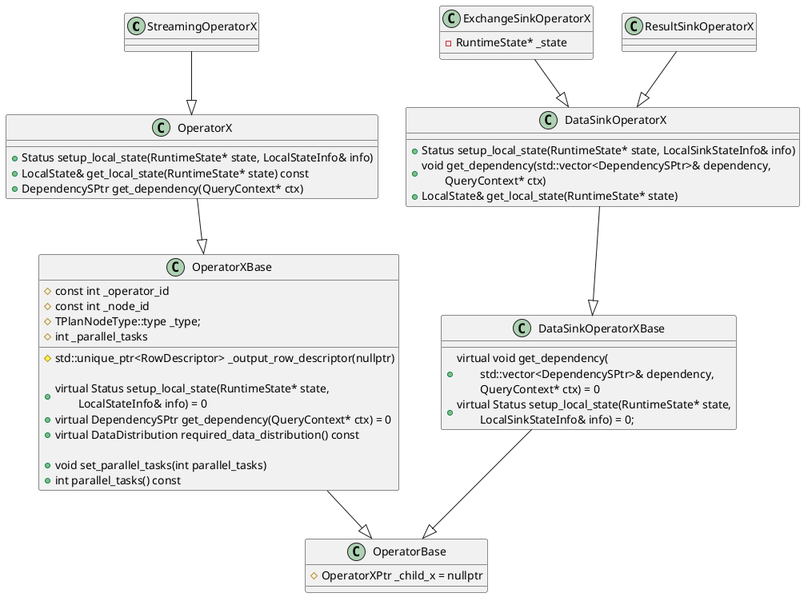

# 接口变更和使用
[Doris官网关于PipelineX的介绍](https://doris.apache.org/zh-CN/docs/query-acceleration/pipeline-x-execution-engine/)

用户接口变更,其中会话级参数

`enable_pipeline_x_engine` : 设置为true，则 BE在进行查询执行时就会默认将SQL的执行模型转变PipelineX的执行方式。
```sql
set enable_pipeline_x_engine = true;
```
`enable_local_shuffle` : 设置为true则打开local shuffle优化。local shuffle将尽可能将数据均匀分布给不同的pipeline task从而尽可能避免数据倾斜。
```sql
set enable_local_shuffle = true;
```

`ignore_storage_data_distribution` : 设置为true，则表示忽略存储层的数据分布。结合local shuffle一起使用，则pipelineX引擎的并发能力将不再受到存储层tablet数量的制约，从而充分利用机器资源。
```sql
set ignore_storage_data_distribution = true;
```


---
# 设计

存在的问题(动机)
> The PipelineX execution engine is an experimental feature in Doris 2.1.0, expected to address the four major issues of the Doris pipeline engine:
> 1. In terms of execution concurrency, Doris is currently constrained by two factors: one is the parameters set by FE, and the other is limited by the number of buckets. This concurrent strategy prevents the execution engine from fully utilizing machine resources.
> 2. In terms of execution logic, Doris currently has some fixed additional overhead. For example, the common expression for all instances will be initialized multiple times due to independence between all instances.
> 3. In terms of scheduling logic, the scheduler of the current pipeline will put all blocking tasks into a blocking queue, and a blocking queue scheduler will be responsible for polling and extracting executable tasks from the blocking queue and placing them in the runnable queue. Therefore, during the query execution process, a CPU core will always be occupied to do scheduling instead of execution.
> 4. In terms of profile, currently the pipeline cannot provide users concise and clear metrics.

要解决的问题(目标)
> 1. In terms of execution concurrency, pipelineX introduces local exchange optimization to fully utilize CPU resources, and distribute data evenly across different tasks to minimize data skewing. In addition, pipelineX will no longer be constrained by the number of tablets.
> 2. Logically, multiple pipeline tasks share all shared states of the same pipeline and eliminate additional initialization overhead, such as expressions and some const variables.
> 3. In terms of scheduling logic, the blocking conditions of all pipeline tasks are encapsulated using Dependency, and the execution logic of the tasks is triggered by external events (such as rpc completion) to enter the runnable queue, thereby eliminating the overhead of blocking polling threads.
> 4. Profile: Provide users with simple and easy to understand metrics





# Operator


# 参考资料
1. [Doris PipeplineX Execution Engine](https://cwiki.apache.org/confluence/display/DORIS/DSIP-035%3A+PipelineX+Execution+Engine)