Doris的Be的代码入口在`be/src/service/doris_main.cpp`，这里实现了`main`函数，

```C++
int main(int argc, char** argv) {
			......
    // init exec env
    auto exec_env = doris::ExecEnv::GetInstance();
    doris::ExecEnv::init(exec_env, paths);
    doris::TabletSchemaCache::create_global_schema_cache();
    	......
}
```

其中，`doris::ExecEnv::init(exec_env, paths)`调用`init_pipeline_task_scheduler`，从而初始化了Pipeline Task Scheduler，相关的调用逻辑如下：

```C++
Status ExecEnv::init(ExecEnv* env, const std::vector<StorePath>& store_paths) {
    return env->_init(store_paths);
}

Status ExecEnv::_init(const std::vector<StorePath>& store_paths) {
		......
    // 创建和初始化Pipeline TaskScheduler
    RETURN_IF_ERROR(init_pipeline_task_scheduler());
}
```

# Pipeline调度概述
Pipeline调度通过`TaskScheduler`的主要职责是实现PipelineTask的调度和执行，内部维护了两个任务队列，实现任务调度和出让时间

- 执行队列，抽象为`TaskQueue`接口，`TaskScheduler`后台线程从其中取出任务来执行，`TaskScheduler`内部后台运行了`cores`个后台线程(该参数由默认值为0的`pipeline_executor_size`配置参数决定，如果用户没有设置，和CPU核心数一致)。
- 阻塞队列，抽象为`BlockedTaskScheduler`，其内部后台运行了一个`_schedule`线程，从本地的任务队列中取出任务检查任务是否可以执行，如果可以执行将其放入`TaskQueue`等待调度执行。

<center>
    
</center>

`TaskScheduler`的类图
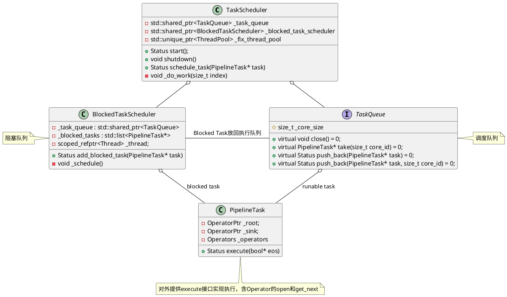

# 初始化TaskScheduler
```C++
Status ExecEnv::init_pipeline_task_scheduler() {
    // 配置参数pipeline_executor_size默认为0
    auto executors_size = config::pipeline_executor_size;
    if (executors_size <= 0) {
        // 系统文件/proc/cpuinfo中processor的数量
        executors_size = CpuInfo::num_cores();
    }

    // 1. 创建TaskScheduler，由于有两种调度算法创建了两个
    // 1.1 通过MultiCoreTaskQueue通过多级反馈队列实现调度
    auto t_queue = std::make_shared<pipeline::MultiCoreTaskQueue>(executors_size);
    auto b_scheduler = std::make_shared<pipeline::BlockedTaskScheduler>(t_queue);
    _pipeline_task_scheduler =
            new pipeline::TaskScheduler(this, b_scheduler, t_queue, "WithoutGroupTaskSchePool");
    RETURN_IF_ERROR(_pipeline_task_scheduler->start());

    // 1.2. 如果前端采用了workload group，采用TaskGroupTaskQueue实现调度
    auto tg_queue = std::make_shared<pipeline::TaskGroupTaskQueue>(executors_size);
    auto tg_b_scheduler = std::make_shared<pipeline::BlockedTaskScheduler>(tg_queue);
    _pipeline_task_group_scheduler =
            new pipeline::TaskScheduler(this, tg_b_scheduler, tg_queue, "WithGroupTaskSchePool");
    RETURN_IF_ERROR(_pipeline_task_group_scheduler->start());

    return Status::OK();
}
```

`TaskScheduler::start`，这里会创建执行线程和轮询线程。

```C++
Status TaskScheduler::start() {
    int cores = _task_queue->cores();
    // Must be mutil number of cpu cores
    ThreadPoolBuilder(_name).set_min_threads(cores)
            .set_max_threads(cores).set_max_queue_size(0)
            .build(&_fix_thread_pool);
    _markers.reserve(cores);
 
    // 创建cores个worker线程,去任务并执行
    // 线程执行函数是TaskScheduler::_do_work
    for (size_t i = 0; i < cores; ++i) {
        _markers.push_back(std::make_unique<std::atomic<bool>>(true));
        // i被当作core_id从TaskQueue中取任务
        RETURN_IF_ERROR(_fix_thread_pool->submit_func(
            std::bind(&TaskScheduler::_do_work, this, i)));
    }

    // 创建Schedule Thread检查任务状态
    return _blocked_task_scheduler->start();
}
```

`BlockedTaskScheduler::start`创建轮询线程，检查Task是否可以执行。

```C++
Status BlockedTaskScheduler::start() {
    // 创建轮询线程，线执行函数是BlockedTaskScheduler::_schedule
    RETURN_IF_ERROR(Thread::create("BlockedTaskScheduler",
           "schedule_blocked_pipeline", [this]() { this->_schedule(); },
            &_thread));
    while (!this->_started.load()) {
        std::this_thread::sleep_for(std::chrono::milliseconds(5));
    }
    return Status::OK();
}
```

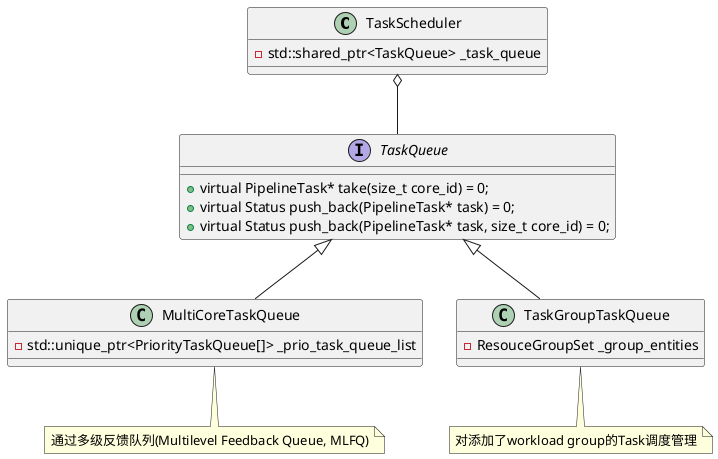

# 划分时间片
PipeLine的核心思路可以类比操作系统的分时调度系统，PipelineTask在执行超过`THREAD_TIME_SLICE`(100'000'000ns = 100毫秒)，出让调度线程资源给其他的Task。
```C++
Status PipelineTask::execute(bool* eos) {
    int64_t time_spent = 0;
    if (!_opened) {
        {
            SCOPED_RAW_TIMER(&time_spent);
            auto st = _open();
                ......
        }
    }

    while (!_fragment_context->is_canceled()) {
                ......
        // 让出CPU，给其他的Task
        // 当前的PipelineTask通过TaskScheduler再次push到TaskQueue中
        if (time_spent > THREAD_TIME_SLICE) {
            COUNTER_UPDATE(_yield_counts, 1);
            break;
        }
            ......
    }
    return Status::OK();
}
```
# Pipeline调度
Pipeline调度器启动固定的Work Thread数目来执行不同的PipeLineTask。各个PipeTask可以任意在任何执行线程上进行调度，充分利用多核CPU的并行能力。内部包含两个任务队列
- 阻塞队列：前置数据，或执行条件没有准备好的Pipeline Task都放置在该队列中。由轮询线程定期轮询，检查是否进入Ready状态，如果Ready则进入调度队列进行调度
- 调度队列：绑定执行线程，该队列上的Pipeline Task都是由轮询队列放入的，代表可以被执行的PipelineTask的队列。

## 执行线程

执行引擎启动固定的执行线程进行查询任务的执行，数目可以由用户配置，默认为CPU的核数。
- 获取该执行线程本地的调度队列的PipeLine Task进行执行，如果线程绑定的调度队列没有对应的Task，则进行Work Steal，从其他线程的调度队列中拉取Task
- 记录该PipeLine Task的执行时间和处理的Block数目，超过固定时间片或一定数据量后放回调度队列，以免大查询饿死其他查询
- PipeLine task执行过程中陷入阻塞，则将改任务放回阻塞队列之中，交付给轮询线程来后续处理。

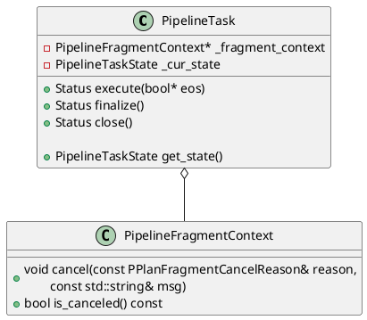

```C++
void TaskScheduler::_do_work(size_t index) {
    const auto& marker = _markers[index];
    while (*marker) {
        // 1. 从执行队列中取Task
        auto* task = _task_queue->take(index);
        if (!task) continue;
        task->set_task_queue(_task_queue.get());
        auto* fragment_ctx = task->fragment_context();
        signal::query_id_hi = fragment_ctx->get_query_id().hi;
        signal::query_id_lo = fragment_ctx->get_query_id().lo;
        bool canceled = fragment_ctx->is_canceled();

        // 2. PENDING_FINISH或cancle, close task并设置task state
        auto check_state = task->get_state();
        if (check_state == PipelineTaskState::PENDING_FINISH) {
            _try_close_task(task, canceled ?
				PipelineTaskState::CANCELED : PipelineTaskState::FINISHED);
            continue;
        }

        if (canceled) {
            fragment_ctx->send_report(true);
            _try_close_task(task, PipelineTaskState::CANCELED);
            continue;
        }

        bool eos = false;
        auto status = Status::OK();
        // 3. 实际执行task，绑定执行的线程core id
        try {
            status = task->execute(&eos);
        } catch (const Exception& e) {
            status = e.to_status();
        }
        task->set_previous_core_id(index);

        if (!status.ok()) {
            task->set_eos_time();
            // 3.1 执行失败，cancel所有的子计划
            fragment_ctx->cancel(PPlanFragmentCancelReason::INTERNAL_ERROR,
                                 status.to_string());
            fragment_ctx->send_report(true);
            _try_close_task(task, PipelineTaskState::CANCELED);
            continue;
        }

        // 3.2 任务执行完成, 调用finalize
        if (eos) {
            task->set_eos_time();
            status = task->finalize();
            if (!status.ok()) {
                // finalize失败, cancel所有的子计划
                fragment_ctx->cancel(PPlanFragmentCancelReason::INTERNAL_ERROR,
                                     "finalize fail:" + status.to_string());
                _try_close_task(task, PipelineTaskState::CANCELED);
            } else {
                _try_close_task(task, PipelineTaskState::FINISHED);
            }
            continue;
        }

        auto pipeline_state = task->get_state();
        switch (pipeline_state) {
        case PipelineTaskState::BLOCKED_FOR_SOURCE:
        case PipelineTaskState::BLOCKED_FOR_SINK:
        case PipelineTaskState::BLOCKED_FOR_RF:
        case PipelineTaskState::BLOCKED_FOR_DEPENDENCY:
            // 4. block Task,放回阻塞队列,将其添加到blocked task队列
            _blocked_task_scheduler->add_blocked_task(task);
            break;
        case PipelineTaskState::RUNNABLE:
            // 5. 放回调度队列将task再次入队
            _task_queue->push_back(task, index);
            break;
        default:
            DCHECK(false) << "error state after run task, " << get_state_name(pipeline_state);
            break;
        }
    }
}
```

## 轮询线程
轮询线程是全局唯一的线程，轮询各个查询之间的PipeLine Task是否就绪。
- 轮询阻塞队列中的任务，Ready之后 轮询线程将任务 阻塞队列 -> 调度队列
- 任务中记录了上一次被调度的线程id，优先进入该线程id的调度队列

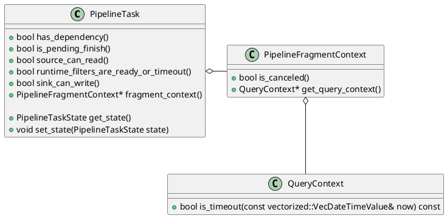
`PipelineTask`轮询调度，主要实现判断Task是否可以执行，如果可以执行将其放到`_task_queue`等调度线程调度执行，这里也会实现一些状态切换。

```C++
void BlockedTaskScheduler::_schedule() {
    _started.store(true);
    std::list<PipelineTask*> local_blocked_tasks;
    int empty_times = 0;

    while (!_shutdown) {
        // 将_blocked_tasks移动到local_blocked_tasks局部变量
        {
            std::unique_lock<std::mutex> lock(this->_task_mutex);
            local_blocked_tasks.splice(local_blocked_tasks.end(), _blocked_tasks);
            if (local_blocked_tasks.empty()) {
                while (!_shutdown.load() && _blocked_tasks.empty()) {
                    _task_cond.wait_for(lock, std::chrono::milliseconds(10));
                }

                if (_shutdown.load()) break;
                local_blocked_tasks.splice(local_blocked_tasks.end(), _blocked_tasks);
            }
        }

        auto origin_local_block_tasks_size = local_blocked_tasks.size();
        auto iter = local_blocked_tasks.begin();
        vectorized::VecDateTimeValue now = vectorized::VecDateTimeValue::local_time();
        while (iter != local_blocked_tasks.end()) {
            auto* task = *iter;
            auto state = task->get_state();
            if (state == PipelineTaskState::PENDING_FINISH) {
                // should cancel or should finish
                if (task->is_pending_finish()) {
                    iter++;
                } else {
                    _make_task_run(local_blocked_tasks, iter, PipelineTaskState::PENDING_FINISH);
                }
            } else if (task->fragment_context()->is_canceled()) {
                if (task->is_pending_finish()) {
                    task->set_state(PipelineTaskState::PENDING_FINISH);
                    iter++;
                } else {
                    _make_task_run(local_blocked_tasks, iter);
                }
            } else if (task->query_context()->is_timeout(now)) {
                task->fragment_context()->cancel(PPlanFragmentCancelReason::TIMEOUT);
                if (task->is_pending_finish()) {
                    task->set_state(PipelineTaskState::PENDING_FINISH);
                    iter++;
                } else {
                    _make_task_run(local_blocked_tasks, iter);
                }
            } else if (state == PipelineTaskState::BLOCKED_FOR_DEPENDENCY) {
                if (task->has_dependency()) {
                    iter++;
                } else {
                    _make_task_run(local_blocked_tasks, iter);
                }
            } else if (state == PipelineTaskState::BLOCKED_FOR_SOURCE) {
                if (task->source_can_read()) {
                    _make_task_run(local_blocked_tasks, iter);
                } else {
                    iter++;
                }
            } else if (state == PipelineTaskState::BLOCKED_FOR_RF) {
                if (task->runtime_filters_are_ready_or_timeout()) {
                    _make_task_run(local_blocked_tasks, iter);
                } else {
                    iter++;
                }
            } else if (state == PipelineTaskState::BLOCKED_FOR_SINK) {
                if (task->sink_can_write()) {
                    _make_task_run(local_blocked_tasks, iter);
                } else {
                    iter++;
                }
            } else {
                _make_task_run(local_blocked_tasks, iter);
            }
        }

        if (origin_local_block_tasks_size == 0 ||
            local_blocked_tasks.size() == origin_local_block_tasks_size) {
            empty_times += 1;
        } else {
            empty_times = 0;
        }

        if (empty_times != 0 && (empty_times & (EMPTY_TIMES_TO_YIELD - 1)) == 0) {
#ifdef __x86_64__
            _mm_pause();
#else
            sched_yield();
#endif
        }
        if (empty_times == EMPTY_TIMES_TO_YIELD * 10) {
            empty_times = 0;
            sched_yield();
        }
    }
}
```

# Task状态切换

状态定义：

```C++
enum class PipelineTaskState : uint8_t {
    NOT_READY = 0, 				// do not prepare
    BLOCKED_FOR_DEPENDENCY = 1,
    BLOCKED_FOR_SOURCE = 2,
    BLOCKED_FOR_SINK = 3,
    RUNNABLE = 4, 			// can execute
    PENDING_FINISH = 5,     // compute task is over,but still hold resource.
    					    // like some scan and sink task
    FINISHED = 6,
    CANCELED = 7,
    BLOCKED_FOR_RF = 8,
};
```
状态的表示意义：
- NOT_READY: The PipeLine task has not called the prepare function and is not ready for execution.
- BLOCKED: The PipeLine task is blocked, waiting for the polling thread to check.
    - The pre-pipeline has not finished running : BLOCKED_FOR_DEPENDENCY
    - SourceOperator's data is not readable, data is not ready: BLOCKED_FOR_SOURCE
    - SinkOperator's data is not writable: BLOCKED_FOR_SINK
- RUNNABLE : PipeLine's task is executable, waiting for the execution thread to perform scheduling.
- PENDING_FINISH: PipeLine's task is ready to finish, wait for other related Pipeline tasks to finish, then call close for resource recovery.
- FINISHED: The PipeLine task is finished, waiting for Shared_ptr destruct to be released.
- CANCELED: PipeLineTask that has been cancelled, waiting for Shared_ptr destructor release

状态切换：

```C++
/**
 * PipelineTaskState indicates all possible states of a pipeline task.
 * A FSM is described as below:
 *
 *                 |-----------------------------------------------------|
 *                 |---|                  transfer 2    transfer 3       |   transfer 4
 *                     |-------> BLOCKED ------------|                   |---------------------------------------> CANCELED
 *              |------|                             |                   | transfer 5           transfer 6|
 * NOT_READY ---| transfer 0                         |-----> RUNNABLE ---|---------> PENDING_FINISH ------|
 *              |                                    |          ^        |                      transfer 7|
 *              |------------------------------------|          |--------|---------------------------------------> FINISHED
 *                transfer 1                                   transfer 9          transfer 8
 * BLOCKED include BLOCKED_FOR_DEPENDENCY, BLOCKED_FOR_SOURCE and BLOCKED_FOR_SINK.
 *
 * transfer 0 (NOT_READY -> BLOCKED): this pipeline task has some incomplete dependencies
 * transfer 1 (NOT_READY -> RUNNABLE): this pipeline task has no incomplete dependencies
 * transfer 2 (BLOCKED -> RUNNABLE): runnable condition for this pipeline task is met (e.g. get a new block from rpc)
 * transfer 3 (RUNNABLE -> BLOCKED): runnable condition for this pipeline task is not met (e.g. sink operator send a block by RPC and wait for a response)
 * transfer 4 (RUNNABLE -> CANCELED): current fragment is cancelled
 * transfer 5 (RUNNABLE -> PENDING_FINISH): this pipeline task completed but wait for releasing resources hold by itself
 * transfer 6 (PENDING_FINISH -> CANCELED): current fragment is cancelled
 * transfer 7 (PENDING_FINISH -> FINISHED): this pipeline task completed and resources hold by itself have been released already
 * transfer 8 (RUNNABLE -> FINISHED): this pipeline task completed and no resource need to be released
 * transfer 9 (RUNNABLE -> RUNNABLE): this pipeline task yields CPU and re-enters the runnable queue if it is runnable and has occupied CPU for a max time slice
 */
```

# 多级反馈队列调度策略
PipeLine的核心思路可以类比操作系统的分时调度系统，其中，CPU资源 = 执行引擎的线程资源， 进程之间的调度策略 = Pipeline的调度策略， 进程的优先级 = 查询的资源管理。
> 多级反馈队列应用于BSD UNIX系统，Windows NT和其后的Windows系统操作系统的进程调度，由图灵奖获得者Corbato提出。
> <center>
>   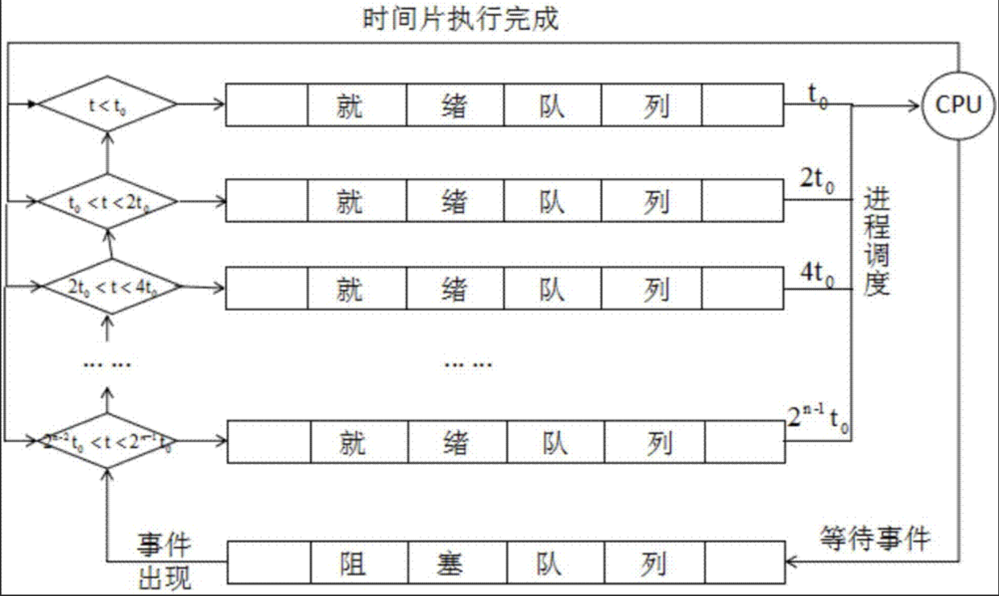
></center>
>
>基于多级反馈队列适配的PipeLine调度规则：
> - 新加入的Query的Pipeline任务放在最高优先级队列，level 1
> - 每个Query Id在对应优先级队列有一个获取task配额，使用完之后，该Query相关的Pipeline Task自动下沉到下一级优先级队列
> - 每个优先级队列能固定分配到调度的时间片，避免大查询饿死的问题 (原算法是定期flush到level 1上，也可以考虑这种实现)
>   level 1 50%的cpu时间片
>   level 2 25%的cpu时间片
>   leve 3 12%的cpu时间片
>   .......
> - 对应level 队列中不存在任务时，执行线程自动获取下一级优先级队列的PipeTask进行执行
>
> 来自《Doris PipeLine的设计文档》

## 进程MLFQ调度策略

多级反馈队列CPU调度需要解决两方面的问题：
1. 优化周转时间。通过先执行短工作可以实现优化周转时间(类似于短时任务调度(SJF)算法)。
2. 降低响应时间，保持交互体验。

MLFQ中有许多独立的队列，每个队列有不同的优先级(priority level)。任何时刻，一个工作只能存在于一个队列中。MLFQ总是优先执行较高优先级的工作(即在较高级队列中的工作)。每个队列中可能会有多个工作，因此具有同样的优先级，对同一个队列中的任务轮转调度。因此有了MLFQ的基本规则
- **规则1**：如果A的优先级 > B的优先级，运行A(不运行B)。
- **规则2**：如果A的优先级 = B的优先级，轮转运行A和B。

MLFQ调度策略的关键在于如何设置优先级，因为没有先验信息，它利用历史经验进行预测，设计策略来调整优先级

- **规则3**：工作进入系统时，放在最高优先级(最上层队列)。
    > 假设短工作，先执行，优化周转时间，如果是短工作很快便执行完成，如果是长工作通过规则4降低优先级
- **规则4a**：工作用完整个时间片后，降低其优先级(移入下一个队列)。
    > 如果不端来短时任务，可能导致长任务饿死
- **规则4b**：如果工作在其时间片以内主动释放CPU，则优先级不变。
    > 如果是I/O型任务，该任务不停出让CPU保持其优先级不变，实现其降低响应时间的目的(存在愚弄程序从而导致程序改变调度优先级，例如，任务用完CPU时间片后调用一个写无关文件的操作，这样便可以保持其有比较高的优先级)

为了避免规则4a导致的饿死的问题，尝试下面的规则：
- **规则4**：经过一段时间*S*，就将系统中所有工作重新加入最高优先级队列。
    > 这里时间S设置为多少很难抉择，也存在一些MLFQ的变体，在《Doris PipeLine的设计文档》中指出，每个优先级队列能固定分配到调度的时间片，避免大查询饿死的问题。

- **规则 5**：一旦工作用完了其在某一层中的时间配额(无论中间主动放弃了多少次CPU)，就降低其优先级(移入低一级队列)。
  > 采用更好的计时方式，避免规则4b导致的愚弄调试程序问题。

`MultiCoreTaskQueue`对外提供了两个添加Task的接口
```C++
// TaskScheduler or BlockedTaskScheduler添加Task
Status push_back(PipelineTask* task)

// TaskScheduler的worker线程添加Task
// core_id是PipelineTask在_prio_task_queue_list的index
Status push_back(PipelineTask* task, size_t core_id)
```

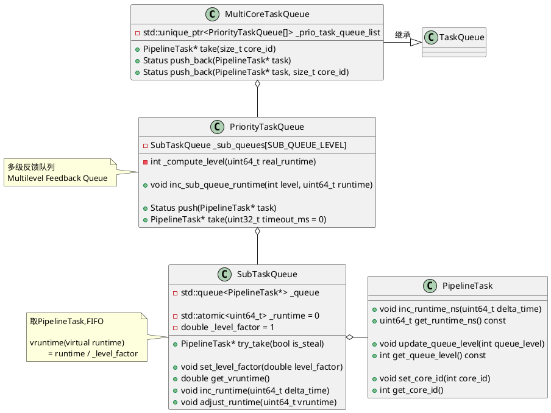

## 初始化

初始化多级反馈队列，设置level factor。
```C++
// 初始化多级反馈队列,6层(SUB_QUEUE_LEVEL=6)队列
// factor = 2^(n-1), n = 1... 6
PriorityTaskQueue::PriorityTaskQueue() : _closed(false) {
    double factor = 1;
    for (int i = SUB_QUEUE_LEVEL - 1; i >= 0; i--) {
        _sub_queues[i].set_level_factor(factor);
        factor *= LEVEL_QUEUE_TIME_FACTOR;
    }
}
```

## vRuntime计算

`PriorityTaskQueue`有`SUB_QUEUE_LEVEL = 6`个`SubTaskQueue`组成，

```C++
// A Multilevel Feedback Queue
class PriorityTaskQueue {
private:
    static constexpr auto LEVEL_QUEUE_TIME_FACTOR = 2;
    static constexpr size_t SUB_QUEUE_LEVEL = 6;
    SubTaskQueue _sub_queues[SUB_QUEUE_LEVEL];
}
```

每个`SubTaskQueue`持有一个vruntime影响其调度的优先级，每个`PipelineTask`在`execute`过程中会计算其`time_spent`作为`runtime`来进而更新vruntime。

`PipelineTask::execute`会调用`_task_queue->update_statistics`，根据PipelineTask中存储的core_id和queue_level找对对应的`SubTaskQueue`，从而更新`SubTaskQueue`的runtime。
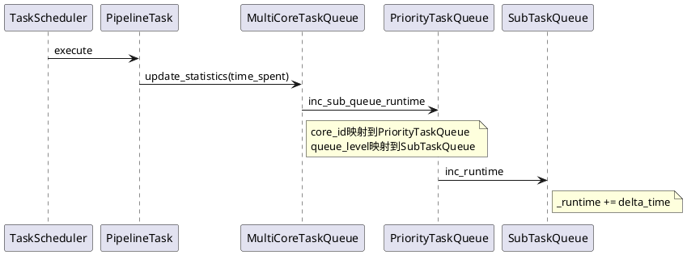

`PipelineTask::execute`会调用`_task_queue->update_statistics`
```c++
Status PipelineTask::execute(bool* eos) {
    int64_t time_spent = 0;
    // 调用TaskQueue的update_statistics更新runtime
    // Defer实现离开作用域调用lambda函数
    Defer defer {[&]() {
        if (_task_queue) {
            _task_queue->update_statistics(this, time_spent);
        }
    }};

    *eos = false;
    if (!_opened) {
        {
            SCOPED_RAW_TIMER(&time_spent);
            auto st = _open();
            ......
        }
    }

    while (!_fragment_context->is_canceled()) {
				......
        SCOPED_RAW_TIMER(&time_spent);
        auto* block = _block.get();
			......
    }
    return Status::OK();
}
```

在`MultiCoreTaskQueue::update_statistics`中，根据PipelineTask中存储的core_id和queue_level找对对应的`SubTaskQueue`，从而更新`SubTaskQueue`的runtime
```C++
void MultiCoreTaskQueue::update_statistics(PipelineTask* task, int64_t time_spent) override {
    task->inc_runtime_ns(time_spent);
    _prio_task_queue_list[task->get_core_id()]
        .inc_sub_queue_runtime(task->get_queue_level(), time_spent);
}

void PriorityTaskQueue::inc_sub_queue_runtime(int level, uint64_t runtime) {
    // SubTaskQueue的_runtime增加runtime
    _sub_queues[level].inc_runtime(runtime);
}
```

```C++
class SubTaskQueue {
public:
    // runtime是PipelineTask执行期间消耗的真实的时间
    // vruntime(也就是virtual runtime) = runtime / _level_factor
    double get_vruntime() { return _runtime / _level_factor; }
    void inc_runtime(uint64_t delta_time) {
        _runtime += delta_time;
    }

    // 当队列是空时，用PriorityTaskQueue中SubTaskQueue中最小vruntime
    // 即_queue_level_min_vruntime)调整其vrutime
    // 避免空的队列拥有太高的优先级
    // 参见PriorityTaskQueue::push
    void adjust_runtime(uint64_t vruntime) {
        this->_runtime = vruntime * _level_factor;
    }
}
```

## Push Task

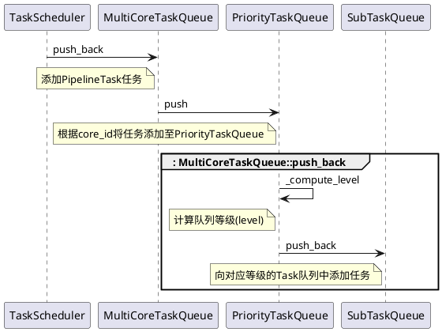

```C++
 // TaskScheduler或BlockedTaskScheduler添加Task
Status MultiCoreTaskQueue::push_back(PipelineTask* task) {
    // 计算core_id,PipelineTask在worker thread拿出execute后
    // 调用set_previous_core_id设置了previous_core_id
    int core_id = task->get_previous_core_id();
    if (core_id < 0) {
        // 轮询调度
        core_id = _next_core.fetch_add(1) % _core_size;
    }
    return push_back(task, core_id);
}

// TaskScheduler的worker线程添加Task
// core_id是PipelineTask在_prio_task_queue_list的index
Status MultiCoreTaskQueue::push_back(PipelineTask* task, size_t core_id) {
    task->put_in_runnable_queue();
    return _prio_task_queue_list[core_id].push(task);
}
```

之后调用`PriorityTaskQueue::push`添加一个`PipelineTask`。

```C++
Status PriorityTaskQueue::push(PipelineTask* task) {
    // 1. 计算优先级(level)
    auto level = _compute_level(task->get_runtime_ns());
    std::unique_lock<std::mutex> lock(_work_size_mutex);

    // 2. 更新SubTaskQueue中最小vruntime
    //    调整空SubTaskQueue的runtime,避免其拥有太高的优先级
    if (_sub_queues[level].empty() &&
        _queue_level_min_vruntime > _sub_queues[level].get_vruntime()) {
        _sub_queues[level].adjust_runtime(_queue_level_min_vruntime);
    }

    // 3. 在SubTaskQueue的_queue尾部追加一个Task
    _sub_queues[level].push_back(task);
    _total_task_size++;
    _wait_task.notify_one();
    return Status::OK();
}
```

`PriorityTaskQueue`通过`_compute_level`计算level将其放进`_sub_queues`。其中每个`SubTaskQueue`对应有一个`_queue_level_limit`表示对应层的时间片配额，`runtime`从做到右遍历，小于`_queue_level_limit[i]`落入对应的level，实现某层时间配额用完，降低其优先级。

```C++
// 时间片配额 1s, 3s, 10s, 60s, 300s
uint64_t _queue_level_limit[SUB_QUEUE_LEVEL - 1] = {
    1000000000, 3000000000, 10000000000,
    60000000000, 300000000000
};
```

```C++
// 规则1: 工作进入系统时，放在最高优先级(最上层队列)
// 规则2：一旦工作用完了其在某一层中的时间配额,就降低其优先级(移入低一级队列)
int PriorityTaskQueue::_compute_level(uint64_t runtime) {
    for (int i = 0; i < SUB_QUEUE_LEVEL - 1; ++i) {
        // runtime小于_queue_level_limit[i]则落入该层级
        if (runtime <= _queue_level_limit[i]) {
            return i;
        }
    }
    // 落入最后一个层级，之后便一直待在这里
    return SUB_QUEUE_LEVEL - 1;
}
```


## Take Task
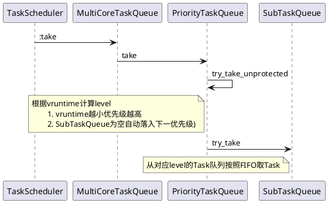
```C++
PipelineTask* MultiCoreTaskQueue::take(size_t core_id) {
    PipelineTask* task = nullptr;
    while (!_closed) {
        // 1. 尝试从core_id对应的PriorityTaskQueue中取PipelineTask
        task = _prio_task_queue_list[core_id].try_take(false);
        if (task) {
            task->set_core_id(core_id);
            break;
        }

        // 2. 第1步取PipelineTask失败
        //    尝试轮询从core_id之后的队列再取PipelineTask
        task = _steal_take(core_id);
        if (task) {
            break;
        }

        // 3. 第2步取PipelineTask失败
        //    尝试等待WAIT_CORE_TASK_TIMEOUT_MS之后再取PipelineTask
        task = _prio_task_queue_list[core_id].take(
            	WAIT_CORE_TASK_TIMEOUT_MS /* timeout_ms */);
        if (task) {
            task->set_core_id(core_id);
            break;
        }
    }
   
    if (task) {
        // 如果取到PipelineTask，更新其信息用于Profile
        task->pop_out_runnable_queue();
    }
    return task;
}
```

上述3步取`PipelineTask`都是调用`PriorityTaskQueue::try_take_unprotected`来取`PipelineTask`。

```C++
// 规则：如果A的优先级 > B的优先级，运行A(不运行B)
//     PriorityTaskQueue::try_take_unprotected选择level，进而到SubTaskQueue取Task
// 规则: 如果A的优先级=B的优先级，按照FIFO轮询执行A和B(SubTaskQueue::try_take)
// 规则：对应level队列中不存在任务，执行线程自动获取下一级优先级队列的PipeTask进行执行
PipelineTask* PriorityTaskQueue::try_take_unprotected(bool is_steal) {
    if (_total_task_size == 0 || _closed) return nullptr;

    // 1. 规则：如果A的优先级 > B的优先级，运行A(不运行B)
    double min_vruntime = 0;
    int level = -1;
    // 找到vruntime最小的SubTaskQueue的level
    // 可见非空的vruntime小的SubTaskQueue优先级高
    for (int i = 0; i < SUB_QUEUE_LEVEL; ++i) {
        double cur_queue_vruntime = _sub_queues[i].get_vruntime();
        // 如果对应的level队列中不存在任务，自动获取下一优先级队列的任务
        if (!_sub_queues[i].empty()) {
            // SubTaskQueue vruntime较小先调度
            if (level == -1 || cur_queue_vruntime < min_vruntime) {
                level = i;
                min_vruntime = cur_queue_vruntime;
            }
        }
    }
    _queue_level_min_vruntime = min_vruntime;

    // 2. 规则: 如果A的优先级=B的优先级，按照FIFO轮询执行A和B
    //    从SubTaskQueue::_queue的头部取出一个Task
    //    队列方式组织数据(FIFO)
    auto task = _sub_queues[level].try_take(is_steal);
    if (task) {
        task->update_queue_level(level);
        _total_task_size--;
    }
    return task;
}
```

# TaskGroupTaskQueue

配置了Workload group采用这个队列调度，这部分没有找到相关的设计文档，应该类似于Linux CPU调度的组调度，组内以一组PipelineTask为一个调度单位(TaskGroupEntity)，采取CFS(完全公平调度策略)。在一个调度单位内采用FIFO调度。

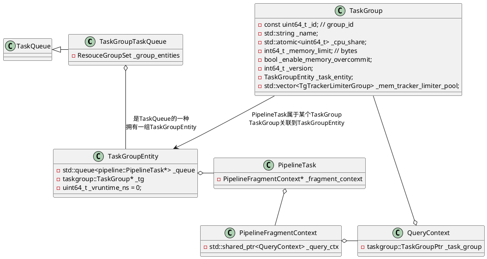

## vruntime计算

```C++
uint64_t TaskGroupEntity::vruntime_ns() const {
    return _vruntime_ns;
}

void TaskGroupEntity::incr_runtime_ns(uint64_t runtime_ns) {
    auto v_time = runtime_ns / _tg->cpu_share();
    _vruntime_ns += v_time;
}

// 在Push Task时调整vruntime
// push_back -> _push_back -> _enqueue_task_group
// 参见_enqueue_task_group
void TaskGroupEntity::adjust_vruntime_ns(uint64_t vruntime_ns) {
    _vruntime_ns = vruntime_ns;
}
```

和MultiCoreTaskQueue类似，在`PipelineTask`的`execute`调用`update_statistics`更新vruntime

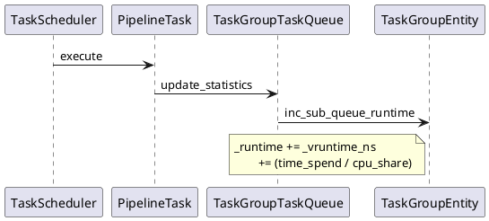

```C++
void TaskGroupTaskQueue::update_statistics(PipelineTask* task, int64_t time_spent) {
    std::unique_lock<std::mutex> lock(_rs_mutex);
    // 1. 查找所属的TaskGroupEntity
    auto* group = task->get_task_group();
    auto* entity = group->task_entity();
    auto find_entity = _group_entities.find(entity);
    bool is_in_queue = find_entity != _group_entities.end();
    if (is_in_queue) {
        _group_entities.erase(entity);
    }
    // 2. 为TaskGroupEntity更新runtime
    entity->incr_runtime_ns(time_spent);
    if (is_in_queue) {
        _group_entities.emplace(entity);
        // 更新_min_tg_entity和_min_tg_v_runtime_ns
        _update_min_tg();
    }
}
```

`PipelineTask`入队调整vruntime
```C++
template <bool from_worker>
void TaskGroupTaskQueue::_enqueue_task_group(taskgroup::TGEntityPtr tg_entity) {
    _total_cpu_share += tg_entity->cpu_share();

    // PipelineTask来自TaskScheduler或BlockedTaskScheduler
    if constexpr (!from_worker) {
        auto old_v_ns = tg_entity->vruntime_ns();
        auto* min_entity = _min_tg_entity.load();
        if (min_entity) {
            int64_t new_vruntime_ns = min_entity->vruntime_ns() - _ideal_runtime_ns(tg_entity) / 2;
            if (new_vruntime_ns > old_v_ns) {
                tg_entity->adjust_vruntime_ns(new_vruntime_ns);
            }
        } else if (old_v_ns < _min_tg_v_runtime_ns) {
            tg_entity->adjust_vruntime_ns(_min_tg_v_runtime_ns);
        }
    }
            ......
}

// like sched_fair.c calc_delta_fair, THREAD_TIME_SLICE maybe a dynamic value.
int64_t TaskGroupTaskQueue::_ideal_runtime_ns(
        taskgroup::TGEntityPtr tg_entity) const {
    return PipelineTask::THREAD_TIME_SLICE * _core_size *
            tg_entity->cpu_share() / _total_cpu_share;
}
```

## 任务优先级
任务优先级依次：
1. vruntime
2. cpu share，越小
3. task group id

```C++
class TaskGroupTaskQueue : public TaskQueue {
            .....
private:
    // Like cfs rb tree in sched_entity
    struct TaskGroupSchedEntityComparator {
        bool operator()(const taskgroup::TGEntityPtr&, const taskgroup::TGEntityPtr&) const;
    };
    using ResouceGroupSet = std::set<taskgroup::TGEntityPtr, TaskGroupSchedEntityComparator>;
    ResouceGroupSet _group_entities;

            ......
}

bool TaskGroupTaskQueue::TaskGroupSchedEntityComparator::operator()(
        const taskgroup::TGEntityPtr& lhs_ptr,
        const taskgroup::TGEntityPtr& rhs_ptr) const {
    // 在std::set中的优先级
    //  1. vruntime
    //  2. cpu share
    //  3. task group id
    int64_t lhs_val = lhs_ptr->vruntime_ns();
    int64_t rhs_val = rhs_ptr->vruntime_ns();
    if (lhs_val != rhs_val) {
        return lhs_val < rhs_val;
    } else {
        auto l_share = lhs_ptr->cpu_share();
        auto r_share = rhs_ptr->cpu_share();
        if (l_share != r_share) {
            return l_share < r_share;
        } else {
            return lhs_ptr->task_group_id() < rhs_ptr->task_group_id();
        }
    }
}
```


## Push Task
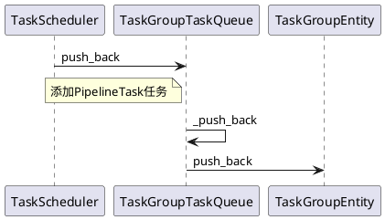

```C++
template <bool from_executor>
Status TaskGroupTaskQueue::_push_back(PipelineTask* task) {
    auto* entity = task->get_task_group()->task_entity();
    std::unique_lock<std::mutex> lock(_rs_mutex);
    entity->push_back(task);
    // 
    if (_group_entities.find(entity) == _group_entities.end()) {
        _enqueue_task_group<from_executor>(entity);
    }
    _wait_task.notify_one();
    return Status::OK();
}

template <bool from_worker>
void TaskGroupTaskQueue::_enqueue_task_group(taskgroup::TGEntityPtr tg_entity) {
    _total_cpu_share += tg_entity->cpu_share();

    // PipelineTask来自TaskScheduler或BlockedTaskScheduler
    if constexpr (!from_worker) {
        auto old_v_ns = tg_entity->vruntime_ns();
        auto* min_entity = _min_tg_entity.load();
        if (min_entity) {
            int64_t new_vruntime_ns = min_entity->vruntime_ns() - _ideal_runtime_ns(tg_entity) / 2;
            if (new_vruntime_ns > old_v_ns) {
                tg_entity->adjust_vruntime_ns(new_vruntime_ns);
            }
        } else if (old_v_ns < _min_tg_v_runtime_ns) {
            tg_entity->adjust_vruntime_ns(_min_tg_v_runtime_ns);
        }
    }
    _group_entities.emplace(tg_entity);
    _update_min_tg();
}
```

## Take task
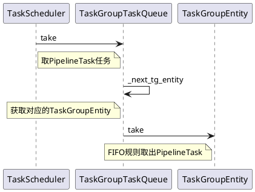
```C++
PipelineTask* TaskGroupTaskQueue::take(size_t core_id) {
    std::unique_lock<std::mutex> lock(_rs_mutex);
    taskgroup::TGEntityPtr entity = nullptr;
    while (entity == nullptr) {
        if (_closed) return nullptr;

        if (_group_entities.empty()) {
            // 空，等待Push PipelineTask
            _wait_task.wait(lock);
        } else {
            // 根据调度规则，取出TaskGroupEntity
            entity = _next_tg_entity();
            if (!entity) {
                _wait_task.wait_for(lock,
                    std::chrono::milliseconds(WAIT_CORE_TASK_TIMEOUT_MS));
            }
        }
    }

    if (entity->task_size() == 1) {
        // TaskGroupEntity中只剩一个PipelineTask
        // PipelineTask取出后，TaskGroupEntity为空
        // 将其从_group_entities中移除并更新本地的如min task group等信息
        _dequeue_task_group(entity);
    }

    // FIFO取出PipelineTask
    return entity->take();
}

void TaskGroupTaskQueue::_dequeue_task_group(taskgroup::TGEntityPtr tg_entity) {
    _total_cpu_share -= tg_entity->cpu_share();
    _group_entities.erase(tg_entity);
    _update_min_tg();
}
```

# 参考资料
1. [DSIP-027: Support Pipeline Exec Engine](https://cwiki.apache.org/confluence/display/DORIS/DSIP-027%3A+Support+Pipeline+Exec+Engine)
2. [操作系统导论：多级反馈队列 - 知乎](https://zhuanlan.zhihu.com/p/367636084)
