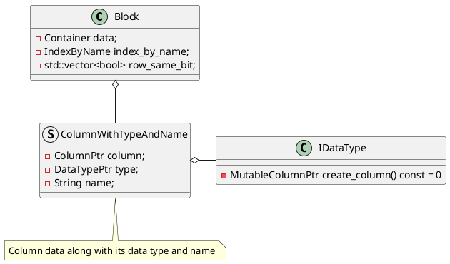

```sql
-- 开启向量化，默认是true,2.0之后移除了非向量化的代码，该配置失效
SET enable_vectorized_engine = true;
-- 默认值是4064 = 4096 - (16 + 16)
SET batch_size = 4064;
```

# 计算引擎采用列存
计算引擎对数据的组织方式由行存的Tuple和RowBatch变成Column和Block。
```C++
class Block {
private:
    using Container = ColumnsWithTypeAndName;
    using IndexByName = phmap::flat_hash_map<String, size_t>;
};

using ColumnsWithTypeAndName = std::vector<ColumnWithTypeAndName>;
```

```C++
class Block {
private:
    using Container = ColumnsWithTypeAndName;
    using IndexByName = phmap::flat_hash_map<String, size_t>;
    Container data;
    // column name和column index的映射
    // key: column name, value: column index
    // 通过initialize_index_by_name()接口进行初始化
    IndexByName index_by_name;
    std::vector<bool> row_same_bit;

    int64_t _decompress_time_ns = 0;
    int64_t _decompressed_bytes = 0;

    mutable int64_t _compress_time_ns = 0;
}

```
```C++
struct ColumnWithTypeAndName {
    ColumnPtr column;
    DataTypePtr type;
    String name;

    // null
    ColumnWithTypeAndName() {}
    ColumnWithTypeAndName(const ColumnPtr& column_, const DataTypePtr& type_,
            const String& name_) : column(column_), type(type_), name(name_) {}

    //调用type->create_column()创建Column
    ColumnWithTypeAndName(const DataTypePtr& type_, const String& name_)
            : column(type_->create_column()), type(type_), name(name_) {}
}
```
# 参考资料
1. [活动回顾｜Apache Doris 向量化技术实现与后续规划](https://zhuanlan.zhihu.com/p/454141438)
2. [李昊鹏：单表性能提升数倍，Doris向量化技术升级实践!](https://zhuanlan.zhihu.com/p/473337062)