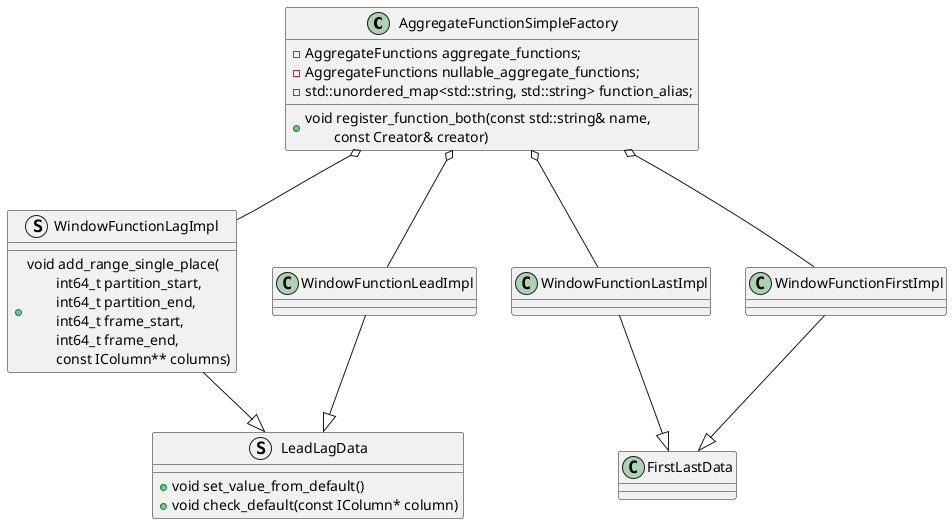
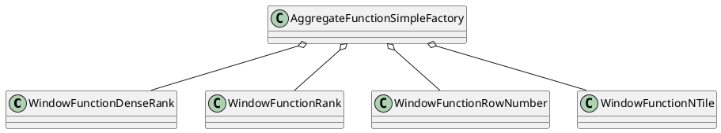

窗口函数相关的生成函数在`be/src/vec/aggregate_functions/aggregate_function_window.cpp`

### 值函数




### TopN函数

```C++
void register_aggregate_function_window_rank(AggregateFunctionSimpleFactory& factory) {
    factory.register_function("dense_rank", creator_without_type::creator<WindowFunctionDenseRank>);
    factory.register_function("rank", creator_without_type::creator<WindowFunctionRank>);
    factory.register_function("row_number", creator_without_type::creator<WindowFunctionRowNumber>);
    factory.register_function("ntile", creator_without_type::creator<WindowFunctionNTile>);
}
```

