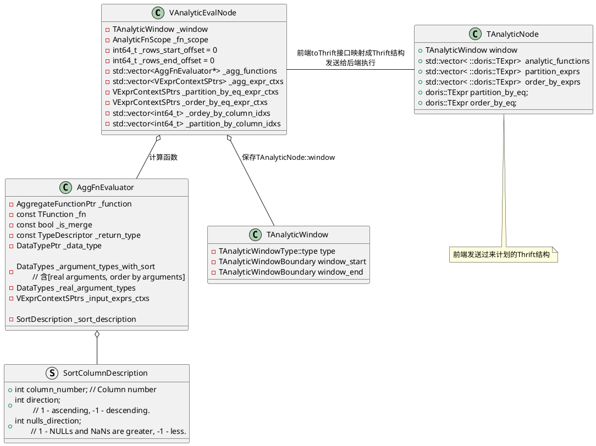
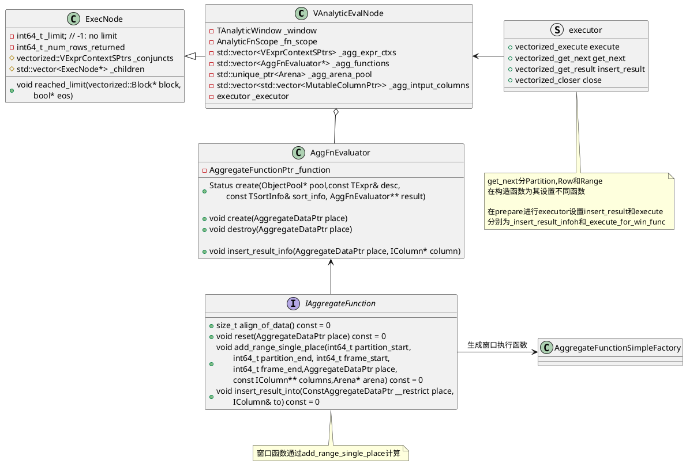
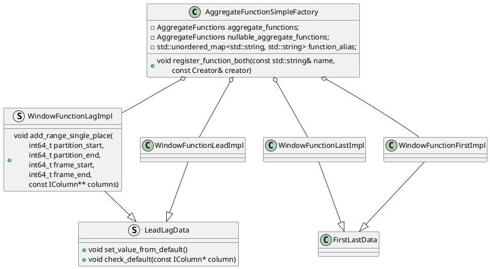
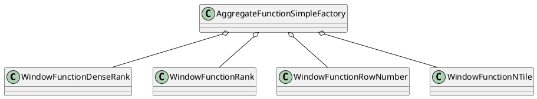
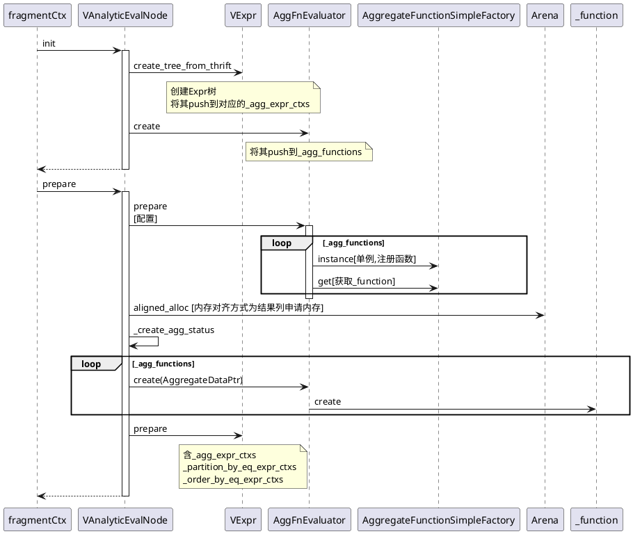
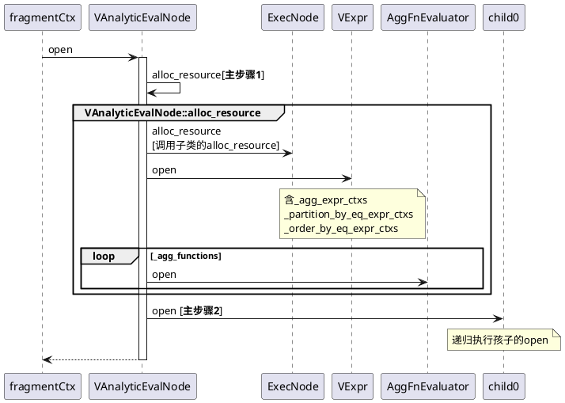
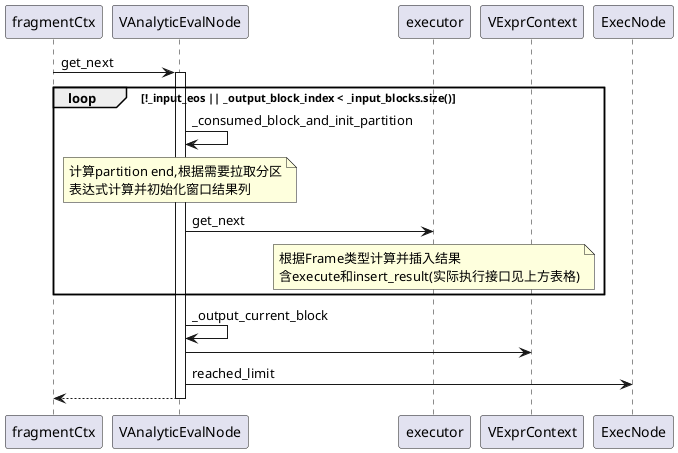
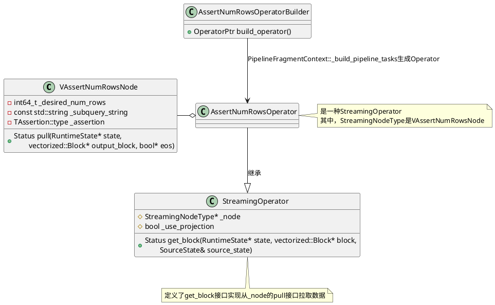
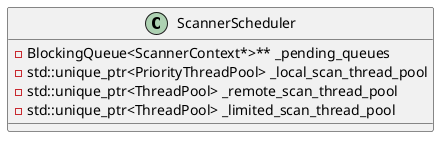

# 窗口
```sql
function(args) OVER(partition_by_clause order_by_clause [window_frame])

其中：
    partition_by_clause ::= PARTITION BY expr [, expr ...]    
    order_by_clause ::= ORDER BY expr [ASC | DESC] [, expr [ASC | DESC] ...]
    window_frame ::=
        { RANGE | ROWS } frame_start
        { RANGE | ROWS } BETWEEN frame_start AND frame_end
```

前端窗口表示的数据结构是`public AnalyticEvalNode`
```java
// org/apache/doris/planner/AnalyticEvalNode.java
public AnalyticEvalNode {

}
```

## 数据结构





窗口函数相关的生成函数在`be/src/vec/aggregate_functions/aggregate_function_window.cpp`

### 值函数




### TopN函数

```C++
void register_aggregate_function_window_rank(AggregateFunctionSimpleFactory& factory) {
    factory.register_function("dense_rank", creator_without_type::creator<WindowFunctionDenseRank>);
    factory.register_function("rank", creator_without_type::creator<WindowFunctionRank>);
    factory.register_function("row_number", creator_without_type::creator<WindowFunctionRowNumber>);
    factory.register_function("ntile", creator_without_type::creator<WindowFunctionNTile>);
}
```



## 接口实现

这里[记录了一些窗口定义中成员](11_04_00_Exec_Operator_Analytic.md)，辅助理解代码。

### init和prepare


### open

```C++
Status VAnalyticEvalNode::open(RuntimeState* state) {
    RETURN_IF_ERROR(alloc_resource(state));
    RETURN_IF_ERROR(child(0)->open(state));
    return Status::OK();
}

Status VAnalyticEvalNode::alloc_resource(RuntimeState* state) {
    {
        RETURN_IF_ERROR(ExecNode::alloc_resource(state));
        RETURN_IF_CANCELLED(state);
    }

    RETURN_IF_ERROR(VExpr::open(_partition_by_eq_expr_ctxs, state));
    RETURN_IF_ERROR(VExpr::open(_order_by_eq_expr_ctxs, state));

    for (size_t i = 0; i < _agg_functions_size; ++i) {
        RETURN_IF_ERROR(VExpr::open(_agg_expr_ctxs[i], state));
    }

    for (auto* agg_function : _agg_functions) {
        RETURN_IF_ERROR(agg_function->open(state));
    }
    return Status::OK();
}
```



### get_next


| `executor`结构                                               | 对应函数                                                     | 何时赋值  | 描述                                                  |
| ------------------------------------------------------------ | ------------------------------------------------------------ | --------- | ----------------------------------------------------- |
| `_executor.get_next`<br/><br/>接口实现含<br/>1. `_executor.execute`<br/>2. `_executor.insert_result` | `VAnalyticEvalNode::_get_next_for_partition`,默认<br/><br/>情况1. 无`WINDOW FRAME`<br/>情况2. `RANGE && [unbounded preceding, unbounded following]`<br/>情况3. `ROWS && 无start和end` | 构造      | `PARTITION`类型<br/>计算获取的Partition的结果并写结果 |
|                                                              | `VAnalyticEvalNode::_get_next_for_range`<br/><br/>情况1. `RANGE && [unbounded preceding,current row]` | 构造      | `RANGE`类型<br/>计算结果并写结果                      |
|                                                              | `VAnalyticEvalNode::_get_next_for_rows`                      | 构造      | `ROWS`类型<br/>计算`window_function`并写结果          |
| `_executor.execute`                                          | `VAnalyticEvalNode::_execute_for_win_func`                   | `prepare` | 计算已获取Partition的函数结果                         |
| `_executor.insert_result`                                    | `VAnalyticEvalNode::_insert_result_info`                     | `prepare` | 写结果                                                |
|                                                              |                                                              |           |                                                       |

```C++
Status VAnalyticEvalNode::get_next(RuntimeState* state, vectorized::Block* block, bool* eos) {
    RETURN_IF_CANCELLED(state);

    if (_input_eos && _output_block_index == _input_blocks.size()) {
        *eos = true;
        return Status::OK();
    }

    while (!_input_eos || _output_block_index < _input_blocks.size()) {
        // claculate current partition end
        // check whether need get next partition, if need fectch next block
        // otherwise, init next partition
        RETURN_IF_ERROR(_consumed_block_and_init_partition(state, &_next_partition, eos));
        // 
        if (*eos) {
            return Status::OK();
        }
        size_t current_block_rows = _input_blocks[_output_block_index].rows();
        // 含_executor.execute(执行agg_function, see _execute_for_win_func)
        //   _executor.insert_result(计算窗口函数结果)
        RETURN_IF_ERROR(_executor.get_next(current_block_rows));
        if (_window_end_position == current_block_rows) {
            break;
        }
    }
    RETURN_IF_ERROR(_output_current_block(block));
    RETURN_IF_ERROR(VExprContext::filter_block(_conjuncts, block, block->columns()));
    reached_limit(block, eos);
    return Status::OK();
}
```

```C++
Status VAnalyticEvalNode::_consumed_block_and_init_partition(
        RuntimeState* state, bool* next_partition, bool* eos) {
    // 1. 二分法claculate current partition end(block_num和row num)
    BlockRowPos found_partition_end = _get_partition_by_end();

    // 2. check whether need get next partition
    //    if current partition haven't execute done, return false
    while (whether_need_next_partition(found_partition_end)) {
        // 2.1 need next partition, then fetch next block from child[0]
        RETURN_IF_ERROR(_fetch_next_block_data(state));
        // 重新claculate new partition end
        found_partition_end = _get_partition_by_end();
    }

    // 2.2 如果当前计算的pos到达partition end,初始化next partition
    //     重置agg function state(todo)
    if (_input_eos && _input_total_rows == 0) {
        *eos = true;
        return Status::OK();
    }

    // 2.3 
    *next_partition = _init_next_partition(found_partition_end);

    // 为_result_window_columns根据agg_function返回类型创建column
    RETURN_IF_ERROR(_init_result_columns());
    return Status::OK();
}
```

```C++
Status VAnalyticEvalNode::_output_current_block(Block* block) {
    block->swap(std::move(_input_blocks[_output_block_index]));
    // block中包含函数, partition by, order by表达式计算中间结果
    // 输出结果只保留_origin_cols，不保留中间计算数据
    if (_origin_cols.size() < block->columns()) {
        block->erase_not_in(_origin_cols);
    }

    for (size_t i = 0; i < _result_window_columns.size(); ++i) {
        if (_change_to_nullable_flags[i]) {
            block->insert({make_nullable(std::move(_result_window_columns[i])),
                           make_nullable(_agg_functions[i]->data_type()), ""});
        } else {
            block->insert({std::move(_result_window_columns[i]),
                        _agg_functions[i]->data_type(), ""});
        }
    }

    _output_block_index++;
    _window_end_position = 0;

    return Status::OK();
}
```

```C++
BlockRowPos VAnalyticEvalNode::_get_partition_by_end() {
    // 1. still have data, return partition_by_end directly
    if (_current_row_position < _partition_by_end.pos) { 
        return _partition_by_end;
    }

    // 2. no partition_by, the all block is end
    if (_partition_by_eq_expr_ctxs.empty() || (_input_total_rows == 0)) { 
        return _all_block_end;
    }

    BlockRowPos cal_end = _all_block_end;
    for (size_t i = 0; i < _partition_by_eq_expr_ctxs.size(); ++i) {
        // 3. have partition_by, binary search the partiton end
        //    make sure which block and partition end row num
        cal_end = _compare_row_to_find_end(_partition_by_column_idxs[i],
                _partition_by_end, cal_end);
    }
    cal_end.pos = input_block_first_row_positions[cal_end.block_num] + cal_end.row_num;
    return cal_end;
}
```

```C++
BlockRowPos VAnalyticEvalNode::_compare_row_to_find_end(
        int idx, BlockRowPos start, BlockRowPos end, bool need_check_first) {
    int64_t start_init_row_num = start.row_num;
    ColumnPtr start_column = _input_blocks[start.block_num].get_by_position(idx).column;
    ColumnPtr start_next_block_column = start_column;
    int64_t start_block_num = start.block_num;
    int64_t end_block_num = end.block_num;
    int64_t mid_blcok_num = end.block_num;
    // To fix this problem: https://github.com/apache/doris/issues/15951
    // in this case, the partition by column is last row of block, so it's pointed to a new block at row = 0, range is: [left, right)
    // From the perspective of order by column, the two values are exactly equal.
    // so the range will be get wrong because it's compare_at == 0 with next block at row = 0
    if (need_check_first && end.block_num > 0 && end.row_num == 0) {
        end.block_num--;
        end_block_num--;
        end.row_num = _input_blocks[end_block_num].rows();
    }

    // 1. binary search find in which block
    while (start_block_num < end_block_num) {
        // 划分为[start_block_num, mid_block_num-1], [mid_block_num, end_block_num]两个区间
        mid_blcok_num = (start_block_num + end_block_num + 1) >> 1;
        start_next_block_column = _input_blocks[mid_blcok_num].get_by_position(idx).column;
        //Compares (*this)[n] and rhs[m], this: start[init_row]  rhs: mid[0]
        if (start_column->compare_at(start_init_row_num, 0, *start_next_block_column, 1) == 0) {
            start_block_num = mid_blcok_num;
        } else {
            end_block_num = mid_blcok_num - 1;
        }
    }

    // have check the start.block_num:  start_column[start_init_row_num] with mid_blcok_num start_next_block_column[0]
    // now next block must not be result, so need check with end_block_num: start_next_block_column[last_row]
    if (end_block_num == mid_blcok_num - 1) {
        start_next_block_column = _input_blocks[end_block_num].get_by_position(idx).column;
        int64_t block_size = _input_blocks[end_block_num].rows();
        if ((start_column->compare_at(start_init_row_num, block_size - 1, *start_next_block_column,
                                      1) == 0)) {
            start.block_num = end_block_num + 1;
            start.row_num = 0;
            return start;
        }
    }

    //check whether need get column again, maybe same as first init
    // if the start_block_num have move to forword, so need update start block num and compare it from row_num=0
    if (start_block_num != start.block_num) {
        start_init_row_num = 0;
        start.block_num = start_block_num;
        start_column = _input_blocks[start.block_num].get_by_position(idx).column;
    }
    //binary search, set start and end pos
    int64_t start_pos = start_init_row_num;
    int64_t end_pos = _input_blocks[start.block_num].rows();
    //if end_block_num haven't moved, only start_block_num go to the end block
    //so could use the end.row_num for binary search
    if (start.block_num == end.block_num) {
        end_pos = end.row_num;
    }

    //  2. binary search find partition end row num
    while (start_pos < end_pos) {
        // [start_pos, mid_pos], [mid_pos+1, end_pos]
        int64_t mid_pos = (start_pos + end_pos) >> 1;
        if (start_column->compare_at(start_init_row_num, mid_pos, *start_column, 1)) {
            end_pos = mid_pos;
        } else {
            start_pos = mid_pos + 1;
        }
    }
    start.row_num = start_pos; //update row num, return the find end
    return start;
}
```
```C++
VAnalyticEvalNode::_fetch_next_block_data
    _children[0]->get_next_after_projects

    VAnalyticEvalNode::sink {
        // 计算函数表达式结果
        _insert_range_column(input_block, _agg_expr_ctxs[i][j],
                _agg_intput_columns[i][j].get(), block_rows)
        // 计算partition by expr
        _partition_by_eq_expr_ctxs[i]->execute(input_block, &result_col_id)
        // 计算order by expr
        _order_by_eq_expr_ctxs[i]->execute(input_block, &result_col_id)
        _input_blocks.emplace_back(std::move(*input_block));
    
        _found_partition_end = _get_partition_by_end();
        _need_more_input = whether_need_next_partition(_found_partition_end);
    }

```



### close
```C++
Status VAnalyticEvalNode::close(RuntimeState* state) {
    if (is_closed()) return Status::OK();

    release_resource(state);
    return ExecNode::close(state);
}

void VAnalyticEvalNode::release_resource(RuntimeState* state) {
    if (is_closed()) {
        return;
    }
    for (auto* agg_function : _agg_functions) {
        agg_function->close(state);
    }

    _destroy_agg_status();
    _release_mem();
    return ExecNode::release_resource(state);
}
```

# VAssertNumRowsNode
用于子链接解关联，例如
```sql
explain graph
select
    -- 子链接，最多返回一行
    (select count(i1) from t2 group by i2)
    from t1;
```
理论上所有的子链接都可以转Join，上面的SQL可以等价转换为`LEFT OUTR JOIN`
```sql
explain graph
select cnt from
	t1 left outer join (
        -- 是子链接，最多返回一行，添加一个assert算子终止查询
        select count(i1) as cnt from t2 group by i2) tmp2
    ON 1=1
```

```C++
Status ExecNode::create_node(RuntimeState* state, ObjectPool* pool,
        const TPlanNode& tnode, const DescriptorTbl& descs, ExecNode** node) {
            ......
    // 生成ExecNode
    case TPlanNodeType::ASSERT_NUM_ROWS_NODE:
        *node = pool->add(new vectorized::VAssertNumRowsNode(
            pool, tnode, descs));
        return Status::OK();
            ....
}
```
```C++
Status PipelineFragmentContext::_build_pipelines(ExecNode* node, PipelinePtr cur_pipe) {
            ......
    // 生成buildOperator
    case TPlanNodeType::ASSERT_NUM_ROWS_NODE: {
        RETURN_IF_ERROR(_build_pipelines(node->child(0), cur_pipe));
        // AssertNumRowsOperatorBuilder是StreamingOperator的一种
        // 通过build_operator生成AssertNumRowsOperator
        OperatorBuilderPtr builder =
                std::make_shared<AssertNumRowsOperatorBuilder>(node->id(), node);
        RETURN_IF_ERROR(cur_pipe->add_operator(builder));
        break;
    }
            .......
}
```


`AssertNumRowsOperatorBuilder`是`StreamingOperator`的一种，通过`VAssertNumRowsNode::pull`来获取`Block`。
```C++
VAssertNumRowsNode::VAssertNumRowsNode(ObjectPool* pool,
        const TPlanNode& tnode, const DescriptorTbl& descs) :
        ExecNode(pool, tnode, descs),
          _desired_num_rows(tnode.assert_num_rows_node.desired_num_rows),
          _subquery_string(tnode.assert_num_rows_node.subquery_string) {
    if (tnode.assert_num_rows_node.__isset.assertion) {
        _assertion = tnode.assert_num_rows_node.assertion;
    } else {
        _assertion = TAssertion::LE;
    }
}

Status VAssertNumRowsNode::pull(doris::RuntimeState* state, vectorized::Block* block, bool* eos) {
    _num_rows_returned += block->rows();
    bool assert_res = false;
    switch (_assertion) {
    case TAssertion::EQ:
        assert_res = _num_rows_returned == _desired_num_rows;
        break;
                ......
    }

    // assert_res为ture,返回Cancel，否则OK
    if (!assert_res) {
            ......
        return Status::Cancelled(......);
    }
    return Status::OK();
}

Status VAssertNumRowsNode::get_next(RuntimeState* state, Block* block, bool* eos) {
    RETURN_IF_ERROR(child(0)->get_next_after_projects(
            state, block, eos,std::bind((Status(ExecNode::*)
            (RuntimeState*, vectorized::Block*, bool*)) &ExecNode::get_next,
                _children[0], std::placeholders::_1, std::placeholders::_2,
                std::placeholders::_3)));
    return pull(state, block, eos);
}
```

# scan
```plantuml
PInternalServiceImpl -> FragmentMgr:exec_plan_fragment
FragmentMgr -> FragmentMgr:_get_query_ctx
group : _get_query_ctx
FragmentMgr -> QueryContext:create_shared
note left of QueryContext: 创建QueryContext
FragmentMgr -> FragmentMgr:_set_scan_concurrency

FragmentMgr -> QueryContext:set_thread_token
note left of QueryContext: resource_limit.cpu_limit是否设置\nmode=concurrent(并行)
end group

```

```C++
void QueryContext::set_thread_token(int concurrency, bool is_serial) {
    _thread_token = _exec_env->scanner_scheduler()->new_limited_scan_pool_token(
            is_serial ? ThreadPool::ExecutionMode::SERIAL
                        : ThreadPool::ExecutionMode::CONCURRENT,
            concurrency);
}
```

