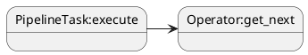

# VAssertNumRowsNode
用于子链接解关联，例如
```sql
explain graph
select
    -- 子链接，最多返回一行
    (select count(i1) from t2 group by i2)
    from t1;
```
理论上所有的子链接都可以转Join，上面的SQL可以等价转换为`LEFT OUTR JOIN`
```sql
explain graph
select cnt from
	t1 left outer join (
        -- 是子链接，最多返回一行，添加一个assert算子终止查询
        select count(i1) as cnt from t2 group by i2) tmp2
    ON 1=1
```

```C++
Status ExecNode::create_node(RuntimeState* state, ObjectPool* pool,
        const TPlanNode& tnode, const DescriptorTbl& descs, ExecNode** node) {
            ......
    // 生成ExecNode
    case TPlanNodeType::ASSERT_NUM_ROWS_NODE:
        *node = pool->add(new vectorized::VAssertNumRowsNode(
            pool, tnode, descs));
        return Status::OK();
            ....
}
```
```C++
Status PipelineFragmentContext::_build_pipelines(ExecNode* node, PipelinePtr cur_pipe) {
            ......
    // 生成buildOperator
    case TPlanNodeType::ASSERT_NUM_ROWS_NODE: {
        RETURN_IF_ERROR(_build_pipelines(node->child(0), cur_pipe));
        // AssertNumRowsOperatorBuilder是StreamingOperator的一种
        // 通过build_operator生成AssertNumRowsOperator
        OperatorBuilderPtr builder =
                std::make_shared<AssertNumRowsOperatorBuilder>(node->id(), node);
        RETURN_IF_ERROR(cur_pipe->add_operator(builder));
        break;
    }
            .......
}
```


`AssertNumRowsOperatorBuilder`是`StreamingOperator`的一种，通过`VAssertNumRowsNode::pull`来获取`Block`。
```C++
VAssertNumRowsNode::VAssertNumRowsNode(ObjectPool* pool,
        const TPlanNode& tnode, const DescriptorTbl& descs) :
        ExecNode(pool, tnode, descs),
          _desired_num_rows(tnode.assert_num_rows_node.desired_num_rows),
          _subquery_string(tnode.assert_num_rows_node.subquery_string) {
    if (tnode.assert_num_rows_node.__isset.assertion) {
        _assertion = tnode.assert_num_rows_node.assertion;
    } else {
        _assertion = TAssertion::LE;
    }
}

Status VAssertNumRowsNode::pull(doris::RuntimeState* state, vectorized::Block* block, bool* eos) {
    _num_rows_returned += block->rows();
    bool assert_res = false;
    switch (_assertion) {
    case TAssertion::EQ:
        assert_res = _num_rows_returned == _desired_num_rows;
        break;
                ......
    }

    // assert_res为ture,返回Cancel，否则OK
    if (!assert_res) {
            ......
        return Status::Cancelled(......);
    }
    return Status::OK();
}

Status VAssertNumRowsNode::get_next(RuntimeState* state, Block* block, bool* eos) {
    RETURN_IF_ERROR(child(0)->get_next_after_projects(
            state, block, eos,std::bind((Status(ExecNode::*)
            (RuntimeState*, vectorized::Block*, bool*)) &ExecNode::get_next,
                _children[0], std::placeholders::_1, std::placeholders::_2,
                std::placeholders::_3)));
    return pull(state, block, eos);
}
```

# scan
```plantuml
PInternalServiceImpl -> FragmentMgr:exec_plan_fragment
FragmentMgr -> FragmentMgr:_get_query_ctx
group : _get_query_ctx
FragmentMgr -> QueryContext:create_shared
note left of QueryContext: 创建QueryContext
FragmentMgr -> FragmentMgr:_set_scan_concurrency

FragmentMgr -> QueryContext:set_thread_token
note left of QueryContext: resource_limit.cpu_limit是否设置\nmode=concurrent(并行)
end group

```

```C++
void QueryContext::set_thread_token(int concurrency, bool is_serial) {
    _thread_token = _exec_env->scanner_scheduler()->new_limited_scan_pool_token(
            is_serial ? ThreadPool::ExecutionMode::SERIAL
                        : ThreadPool::ExecutionMode::CONCURRENT,
            concurrency);
}
```

