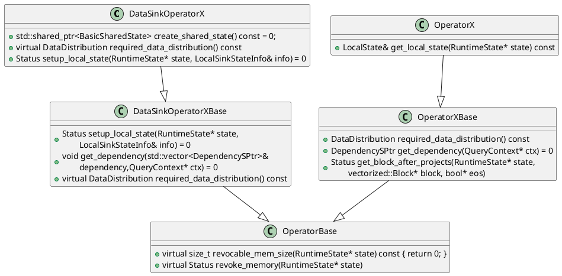
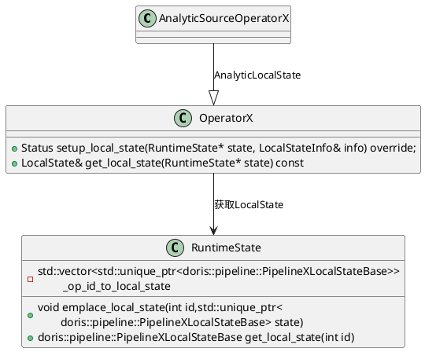
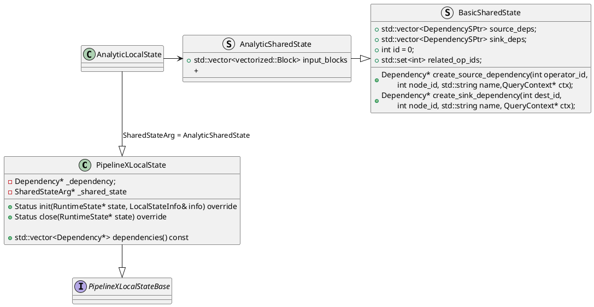
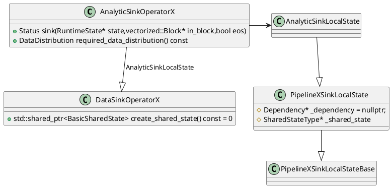
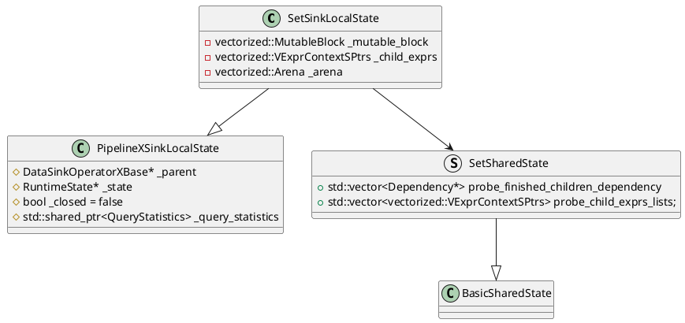

基于2.1.2-rc04分支



```C++
class PipelineXSinkLocalState : public PipelineXSinkLocalStateBase {
protected:
    DependencyType* _dependency = nullptr;
    typename DependencyType::SharedState* _shared_state = nullptr;
}
```

# 窗口






# 集合运算
对于`INTERSECT`，`EXCEPT`运算

