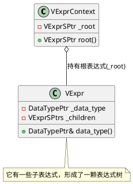
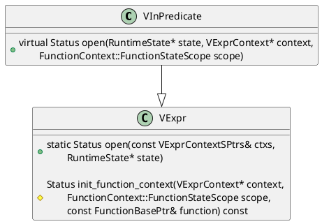
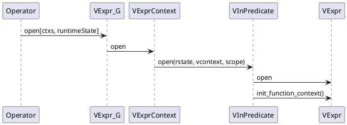

```plantuml
@startuml
class VExprContext {
    - VExprSPtr _root
    + VExprSPtr root() 
}

class VExpr {
    - DataTypePtr _data_type
    - VExprSPtrs _children
    + DataTypePtr& data_type()
}
note bottom : 它有一些子表达式，形成了一颗表达式树

VExpr -up-o VExprContext : 持有根表达式(_root)
@enduml
```

```plantuml
@startuml
class VInPredicate {
    + virtual Status open(RuntimeState* state, VExprContext* context,\n\tFunctionContext::FunctionStateScope scope)
}

class VExpr {
    + static Status open(const VExprContextSPtrs& ctxs,\n\tRuntimeState* state)

    # Status init_function_context(VExprContext* context, \n\tFunctionContext::FunctionStateScope scope,\n\tconst FunctionBasePtr& function) const
}
VInPredicate -down-|> VExpr
@enduml
```

```plantuml
@startuml
Operator -> VExpr_G:open[ctxs, runtimeState]
VExpr_G -> VExprContext:open

VExprContext -> VInPredicate:open(rstate, vcontext, scope)
VInPredicate -> VExpr:open
VInPredicate -> VExpr:init_function_context()
@enduml
```