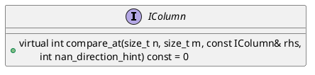

```C++
class IColumn : public COW<IColumn> {
public:
    // Compares (*this)[n] and rhs[m]
    virtual int compare_at(size_t n, size_t m, const IColumn& rhs,
                        int nan_direction_hint) const = 0;
}
```