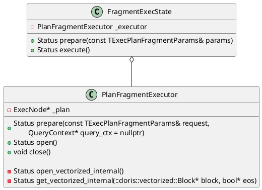
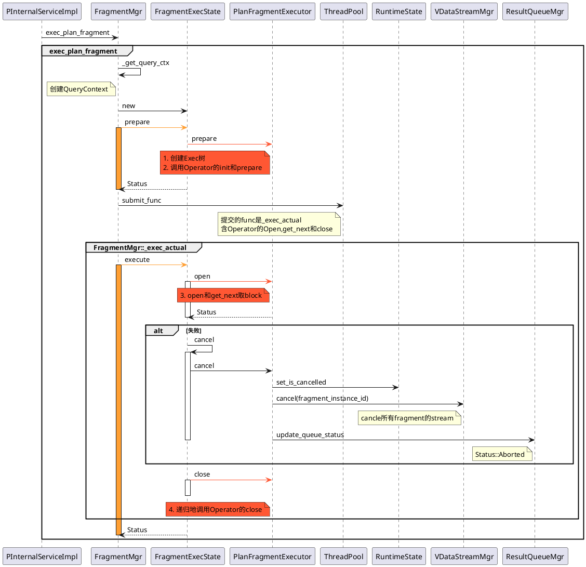
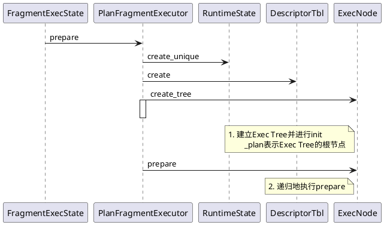
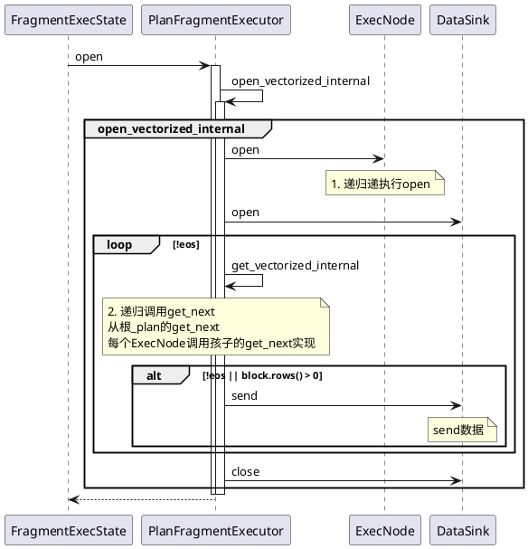
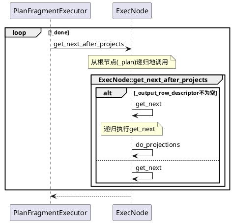
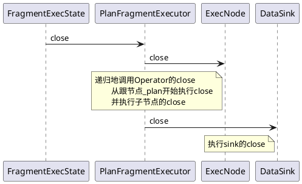

火山模型的调用入口是
```C++
FragmentMgr::exec_plan_fragment(const TExecPlanFragmentParams& params)
```

借助`FragmentExecState`完成整个生命周期调用，它拥有一个`PlanFragmentExecutor`，通过它实现：
1. `PlanFragmentExecutor::prepare`: 创建Exec Tree并init，参见`ExecNode::create_tree`；递归地执行Operator的`prepare`
2. `PlanFragmentExecutor::open`:执行算子的`open`和`get_next`
3. `PlanFragmentExecutor::close`:执行算子的`close`



# 主流程图

每个instance对应线程池的一个线程，提交给线程池中`FragmentMgr::_exec_actual`执行，含Operator的`open`, `get_next`和`close`。



## Executor::prepare

`ExecNode:create_tree`参见[这里的 创建Exec树 章节](11_00_00_Exec_CreateTree.md)

## Executor::open



对于`PlanFragmentExecutor::get_vectorized_internal`


```C++
Status PlanFragmentExecutor::get_vectorized_internal(
        doris::vectorized::Block* block, bool* eos) {
    while (!_done) {
        block->clear_column_data(_plan->row_desc().num_materialized_slots());
        RETURN_IF_ERROR(_plan->get_next_after_projects(
                _runtime_state.get(), block, &_done,
                std::bind((Status(ExecNode::*)(RuntimeState*, vectorized::Block*, bool*)) &
                        ExecNode::get_next, _plan, std::placeholders::_1,
                        std::placeholders::_2, std::placeholders::_3)));

        if (block->rows() > 0) {
            break;
        }
    }
    *eos = _done;
    return Status::OK();
}

Status ExecNode::get_next_after_projects(
        RuntimeState* state, vectorized::Block* block, bool* eos,
        const std::function<Status(RuntimeState*, vectorized::Block*, bool*)>& func,
        bool clear_data) {
    if (_output_row_descriptor) {
        if (clear_data) {
            clear_origin_block();
        }
        auto status = func(state, &_origin_block, eos);
        if (UNLIKELY(!status.ok())) return status;
        return do_projections(&_origin_block, block);
    }
    _peak_memory_usage_counter->set(_mem_tracker->peak_consumption());
    return func(state, block, eos);
}
```

以`VSelectNode`为例
```C++
Status VSelectNode::get_next(RuntimeState* state, vectorized::Block* block, bool* eos) {
    SCOPED_TIMER(_runtime_profile->total_time_counter());
    RETURN_IF_CANCELLED(state);
    do {
        RETURN_IF_CANCELLED(state);
        // 调用孩子的get_next
        RETURN_IF_ERROR(_children[0]->get_next_after_projects(
            state, block, &_child_eos, std::bind((Status(ExecNode::*)
            (RuntimeState*, vectorized::Block*, bool*)) &ExecNode::get_next,
                _children[0], std::placeholders::_1, std::placeholders::_2,
                std::placeholders::_3)));
        if (_child_eos) {
            *eos = true;
            break;
        }
    } while (block->rows() == 0);

    return pull(state, block, eos);
}
```
## Executor::close


```C++
void PlanFragmentExecutor::close() {
    if (_closed) return;

    // 执行了prepare
    if (_runtime_state != nullptr) {
        // _runtime_state init failed
        if (_plan != nullptr) {
            _plan->close(_runtime_state.get());
        }

        if (_sink != nullptr) {
            if (_prepared) {
                Status status;
                {
                    std::lock_guard<std::mutex> l(_status_lock);
                    status = _status;
                }
                _sink->close(runtime_state(), status);
            } else {
                _sink->close(runtime_state(), Status::InternalError("prepare failed"));
            }
        }
    }

    // 如果没有prepare,直接close
    _closed = true;
}
```

```C++
Status ExecNode::close(RuntimeState* state) {
    if (_is_closed) {
        return Status::OK();
    }

    _is_closed = true;
    Status result;
    // 执行子节点的close
    for (int i = 0; i < _children.size(); ++i) {
        auto st = _children[i]->close(state);
        if (result.ok() && !st.ok()) {
            result = st;
        }
    }

    release_resource(state);
    return result;
}
```

# 清理超时任务
前端可以配置可选的`query_timeout`参数，在后端启动了一个线程执行`FragmentMgr::cancel_worker`来终止相关子计划。

```C++
FragmentMgr::FragmentMgr(ExecEnv* exec_env)
        : _exec_env(exec_env), _stop_background_threads_latch(1) {
                ......
    // 创建线程检查timeout fragment
    auto s = Thread::create(
            "FragmentMgr", "cancel_timeout_plan_fragment",
            [this]() { this->cancel_worker(); }, &_cancel_thread);
                ......
}

void FragmentMgr::cancel_worker() {
    do {
        std::vector<TUniqueId> to_cancel;
        std::vector<TUniqueId> to_cancel_queries;
        vectorized::VecDateTimeValue now = vectorized::VecDateTimeValue::local_time();
        {
            std::lock_guard<std::mutex> lock(_lock);
            for (auto& it : _fragment_map) {
                // 1. fragment timeout, 将fragment_instance_id添加到to_cancel中
                if (it.second->is_timeout(now)) {
                    to_cancel.push_back(it.second->fragment_instance_id());
                }
            }

            for (auto it = _query_ctx_map.begin(); it != _query_ctx_map.end();) {
                if (it->second->is_timeout(now)) {
                    it = _query_ctx_map.erase(it);
                } else {
                    ++it;
                }
            }
        }

        for (auto& id : to_cancel) {
            // 2. 执行cancel
            cancel(id, PPlanFragmentCancelReason::TIMEOUT);
        }
    } while (!_stop_background_threads_latch.wait_for(std::chrono::seconds(1)));
}
```


## 超时参数设置

```thrift
// ExecPlanFragment
struct TExecPlanFragmentParams {
        ......
  // options for the query
  8: optional TQueryOptions query_options
        ......
}

struct TQueryOptions {
        ......
  14: optional i32 query_timeout = 3600
        ......
};
```

该参数在前端`Coordinator`的设置和初始化接口为`Coordinator::initQueryOptions`
```java
// ConnectContext
public int getExecTimeout() {
    if (executor != null && executor.isSyncLoadKindStmt()) {
        // particular for insert stmt, we can expand other type of timeout in the same way
        return Math.max(sessionVariable.getInsertTimeoutS(), sessionVariable.getQueryTimeoutS());
    } else if (executor != null && executor.isAnalyzeStmt()) {
        return sessionVariable.getAnalyzeTimeoutS();
    } else {
        // normal query stmt
        // query_timeout的默认值是900s
        return sessionVariable.getQueryTimeoutS();
    }
}

```


# 配置参数

```C++
FragmentMgr::FragmentMgr(ExecEnv* exec_env){
    s = ThreadPoolBuilder("FragmentMgrThreadPool")
                .set_min_threads(config::fragment_pool_thread_num_min)
                .set_max_threads(config::fragment_pool_thread_num_max)
                .set_max_queue_size(config::fragment_pool_queue_size)
                .build(&_thread_pool);
}
```

|             参数             | 类型  | 默认值 |    描述    |
| :--------------------------: | :---: | :----: | :--------: |
| fragment_pool_thread_num_min | int32 |   64   | 最小线程数 |
| fragment_pool_thread_num_max | int32 |  2048  | 最大线程数 |
|   fragment_pool_queue_size   | int32 |  4096  |            |

```C++
Status ThreadPool::do_submit(std::shared_ptr<Runnable> r, ThreadPoolToken* token) {
    				......
    int64_t capacity_remaining = static_cast<int64_t>(_max_threads) - _active_threads +
                                 static_cast<int64_t>(_max_queue_size) - _total_queued_tasks;
    if (capacity_remaining < 1) {
        return Status::Error<SERVICE_UNAVAILABLE>(
                "Thread pool {} is at capacity ({}/{} tasks running, {}/{} tasks queued)", _name,
                _num_threads + _num_threads_pending_start, _max_threads, _total_queued_tasks,
                _max_queue_size);
    }
    			......
}
```


# 性能影响因素分析

volcano的pull模型，在单机多核的场景下存在下面的一些问题：
1. 无法充分利用多核计算能力，提升查询性能，多数场景下进行性能调优时需要手动设置并行度，在生产环境中几乎很难进行设定。
2. 单机查询的每个instance对应线程池的一个线程，这会带来额外的两个问题。
    - 线程池一旦打满。Doris的查询引擎会进入假性死锁，对后续的查询无法响应。同时有一定概率进入逻辑死锁的情况：比如所有的线程都在执行一个instance的probe任务。
    - 阻塞的算子会占用线程资源，而阻塞的线程资源无法让渡给能够调度的instance，整体资源利用率上不去。
3. 阻塞算子依赖操作系统的线程调度机制，线程切换开销较大(尤其在系统混布的场景中)。CPU的资源管理困难，很难做到更细粒度的资源管理，多查询的混合并发做到合理的资源调度。
4. 大查询生成海量instance之后，线程池被打满。小查询几乎得不到调度的机会，导致混合负载下，小查询的时延较高。
5. 在混合部署的Doris集群之间，用户间的cpu资源无法得到好的隔离，目前几乎是处于无管控状态。

```C++
config::fragment_pool_thread_num_min
config::fragment_pool_thread_num_max
config::fragment_pool_queue_size

FragmentMgr::FragmentMgr(ExecEnv* exec_env){
    s = ThreadPoolBuilder("FragmentMgrThreadPool")
                .set_min_threads(config::fragment_pool_thread_num_min)
                .set_max_threads(config::fragment_pool_thread_num_max)
                .set_max_queue_size(config::fragment_pool_queue_size)
                .build(&_thread_pool);
```
 # 参考资料
 - 1. [DSIP-027: Support Pipeline Exec Engine](https://cwiki.apache.org/confluence/display/DORIS/DSIP-027%3A+Support+Pipeline+Exec+Engine)