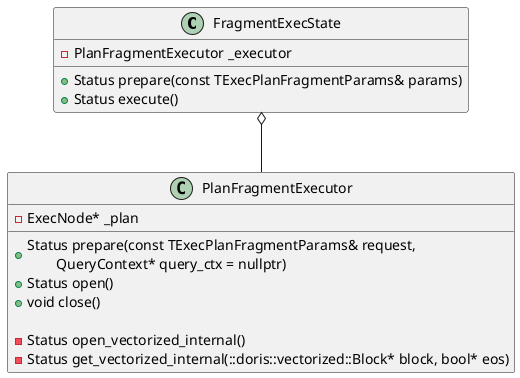
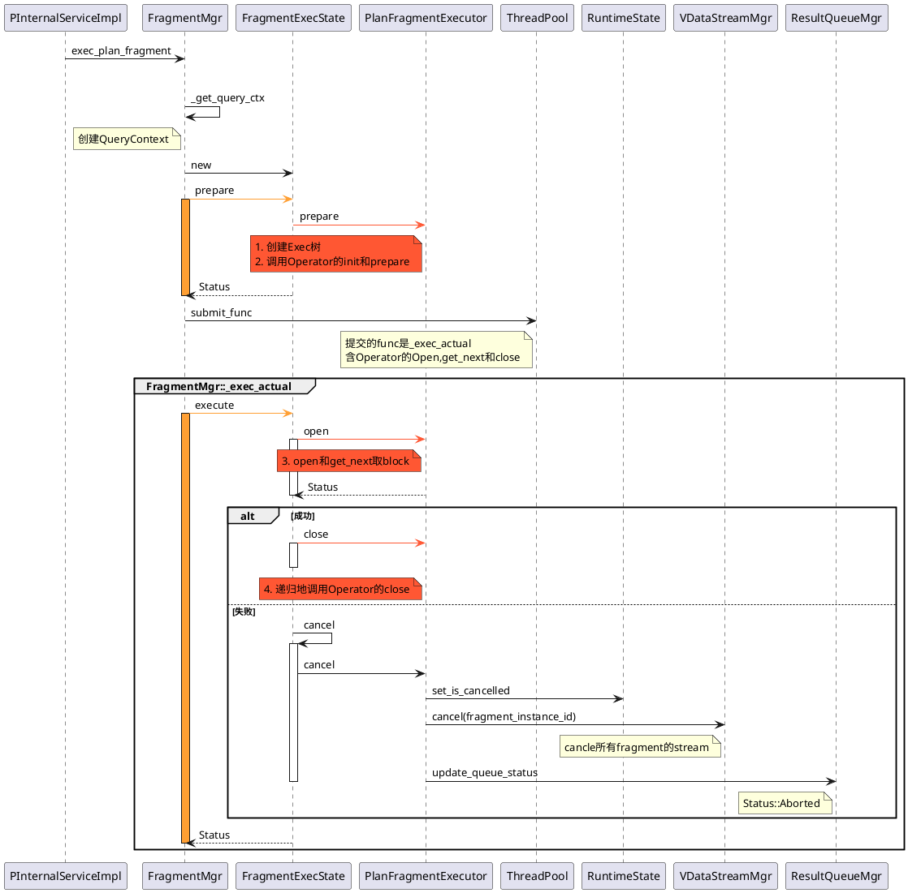
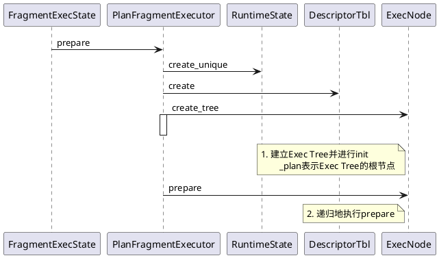
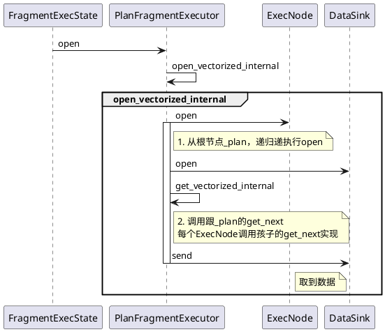
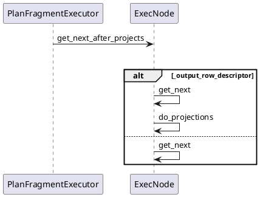
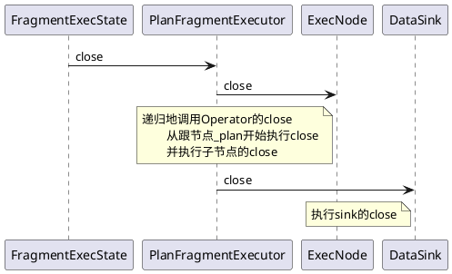

火山模型的调用入口是
```C++
FragmentMgr::exec_plan_fragment(const TExecPlanFragmentParams& params)
```

借助`FragmentExecState`完成整个生命周期调用，它拥有一个`PlanFragmentExecutor`，通过它实现：
1. `PlanFragmentExecutor::prepare`: 创建Exec Tree并init，参见`ExecNode::create_tree`；递归地执行Operator的`prepare`
2. `PlanFragmentExecutor::open`:执行算子的`open`和`get_next`
3. `PlanFragmentExecutor::close`:执行算子的`close`



# 主流程图


## Executor::prepare

`ExecNode:create_tree`参见[这里的 创建Exec树 章节](11_00_00_Exec_CreateTree.md)

## Executor::open


对于`PlanFragmentExecutor::get_vectorized_internal`


```C++
Status ExecNode::get_next_after_projects(
        RuntimeState* state, vectorized::Block* block, bool* eos,
        const std::function<Status(RuntimeState*, vectorized::Block*, bool*)>& func,
        bool clear_data) {
    if (_output_row_descriptor) {
        if (clear_data) {
            clear_origin_block();
        }
        auto status = func(state, &_origin_block, eos);
        if (UNLIKELY(!status.ok())) return status;
        return do_projections(&_origin_block, block);
    }
    _peak_memory_usage_counter->set(_mem_tracker->peak_consumption());
    return func(state, block, eos);
}
```

以`VSelectNode`为例
```C++
Status VSelectNode::get_next(RuntimeState* state, vectorized::Block* block, bool* eos) {
    SCOPED_TIMER(_runtime_profile->total_time_counter());
    RETURN_IF_CANCELLED(state);
    do {
        RETURN_IF_CANCELLED(state);
        // 调用孩子的get_next
        RETURN_IF_ERROR(_children[0]->get_next_after_projects(
            state, block, &_child_eos, std::bind((Status(ExecNode::*)
            (RuntimeState*, vectorized::Block*, bool*)) &ExecNode::get_next,
                _children[0], std::placeholders::_1, std::placeholders::_2,
                std::placeholders::_3)));
        if (_child_eos) {
            *eos = true;
            break;
        }
    } while (block->rows() == 0);

    return pull(state, block, eos);
}
```
# Executor::close


```C++
void PlanFragmentExecutor::close() {
    if (_closed) return;

    // 执行了prepare
    if (_runtime_state != nullptr) {
        // _runtime_state init failed
        if (_plan != nullptr) {
            _plan->close(_runtime_state.get());
        }

        if (_sink != nullptr) {
            if (_prepared) {
                Status status;
                {
                    std::lock_guard<std::mutex> l(_status_lock);
                    status = _status;
                }
                _sink->close(runtime_state(), status);
            } else {
                _sink->close(runtime_state(), Status::InternalError("prepare failed"));
            }
        }
    }

    // 如果没有prepare,直接close
    _closed = true;
}
```

```C++
Status ExecNode::close(RuntimeState* state) {
    if (_is_closed) {
        return Status::OK();
    }

    _is_closed = true;
    Status result;
    // 执行子节点的close
    for (int i = 0; i < _children.size(); ++i) {
        auto st = _children[i]->close(state);
        if (result.ok() && !st.ok()) {
            result = st;
        }
    }

    release_resource(state);
    return result;
}
```

# 后端相关配置参数
```C++
config::fragment_pool_thread_num_min
config::fragment_pool_thread_num_max
config::fragment_pool_queue_size

FragmentMgr::FragmentMgr(ExecEnv* exec_env){
    s = ThreadPoolBuilder("FragmentMgrThreadPool")
                .set_min_threads(config::fragment_pool_thread_num_min)
                .set_max_threads(config::fragment_pool_thread_num_max)
                .set_max_queue_size(config::fragment_pool_queue_size)
                .build(&_thread_pool);
```
