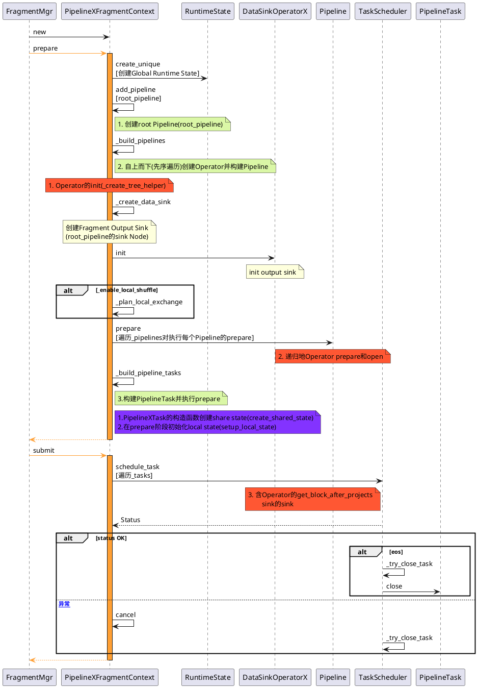
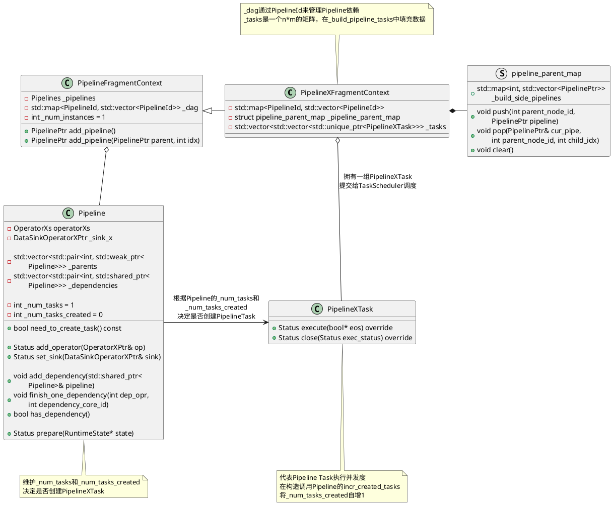
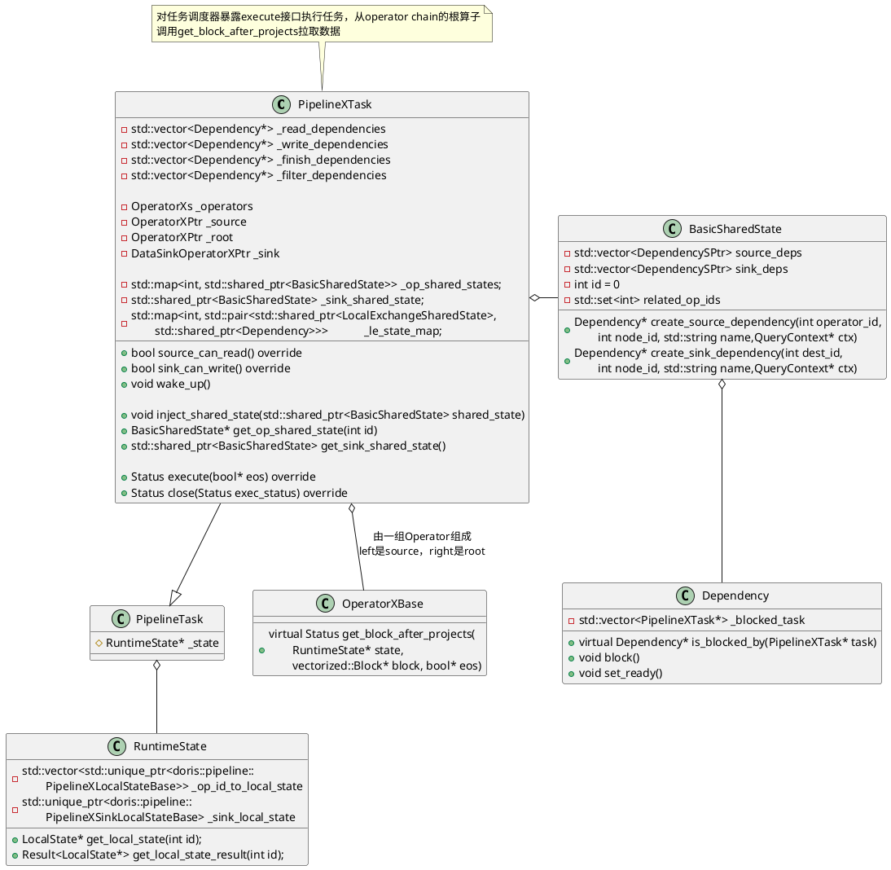
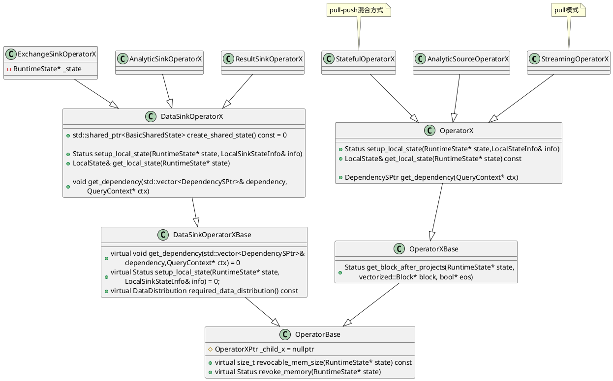
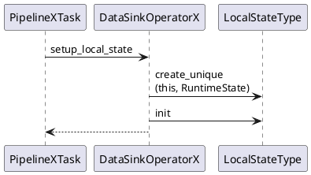
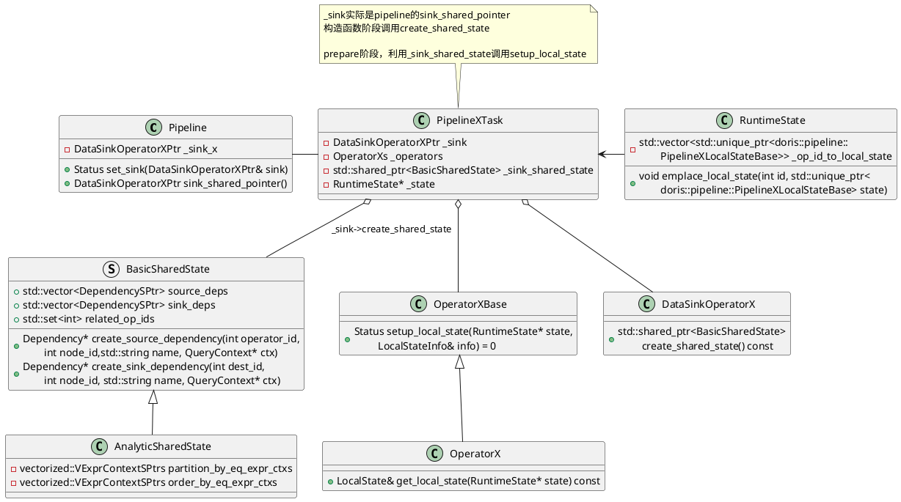
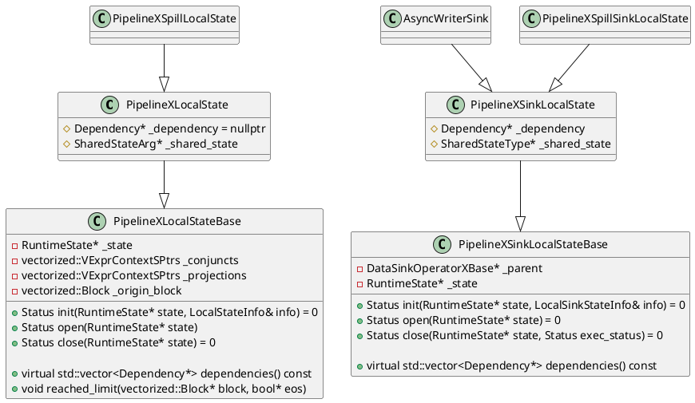

# 背景和目标
PipelineX 执行引擎 是 Doris 在 2.1 版本加入的实验性功能。目标是为了解决Doris pipeline引擎的四大问题：
1. 执行并发上，当前Doris执行并发收到两个因素的制约，一个是fe设置的参数，另一个是受存储层bucket数量的限制，这样的静态并发使得执行引擎无法充分利用机器资源。
2. 执行逻辑上，当前Doris有一些固定的额外开销，例如表达式部分各个instance彼此独立，而instance的初始化参数有很多公共部分，所以需要额外进行很多重复的初始化步骤。
3. 调度逻辑上，当前pipeline的调度器会把阻塞task全部放入一个阻塞队列中，由一个线程负责轮询并从阻塞队列中取出可执行task放入runnable队列，所以在有查询执行的过程中，会固定有一个核的资源作为调度的开销。
4. profile方面，目前pipeline无法为用户提供简单易懂的指标。

预期目标:
1. 执行并发上，<b><font color=33FF5E>依赖local exchange使pipelinex充分并发</font></b>，可以让数据被均匀分布到不同的task中，尽可能减少数据倾斜，此外，pipelineX也将不再受存储层tablet数量的制约。
2. 执行逻辑上，<b><font color=33FF5E>多个pipeline task共享同一个pipeline的全部共享状态</font></b>，例如表达式和一些const变量，<b><font color=33FF5E>消除了额外的初始化开销</font></b>。
3. 调度逻辑上，所有pipeline task的阻塞条件都使用Dependency进行了封装，通过外部事件(例如rpc完成)触发task的执行逻辑进入runnable队列，从而<b><font color=33FF5E>消除阻塞轮询线程的开销</font></b>。
4. profile：为用户提供简单易懂的指标。

# 使用接口
[Doris官网关于PipelineX的介绍](https://doris.apache.org/zh-CN/docs/query-acceleration/pipeline-x-execution-engine/)

用户接口变更,其中会话级参数

`enable_pipeline_x_engine` : 设置为true，则 BE在进行查询执行时就会默认将SQL的执行模型转变PipelineX的执行方式。
```sql
set enable_pipeline_x_engine = true;
```
`enable_local_shuffle` : 设置为true则打开local shuffle优化。local shuffle将尽可能将数据均匀分布给不同的pipeline task从而尽可能避免数据倾斜。
```sql
set enable_local_shuffle = true;
```

`ignore_storage_data_distribution` : 设置为true，则表示忽略存储层的数据分布。结合local shuffle一起使用，则pipelineX引擎的并发能力将不再受到存储层tablet数量的制约，从而充分利用机器资源。
```sql
set ignore_storage_data_distribution = true;
```

---
# 设计

存在的问题(动机)
> The PipelineX execution engine is an experimental feature in Doris 2.1.0, expected to address the four major issues of the Doris pipeline engine:
> 1. In terms of execution concurrency, Doris is currently constrained by two factors: one is the parameters set by FE, and the other is limited by the number of buckets. This concurrent strategy prevents the execution engine from fully utilizing machine resources.
> 2. In terms of execution logic, Doris currently has some fixed additional overhead. For example, the common expression for all instances will be initialized multiple times due to independence between all instances.
> 3. In terms of scheduling logic, the scheduler of the current pipeline will put all blocking tasks into a blocking queue, and a blocking queue scheduler will be responsible for polling and extracting executable tasks from the blocking queue and placing them in the runnable queue. Therefore, during the query execution process, a CPU core will always be occupied to do scheduling instead of execution.
> 4. In terms of profile, currently the pipeline cannot provide users concise and clear metrics.

要解决的问题(目标)
> 1. In terms of execution concurrency, pipelineX introduces local exchange optimization to fully utilize CPU resources, and distribute data evenly across different tasks to minimize data skewing. In addition, pipelineX will no longer be constrained by the number of tablets.
> 2. Logically, multiple pipeline tasks share all shared states of the same pipeline and eliminate additional initialization overhead, such as expressions and some const variables.
> 3. In terms of scheduling logic, the blocking conditions of all pipeline tasks are encapsulated using Dependency, and the execution logic of the tasks is triggered by external events (such as rpc completion) to enter the runnable queue, thereby eliminating the overhead of blocking polling threads.
> 4. Profile: Provide users with simple and easy to understand metrics

# 主流程




# PipelineXTask

PipelineXTask数据结构表达类图：


从算子执行层面，`get_block_after_projects`调用get_block接口实现算子计算
```C++
Status OperatorXBase::get_block_after_projects(
        RuntimeState* state, vectorized::Block* block, bool* eos) {
    auto local_state = state->get_local_state(operator_id());
    if (_output_row_descriptor) {
        local_state->clear_origin_block();
        auto status = get_block(state, &local_state->_origin_block, eos);
        if (UNLIKELY(!status.ok())) return status;
        return do_projections(state, &local_state->_origin_block, block);
    }
    return get_block(state, block, eos);
}
```

在执行算子方面，Pipelinex采取的pull-push混合模型。source算子直接继承`OperatorX`并实现`get_block`接口,`StreamingOperatorX`实现了`get_block`接口pull方式拉取数据，`StatefulOperatorX`也实现了`get_block`通过pull-push混合的方式计算。


`PipelineXTask::prepare`中进行LocalState的初始化

# state





# 参考资料
1. [Doris PipeplineX Execution Engine](https://cwiki.apache.org/confluence/display/DORIS/DSIP-035%3A+PipelineX+Execution+Engine)