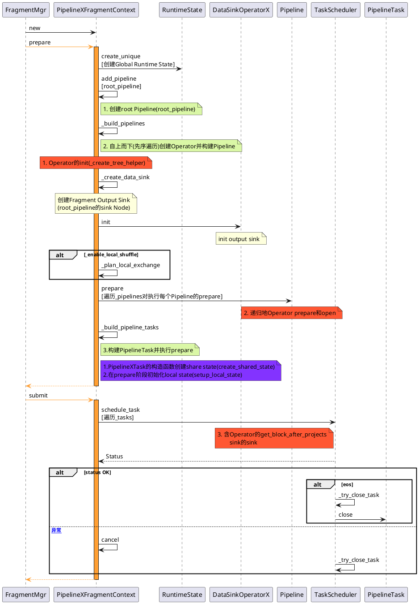
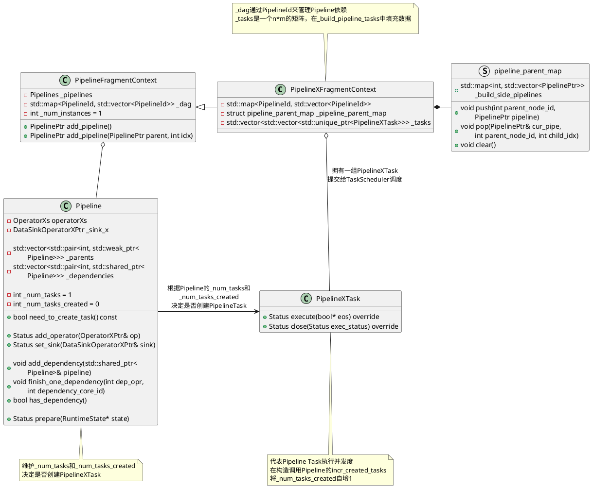
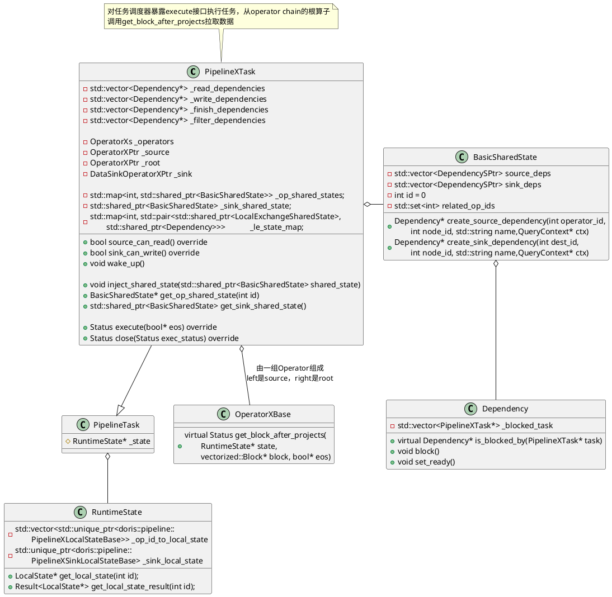
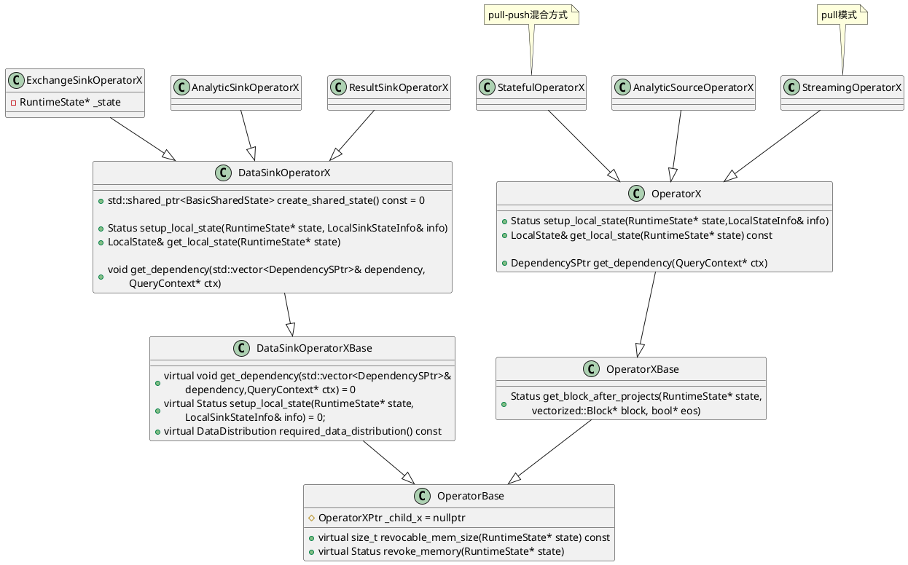
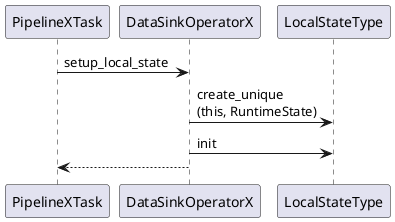
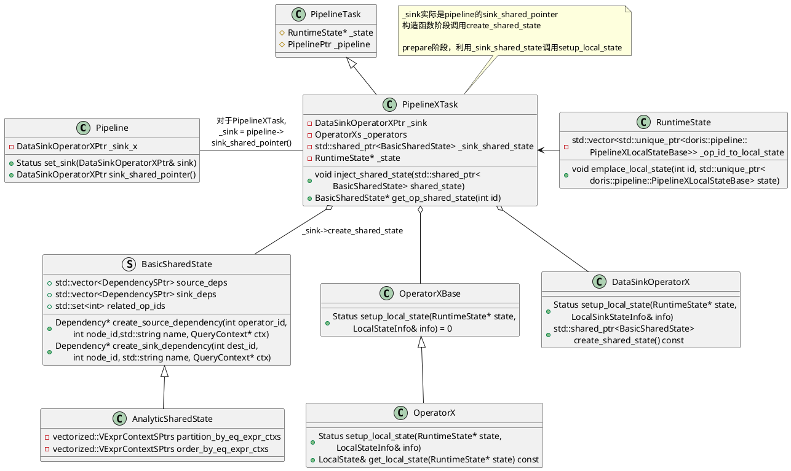
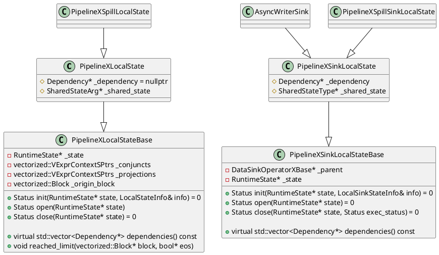
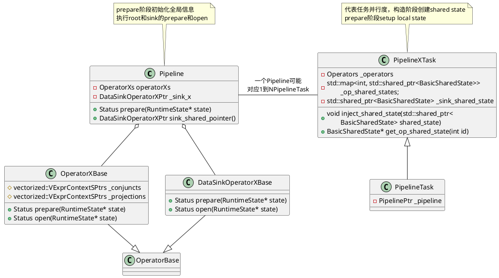

# 背景和目标
PipelineX 执行引擎 是 Doris 在 2.1 版本加入的实验性功能。目标是为了解决Doris pipeline引擎的四大问题：
1. 执行并发上，当前Doris执行并发收到两个因素的制约，一个是fe设置的参数，另一个是受存储层bucket数量的限制，这样的静态并发使得执行引擎无法充分利用机器资源。
2. 执行逻辑上，当前Doris有一些固定的额外开销，例如表达式部分各个instance彼此独立，而instance的初始化参数有很多公共部分，所以需要额外进行很多重复的初始化步骤。
3. 调度逻辑上，当前pipeline的调度器会把阻塞task全部放入一个阻塞队列中，由一个线程负责轮询并从阻塞队列中取出可执行task放入runnable队列，所以在有查询执行的过程中，会固定有一个核的资源作为调度的开销。
4. profile方面，目前pipeline无法为用户提供简单易懂的指标。

预期目标:
1. 执行并发上，<b><font color=33FF5E>依赖local exchange使pipelinex充分并发</font></b>，可以让数据被均匀分布到不同的task中，尽可能减少数据倾斜，此外，pipelineX也将不再受存储层tablet数量的制约。
2. 执行逻辑上，<b><font color=33FF5E>多个pipeline task共享同一个pipeline的全部共享状态</font></b>，例如表达式和一些const变量，<b><font color=33FF5E>消除了额外的初始化开销</font></b>。
3. 调度逻辑上，所有pipeline task的阻塞条件都使用Dependency进行了封装，通过外部事件(例如rpc完成)触发task的执行逻辑进入runnable队列，从而<b><font color=33FF5E>消除阻塞轮询线程的开销</font></b>。
4. profile：为用户提供简单易懂的指标。

## 使用接口
[Doris官网关于PipelineX的介绍](https://doris.apache.org/zh-CN/docs/query-acceleration/pipeline-x-execution-engine/)

上述改造存在一些用户接口变更, 其中会话级参数

`enable_pipeline_x_engine` : 设置为true，则 BE在进行查询执行时就会默认将SQL的执行模型转变PipelineX的执行方式。
```sql
set enable_pipeline_x_engine = true;
```
`enable_local_shuffle` : 设置为true则打开local shuffle优化。local shuffle将尽可能将数据均匀分布给不同的pipeline task从而尽可能避免数据倾斜。
```sql
set enable_local_shuffle = true;
```

`ignore_storage_data_distribution` : 设置为true，则表示忽略存储层的数据分布。结合local shuffle一起使用，则pipelineX引擎的并发能力将不再受到存储层tablet数量的制约，从而充分利用机器资源。
```sql
set ignore_storage_data_distribution = true;
```

# 主流程




# PipelineXTask

PipelineXTask数据结构表达类图：


从算子执行层面，`get_block_after_projects`调用get_block接口实现算子计算
```C++
Status OperatorXBase::get_block_after_projects(
        RuntimeState* state, vectorized::Block* block, bool* eos) {
    auto local_state = state->get_local_state(operator_id());
    if (_output_row_descriptor) {
        local_state->clear_origin_block();
        auto status = get_block(state, &local_state->_origin_block, eos);
        if (UNLIKELY(!status.ok())) return status;
        return do_projections(state, &local_state->_origin_block, block);
    }
    return get_block(state, block, eos);
}
```

在执行算子方面，Pipelinex采取的pull-push混合模型。source算子直接继承`OperatorX`并实现`get_block`接口,`StreamingOperatorX`实现了`get_block`接口pull方式拉取数据，`StatefulOperatorX`也实现了`get_block`通过pull-push混合的方式计算。


`PipelineXTask::prepare`中进行LocalState的初始化

# state




# 完成改造目标的设计实现
这里主要从2.1为实现改造目标所做的设计实现工作，更多是从2.0版本的Pipeline到2.1版本的PipelineX的对比，梳理一个发展历程。

## 执行流程改造
执行流程的改造主要是为了降低了初始化的额外开销，
1. pipeline会启动多个线程同时对多个instance进行初始化的开销
2. 全局const变量初始化在多个instance中重复初始化的开销
<center>
    
</center>

---
首先，对其存在的问题复现描述:

2.0版本的Pipeline在`FragmentMgr`将任务借助`pipeline::PipelineFragmentContext`提交到任务调度器，将每个Instance都作为一个Pipeline处理，每个Pieline对应一个Pipeline Task来调度执行，此外会使用线程池中线程处理
```C++
// 删除一些异常处理和无关变量初始化来了解主要执行流程
Status FragmentMgr::exec_plan_fragment(const TPipelineFragmentParams& params,
                                       const FinishCallback& cb) {
    // 1. Pipeline执行主要含prepare和sumit两大步骤
    //    封装Pipeline任务构建和提交
    auto pre_and_submit = [&](int i) {
        // local_params是TPipelineInstanceParams，是一个instance
        // !!! 也就是说Pipeline将每个instance都作为一个Pipeline处理
        const auto& local_params = params.local_params[i];
                        ......
        std::shared_ptr<pipeline::PipelineFragmentContext> context =
                std::make_shared<pipeline::PipelineFragmentContext>(......);
        // 1.1 构造Pipeline和PipelineTask
        auto prepare_st = context->prepare(params, i);
                        ......
        // 1.2 将PipelineTask提交到任务调度器
        return context->submit();
    };

    int target_size = params.local_params.size();
    if (target_size > 1) {
                        ......
        for (size_t i = 0; i < target_size; i++) {
            // 2. 将封装的Pipeline任务构建和提交操作提交到线程池执行
            // !!! 启动多个线程对instance初始化
            RETURN_IF_ERROR(_thread_pool->submit_func([&, i]() {
                prepare_status[i] = pre_and_submit(i);
                        ......   
            }));
        }
                        ......   
        return Status::OK();
    } else {
        return pre_and_submit(0);
    }
}
```
这里在本地节点存在多个并行子计划执行，会存在重复的多个instance的初始化的开销(pipelinex task仅持有一些运行时状态(即local state)，全局信息则由多个task共享的同一个pipeline对象持有(即global state)。

pipelinex对共享的状态做了复用，对比较重的global state只做一次，对更轻量的local state进行串行初始化。取消了启动多个线程对instance初始化，对local state初始化串行。

---
PipelineX的执行流程改造，优化解决上述问题。首先了解在`FragmentMgr`中取消多线程初始化的实现
```C++
// 删除一些异常处理和无关变量初始化来了解主要执行流程
Status FragmentMgr::exec_plan_fragment(const TPipelineFragmentParams& params,
                                       const FinishCallback& cb) {
    const bool enable_pipeline_x = 
            params.query_options.__isset.enable_pipeline_x_engine &&
            params.query_options.enable_pipeline_x_engine;
    if (enable_pipeline_x) {
        // PipelineX执行引擎
        std::shared_ptr<pipeline::PipelineFragmentContext> context =
                std::make_shared<pipeline::PipelineXFragmentContext>(......);
        // 1.1 构建Pipeline,用request.fragment.plan.nodes构建非instance
        //     初始化global state(source)
        //     构建PipelineTask
        auto prepare_st = context->prepare(params);
                        ......

        // 1.2 将PipelinexTask提交到任务调度器
        RETURN_IF_ERROR(context->submit());
        return Status::OK();
    }
}
```

pipelinex task仅持有一些运行时状态(即local state)，全局信息则由多个task共享的同一个pipeline对象持有(即global state)


```C++
// prepare阶段初始化全局信息
Status PipelineXFragmentContext::prepare(const doris::TPipelineFragmentParams& request) {
                ......
    // 4. Initialize global states in pipelines.
    for (PipelinePtr& pipeline : _pipelines) {
        pipeline->children().clear();
        RETURN_IF_ERROR(pipeline->prepare(_runtime_state.get()));
    }
                ......
    return Status::OK();
}

Status Pipeline::prepare(RuntimeState* state) {
    RETURN_IF_ERROR(operatorXs.back()->prepare(state));
    RETURN_IF_ERROR(operatorXs.back()->open(state));
    RETURN_IF_ERROR(_sink_x->prepare(state));
    RETURN_IF_ERROR(_sink_x->open(state));
    return Status::OK();
}
```

```C++
Status OperatorXBase::prepare(RuntimeState* state) {
    for (auto& conjunct : _conjuncts) {
        RETURN_IF_ERROR(conjunct->prepare(state, intermediate_row_desc()));
    }
    RETURN_IF_ERROR(vectorized::VExpr::prepare(_projections,
            state, intermediate_row_desc()));

    if (_child_x && !is_source()) {
        RETURN_IF_ERROR(_child_x->prepare(state));
    }
    return Status::OK();
}

Status OperatorXBase::open(RuntimeState* state) {
    for (auto& conjunct : _conjuncts) {
        RETURN_IF_ERROR(conjunct->open(state));
    }
    RETURN_IF_ERROR(vectorized::VExpr::open(_projections, state));
    if (_child_x && !is_source()) {
        RETURN_IF_ERROR(_child_x->open(state));
    }
    return Status::OK();
}
```

## 调度逻辑开销改造

# 参考资料
1. [Doris PipeplineX Execution Engine](https://cwiki.apache.org/confluence/display/DORIS/DSIP-035%3A+PipelineX+Execution+Engine)