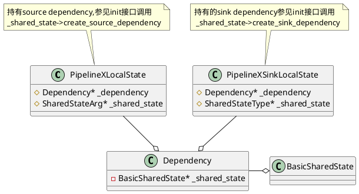
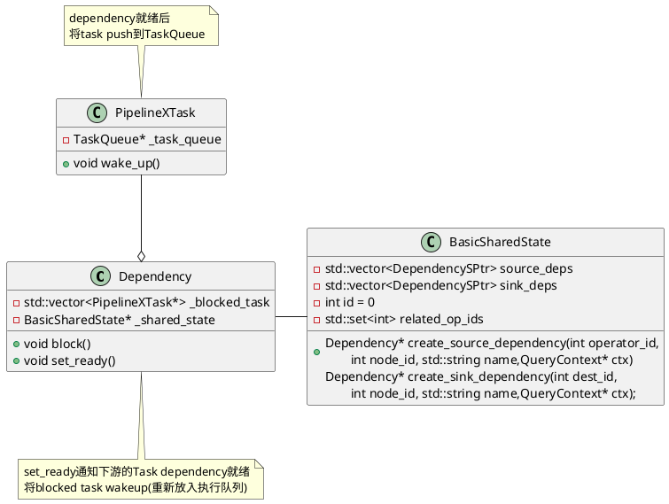
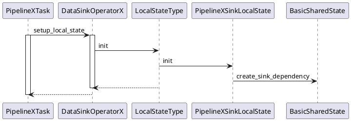
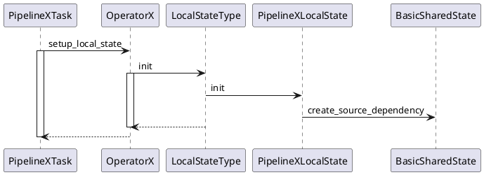

# 设计
从对应关系上分为四类：

1对1dependency：一个上游pipeline task的dependency和一个下游pipeline task的dependency之间通过一个建立阻塞/运行关系，典型例子：一个AggSourceDependency对应一个AggSinkDependency
<center>
    
</center>
1对多dependency：一个上游pipeline task的dependency和多个下游pipeline task的dependency之间通过多个dependency建立阻塞/运行关系，典型例子：一个MultiCastSinkDependency对应多个MultiCastSourceDependency
<center>
    
</center>

多对1dependency：多个上游pipeline task和1个下游pipeline task之间通过多个dependency建立阻塞/运行关系，典型例子：多个UnionSinkDependency/SetSinkDependency对应一个UnionSourceDependency/SetSourceDependency
<center>
    
</center>

多对多dependency：多个上游pipeline task和多个下游pipeline task之间通过多个dependency建立阻塞/运行关系，典型例子：LocalExchangeSourceDependency/LocalExchangeSinkDependency
<center>
    
</center>

# 实现




```C++
PipelineXTask::PipelineXTask(PipelinePtr& pipeline, ......)
        : PipelineTask(pipeline, task_id, state, fragment_context, parent_profile),
          _source(pipeline->source_shared_pointer()),   
          _sink(pipeline->sink_shared_pointer()), ......) {
            ......
    // 创建shared state
    auto shared_state = _sink->create_shared_state();
    if (shared_state) {
        _sink_shared_state = shared_state;
    }

    // 创建的Pipeline Task(_num_tasks_created)自增1
    pipeline->incr_created_tasks();
}
```
```C++
Status PipelineXTask::prepare(const TPipelineInstanceParams& local_params,
        const TDataSink& tsink, QueryContext* query_ctx) {
    // 1. setup sink local state
    {
        LocalSinkStateInfo info {_task_idx, _task_profile.get(),
            local_params.sender_id, get_sink_shared_state().get(),
            _le_state_map, tsink};
        RETURN_IF_ERROR(_sink->setup_local_state(_state, info));
    }

    std::vector<TScanRangeParams> no_scan_ranges;
    auto scan_ranges = find_with_default(local_params.per_node_scan_ranges,
            _operators.front()->node_id(), no_scan_ranges);
    auto* parent_profile = _state->get_sink_local_state()->profile();
    query_ctx->register_query_statistics(
            _state->get_sink_local_state()->get_query_statistics_ptr());

    for (int op_idx = _operators.size() - 1; op_idx >= 0; op_idx--) {
        auto& op = _operators[op_idx];
        LocalStateInfo info {parent_profile, scan_ranges,
                get_op_shared_state(op->operator_id()),
                _le_state_map, _task_idx};
        RETURN_IF_ERROR(op->setup_local_state(_state, info));
        parent_profile = _state->get_local_state(op->operator_id())->profile();
        query_ctx->register_query_statistics(
                _state->get_local_state(op->operator_id())->get_query_statistics_ptr());
    }

    _block = doris::vectorized::Block::create_unique();
    RETURN_IF_ERROR(_extract_dependencies());
    set_state(PipelineTaskState::RUNNABLE);
    _prepared = true;
    return Status::OK();
}
```
`PipelineXTask::prepare`



PipelineX如何实现多个pipeline task共享同一个pipeline的全部共享状态，例如表达式和一些const变量，消除了额外的初始化开销。

```C++
struct AnalyticSharedState : public BasicSharedState {
public:
    AnalyticSharedState() = default;

    int64_t current_row_position = 0;
    vectorized::BlockRowPos partition_by_end;
    vectorized::VExprContextSPtrs partition_by_eq_expr_ctxs;
    int64_t input_total_rows = 0;
    vectorized::BlockRowPos all_block_end;
    std::vector<vectorized::Block> input_blocks;
    bool input_eos = false;
    vectorized::BlockRowPos found_partition_end;
    std::vector<int64_t> origin_cols;
    vectorized::VExprContextSPtrs order_by_eq_expr_ctxs;
    std::vector<int64_t> input_block_first_row_positions;
    std::vector<std::vector<vectorized::MutableColumnPtr>> agg_input_columns;


    std::vector<int64_t> partition_by_column_idxs;
    std::vector<int64_t> ordey_by_column_idxs;
};
```