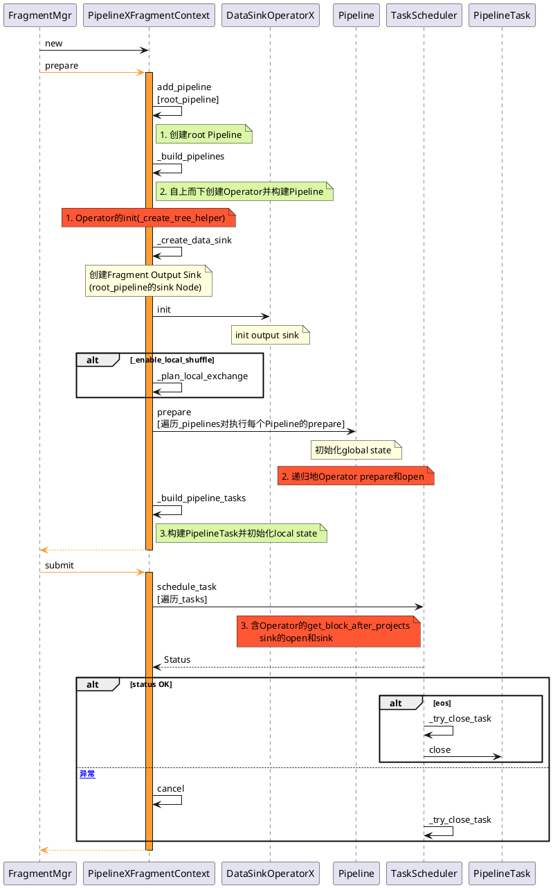
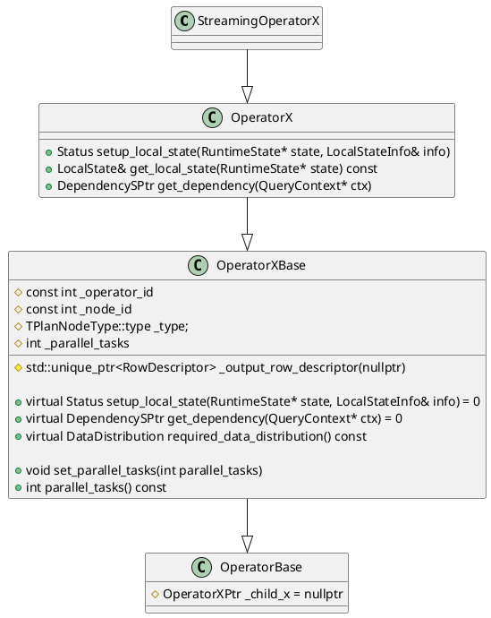

```plantuml
@startuml
FragmentMgr -> PipelineXFragmentContext:new
FragmentMgr -[#FF9F33]> PipelineXFragmentContext:prepare
activate PipelineXFragmentContext #FF9F33
PipelineXFragmentContext -> PipelineXFragmentContext:add_pipeline\n[root_pipeline]
note right of PipelineXFragmentContext #DAF7A6 : 1. 创建root Pipeline

PipelineXFragmentContext -> PipelineXFragmentContext:_build_pipelines
note right of PipelineXFragmentContext #DAF7A6 : 2. 自上而下创建Operator并构建Pipeline
note over of PipelineXFragmentContext #FF5733 : 1. Operator的init(_create_tree_helper)

PipelineXFragmentContext -> PipelineXFragmentContext:_create_data_sink
note over of PipelineXFragmentContext: 创建Fragment Output Sink\n(root_pipeline的sink Node)

PipelineXFragmentContext -> DataSinkOperatorX:init
note over of DataSinkOperatorX : init output sink

alt _enable_local_shuffle
PipelineXFragmentContext -> PipelineXFragmentContext:_plan_local_exchange
end

PipelineXFragmentContext -> Pipeline:prepare\n[遍历_pipelines对执行每个Pipeline的prepare]
note over of Pipeline: 初始化global state
note over of Pipeline #FF5733 : 2. 递归地Operator prepare和open

PipelineXFragmentContext -> PipelineXFragmentContext :_build_pipeline_tasks
note right of PipelineXFragmentContext #DAF7A6 : 3.构建PipelineTask并初始化local state

PipelineXFragmentContext -[#FF9F33]-> FragmentMgr
deactivate PipelineXFragmentContext

FragmentMgr -[#FF9F33]> PipelineXFragmentContext:submit
activate PipelineXFragmentContext #FF9F33
PipelineXFragmentContext -> TaskScheduler:schedule_task\n[遍历_tasks]
note left of TaskScheduler #FF5733 : 3. 含Operator的get_block_after_projects\n\tsink的open和sink
TaskScheduler --> PipelineXFragmentContext : Status
alt status OK
    alt eos
        TaskScheduler -> TaskScheduler:_try_close_task
        TaskScheduler -> PipelineTask:close
    end
else [异常]
    PipelineXFragmentContext -> PipelineXFragmentContext:cancel
    TaskScheduler -> TaskScheduler:_try_close_task
end
PipelineXFragmentContext -[#FF9F33]-> FragmentMgr
deactivate PipelineXFragmentContext
@enduml
```

```plantuml
@startuml
class StreamingOperatorX {

}

class OperatorX {
    + Status setup_local_state(RuntimeState* state, LocalStateInfo& info)
    + LocalState& get_local_state(RuntimeState* state) const
    + DependencySPtr get_dependency(QueryContext* ctx)
}

class OperatorXBase {
    # const int _operator_id
    # const int _node_id
    # TPlanNodeType::type _type;
    # int _parallel_tasks
    # std::unique_ptr<RowDescriptor> _output_row_descriptor(nullptr)

    + virtual Status setup_local_state(RuntimeState* state, LocalStateInfo& info) = 0
    + virtual DependencySPtr get_dependency(QueryContext* ctx) = 0
    + virtual DataDistribution required_data_distribution() const

    + void set_parallel_tasks(int parallel_tasks)
    + int parallel_tasks() const
}

class OperatorBase {
    # OperatorXPtr _child_x = nullptr
}

StreamingOperatorX -down-|> OperatorX
OperatorX -down-|> OperatorXBase
OperatorXBase -down-|> OperatorBase
@enduml
```
# 参考资料
1. [Doris PipeplineX Execution Engine](https://cwiki.apache.org/confluence/display/DORIS/DSIP-035%3A+PipelineX+Execution+Engine)