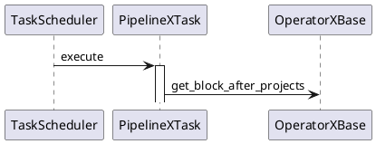
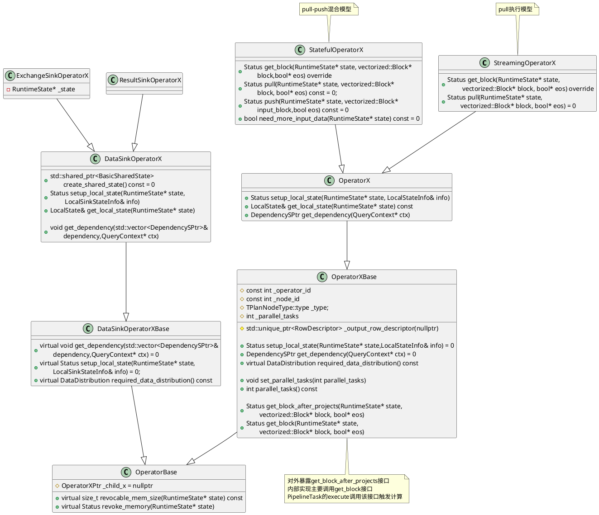
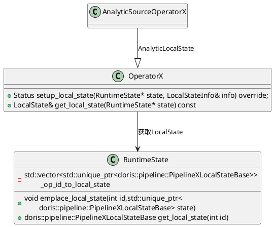
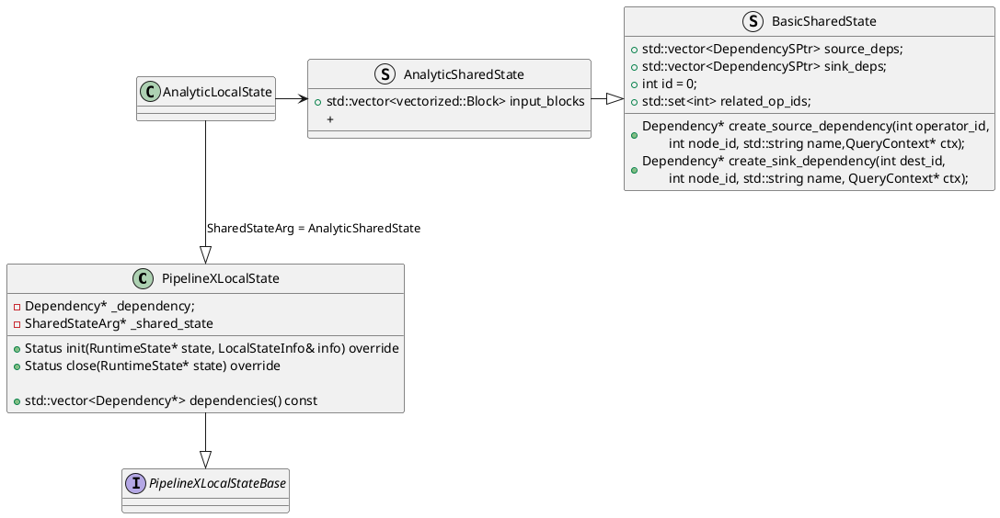
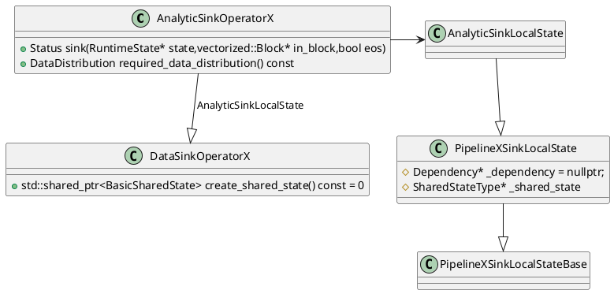
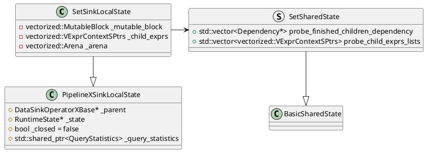
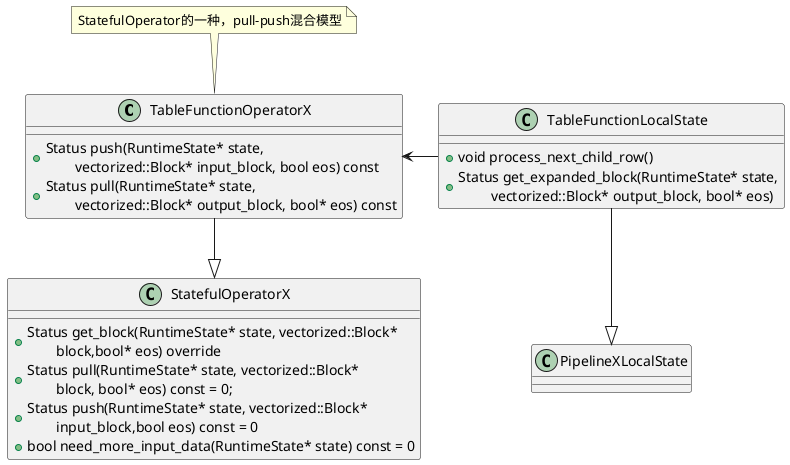
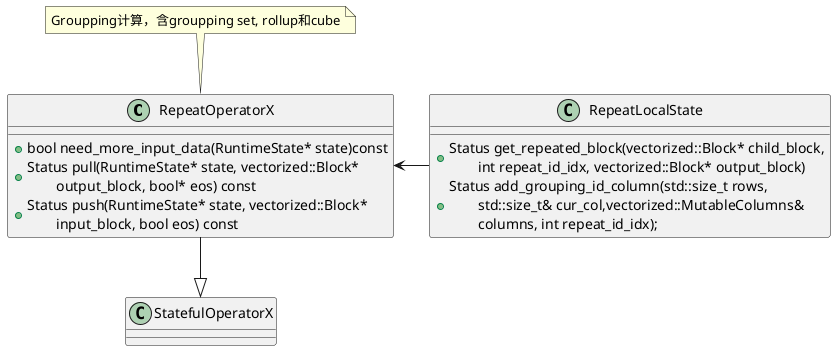

基于2.1.2-rc04分支


# Operator
算子的基本数据结构类图表示：



```C++
class PipelineXSinkLocalState : public PipelineXSinkLocalStateBase {
protected:
    DependencyType* _dependency = nullptr;
    typename DependencyType::SharedState* _shared_state = nullptr;
}

class PipelineXSpillSinkLocalState : public PipelineXSinkLocalState<SharedStateArg>

class AsyncWriterSink : public PipelineXSinkLocalState<FakeSharedState>
```

# 窗口






# 集合运算
对于`INTERSECT`，`EXCEPT`运算



# TableFunction


## Groupping
