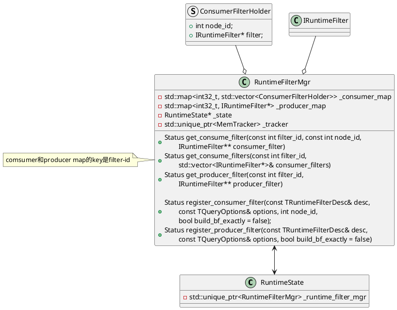

```C++
Status PipelineFragmentContext::prepare(
    const doris::TPipelineFragmentParams& request, const size_t idx) {
            .....
    // 1. init _runtime_state
    _runtime_state = RuntimeState::create_unique(...);
    _runtime_state->runtime_filter_mgr()->init();
            .....
}
```