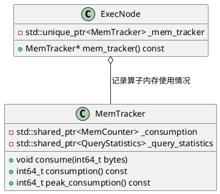

```plantuml
@startuml
class ExecNode {
    - std::unique_ptr<MemTracker> _mem_tracker
    + MemTracker* mem_tracker() const
}

class MemTracker {
    - std::shared_ptr<MemCounter> _consumption
    - std::shared_ptr<QueryStatistics> _query_statistics

    + void consume(int64_t bytes)
    + int64_t consumption() const
    + int64_t peak_consumption() const
}

MemTracker -up-o ExecNode : 记录算子内存使用情况 
@enduml
```
