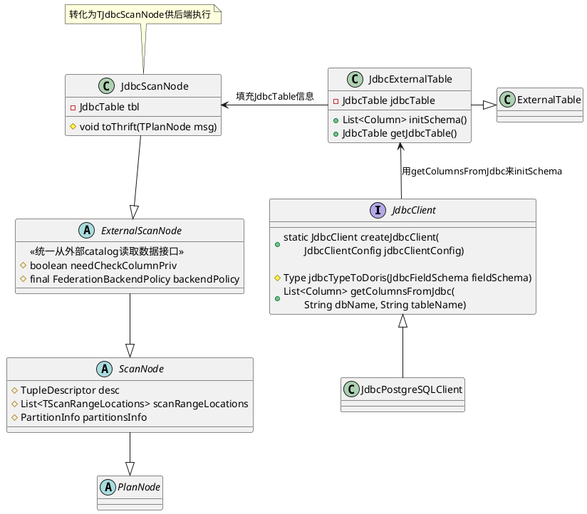
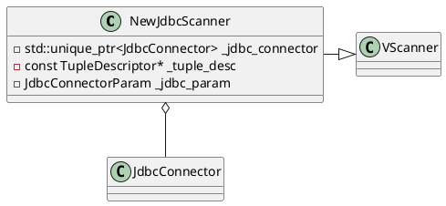

# 前端

```plantuml
@startuml
interface JdbcClient {
    + static JdbcClient createJdbcClient(\n\tJdbcClientConfig jdbcClientConfig)

    # Type jdbcTypeToDoris(JdbcFieldSchema fieldSchema)
    + List<Column> getColumnsFromJdbc(\n\tString dbName, String tableName)
}

class JdbcExternalTable {
    - JdbcTable jdbcTable

    + List<Column> initSchema()
    + JdbcTable getJdbcTable()
}

class JdbcScanNode {
    - JdbcTable tbl
    # void toThrift(TPlanNode msg)
}
note top: 转化为TJdbcScanNode供后端执行

abstract class ExternalScanNode {
    << 统一从外部catalog读取数据接口 >>
    # boolean needCheckColumnPriv
    # final FederationBackendPolicy backendPolicy
}

abstract class ScanNode {
    # TupleDescriptor desc
    # List<TScanRangeLocations> scanRangeLocations
    # PartitionInfo partitionsInfo
}

abstract class PlanNode {

}

JdbcPostgreSQLClient -up-|> JdbcClient
JdbcExternalTable <-- JdbcClient : 用getColumnsFromJdbc来initSchema
JdbcExternalTable -left-> JdbcScanNode : 填充JdbcTable信息
JdbcScanNode -down-|> ExternalScanNode
ExternalScanNode -down-|> ScanNode
ScanNode -down-|> PlanNode

JdbcExternalTable -right-|> ExternalTable
@enduml
```

# 执行算子

```plantuml
@startuml
class NewJdbcScanner {
    - std::unique_ptr<JdbcConnector> _jdbc_connector
    - const TupleDescriptor* _tuple_desc
    - JdbcConnectorParam _jdbc_param
}
NewJdbcScanner -right-|> VScanner
JdbcConnector -up-o NewJdbcScanner
@enduml
```