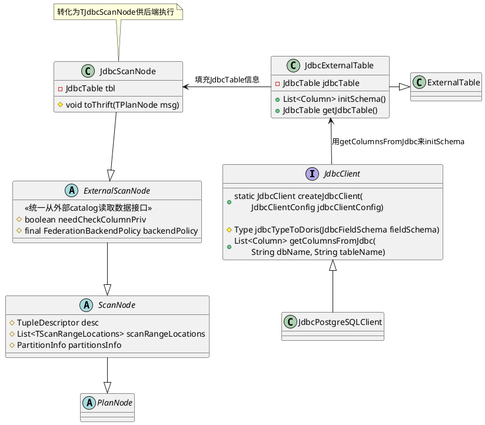
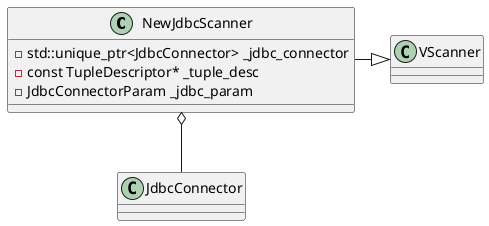

多源数据目录（Multi-Catalog）功能，旨在能够更方便对接外部数据目录，以增强doris的数据湖分析和联邦数据查询能力。Catalog可以直接对应到外部数据目录，解决`create external table`和`create external database`需要手动进行一一映射的问题，构成Catalog -> Database -> Table的三层元数据层级
- InternalCatalog: doris原有的db和table归属于InternalCatalog
- ExternalCatalog: 外部数据源的catalog，支持
    - Apache Hive
    - Apache Iceberg
    - Apache Hudi
    - Elasticsearch
    - Apache Paimon
    - JDBC Catalog，通过标准JDBC协议连接数据源，Doris会自动同步数据源下的Database和Table元数据，以便快速访问这些外部数据，支持 MySQL、PostgreSQL、Oracle、SQLServer、Clickhouse、Doris、SAP HANA、Trino/Presto、OceanBase等。
    - 等等

# 前端

# 执行算子
