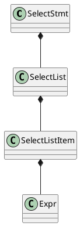

开启新的查询优化器

```shell
SET enable_nereids_planner=true;
# 自动回退到旧版查询优化
SET enable_fallback_to_original_planner=true;
```

# 查询优化配置参数

Doris支持设置一些会话级参数，了解一些查询优化相关的配置参数

```shell
SET enable_dphyp_optimizer=true;
SET enable_dphyp_trace=true;
```

```shell
# 默认为false
SET plan_nereids_dump=true;

# 默认为false,在选择plan前打印Memo(参见NereidsPlanner::plan)
SET dump_nereids_memo=true;

# 默认值为1
SET nth_optimized_plan=XX;
```

SQL进入Doris会进行SQL解析，Doris采用Java CUP Parser，语法规则定义在 `sql_parser.cup`，SQL语句会被解析为抽象语法树(AST)，例如常见的SELECT语句被解析为`SelectStmt`。


# 主流程

`ConnectProcessor`的`handleQuery`接口负责实现对Query查询的处理，这开始对Nereids全新查询优化器的调用，删除一些非重点和异常处理代码了解Nereids查询优化器的主调用流程

```java
private void handleQuery(MysqlCommand mysqlCommand) {        
    // 1. convert statement to Java string
    // packetBuf表示从channel读到的一包数据
    byte[] bytes = packetBuf.array(); 
    int ending = packetBuf.limit() - 1;
    while (ending >= 1 && bytes[ending] == '\0') ending--;
    String originStmt = new String(bytes, 1, ending, StandardCharsets.UTF_8);
    
	// 2. Nereids处理Query Command, do not support prepare and execute now
    if (mysqlCommand == MysqlCommand.COM_QUERY &&
        ctx.getSessionVariable().isEnableNereidsPlanner()) {
        // 2.1 Nereids parser解析
        // 	采用的是Java CUP Parser, 语法规则定义在sql_parser.cup
        stmts = new NereidsParser().parseSQL(originStmt);
    }
    
    List<String> origSingleStmtList = null;
    if (stmts.size() > 1) { // split originStmt to multi singleStmts
        origSingleStmtList = SqlUtils.splitMultiStmts(originStmt);
    }
    
    for (int i = 0; i < stmts.size(); ++i) {
        StatementBase parsedStmt = stmts.get(i);
        parsedStmt.setOrigStmt(new OriginStatement(originStmt, i));
        parsedStmt.setUserInfo(ctx.getCurrentUserIdentity());
        // parsedStmt表示StmtExecutor中的LogicalPlanAdapter
        // 参见StmtExecutor构造
        executor = new StmtExecutor(ctx, parsedStmt);
        ctx.setExecutor(executor);

        // 2.2 execute By Nereids
        executor.execute();
        if (i != stmts.size() - 1) {
            ctx.getState().serverStatus |= MysqlServerStatusFlag.SERVER_MORE_RESULTS_EXISTS;
            if (ctx.getState().getStateType() != MysqlStateType.ERR) {
                finalizeCommand();
            }
        }
        // execute failed, skip remaining stmts
        if (ctx.getState().getStateType() == MysqlStateType.ERR) break;
    }
}
```

`StmtExecutor.java`

```java
public void execute() throws Exception {
    UUID uuid = UUID.randomUUID();
    TUniqueId queryId = new TUniqueId(uuid.getMostSignificantBits(), uuid.getLeastSignificantBits());
    execute(queryId);
}

public void execute(TUniqueId queryId) throws Exception {
    if (parsedStmt instanceof LogicalPlanAdapter
            || (parsedStmt == null && sessionVariable.isEnableNereidsPlanner())) {
        executeByNereids(queryId);
    }
}

private void executeByNereids(TUniqueId queryId) throws Exception {
    parseByNereids();
    LogicalPlan logicalPlan = ((LogicalPlanAdapter) parsedStmt).getLogicalPlan();
    if (logicalPlan instanceof Command) {
        // 
    } else {
        // 创建NereidsPlanner并调用plan进行analyze和optimize
        planner = new NereidsPlanner(statementContext);
        planner.plan(parsedStmt, context.getSessionVariable().toThrift()/*TQueryOptions*/);
        checkBlockRules();
        handleQueryWithRetry(queryId);
    }
}
```

接下来，了解一下`NereidsPlanner`的`plan`实现

```java
@Override
public void plan(StatementBase queryStmt, org.apache.doris.thrift.TQueryOptions queryOptions) {
    LogicalPlanAdapter logicalPlanAdapter = (LogicalPlanAdapter) queryStmt;
    ExplainLevel explainLevel = getExplainLevel(queryStmt.getExplainOptions());
    LogicalPlan parsedPlan = logicalPlanAdapter.getLogicalPlan();
    setParsedPlan(parsedPlan);
    
    // 1. 初始化Require属性为PhysicalProperties.GATHER
    PhysicalProperties requireProperties = buildInitRequireProperties();

    // 2. Do analyze and optimize for query plan,实现流程参见下面
    Plan resultPlan = plan(parsedPlan, requireProperties, explainLevel);
    statementContext.getStopwatch().stop();
    setOptimizedPlan(resultPlan);
    if (explainLevel.isPlanLevel) return;
   
    // 3. translate PhysicalPlan to PlanFragment
    physicalPlan = (PhysicalPlan) resultPlan;
    PlanTranslatorContext planTranslatorContext = new PlanTranslatorContext(cascadesContext);
    PhysicalPlanTranslator physicalPlanTranslator = new PhysicalPlanTranslator(planTranslatorContext,
            statementContext.getConnectContext().getStatsErrorEstimator());
    if (cascadesContext.getConnectContext().getSessionVariable().isPlayNereidsDump()) return;
    PlanFragment root = physicalPlanTranslator.translatePlan(physicalPlan);

    scanNodeList.addAll(planTranslatorContext.getScanNodes());
    descTable = planTranslatorContext.getDescTable();
    fragments = new ArrayList<>(planTranslatorContext.getPlanFragments());
    for (int seq = 0; seq < fragments.size(); seq++) {
        fragments.get(seq).setFragmentSequenceNum(seq);
    }
    // set output exprs
    logicalPlanAdapter.setResultExprs(root.getOutputExprs());
    ArrayList<String> columnLabelList =
        physicalPlan.getOutput().stream().map(NamedExpression::getName)
            .collect(Collectors.toCollection(ArrayList::new));
    logicalPlanAdapter.setColLabels(columnLabelList);
    logicalPlanAdapter.setViewDdlSqls(statementContext.getViewDdlSqls());
}
```

```java
public Plan plan(LogicalPlan plan, PhysicalProperties requireProperties, ExplainLevel explainLevel) {
    // pre-process logical plan out of memo, e.g. process SET_VAR hint
    plan = preprocess(plan);

    initCascadesContext(plan, requireProperties);
    try (Lock lock = new Lock(plan, cascadesContext)) {
        // 1. analyze this query
        analyze();

        // 2. rule-based optimize
        rewrite();

        // 3. optimize
        optimize();

        // 4. choose Nth Plan
        int nth = cascadesContext.getConnectContext().getSessionVariable().getNthOptimizedPlan();
        PhysicalPlan physicalPlan = chooseNthPlan(getRoot(), requireProperties, nth);
        
        // 5. 借助PlanPostProcessor实现rewrite PhysicalPlan to new PhysicalPlan
        physicalPlan = postProcess(physicalPlan);
        return physicalPlan;
    } catch { }
}

```

# Parser

Doris采用Java CUP Parser，语法规则定义在 `fe/fe-core/src/main/cup/sql_parser.cup`，SQL语句会被解析为抽象语法树(AST)，Token定义在`fe/fe-core/src/main/jflex/sql_scanner.flex`。

以SELECT语句来了解AST的表达
```
select_stmt ::=
  select_clause:selectList
    limit_clause:limitClause
  {: RESULT = new SelectStmt(selectList, null, null, null, null, null, limitClause); :}
  | select_clause:selectList
    from_clause:fromClause
    where_clause:wherePredicate
    group_by_clause:groupByClause
    having_clause:havingPredicate
    order_by_clause:orderByClause
    limit_clause:limitClause
  {:
    RESULT = new SelectStmt(selectList, fromClause, wherePredicate,
                            groupByClause, havingPredicate, orderByClause,
                            limitClause);
  :}
  | value_clause:valueClause order_by_clause:orderByClause limit_clause:limitClause
  {:
      RESULT = new SelectStmt(valueClause, orderByClause, limitClause);
  :}
  ;
```

SELECT语句的AST用`SelectStmt`来表示



```java
// SELECT语句的AST树
public class SelectStmt extends QueryStmt{
    protected SelectList selectList;
    private final ArrayList<String> colLabels; // lower case column labels
    protected FromClause fromClause;
    protected GroupByClause groupByClause;
    private List<Expr> originalExpr;

    private Expr havingClause;  // original having clause
    protected Expr whereClause;
    // havingClause with aliases and agg output resolved
    private Expr havingPred;
    private Expr originalWhereClause;

    // set if we have any kind of aggregation operation, include SELECT DISTINCT
    private AggregateInfo aggInfo;
    // set if we have analytic function
    private AnalyticInfo analyticInfo;
}

public abstract class QueryStmt extends StatementBase implements Queriable;
// Glue interface for QueryStmt and LogicalPlanAdaptor
public interface Queriable {
    boolean hasOutFileClause();
    OutFileClause getOutFileClause();
    boolean isExplain();
    ExplainOptions getExplainOptions();
    List<Expr> getResultExprs();
    ArrayList<String> getColLabels();
    String toDigest();
}
public abstract class StatementBase implements ParseNode;
public interface ParseNode {
    void analyze(Analyzer analyzer) throws UserException;
    String toSql();
}
```

```java
public class SelectList {
    private static final String SET_VAR_KEY = "set_var";
    private boolean isDistinct;
    private boolean isExcept;
    private Map<String, String> optHints;
    private List<OrderByElement> orderByElements;
    private final List<SelectListItem> items;
}

public class SelectListItem {
    private Expr expr;
    private final TableName tblName;
    private final boolean isStar;
    private String alias;
}
```

```java
// 列表达数据结构
public class SlotRef extends Expr {
    private TableName tblName;
    private TableIf table = null;
    private TupleId tupleId = null;
    private String col;
    private String label; // Used in 
    // results of analysis
    protected SlotDescriptor desc;
}
```


```java
public class ColumnRefExpr extends Expr {
    private String columnName;
    private int columnId;
    private boolean isNullable;
}
```

```java
public abstract class Expr extends TreeNode<Expr>
    	implements ParseNode, Cloneable, Writable, ExprStats {
   	
}
```


```java
FunctionCallExpr
```

