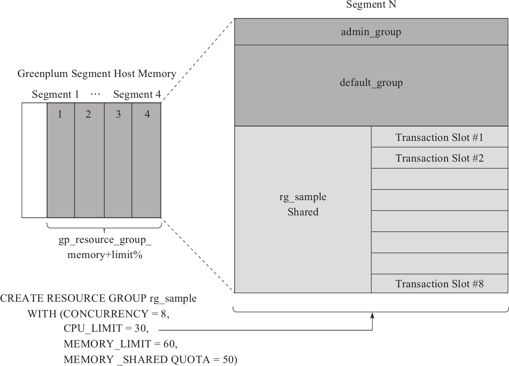
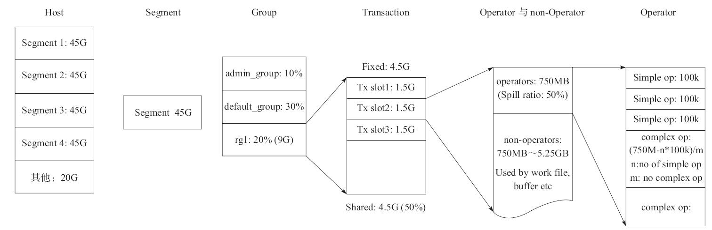

> 当不同用户的多条语句同时在数据库中运行时，数据库需要巧妙地在这些用户这些语句中分配CPU、内存等资源，以便<b><font color=#FF5733>保证语句平稳运行</font></b>。资源管理需要在<b><font color=#FF5733>公平性、确定性和最大资源利用率之间保持微妙的平衡</font></b>，并且给予用户一些配置选择，以便适应不同的使用场景。<b><font color=#FF5733>公平性、确定性是指一个用户或者一个语句可以保证得到一部分资源</font></b>，这部分资源在任何时候都不会被剥夺，这样用户的这个语句就相当于被保留了一个最小可用资源集合，不论这个语句执行得早与晚、快与慢，都至少可以获得这部分资源。<b><font color=#FF5733>最大资源利用率</font></b>是指在系统相对空闲的时候，一个语句可以<b><font color=#FF5733>充分利用这些空闲的资源快速执行</font></b>完毕。
>
> 来自《Greenplum:从大数据战略到实现》7.3 资源管理

CPU和内存资源略有不同，CPU资源可以按照时间片调度，相对来说，调整一个进程的CPU使用占比可以快速完成。而内存资源一旦被分配并且使用，释放要么需要很长时间完成，要么实现起来太复杂，所以动态调整内存资源比较困难。


Greenplum 5实现了基于Linux cgroup的CPU资源管理，以及完全由Greenplum跟踪、记录和分配的内存资源管理，这种资源管理称为资源组(Resource Group)。资源组充分权衡了不同的实现方式，根据CPU和内存资源的不同特点实现了公平而高效的管理。
> cgroup是Linux内核的一个良好的资源分配特性，允许使用者<b><font color=#FF5733>创建不同的cgroup组，在配置文件限定CPU的使用量</font></b>。当用户将不同的进程对接到相应的cgroup组后，这些进程所能使用的CPU资源就会被限制在配置的数据之下或者附近，从而保证CPU资源在不同组之间的隔离。cgroup在系统其他组的CPU使用率低或者整个系统有空余的CPU资源时，还允许cgroup组的进程使用超出限额的CPU资源。

---

>  <b><font color=#FF5733>重要提示:</font></b>
>
> Significant Greenplum Database performance degradation has been observed when enabling resource group-based workload management on RedHat 6.x and CentOS 6.x systems. This issue is caused by a Linux cgroup kernel bug. This kernel bug has been fixed in CentOS 7.x and Red Hat 7.x/8.x systems.
>
> If you use RedHat 6 and the performance with resource groups is acceptable for your use case, upgrade your kernel to version 2.6.32-696 or higher to benefit from other fixes to the cgroups implementation.
>
> 来自https://github.com/greenplum-db/gpdb/blob/6.26.x/gpdb-doc/markdown/admin_guide/workload_mgmt_resgroups.html.md
>
> 翻译一下，也就是说：<b>在 RedHat 6.x 和 CentOS 6.x 系统上启用基于资源组的工作负载管理时，可以看到Greenplum数据库性能显著下降。此问题是由 Linux cgroup 内核错误引起的。此内核错误已在 CentOS 7.x 和 Red Hat 7.x/8.x 系统中修复。</b>
>
> 如果您使用RedHat 6并且资源组的性能对于您的用例来说是可以接受，请将内核升级到版本 2.6.32-696 或更高版本，以便从cgroups的其他修复中受益。
>
> 在[Greenplum 6.9 資源組中文文件](https://tw511.com/a/01/11550.html)也指出：
>
> <b>在RedHat 6.x 和 CentOS 6.x系统下，当启用基于资源组的负载管理时，会引起GP性能的大幅退化。这是因为此版操作系统Linux内核cgroup bug导致，CentOS 7.x 和 Red Hat 7.x系统已经修复了该问题。如果在RedHat 6系统中使用GP资源组功能，你需要将系统內核升级到2.6.32-696或更高版本。</b>

---
# 管理指令

创建Resource Group需要`SUPERUSER`权限，最多创建100个。GP默认创建`admin_group`和`default_group`，这两个名称以及`none`被保留。

```sql
CREATE RESOURCE GROUP name WITH (group_attribute=value [, ... ])
```

其中，`group_attribute`的可能取值是

```sql
CPU_RATE_LIMIT=integer | CPUSET=tuple
[ MEMORY_LIMIT=integer ]
[ CONCURRENCY=integer ]
[ MEMORY_SHARED_QUOTA=integer ]
[ MEMORY_SPILL_RATIO=integer ]
[ MEMORY_AUDITOR= {vmtracker | cgroup} ]
```

| 属性                | 描述                                                         |      |
| ------------------- | ------------------------------------------------------------ | ---- |
| CONCURRENCY         | 资源组允许的最大并发数，包括活动的和空闲的事务，[0, MaxConnections(90)]。 |      |
| MEMORY_LIMIT        | 当前资源组预留(reserve)的内存资源百分比，取值范围为[0, 100]<br/>当MEMORY_LIMIT为0时，GreenPlum将不给资源组分配内存资源，使用资源组全局共享内存来满足内存请求。<br/>GP集群中所有资源组指定的MEMORY_LIMIT参数和不得超过100。 |      |
| MEMORY_AUDITOR      | 内存审计方式。默认，资源组使用vmtracker，外部组件使用cgroup  |      |
| MEMORY_SHARED_QUOTA | 资源组用于运行时事务之间共享的内存资源百分比<br/>将一个资源组内的内存分为两部分：组内各语句共享部分和每个语句独占的固定部分 |      |
| MEMORY_SPILL_RATIO  | 内存密集型事务的内存使用阈值。当事务达到此阈值时，它将溢出到磁盘。<br/>GP的Spill支持两种模式:<br/>1. Percentage模式，MEMORY_SPILL_RATIO的值不为0<br/>2. Fallback模式，由GUC参数statement_mem决定<br/><br/>参见`groupGetMemSpillTotal`接口计算 |      |
| CPU_RATE_LIMIT      | 资源组的可用的CPU使用率，取值范围[0, 100]。                  |      |
| CPUSET              | 资源组保留的CPU核                                            |      |

SET，RESET和SHOW命令不受资源限制，资源组的配置信息存在`gp_toolkit.gp_resgroup_config`系统视图中


`group_attribute`在Greenplum中采用`ResGroupCaps`表达

```C
typedef int32 ResGroupCap;
typedef struct ResGroupCaps {
	ResGroupCap		__unknown;			/* placeholder, do not use it */
	ResGroupCap		concurrency;
	ResGroupCap		cpuRateLimit;
	ResGroupCap		memLimit;
	ResGroupCap		memSharedQuota;
	ResGroupCap		memSpillRatio;
    // 内存审计方式
	ResGroupCap		memAuditor;
	char		    cpuset[MaxCpuSetLength];
} ResGroupCaps;
```


资源组管理指令实现相关接口，不进行详细的解读。

语法解析：`src\backend\parser\gram.y`

```C
// src/backend/commands/resgroupcmds.c

// CREATE RESOURCE GROUP
// 调用AllocResGroupEntry实现真实地创建资源组
void CreateResourceGroup(CreateResourceGroupStmt *stmt)

// DROP RESOURCE GROUP
void DropResourceGroup(DropResourceGroupStmt *stmt)

// ALTER RESOURCE GROUP
void AlterResourceGroup(AlterResourceGroupStmt *stmt)
```

# 资源组管理思想
资源组的内存管理是基于slot的方式进行管理的，在内存分配策略上采用了禁用OverCommit的方式，在内核上会配置
- `vm.overcommit_memory = 2`，系统默认为0，修改`/etc/sysctl.conf`进行配置
- `vm.overcommit_ratio`默认值为0.5

资源组实现了细粒度地对内存和CPU的管理。Linux的cgroup的`memsw`启用需要内核参数配合，下面两种当时选择其一：

- 内核配置中`CONFIG_MEMCG_SWAP_ENABLED=on`

- `swapaccount=1`in kernel cmdline.

## 内存管理
GP基于全局共享内存和slot机制对限制内存
> 启用资源组后，将在Greenplum数据库节点，段和资源组级别管理内存使用情况。
>
> 用户可以使用角色资源组在事务级别管理内存。gp_resource_group_memory_limit标识要分配给每个Greenplum数据库Segment主机上的资源组的系统内存资源的最大百分比，默认0.7(70%)。
>
> Greenplum数据库节点上可用的内存资源在节点上的每个Segment之间进一步平均分配。当基于资源组的资源管理处于活跃状态时，分配给段主机上每个段的内存量是Greenplum数据库可用的内存乘以gp_resource_group_memory_limit服务器配置参数，并除以主机上活跃Primary Segment的数量：
>
> rg_perseg_mem = ( (RAM * (vm.overcommit_ratio / 100) + SWAP) *  gp_resource_group_memory_limit) / num_active_primary_segments
>
>用户可以在创建资源组时指定MEMORY_LIMIT值来标识预留(reserve)用于资源管理的Segment内存的百分比。用户可以为资源组的MEMORY_LIMIT的取值范围是[0, 100]。
>
> 在Greenplum数据库群集中定义的所有资源组指定的MEMORY_LIMIT总和不得超过100。
>
> 参考资料：[GreenPlum Database Document : 用资源组进行工作负载管理](https://docs-cn.greenplum.org/v6/admin_guide/workload_mgmt_resgroups.html#topic8339777)

## CPU资源管理

GP提供了CPUSET和CPU_RATE_LIMIT两种资源组限制来标识CPU资源分配模式，配置资源组时只能选择其中一个限制，用户可以再运行时更改CPU资源的分配方式:
### 按核心数分配CPU资源
> 用户可以使用CPUSET属性标识要为资源组保留的CPU核心。用户指定的CPU核心必须在系统中可用，并且不能与为其他资源组保留的任何CPU核心重叠。将CPU核心分配给CPUSET组时，需要考虑以下事项：
>- 使用CPUSET创建的资源组仅使用指定的核心。如果组中没有正在运行的查询，则保留的核心处于空闲状态，并且其他资源组中的查询无法使用这些核心。 需要考虑最小化CPUSET组的数量以避免浪费系统CPU资源。
>
> - 考虑将CPU核心0不分配：在以下情况下，CPU核心0用作回退机制：
>     - admin_group和default_group至少需要一个CPU核心。 保留所有CPU内核后，Greenplum Database会将CPU内核0分配给这些默认组。 在这种情况下，用户为其分配CPU核心0的资源组与admin_group和default_group共享核心。
>     - 如果通过一个节点替换重新启动Greenplum数据库集群，并且节点没有足够的内核来为所有CPUSET资源组提供服务，则会自动为这些组分配CPU核心0以避免系统启动失败。
>- 尽可能将较小的核心编号分配给资源组。 如果替换Greenplum数据库节点并且新节点的CPU核心数比原始节点少，或者备份数据库并希望在具有较少CPU核心的节点的群集上做恢复，操作可能会失败。 例如，如果用户的Greenplum数据库群集有16个核心，则分配核心1-7是最佳选择。 如果创建资源组并分配CPU核心9，则数据库恢复到8核心的节点将失败。
>
> 为资源组配置CPUSET时，Greenplum数据库会禁用组的CPU_RATE_LIMIT并将值设置为-1。

### 按百分比分配CPU资源
> Greenplum节点CPU百分比在Greenplum节点上的每个Segment间平均分配。 使用CPU_RATE_LIMIT配置每个资源组保留用于资源管理的段CPU的指定百分比，其取值范围是[1, 100]。Greenplum数据库群集中定义的所有资源组指定的CPU_RATE_LIMIT的总和不得超过100。
>
> 按百分比分配核心(资源组指定CPU_RATE_LIMIT)，Segment主机上配置的所有资源组的最大CPU资源使用量是以下值中的最小值：
> - 非保留CPU核心数除以所有CPU核心数乘以100，和
> - gp_resource_group_cpu_limit值。
>
> 配置有CPU_RATE_LIMIT的资源组的CPU资源分配是弹性的，因为Greenplum数据库可以将空闲资源组的CPU资源分配给更繁忙的资源组。在这种情况下，当该资源组接下来变为活动时，CPU资源被重新分配给先前空闲的资源组。如果多个资源组繁忙，则根据其CPU_RATE_LIMIT的比率为它们分配任何空闲资源组的CPU资源。例如，使用CPU_RATE_LIMIT为40创建的资源组将分配两倍于使用CPU_RATE_LIMIT为20创建的资源组的额外CPU资源。
>
> 为资源组配置CPU_RATE_LIMIT时，禁用资源组的CPUSET并将值设置为-1。


## 资源队列示例

对于一个支持混合负载的数据产品而言，系统中的长查询和短查询会不定期出现，很多用户的一个痛点是，当系统中运行着一个长查询时，这个语句有可能占用太多的系统CPU或者内存等资源，造成短查询无法获得哪怕很小部分的资源，表现为运行很慢、执行时间变长，Greenplum结合资源组可以避免这一问题。

```sql
create resource group rg1 with (concurrency=3, cpu_rate_limit=50, memory_limit=30);
create resource group rg2 with (concurrency=3, cpu_rate_limit=20, memory_limit=20);
alter role tom1 resource group rg1;
alter role tom2 resource group rg2;
```

在`rg2`中运行短查询，在`rg1`中运行长查询，那么在没有短查询时，长查询会使用更多CPU资源；一旦有一个短查询到达`rg2`，那么长查询会立刻让出多占的CPU资源，短查询可以立刻享用自己应该使用的20%CPU资源。如果将运行短查询的`rg2`的CPU资源设置得非常大(例如60%或者更高)，那么在没有短查询时，其他组依然可以分享这部分CPU；当有短查询时，短查询可以享用绝大多数CPU资源来快速完成，从而实现一个偏向短查询的良好特性。

Greenplum 5.9中添加的一个新特性cpuset能够更好地保证短查询的资源。

```sql
-- 所有运行在rg3中的语句都会被调度到CPU核1上运行，且rg3中的语句对CPU核1是独占的
-- 其他组的语句只能被调度到其他核上
-- 当有一个短查询需要在rg3中运行时，会立刻在核1上运行，而不用担心要先把大查询的进程调度出来。
create resource group rg3 with (concurrency=3, cpuset='1', memory_limit=30);
```

---


<b>资源组也实现了对系统内存资源的隔离。</b>对于`rg1`和`rg2`，它们会分别使用系统的30%和20%内存，各自组的语句使用的内存总和如果超过了配额，将会抢占使用整个系统的全局共享内存。如果全局共享内存已经用完，那么这个语句将会失败，从而保证整个集群的安全。<b>系统的全局共享内存是创建资源组后剩余的没有分配的内存，这给混合负载提供了一定的灵活度。</b>如果用户可以很好地预测每个组的内存需求，就可以把系统内存在各个组之间分配完，这样每个组的内存使用只能限制在自己组的限额内。如果用户的业务和每个组的负载不完全确定，或者会有不定期出现的巨大查询需要特别多的内存资源时，可以预留部分共享内存在所有组之间共享。这部分不确定但可能需要大量内存资源的语句，若使用完自己组内的内存份额，就可以使用这部分共享资源来继续执行。

<b>对于组内各个语句之间的内存分配，资源组也会充分权衡各种因素。</b>创建资源组时，可以通过`memory_shared_quota`和`memory_spill_ratio`来对组内的内存使用进行微调，`memory_shared_quota`将一个资源组内的内存分为两部分：组内各语句共享部分和每个语句独占的固定部分。`memory_spill_ratio`会影响单个语句的内存使用量。

```SQL
create resource group rg_sample with (
	concurrency = 8,
	cpu_rate_limit = 30,
	memory_limit = 60,			-- 资源组可用的内存资源百分比
	memory_shared_quota = 50,  	-- 提交到该资源组的事务之间共享的内存资源百分比
	memory_spill_ratio = 30		-- 内存密集型事务的内存使用阈值,当事务达到此阈值时，溢出到磁盘
);
```

<center>
    
    <br/>
    <div>资源组的内存分配和配额管理</div>
</center>

预留白色的`1 - gp_resource_group_memory_limit`的内存给操作系统和Greenplum的后台进程，将灰色的`gp_resource_group_memory_limit`的内存，平均分配给各个Segment实例。

```
pre_segment_mem = (RAM * (vm.overcommit_ratio / 100) + SWAP)
					* gp_resource_group_memory_limit
					/ num_active_primary_segments
```

浅灰色表示共享内存和各个并发事务预留内存的关系。`MEMORY_LIMIT=60%`表示该资源组分配60%的节点内存

```
group_expected_mem = pre_segment_mem * 0.6
```

该资源组的`memory_shared_quota`为50，意味着其总内存的50%是共享内存，其他50%是预留的固定内存。
```
group_quota_expected_mem = group_expected_mem * (1 - 0.5)
group_shared_expected_mem = group_expected_mem - group_quota_expected_mem
```

`CONCURRENCY=8`表示并发度为8，共有8个预留的固定内存slot。
```C++
slot_quota_expected_mem = group_quota_expected_mem / concurrency
```
每条运行的语句将会独占一部分固定内存，如`Transaction slot#1`。<b><font color=#FF5733>语句开始执行后，会优先使用属于自己的固定内存，之后使用组内共享的部分，最后才使用全局共享的部分。</font></b>

`memory_spill_ratio`不为0，GP按照下面的公式计算分配给事务的内存

```C++
query_mem = (pre_segment_mem * memory_limit) * memory_spill_ratio / concurrency
```

`memory_spill_ratio`配置会影响单个语句的内存使用量。对于`rg_sample`资源组的`memory_spill_ratio`设为30，意味着当语句开始执行时，会计算该语句可以使用的内存量，并为其分配30%作为初始用量。当语句的执行计划生成后，会根据这个配置在不同的算子（例如表扫描算子或者排序算子）之间进行内存分配。默认，普通的操作只需要分配100KB的内存，对于哈希关联或者排序这样非常需要内存的操作，会平均分配其余内存。在执行哈希关联或者排序时，如果内存使用量超过为其分配的内存，那么该算子的运行开始利用外部文件来存储部分中间结果，从而缓解对内存的使用，这个过程称为spill。

<center>
	
	<div>内存资源在不同粒度逐级分配</div>
</center>
<br/>
<br/>

对于CPU的限制，将`gp_resource_group_cpu_limit`的CPU核心给节点使用，剩余的`1-gp_resource_group_cpu_limit`核心给系统后台和GP的其他辅助进程使用

```
cfs_quota_us := parent.cfs_period_us * ncores * gp_resource_group_cpu_limit
cpu.shares := parent.shares * gp_resource_group_cpu_priority
```

该资源组`cpu_rate_limit=30`

```
group_cpu_shares = parent_cpu_shares * 0.3
```

数据会更新到资源组cpu子系统的`cpu.shares`中。

# 配置和使用

| 参数                                             | 参数意义                                                     | 默认值 |
| ------------------------------------------------ | ------------------------------------------------------------ | ------ |
| `gp_resource_group_bypass`                       | 查询使用资源不受资源组限制                                   | false  |
| `gp_resource_group_memory_limit`                 | 分配给 Greenplum 数据库的系统内存百分比，默认70%。           | 0.7    |
| `gp_resource_group_enable_cgroup_cpuset`         | 是否使能CPU_SET，默认是False                                 | false  |
| `gp_resource_group_enable_cgroup_memory`         |                                                              |        |
| `gp_resource_group_enable_cgroup_swap`           |                                                              |        |
| `gp_resource_group_cpu_limit`                    | 分配给每个Greenplum数据库Segment上的资源组的系统CPU资源的最大百分比。<br/>无论资源组CPU分配模式如何，此限制都将控制Segment主机上所有资源组的最大CPU使用率。<br/>剩余的未预留CPU资源用于OS内核和Greenplum数据库辅助守护进程 | 0.9    |
| `gp_resource_group_cpu_priority`                 | postgres进程的cpu优先级                                      | 10     |
| `gp_resource_group_cpu_ceiling_enforcement`      | 是否启用CPU上限限制                                          | false  |
| `gp_resource_group_enable_recalculate_query_mem` | 使能QE上资源组重新计算query_mem<br/>如果master和segment上硬件配置不同，GP建议将其设置为true | false  |
| `gp_resource_group_queuing_timeout`              | 事务在资源队列上排队等待的时间，单位ms                       |        |
| `memory_spill_ratio`                             | 影响单个语句的内存使用量，影响Greenplum分配给查询运算符内存量。<br/>当 memory_spill_ratio大于0时，表示分配给查询运算符的资源组内存的百分比。如果并发很高，即使memory_spill_ratio设置为最大值100，此内存量也可能很小。<br/>如果memory_spill_ratio=0，Greenplum 数据库使用 statement_mem 设置来确定要分配的查询运算符内存的初始量。 |        |
| `statement_mem`                                  | 如果memory_spill_ratio=0，GP分配给查询的内存量               | 128M   |
| `gp_resgroup_memory_policy`                      | 控制所有查询算子的内存申请及使用，GP支持资源组使用eager-free和auto内存分配两种策略,默认为Auto。<br/>1.None策略，内存管理和Greenplum数据库4.1之前的版本一样。<br/>2. auto策略，GP使用资源组内存限制在算子之间分配内存，为非内存密集型算子分配固定大小内存并将剩余内存分配给内存密集型算子。<br/>3. eager-free策略，GP会把已经完成处理的算子释放的内存重新分配给后续算子，从而在算子之间更优地分配内存。<br/>分布算法Eager_free 利用不是所有的操作符都同时执行完成（GP 4.2和之后的版本）。查询计划被分成几个阶段，Greenplum 数据库在该阶段执行结束时马上释放分配给前一个阶段的内存，然后将释放的内存分配给新阶段。<br/>(原文: In Greenplum Database 4.2 and later, the distribution algorithm eager_free takes advantage of the fact that not all operators execute at the same time. The query plan is divided into stages and Greenplum Database eagerly frees memory allocated to a previous stage at the end of that stage's execution, then allocates the eagerly freed memory to the new stage.) |        |
| `gp_resgroup_memory_policy_auto_fixed_mem`       | AUTO策略中非内存密集型运算符保留的固定内存量                 |        |
| `gp_vmem_limit_per_query`                        | 每个Segment每个语句的最大允许内存，0表示不限制               |        |
| `gp_segworker_relative_priority`                 | segworkers相对于postmaster的优先级                           |        |


## 资源组分配

可以在`CREATE ROLE`和`ALTER ROLE`将角色分配给Resource Group。

```sql
-- 创建角色时分配资源组，需要CREATEROLE权限或superuser
CREATE ROLE name WITH RESOURCE GROUP group_name
```

将group_name资源组分配给新创建的角色，该角色也需要遵循Resource Group在并发事务、内存和CPU的配置下执行。一个Resource Group可以对应1到多个角色。如果没有为新角色指定Resource Group，则会自动为该角色分配默认资源组，为SUPERUSER角色分配admin_group，为非管理员角色分配 default_group。可以将`admin_group`资源组分配给具有SUPERUSER属性的任何角色，可以将`default_group`资源组分配给任何角色。不能将为外部组件创建的资源组分配给角色。


```sql
-- 修改角色,将资源组分配给相应角色
ALTER ROLE name RESOURCE GROUP {group_name | NONE}
```


# 源码解读

基于最新的`6.26.x`分支进行源码解读。源码实现层面主要涉及两个文件：

| 文件                                              | 职责                 |
| ------------------------------------------------- | -------------------- |
| `src/backend/commands/resgroupcmds.c`             | 资源组管理指令       |
| `src/backend/utils/resgroup/resgroup.c`           | 资源组管理实现核心   |
| `src/backend/utils/resgroup/resgroup-ops-linux.c` | Linux cgroup相关操作 |


## 数据结构

资源组支持的属性表达

```C
typedef int32 ResGroupCap;

typedef struct ResGroupCaps {
	ResGroupCap		__unknown;			/* placeholder, do not use it */
	ResGroupCap		concurrency;
	ResGroupCap		cpuRateLimit;
	ResGroupCap		memLimit;
	ResGroupCap		memSharedQuota;
	ResGroupCap		memSpillRatio;
    // 内存审计方式
	ResGroupCap		memAuditor;
	char		    cpuset[MaxCpuSetLength];
} ResGroupCaps;
```

资源组信息表达

```C
struct ResGroupData {
	Oid			groupId;			/* Id for this group */

	/*
	 * memGap is calculated as:
	 * 	(memory limit (before alter) - memory expected (after alter))
	 *
	 * It stands for how many memory (in chunks) this group should
	 * give back to MEM POOL.
	 */
	int32       memGap;
	

    // pResGroupControl->totalChunks * caps->memLimit / 100
    // see groupGetMemExpected API
	int32		memExpected;		/* 根据属性(cap)计算expected memory chunks */
    // see groupRebalanceQuota, 根据预留chunks和资源组属性更新计算
	int32		memQuotaGranted;	/* memory chunks for quota part */
	int32		memSharedGranted;	/* memory chunks for shared part */

	volatile int32	memQuotaUsed;	/* memory chunks assigned to all the running slots */

	/*
	 * memory usage of this group, should always equal to the
	 * sum of session memory(session_state->sessionVmem) that
	 * belongs to this group
	 */
	volatile int32	memUsage;
	volatile int32	memSharedUsage;

	volatile int			nRunning;		/* number of running trans */
	volatile int	nRunningBypassed;		/* number of running trans in bypass mode */
	// 获取slot成功,自增1,参见groupAcquireSlot
	int			totalExecuted;	/* total number of executed trans */
	int			totalQueued;	/* total number of queued trans	*/
	Interval	totalQueuedTime;/* total queue time */
    // 当前资源组中等待的进程队列
	PROC_QUEUE	waitProcs;


     // 根据资源组内存审计方式属性绑定内存操作相关接口
     // see bindGroupOperation API
	const ResGroupMemOperations *groupMemOps;

    // true表示当前资源组已删除,还没提交
	bool		lockedForDrop;
	// 资源组属性
	ResGroupCaps	caps;		/* capabilities of this group */
};
```


```C
/* GP对于每个查询都会开启一个事务,记录一个事务对应的资源组信息
 * 由decideResGroup进行数据赋值
 */
struct ResGroupInfo {
	ResGroupData	*group;
	Oid				groupId;
};
```


```C++
struct ResGroupControl {
    // segment节点mem总chunk数
	int32			totalChunks;
    // 每个chunk中的位数(默认20,即1M 1 >> 20)
    int32			chunkSizeInBits;
    // master上primary segment数量,在InitResGroups时初始化
	int 			segmentsOnMaster;
 	// 资源组最大数量(MaxResourceGroups=100),在InitResGroups时初始化
	int				nGroups;
	// 资源组数据是否从系统中加载完成,在InitResGroups进行加载并设置为true
	bool			loaded;

    // Safe memory threshold,如果剩余的全局shared mem低于此阈值
    // 资源组的内存使用进入red zone
	pg_atomic_uint32 safeChunksThreshold100;

    // 没有分配给资源组的mem chunk数,资源组优先使用share mem
    // 当share mem不够用时,使用这部分内存,参见mempoolAutoReserve
	pg_atomic_uint32 freeChunks;

    // slotpoolInit接口初始化slot pool
    // 最多RESGROUP_MAX_SLOTS=MaxConnections=90个ResGroupSlotData
	ResGroupSlotData	*slots;		/* slot pool shared by all resource groups */
    // shared slot pool, head of the free list
	ResGroupSlotData	*freeSlot;

	HTAB			*htbl;
	ResGroupData	groups[1];
};
```


## 初始化

```C++
void InitResGroups(void) {
					......                
	// 1. 计算Segment上的chunk总数
	//    计算可管理的chunk总数(totalChunks),一个chunk容量(chunkSizeInBits)
	decideTotalChunks(&pResGroupControl->totalChunks, &pResGroupControl->chunkSizeInBits);
	pg_atomic_write_u32(&pResGroupControl->freeChunks, pResGroupControl->totalChunks);
	pg_atomic_write_u32(&pResGroupControl->safeChunksThreshold100,
						pResGroupControl->totalChunks * (100 - runaway_detector_activation_percent));
	// 2. cgroup初始化
    ResGroupOps_Init();
    				.......
}
```


### 内存初始化
GP将所有资源放在一个全局的mem pool中，通过`ResGroupControl *pResGroupControl`结构来维护相关的数据信息
- `chunkSizeInBits`：一个chunk多少bit
- `totalChunks`：一共有多少chunk
- `freeChunks`：空闲chunk数量，代表全局共享内存的大小。
- `safeChunksThreshold100`：表示Safe memory，当全局共享资源小于该阈值的时候，资源组的内存使用进入red zone

通过`decideTotalChunks`接口，GP将这些内存划分为不超过16K的chunk，之后基于Chunk进行管理。默认一个chunk是1M，默认的一个Chunk为1M大小，如果可用虚拟内存大于16GB(16K MB)，则通过增大一个Chunk的大小(依次放大为2M、4M....)，来确保Chunk的数量不超过16K。
```C
// Calculate the total memory chunks of the segment
static void decideTotalChunks(int32 *totalChunks, int32 *chunkSizeInBits) {
	int32 nsegments;
	int32 tmptotalChunks;
	int32 tmpchunkSizeInBits;

	// 获取primary segments数
	nsegments = Gp_role == GP_ROLE_EXECUTE ? host_segments : pResGroupControl->segmentsOnMaster;
	/**
	 * 结合Linux系统配置以及cgroup信息获取可管理内存, 单位MB
	 * 
	 *  Linux系统 outTotalMemory = SWAP + RAM * vm.overcommitRatio / 100
	 * 
	 *  通过getCgMemoryInfo中获取cgroup的RAM和swap
	 * 		cgram(MEM) : memory.limit_in_bytes
	 * 		cgmemsw(SWAPs): memory.memsw.limit_in_bytes
	 * 
	 * total = Min(outTotalMemory, (cgmemsw<memsw ? cgmemsw - ram : swap) + Min(ram, cgram))
	 * */
	tmptotalChunks = ResGroupOps_GetTotalMemory() /*单位:MB*/
        	* gp_resource_group_memory_limit / nsegments;

	// 默认一个chunk含1M
	tmpchunkSizeInBits = BITS_IN_MB;
	// 如果vmem > 16GB(16 K MB)，每个chunk含的bit容量(chunkSizeInBits)增大
	// 确保每个chunk单元的vmem不超过16K
	while(tmptotalChunks > (16 * 1024)) {
		tmpchunkSizeInBits++;
		tmptotalChunks >>= 1;
	}

	*totalChunks = tmptotalChunks;
	*chunkSizeInBits = tmpchunkSizeInBits;
}
```


### CPU管理初始化

Linux CPU采用CFS调度策略，通过两种方式控制CPU：

1. 配置上限限制(ceiling enforcement)，`cpu.cfs_period_us`，指定一个时间段用于重新分配cgroup对CPU资源的访问的频率，单位微秒。如果cgroup中的任务能够每1秒访问单个CPU 0.2秒，将`cpu.cfs_quota_us`设置为200000，`cpu.cfs_period_us`设置为1000000。`cpu.cfs_quota_us`参数的上限为1秒，下限为1000微秒。

2. 相对的共享份额(relative sharing), `cpu.shares`，包含一个整数值，该值指定cgroup中的任务可用的CPU时间的相对份额。例如，两个将`cpu.shares`设置为100的cgroup中的任务将获得相等的CPU时间，但将`cpu.shares`为200的cgroup中的任务获得的CPU时间是将`cpu.shares`为100的两倍。`cpu.shares`的值必须大于等于2.

```C++
/* Initialize the OS group */
void ResGroupOps_Init(void) {
    // 1. 初始化CPU设置,linux cgroup通过强制上限(cfs_quota_us)和相对份额(shares)控制CPU
    //    cfs_quota_us := parent.cfs_quota_us * gp_resource_group_cpu_limit
    //				(parant cgroup限制)
    //	  cfs_quota_us := parent.cfs_period_us * ncores * gp_resource_group_cpu_limit
    // 				(parant cgroup有限制)
    //    shares := parent.shares * gp_resource_group_cpu_priority
    initCpu();

    // 2. 初始化cpuset设置
    //    将parent cpuset的mems和cpus写入gpdb cpuset中
	//	  cpu核心1保留在gpdb根路径下并检查权限
    initCpuSet();

	// 3. 将postmaster以及子进程放入gpdb cgroup(进程号写入相应cgroup.procs路劲下)
	ResGroupOps_AssignGroup(RESGROUP_ROOT_ID, NULL, PostmasterPid);
}
```

```C++
static void initCpu(void) {
	ResGroupCompType comp = RESGROUP_COMP_TYPE_CPU;
	int64		cfs_quota_us;
	int64		shares;

	if (parent_cfs_quota_us <= 0LL) {
		/* 
		 * 若parent cgroup unlimited,用system_cfs_quota_us进行计算
		 * system_cfs_quota_us = parent.cfs_period_us * ncores
		 * gpdb将parent.cfs_period_us设置为100000(100ms), 参见getCfsPeriodUs接口
		 *
		 * cfs_quota_us := parent.cfs_period_us * ncores * gp_resource_group_cpu_limit
		 */
		cfs_quota_us = system_cfs_quota_us * gp_resource_group_cpu_limit;
	} else {
		/*
		 * 若parent cgroup is limited
		 * cfs_quota_us := parent.cfs_quota_us * gp_resource_group_cpu_limit
		 */
		cfs_quota_us = parent_cfs_quota_us * gp_resource_group_cpu_limit;
	}
	writeInt64(RESGROUP_ROOT_ID, BASETYPE_GPDB, comp, "cpu.cfs_quota_us", cfs_quota_us);

	// shares := parent.shares * gp_resource_group_cpu_priority
	shares = readInt64(RESGROUP_ROOT_ID, BASETYPE_PARENT, comp, "cpu.shares");
	shares = shares * gp_resource_group_cpu_priority;
	writeInt64(RESGROUP_ROOT_ID, BASETYPE_GPDB, comp, "cpu.shares", shares);
}
```

```C++
static void initCpuSet(void) {
	ResGroupCompType comp = RESGROUP_COMP_TYPE_CPUSET;
	char buffer[MaxCpuSetLength];

	if (!gp_resource_group_enable_cgroup_cpuset)
		return;

	// 1. 将parent cpuset的mems和cpus写入gpdb cpuset中
	readStr(RESGROUP_ROOT_ID, BASETYPE_PARENT, comp, "cpuset.mems", buffer, sizeof(buffer));
	writeStr(RESGROUP_ROOT_ID, BASETYPE_GPDB, comp, "cpuset.mems", buffer);

	readStr(RESGROUP_ROOT_ID, BASETYPE_PARENT, comp, "cpuset.cpus",buffer, sizeof(buffer));
	writeStr(RESGROUP_ROOT_ID, BASETYPE_GPDB, comp, "cpuset.cpus", buffer);

	// 2. cpu核心1保留在gpdb根路径下并检查权限
	createDefaultCpuSetGroup();
}
```

## 创建资源组

在`src\include\catalog\pg_resgroup.h`，借助[BKI命令](https://docs.huihoo.com/postgresql/9.0/bki-commands.html)在创建默认的admin_group和default_group。

```C++
// 通过BKI创建默认资源组
DATA(insert OID = 6437 ( default_group, 0 ));
DATA(insert OID = 6438 ( admin_group, 0 ));

#define DEFAULTRESGROUP_OID 	6437
#define ADMINRESGROUP_OID 	6438
```


` createGroup`创建资源组接口实现

```C
/*
 * 创建资源组(resource group)，初始化资源组参数
 *
 * 1. 通过groupGetMemExpected(caps)计算memExpected = totalChunks * caps->memLimit
 * 2. 通过mempoolReserve计算从freeChunks中尽可能多地reserve memExpected的资源
 * 3. 通过groupRebalanceQuota计算reserved的chunks计算memQuotaGranted和memSharedGranted
 * 4. 通过bindGroupOperation根据内存审计方式绑定内存操作的接口函数
 */
static ResGroupData * createGroup(Oid groupId, const ResGroupCaps *caps) {
	ResGroupData	*group;
	int32			chunks;
			......
	group = groupHashNew(groupId);
	// initialize a shared memory process queue
	ProcQueueInit(&group->waitProcs);
			......
    // group->memExpected = pResGroupControl->totalChunks * caps->memLimit / 100
	group->memExpected = groupGetMemExpected(caps);

	// 从freeChunks中尽可能多地reserve memExpected的资源
    // 更新pResGroupControl的freeChunks和safeChunksThreshold100
	chunks = mempoolReserve(groupId, group->memExpected);
    
	// 根据reserved的chunks以及资源组属性,更新memQuotaGranted和memSharedGranted
	groupRebalanceQuota(group, chunks, caps);
  
	// 根据内存审计方式绑定groupMemOps相关接口
	bindGroupOperation(group);

	return group;
}
```

```C
/*
 * @param 	chunks:	表示实际希望获得chunk数
 * @return 	reserved 本次预留的chunk,可能小于期望的chunks数
 */
static int32 mempoolReserve(Oid groupId, int32 chunks) {
	int32 reserved = 0;

	while (true) {
		int32 oldFreeChunks = pg_atomic_read_u32(&pResGroupControl->freeChunks);
         // 此次预留的chunk数，也是实际获取的chunk数，可能会小于希望获取的chunks
		reserved = Min(Max(0, oldFreeChunks), chunks);
		int32 newFreeChunks = oldFreeChunks - reserved;
		if (reserved == 0) break;
		if (pg_atomic_compare_exchange_u32(&pResGroupControl->freeChunks,
                   (uint32 *) &oldFreeChunks, (uint32) newFreeChunks))
			break;
	}

    // 更新safeChunksThreshold100
	if (reserved != 0) {
		uint32 safeChunksThreshold100 = (uint32) pg_atomic_read_u32(
				&pResGroupControl->safeChunksThreshold100);
		int safeChunksDelta100 = reserved * (100 - runaway_detector_activation_percent);
		pg_atomic_sub_fetch_u32(&pResGroupControl->safeChunksThreshold100, safeChunksDelta100);
	}

	return reserved;
}
```


```C++
// 根据reserved的chunks以及资源组属性,更新memQuotaGranted和memSharedGranted
static void groupRebalanceQuota(ResGroupData *group, int32 chunks,
                                const ResGroupCaps *caps) {
    // 1. 根据资源组属性计算group expected memory quota
	int32 memQuotaGranted = groupGetMemQuotaExpected(caps);
	// 2. expected memory quta和资源资已有的mem quota差值
	int32 delta = memQuotaGranted - group->memQuotaGranted;
	if (delta >= 0) {
		delta = Min(chunks, delta);
		// 3. 更新memory chunks for quota
		group->memQuotaGranted += delta;
         // 预留的chunks除去quota part,给share
		chunks -= delta;
	}
	// 4. 更新memory chunks for shared
	group->memSharedGranted += chunks;
}
```


## 并发度控制

申请和释放slot,在事务开始时申请slot，在事务结束时释放slot。

```C++
// master上, QD在事务刚开始时被分配给资源组(resource group) 
// 并从资源组中获取一个slot
AssignResGroupOnMaster
    decideResGroup(&groupInfo);
    slot = groupAcquireSlot 	// 获取slot
	sessionSetSlot(slot);		// MySessionState->resGroupSlot
    selfAttachResGroup(resgroup, resgroupslot)
        groupIncMemUsage(group, slot, self->memUsage);
    self->caps = slot->caps; 	// 初始化当前进程资源队列属性
	ResGroupOps_AssignGroup  	// 将当前进程添加到cgroup
```


```C++
// 提交事务
CommitTransaction()
    UnassignResGroup 	// 事务结束时,释放资源组的slot
    	groupReleaseSlot(group, slot, false);		// 释放slot
	    sessionResetSlot();
```


### 申请slot

在`ResGroupData`结构中通过`nRunning`记录了正在运行的事务数量，每成功获取一个slot，`nRunning++`。`ResGroupCap`记录着资源组属性配置信息，其中`concurrency`记录着并发度的上限。总体上来说，并发度的控制是运行事务数量和quota已使用量相关因素综合作用的结果。

这里忽略一些异常和锁的相关处理逻辑来了解主实现

```C
static ResGroupSlotData *groupAcquireSlot(ResGroupInfo *pGroupInfo, bool isMoveQuery) {
	ResGroupSlotData *slot;
	ResGroupData	 *group;
	group = pGroupInfo->group;

			......
	if (!group->lockedForDrop) {
		/**
		 * 1. 尝试获取resource group slot
		 * 	  1.1. 尝试预留mem quota, 以下情况会出现获取slot失败：
		 * 		1). 在运行中的事务数量(group->nRunning)>=资源组的并发度(caps->concurrency)
		 * 		2). 从group中reserve slot失败，详见groupReserveMemQuota实现
		 * 
		 *    1.2. 若mem quota预留成功, 则从shared slot pool(pResGroupControl->freeSlot)中申请slot
		 *		   GP在初始化时,通过slotpoolInit接口初始化slot pool
		 *         最多RESGROUP_MAX_SLOTS=MaxConnections=90个ResGroupSlotData
		 *       参见slotpoolAllocSlot
          */
		slot = groupGetSlot(group);
		if (slot != NULL) {
			// 获取slot成功,执行中的trans自增1
			group->totalExecuted++;
			pgstat_report_resgroup(0, group->groupId);
			return slot;
		}
	}

	// 1.2 获取slot失败,将当前进程(MyProc)添加到group wait queue
	groupWaitQueuePush(group, MyProc);

	if (!group->lockedForDrop) group->totalQueued++;

	// 1.3 等待gp_resource_group_queuing_timeout(单位Ms)来获取slot,超时则cancle查询
    //      wakeupSlots来唤醒资源组中排队等待slot,给MyProc->resSlot赋值
    waitOnGroup(group, isMoveQuery);
	if (MyProc->resSlot == NULL) return NULL;

	slot = (ResGroupSlotData *) MyProc->resSlot;
	MyProc->resSlot = NULL;
	addTotalQueueDuration(group);
	group->totalExecuted++;
	pgstat_report_resgroup(0, group->groupId);
	return slot;
}
```


```C++
static ResGroupSlotData * groupGetSlot(ResGroupData *group) {
	ResGroupCaps* caps = &group->caps;
	// 1. 运行中的事务数量>=资源组的并发度,获取失败
	if (group->nRunning >= caps->concurrency) return NULL;

	// 2. 从资源组预留的mem quota中尝试预留slot
	//    优先从资源组shared mem, 若失败,再从global shared mem(freechunk)中获取
	int32 slotMemQuota = groupReserveMemQuota(group);
	if (slotMemQuota < 0) return NULL;

	// 3. 从pResGroupControl->freeSlot(shared slot pool)中获取一个slot
	ResGroupSlotData* slot = slotpoolAllocSlot();

	// 4. 初始化slot信息
	initSlot(slot, group, slotMemQuota);

	// 5. 事务获取slot成功，运行中事务数自增1
	group->nRunning++;
	return slot;
}
```

```C++
// Reserve memory quota for a slot in group.
static int32 groupReserveMemQuota(ResGroupData *group) {
	ResGroupCaps* caps = &group->caps;
	mempoolAutoReserve(group, caps);

	/* Calculate the expected per slot quota */
	int32 slotMemQuota = slotGetMemQuotaExpected(caps);

	if (group->memQuotaUsed + slotMemQuota > group->memQuotaGranted) {
		/* No enough memory quota available, give up */
		return -1;
	}
	group->memQuotaUsed += slotMemQuota;
	return slotMemQuota;
}

// Try to acquire enough quota & shared quota for current group from MEM POOL
static int32 mempoolAutoReserve(ResGroupData *group, const ResGroupCaps *caps) {
    // 先用资源组固定和share的内存
	int32 currentMemStocks = group->memSharedGranted + group->memQuotaGranted;
	int32 neededMemStocks = group->memExpected - currentMemStocks;
	int32 chunks = 0;
	if (neededMemStocks > 0) { // 资源组固定和share的内存不够,从全局共享内存(freechunk)中申请
		chunks = mempoolReserve(group->groupId, neededMemStocks);
		groupRebalanceQuota(group, chunks, caps);
	}
	return chunks;
}
```


### 释放slot

```C++
// Release the resource group slot
// Call this function at the end of the transaction.
static void groupReleaseSlot(ResGroupData *group, ResGroupSlotData *slot, bool isMoveQuery) {
	groupPutSlot(group, slot);
	if (IS_QUERY_DISPATCHER())
        // 唤醒在等待slot资源的进程获取slot
		wakeupSlots(group, true);
}

static void groupPutSlot(ResGroupData *group, ResGroupSlotData *slot) {
	// 1. 将slot的memory quota归还给group
    //    即group->memQuotaUsed -= slot->memQuota
	groupReleaseMemQuota(group, slot);

	// 2. 将slot加入到pResGroupControl->freeSlot队列
	slotpoolFreeSlot(slot);
	group->nRunning--;

	// 3. release the overused memory quota
	int32 released = mempoolAutoRelease(group);
	if (released > 0) notifyGroupsOnMem(group->groupId);
}
```


## 属性(cap)到ResGroupData计算

```C++
// Get total expected memory quota of a group in chunks
static int32 groupGetMemExpected(const ResGroupCaps *caps) {
	return pResGroupControl->totalChunks * caps->memLimit / 100;
}

// Get per-group expected memory quota in chunks
static int32 groupGetMemQuotaExpected(const ResGroupCaps *caps) {
	if (caps->concurrency > 0)
		return slotGetMemQuotaExpected(caps) * caps->concurrency;
	else
		return groupGetMemExpected(caps) * (100 - caps->memSharedQuota) / 100;
}

// Get per-group expected memory shared quota in chunks
static int32 groupGetMemSharedExpected(const ResGroupCaps *caps) {
	return groupGetMemExpected(caps) - groupGetMemQuotaExpected(caps);
}

// Get per-group expected memory spill in chunks
static int32 groupGetMemSpillTotal(const ResGroupCaps *caps) {
	if (memory_spill_ratio != RESGROUP_FALLBACK_MEMORY_SPILL_RATIO)
		/* memSpill is in percentage mode */
		return groupGetMemExpected(caps) * memory_spill_ratio / 100;
	else
		/* memSpill is in fallback mode, return statement_mem instead */
		return VmemTracker_ConvertVmemMBToChunks(statement_mem >> 10);
}

// Get per-slot expected memory quota in chunks
static int32 slotGetMemQuotaExpected(const ResGroupCaps *caps) {
	// pResGroupControl->totalChunks * caps->memLimit / 100;
	return groupGetMemExpected(caps) * (100 - caps->memSharedQuota) / 100
        	/ caps->concurrency;
}

// Get per-slot expected memory spill in chunks
static int32 slotGetMemSpill(const ResGroupCaps *caps) {
	if (memory_spill_ratio != RESGROUP_FALLBACK_MEMORY_SPILL_RATIO) {
		/* memSpill is in percentage mode */
		return groupGetMemSpillTotal(caps) / caps->concurrency;
	} else {
		// memSpill is in fallback mode, it is an absolute value
		return groupGetMemSpillTotal(caps);
	}
}
```


## CPU管理

GP的资源组对于CPU的限制借助Linux的cgroup的cpu和cpuset子系统进行CPU限制，cgroup采用层级形式进行组织，cgroup上的子节点cgroup是父节点cgroup的孩子，继承父cgroup的特定的属性。

```C
// 探测cgroup的挂载点
static bool detectCgroupMountPoint(void)
```


### 加入cgroup的子系统

GP在开启事务时将相应的pid写入cgroup子系统的`cgroup.procs`文件，从而实现进程组中进程接受资源控制的目的。

```c
/*
 * Assign a process to the OS group. A process can only be assigned to one OS group
 * if it's already running under other OS group then it'll be moved out that OS group.
 * pid is the process id.
 */
void ResGroupOps_AssignGroup(Oid group, ResGroupCaps *caps, int pid) {
    bool oldViaCpuset = oldCaps.cpuRateLimit == CPU_RATE_LIMIT_DISABLED;
    bool curViaCpuset = caps ? caps->cpuRateLimit == CPU_RATE_LIMIT_DISABLED : false;
        
            .......
    // 调用buildPath->buildPathSafe来决定要写入的cgroup文件的路径
    writeInt64(group, BASETYPE_GPDB, RESGROUP_COMP_TYPE_CPU, "cgroup.procs", pid);
    writeInt64(group, BASETYPE_GPDB, RESGROUP_COMP_TYPE_CPUACCT, "cgroup.procs", pid);

    if (gp_resource_group_enable_cgroup_cpuset) {
        if (caps == NULL || !curViaCpuset) {
            /* add pid to default group */
            writeInt64(DEFAULT_CPUSET_GROUP_ID, BASETYPE_GPDB,
                       RESGROUP_COMP_TYPE_CPUSET, "cgroup.procs", pid);
        } else {
            writeInt64(group, BASETYPE_GPDB, RESGROUP_COMP_TYPE_CPUSET, "cgroup.procs", pid);
        }
    }
			.......
}
```

```C
/*
 * Build path string with parameters.
 * Return NULL if the path buffer is not large enough, errno will also be set.
 *
 * Examples (path and pathsize are omitted):
 * - buildPath(ROOT, PARENT, CPU, ""     ): /sys/fs/cgroup/cpu
 * - buildPath(ROOT, PARENT, CPU, "tasks"): /sys/fs/cgroup/cpu/tasks
 * - buildPath(ROOT, GPDB  , CPU, "tasks"): /sys/fs/cgroup/cpu/gpdb/tasks
 * - buildPath(6437, GPDB  , CPU, "tasks"): /sys/fs/cgroup/cpu/gpdb/6437/tasks
 */
static char * buildPathSafe(Oid group, BaseType base, ResGroupCompType comp,
                            const char *prop, char *path, size_t pathsize)
```


在事务提交对资源组的修改(ResGroupAlterOnCommit),根据`callbackCtx->limittype`为`RESGROUP_LIMIT_TYPE_CPU`或者`RESGROUP_LIMIT_TYPE_CPUSET`来决定是按照核心数或者百分比来管理CPU核心。

### 按照核心数分配核心

```c
void ResGroupOps_SetCpuSet(Oid group, const char *cpuset) {
    ResGroupCompType comp = RESGROUP_COMP_TYPE_CPUSET;

    if (!gp_resource_group_enable_cgroup_cpuset)
        return ;

    writeStr(group, BASETYPE_GPDB, comp, "cpuset.cpus", cpuset);
}
```


### 按照百分比管理核心数

```c
// Set the cpu rate limit for the OS group.
// cpu_rate_limit should be within [0, 100].
void ResGroupOps_SetCpuRateLimit(Oid group, int cpu_rate_limit) {
    ResGroupCompType comp = RESGROUP_COMP_TYPE_CPU;
    /* group.shares := gpdb.shares * cpu_rate_limit */
    int64 shares = readInt64(RESGROUP_ROOT_ID, BASETYPE_GPDB, comp, "cpu.shares");
    writeInt64(group, BASETYPE_GPDB, comp, "cpu.shares", shares * cpu_rate_limit / 100);
}
```


## 内存限制

```C++
static int32 groupIncMemUsage(ResGroupData *group, ResGroupSlotData *slot,
                              int32 chunks) {
    
}
```


 ## 内存审计

| 参数                                    | 参数意义                                                     | 默认值 |
| --------------------------------------- | ------------------------------------------------------------ | ------ |
| `gp_vmem_protect_limit`                 | 单个Segment的所有活动postgres进程在任何给定时刻能够消耗的内存量 | 8192M  |
| `gp_vmem_limit_per_query`               |                                                              |        |
| `gp_vmem_protect_segworker_cache_limit` | Max virtual memory limit (in MB) for a segworker to be cachable | 500M   |
| `runaway_detector_activation_percent`   |                                                              | 90%    |


相关实现位于`src\backend\utils\mmgr\vmem_tracker.c`

```C++
// Operations of memory for resource groups with vmtracker memory auditor.
static const ResGroupMemOperations resgroup_memory_operations_vmtracker = {
	.group_mem_on_create	= NULL,
	.group_mem_on_alter		= groupMemOnAlterForVmtracker,
	.group_mem_on_drop		= groupMemOnDropForVmtracker,
	.group_mem_on_notify	= groupMemOnNotifyForVmtracker,
	.group_mem_on_dump		= groupMemOnDumpForVmtracker,
};

// Operations of memory for resource groups with cgroup memory auditor.
static const ResGroupMemOperations resgroup_memory_operations_cgroup = {
	.group_mem_on_create	= NULL,
	.group_mem_on_alter		= groupMemOnAlterForCgroup,
	.group_mem_on_drop		= groupMemOnDropForCgroup,
	.group_mem_on_notify	= groupMemOnNotifyForCgroup,
	.group_mem_on_dump		= groupMemOnDumpForCgroup,
};
```

```C++
// Bind operation to resource group according to memory auditor.
static void bindGroupOperation(ResGroupData *group) {
	if (group->caps.memAuditor == RESGROUP_MEMORY_AUDITOR_VMTRACKER)
		group->groupMemOps = &resgroup_memory_operations_vmtracker;
	else if (group->caps.memAuditor == RESGROUP_MEMORY_AUDITOR_CGROUP)
		group->groupMemOps = &resgroup_memory_operations_cgroup;
}
```


```c
/**
 * 	gp_vmem_protect_limit => vmemChunksQuota
 * 	maxChunksPerQuery => gp_vmem_limit_per_query to chunk
 *  redZoneChunks = gp_vmem_protect_limit * runaway_detector_activation_percent to chunk
 *  segmentVmemChunks初始化0
*/
void VmemTracker_ShmemInit()
```

在`InitResManager`将startup mem注册到vmTracker

```c
/*
 * Register the startup memory to vmem tracker.
 *
 * The startup memory will always be tracked, but an OOM error will be raised
 * if the memory usage exceeds the limits.
 * 
 * 更新数据
 * 	1. startupChunks
 * 	2. startupBytes
 * 	3. trackedBytes += startupBytes;
 *	4. trackedVmemChunks += startupChunks;
 */
MemoryAllocationStatus VmemTracker_RegisterStartupMemory(int64 bytes)
```


```c
/*
 * Reserve newly_requested bytes from the vmem system.
 *
 * For performance reason, this method only reserves in chunk units and if the new
 * request can be met from previous chunk reservation, it does not try to reserve a new
 * chunk.
 */
MemoryAllocationStatus VmemTracker_ReserveVmem(int64 newlyRequestedBytes)
```


## 内存管理策略

`src\backend\utils\resource_manager\memquota.c`

```C++
void PolicyAutoAssignOperatorMemoryKB(PlannedStmt *stmt, uint64 memAvailableBytes)
void PolicyEagerFreeAssignOperatorMemoryKB(PlannedStmt *stmt, uint64 memAvailableBytes)
```


# 参考资料

1. 《Greenplum:从大数据战略到实现》
2. [GreenPlum Database Document : 用资源组进行工作负载管理](https://docs-cn.greenplum.org/v6/admin_guide/workload_mgmt_resgroups.html#topic8339777)
