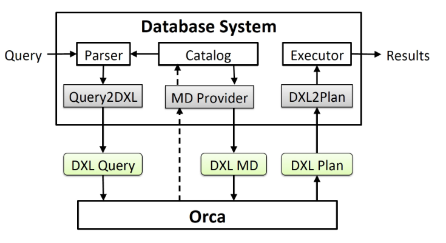
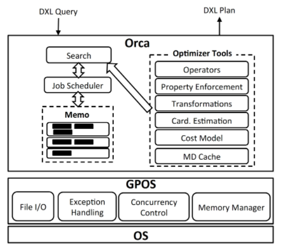
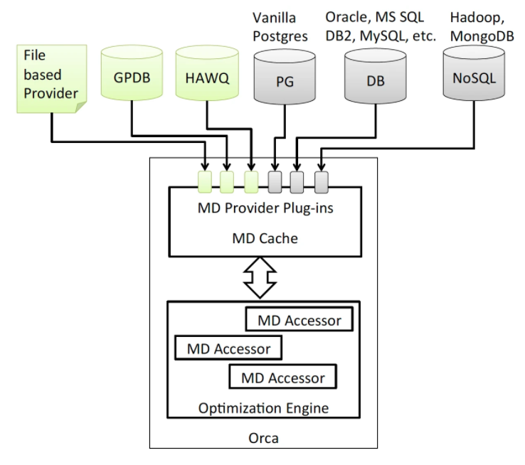

# ORCA架构
> 在 ORCA 构建的伊始，就制定了如下这些目标：
> 1. 模块化：开发的第一天起，ORCA 就完全以一个独立的模块进行开发。所有的数据输入和输出都接口化。这也是为了能够让 ORCA 能够兼容不同的数据库产品。
> 2. 可验证和测试性:在构建ORCA的同时，为了ORCA的可验证性和可测试性，同时构建了一批测试和验证工具，确保ORCA一直在正确的道路上迭代。
> 3. 高延展性：算子类，优化规则(transformation rule)，数据类型类都支持扩展，使得 ORCA 可以不断迭代。方便更高效地加入新的优化规则。
> 4. 高并发优化：ORCA内部实现了可以利用多核并发的调度器来进一步提高对复杂语句的优化效率。

## DB和ORCA交互

DXL(Data eXchange Language)是ORCA暴露出的接口: DXL定制了一套基于XML语言的数据交互接口。这些数据包括：用户输入的查询语句，优化器输出的执行计划，数据库的元数据及数据分布等。

数据库输入 DXL Query 和 DXL Metadata，然后 ORCA 返回 DXL plan。任何数据库系统只要实现 DXL 接口，理论上都可以使用 ORCA 进行查询优化。DXL 接口的另一个好处就在于，大幅度简化了优化器的测试，验证 bug 修复的难度。只需要通过 DXL 输入 mock(假数据)数据，就可以让 ORCA 进行优化并输出执行结果，而不需要真正搭建一个实体数据库来操作。

## 架构机制

ORCA架构分成以下几个模块：
### Memo
> 存储执行计划的搜索空间的叫Memo, Memo就是一个非常高效的存储搜索空间的数据结构, 由一系列的集合(group)构成。每个group代表执行计划的一个子表达式(想对应与查询语句的一个子表达式)。不同的 group 又产生相互依赖的关系。根 group 就代表整个查询语句[1]。

### Search&Job scheduler
> ORCA实现了一套算法来扫描Memo并计算得到预估代价最小的执行计划。搜索由Job Scheduler调度和分配，调度会生成相应的有依赖关系或者可并行的搜索子工作。这些工作主要分成三步:
> - **第一步是Exploration，探索和补全计划空间**，就是根据优化规则不断生成语义相同的逻辑表达式。举个例子，select * from a, b where a.c1 = b.c2 可以生成两个语义相同的逻辑表达式： a join b 和 b join a
> - **第二步是Implementation，就是实例化逻辑表达式变成物理算子**。比如， a join b 可以变成 a hash_join b 或者 a merge_join b。
> - **第三步是优化，把计划的必要条件都加上**，比如某些算子需要 input 被排过序，数据需要被重新分配等等。然后对不同的执行计划进行算分，来计算最终预估代价。
> 优化时，首先进行 property enforcement，然后不同的物理执行计划被计算出预估代价 Cost(即Cost Model Calibration)。每个对应的物理算子会有一个 cost formula，配合上 cardinality estimation 计算出来的输入和输出，就可以算出相应的 cost。整个过程是首先发送一个优化请求给根 group。这个优化请求一般会有结果的分布或者结果的排序的条件，同时它要求获取当前 group 里 Cost 最小的执行计划。
对于优化请求，每一组物理算子会先计算自身的那一部分 cost。同时把请求发送给子算子，这和 statistics derivation 的模式是一样的。对于一个物理算子组来说，可能在整个优化过程中接受到重复的优化请求，ORCA 会把这些请求 cache 起来去重，用来确保对相同请求，只计算一次。

### Plan Transformation
> Plan transformation 就是刚才优化中第一步 exploration 的详解，如何通过优化规则来补全计划空间。
> 例如，下面一则优化规则`InnerJoin(A,B) -> InnerJoin(B,A)`。
> 这些Transformation的条件通过触发将新的表达式，存放到Memo中的同一个group里。
### Cardinality Estimation (Statistics Derivation)
Cardinality estimation用来估算每一个SQL节点的输入和输出量。每一组逻辑表达式其实是一个 SQL 节点的一部分，举个例子，scan of table1 估计出有多少行数据被输出。ORCA 内部用 column histogram 来预估 cardinality 和可能的数据分布情况。Cardinality estimation 是自底向上进行，也就是先从叶 group 开始，最后至根节点。

### Property Enforcement
> 在优化过程中，有些算子的实现需要一些先决条件。比如:
> - sortGroupBy需要input是排序过的。这时候就需要enforce order属性property。加入了这个property，ORCA 在优化的过程中就会要求子节点能满足这个要求。比如要让子节点满足sort order property，一个可能的方法是对其进行排序，或者，有些子节点的算子可以直接满足条件，比如 index scan[1].

### Metadata Cache
> 数据库中表的元数据(column 类型)等变动不会太大，因此 Orca 把表的元数据缓存在内存用来减少传输成本，只有当元数据发生改变时(metadata version 改变时)，再请求获取最新的元数据[1]。

### GPOS
> 为了可以运行在不同操作系统上，ORCA 也实现了一套 OS 系统的 API 用来适配不同的操作系统包括内存管理，并发控制，异常处理和文件 IO 等等[1]。

# 并行优化
> 执行优化可能是最消耗 CPU 资源的过程。更高效地执行优化过程来产生高效的执行计划可以大幅度提升整个数据库的性能。考虑到现在服务器的多核配置，如何利用多核资源来加速优化过程是 ORCA 的另一个重要的特性。ORCA 的 job scheduler 配合 GPOS 就可以利用多核进行并行优化。整个优化过程其实是被分发到每个物理算子组中进行，每个组在执行优化的过程中，根据依赖关系，可以并行进行。

# 元数据获取
> **ORCA 一大特性是可以独立于数据库系统运行。** 元数据获取就是 ORCA 和数据库系统一个重要的交互。在优化中，ORCA 需要知道表的数据分布，对于 column 的 histogram，或者对于某个 column 是否有 index 等的信息。在优化过程中，所有的元数据信息会被 cache 在 ORCA 中。优化过程中，ORCA 通过 MDAccessor 来获取所有的元数据。MDProvider 除了 plug-in 到其他系统，也提供了文件形式导入 metadata。这就使得测试 ORCA 变得非常容易：我们可以单独运行 ORCA 程序，通过文件形式提供 metadata 和 SQL 语句来获取 ORCA 的执行计划来测试。

# 参考资料
