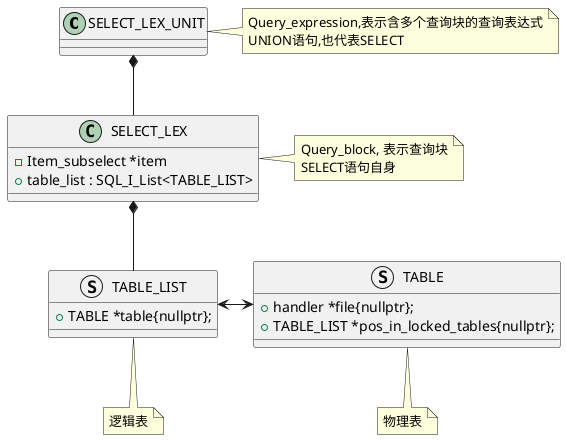

```plantuml
@startuml
class SELECT_LEX_UNIT {

}
note right: Query_expression,表示含多个查询块的查询表达式\nUNION语句,也代表SELECT

class SELECT_LEX {
- Item_subselect *item
+ table_list : SQL_I_List<TABLE_LIST>
}
note right : Query_block, 表示查询块\nSELECT语句自身

struct TABLE_LIST {
+ TABLE *table{nullptr};
}
note bottom : 逻辑表

struct TABLE {
+ handler *file{nullptr};
+ TABLE_LIST *pos_in_locked_tables{nullptr};
}
note bottom : 物理表

SELECT_LEX -up-* SELECT_LEX_UNIT
TABLE_LIST -up-* SELECT_LEX
TABLE_LIST <-> TABLE
@enduml
```

