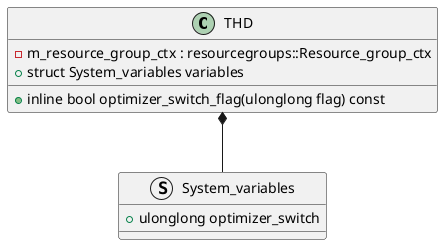
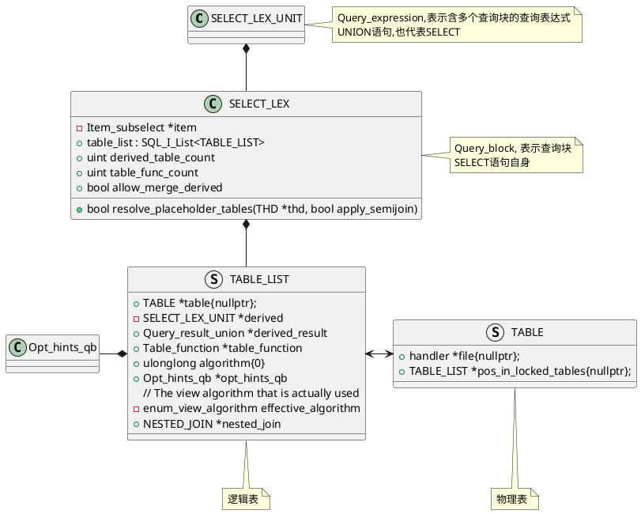

MySQL将`FROM`后的子查询称作Derived Table(派生表)，View。它是复杂SQL执行过程中的中间表，存放SQL执行过程的中间数据。

```sql
SELECT * FROM (
    -- derived table，属于一个抽象的表概念
    SELECT * FROM t1) AS derived_t1;
```

Derived Table有两种优化策略：

1.  将Derived Table合并(Merge)到外部的查询

    ```sql
    SELECT * FROM (SELECT * FROM t1) AS derived_t1;
    -- 如果merge derived table等价于
    SELECT * FROM t1;
    
    SELECT * FROM t1 JOIN (SELECT t2.f1 FROM t2) AS derived_t2
      	ON t1.f2=derived_t2.f1 WHERE t1.f1 > 0;
    -- merge derived table等价于
    SELECT t1.*, t2.f1 FROM t1 JOIN t2 ON t1.f2=t2.f1
      WHERE t1.f1 > 0;
    ```

2. 物化(Materialize) Derived Table到内存中生成一张临时表

    ```sql
    SELECT * FROM (
        -- 这是derived table,可以将其物化(中间执行结果保存在内存)
        -- 直接从该内存中的数据进行计算
        SELECT * FROM t1) AS derived_t1;
    ```


# 优化策略控制

1. 通过`NO_MERGE`和`MERGE`进行是否合并的控制。

    ```sql
    -- disable merge,采用物化策略
    select/*+NO_MERGE(dt)*/ * from (select * from t1) dt;
    
    -- enable merge,等价于select * from t1;
    select/*+MERGE(dt)*/ * from (select * from t1) dt;
    ```

2. `optimizer_switch`提供了对是否支持merge derived table。

    ```sql
    -- disable merge derived table
    set optimizer_switch='derived_merge=OFF';
    
    -- enable merge derived table
    set optimizer_switch='derived_merge=ON';
    ```

3. 在`CREATE VIEW`的时候指定`ALGORITHM=MERGE | TEMPTABLE`， 默认是MERGE方式。如果指定是`TEMPTABLE`，将不会对VIEW进行Merge Derived table操作。

    ```sql
    -- 创建视图采用TEMPTABLE算法,不对视图merge
    CREATE ALGORITHM=TEMPTABLE VIEW merge_view_test2 as (SELECT * FROM t1);
    
    EXPLAIN format=tree
    SELECT * FROM merge_view_tesst2;
    
    /* 计划
    -> Table scan on merge_view_test2
        -> Materialize
            -> Table scan on t1  (cost=0.85 rows=6)
    */
    ```
# 数据结构类图





```C++
SELECT_LEX::resolve_placeholder_tables {
    // 1. 递归地对每个derived table变换
    TABLE_LIST::resolve_derived {
        derived->prepare()
    }

    // 2. 将derived Table和父查询进行Merge
    SELECT_LEX::merge_derived
}

```