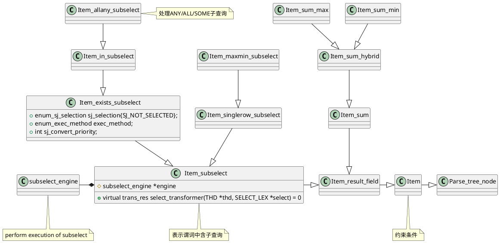
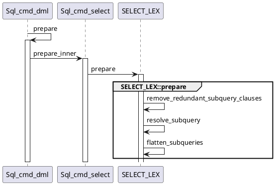
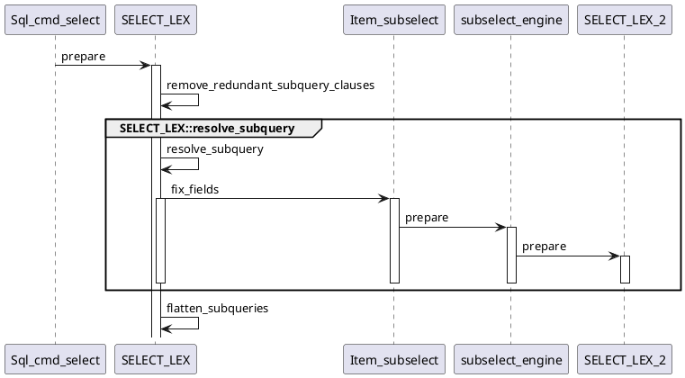

MySQL将除了出现在FROM的子查询，将出现在投影列、条件、having，甚至group by/order by中子查询称作subselect。其对应的SQL语法形态包括:
```sql
-- 在MySQL中SOME是ANY的别称，两者等价
operand comparison_operator SOME (subquery)

-- 存在性问题，只要有一个为真即为真
operand comparison_operator ANY (subquery)
-- 任意问题，所有都为真才为真
operand comparison_operator ALL (subquery)

non_subquery_operand comparison_operator (subquery)

operand [NOT] EXISTS (subquery)
operand [NOT] IN (subquery)
```
其中`comparison_operator`是`=, >, <,  >=,  <=,  <>,  !=`的一种。

MYSQL提供的优化策略有
| 优化策略                                                     | 描述                                                        |
| ------------------------------------------------------------ | ----------------------------------------------------------- |
| `MIN/MAX`优化，可以利用索引加速<br/><br/>例如: `SELECT a FROM t1 WHERE a > ANY(SELECT a FROM t2) `<br/>等价转化为<br/>`SELECT a FROM t1 WHERE a > (SELECT MIN(a) FROM t2);` |                                                             |
| 物化<br/><br/>将子查询的结果保存为临时表，之后直接访问该结果集 |                                                             |
| 转化为Semi Join或Anti Join<br/><br/>IN/EXISTS转化为Semi Join<br/>NOT IN/NOT EXISTS转化为Anti Join | 在prepare阶段将IN向相关EXISTS转换，EXISTS再扁平化为SemiJoin |

# 优化策略控制
`optimizer_switch`提供了一些参数进行优化策略的控制
```sql
-- 查询
SELECT @@optimizer_switch;

-- 参数设置
SET [GLOBAL|SESSION] optimizer_switch='command[,command]...';
```

| 配置参数                                                     | 默认值 | 描述 |
| ------------------------------------------------------------ | ------ | ---- |
| [`semijoin`](https://dev.mysql.com/doc/refman/8.0/en/switchable-optimizations.html#optflag_semijoin) | `on`   | 控制是否开启所有半连接查询优化策略，包含semi join和anti join |
| [`materialization`](https://dev.mysql.com/doc/refman/8.0/en/switchable-optimizations.html#optflag_materialization) | `on`   |  控制是否开启物化，包含semijoin的物化 |
| [`subquery_materialization_cost_based`](https://dev.mysql.com/doc/refman/8.0/en/switchable-optimizations.html#optflag_subquery-materialization-cost-based) | `on`   | 控制是否开启基于代价的物化子查询的选择  |


# 数据结构类图

## 约束条件(谓词)


## SELECT抽象语法树

```plantuml
class SELECT_LEX_UNIT {

}
note right: Query_expression,表示含多个查询块的查询表达式\nUNION语句,也代表SELECT

class SELECT_LEX {
- Item_subselect *item
- sj_candidates : Mem_root_array<Item_exists_subselect *> *
+ table_list : SQL_I_List<TABLE_LIST>
}
note right : Query_block, 表示查询块\nSELECT语句自身

class Item_subselect {
# subselect_engine *engine
+ virtual trans_res select_transformer(\nTHD *thd, SELECT_LEX *select) = 0
}
note top: 表示谓词中含子查询

struct TABLE_LIST {
+ TABLE *table{nullptr};
}
note bottom : 逻辑表

struct TABLE {
+ handler *file{nullptr};
+ TABLE_LIST *pos_in_locked_tables{nullptr};
}
note bottom : 物理表

SELECT_LEX -up-* SELECT_LEX_UNIT
TABLE_LIST -up-* SELECT_LEX
Item_subselect -* SELECT_LEX
TABLE_LIST <-> TABLE
```

# 执行主时序
会话管理将SQL经过Parser语法分析后，通过`dispatch_command`实现将DML命令分发给`Sql_cmd_dml::execute`来执行，这里开始查询优化的Prepare处理。

```plantuml
class Sql_cmd_select {
# virtual bool precheck(THD *thd) override
# virtual bool prepare_inner(THD *thd) override
}

class Sql_cmd_dml {
+ virtual bool execute(THD *thd) overide
+ virtual bool prepare_inner(THD *thd) = 0;
+ virtual bool execute_inner(THD *thd);
}

class Sql_cmd_create_table {
    + bool execute(THD *thd) override
    + bool prepare(THD *thd) override
}

class Sql_cmd_ddl_table {
}

class Sql_cmd {
  + virtual bool execute(THD *thd) = 0;
  + virtual bool prepare(THD *thd);
}

Sql_cmd_select -down--|> Sql_cmd_dml
Sql_cmd_create_table --|> Sql_cmd_ddl_table
Sql_cmd_ddl_table --|> Sql_cmd
Sql_cmd_dml -right--|> Sql_cmd
```

```C++
Sql_cmd_dml::execute(THD *thd)
  Sql_cmd_dml::prepare
    Sql_cmd_select::prepare_inner{
      if (SELECT_LEX_UNIT::is_simple()) {
        // 处理SELECT语句
        SELECT_LEX::prepare
          SELECT_LEX::remove_redundant_subquery_clauses
          // 解析子查询
          // 这里将可以转Semi-Join保存在sj_candidates
          // 待flatten_subqueries进行去关联
          SELECT_LEX::resolve_subquery
          SELECT_LEX::flatten_subqueries
      } else {
        SELECT_LEX_UNIT::prepare
      }
    }
```
对应的时序图，如下：


| 接口                              | 实现主要功能                                                 |
| --------------------------------- | ------------------------------------------------------------ |
| `remove_redundant_subquery_clauses` | 去除子查询中的冗余信息<br/><br/>Optimizer Trace关键词:`transformations_to_subquery`                                     |
| `resolve_subquery`                  | 解析子查询:<br/><br/> 1. MIN/MAX优化<br/> 2. 标记子查询是否可以采取物化执行<br/>3. IN子查询向EXISTS子查询转换 |
| `flatten_subqueries`               | 子查询扁平<br/><br/>Optimizer Trace关键词：<br/>`transformation:{`<br/>...<br/>`from : IN (SELECT)`<br/>`to: semijoin/antijoin`<br/>....<br/>|

## 去除冗余
| 子查询类型                                             | 去除冗余情况                                                 |
| ------------------------------------------------------ | ------------------------------------------------------------ |
| `SINGLEROW_SUBS`                                       | 支持去除ORDER BY<br/>如果没有显示定义limit,去除ORDER BY子句  |
| `EXISTS_SUBS`<br/>`IN_SUBS`<br/>`ALL_SUBS`, `ANY_SUBS` | 去除ORDER BY子句(当前版本不支持在IN/EXISTS/ALL/ANY子查询添加LIMIT)<br/>去除DISTINCT子句<br/>如果没有Agg函数, 没有HAVING, 没有窗口函数和`rollup`,则去除GROUP BY子句 |

删除一些非关键代码来了解主执行流程。

```C++
void SELECT_LEX::remove_redundant_subquery_clauses(
    THD *thd, int hidden_group_field_count) {
  Item_subselect *subq_predicate = master_unit()->item;
  enum change {
    REMOVE_NONE = 0,
    REMOVE_ORDER = 1 << 0,
    REMOVE_DISTINCT = 1 << 1,
    REMOVE_GROUP = 1 << 2
  };
  uint possible_changes;

  // 如果是SINGLEROW_SUBS且没有显式定义limit,删除冗余的ORDER BY子句
  if (subq_predicate->substype() == Item_subselect::SINGLEROW_SUBS) {
    if (explicit_limit) return; // 显示定义了limit
    possible_changes = REMOVE_ORDER;
  } else {
    // 如果是IN/ALL/ANY/EXISTS出现在谓词中
    // ORDERBY/DISTINCT/GROUPBY都是冗余可能会删除
    possible_changes = REMOVE_ORDER | REMOVE_DISTINCT | REMOVE_GROUP;
  }

  // 删除ORDER BY
  if ((possible_changes & REMOVE_ORDER) && order_list.elements) {
    empty_order_list(this);
  }

  // 去除DISTINCT
  if ((possible_changes & REMOVE_DISTINCT) && is_distinct()) {
    remove_base_options(SELECT_DISTINCT);
  }

  // 如果没有agg函数, 没有having, 没有窗口函数和rollup,则删除group by
  if ((possible_changes & REMOVE_GROUP) && group_list.elements &&
      !agg_func_used() && !having_cond() && olap == UNSPECIFIED_OLAP_TYPE &&
      m_windows.elements == 0) {
    for (ORDER *g = group_list.first; g != NULL; g = g->next) {
      if (*g->item == g->item_ptr) {
        Item::Cleanup_after_removal_context ctx(this);
        (*g->item)->walk(&Item::clean_up_after_removal,
                enum_walk::SUBQUERY_POSTFIX, pointer_cast<uchar *>(&ctx));
      }
    }
    group_list.empty();
    while (hidden_group_field_count-- > 0) {
      all_fields.pop();
      base_ref_items[all_fields.elements] = NULL;
    }
  }
}
```

## 子查询解析
```C++
SELECT_LEX::resolve_subquery {
  chose_semijoin = false;

  // 1. 子查询可以扁平化将信息暂存在sj_candidates
  if (子查询是否可以扁平化为semi-join(13个条件)) {
    // 子查询暂存在sj_candidates待待flatten_subqueries进行扁平化
    outer->sj_candidates->push_back(predicate);
    chose_semijoin = true;
  }

  // 如果子查询不可以扁平化，调用select_transformer
  // 对IN/ALL/ANY类型的子查询进行优化
  if (!chose_semijoin && 
    Item_in_subselect::select_transformer {

      Item_in_subselect::select_in_like_transformer {
        // 2. 如果还没设定execution method,暂时设定为EXEC_EXISTS_OR_MAT
        //      表示采用物化或者IN=>EXISTS变换，最后根据代价进行选择
        //      参见 JOIN::decide_subquery_strategy
        // 	    在prepare阶段按照IN=>EXISTS transformation进行处理
        if (exec_method == EXEC_UNSPECIFIED)
          exec_method = EXEC_EXISTS_OR_MAT;
        
        // 3. IN子查询优化
        if (left_expr->cols() == 1) {
          // 3.1 优化标量IN子查询(MySQL称为：Scalar IN Subquery)
          //   IN谓词的左操作数只有一列,则认为是标量IN子查询
          //   例如: (oe1) in (SELECT ie2)
          Item_in_subselect::single_value_transformer
        } else {
          // 3.2 优化行式子查询(MySQL称为：Row IN Subquery)
          //   IN谓词的左操作数不止一列,则认为是行式IN子查询
          //   例如: (oe1, oe2) in (SELECT ie1, ie2)
          Item_in_subselect::row_value_transformer
        }
      }

    }
}
```

## 子查询扁平化

子查询扁平化是自底向上进行的，例如`SELECT#1 WHERE X IN (SELECT #2 WHERE Y IN (SELECT#3))`
```C++
SELECT_LEX::prepare() (select#1)
   // 子查询谓词(Item_subselect)的fix_fields
   // 借助engine进行嵌套语句的prepare处理
   // 参见下面Item_subselect::fix_fields
   // 其中SELECT_LEX::prepare含子查询扁平化
   // 从而实现自底向上的扁平化
   -> fix_fields() on IN condition
       -> SELECT_LEX::prepare() on subquery (select#2)
           -> fix_fields() on IN condition
                -> SELECT_LEX::prepare() on subquery (select#3)
                <- SELECT_LEX::prepare()
           <- fix_fields()
           -> flatten_subqueries: merge #3 in #2
           <- flatten_subqueries
       <- SELECT_LEX::prepare()
   <- fix_fields()
   -> flatten_subqueries: merge #2 in #1
```

```C++
> Item_subselect::fix_fields
    > engine->prepare
        > query_block->prepare
        (Here we realize we need to do the rewrite and set
            substitution= some new Item, eg. Item_in_optimizer )
        < query_block->prepare
    < engine->prepare
    *ref= substitution;
< Item_subselect::fix_fields
```

对应的时序图

去除一些非关键代码来了解主执行流程
```C++
bool SELECT_LEX::flatten_subqueries(THD *thd) {
  Item_exists_subselect **subq, **subq_begin = sj_candidates->begin(),
                                **subq_end = sj_candidates->end();
  auto subq_item = *subq;
  // 1. 建立sj_candidates列表中的子查询扁平化的优先级,之后调用std::sort按照此优先级排序
  for (subq = subq_begin, subq_no = 0; subq < subq_end; subq++, subq_no++) {
    subq_item->sj_convert_priority =
        (((dependent * MAX_TABLES_FOR_SIZE) +  // dependent subqueries first
          child_select->leaf_table_count) * 65536) + // then with many tables
        (65536 - subq_no);  // then based on position
  }

  std::sort(subq_begin, subq_begin + sj_candidates->size(),
            [](Item_exists_subselect *el1, Item_exists_subselect *el2) {
              return el1->sj_convert_priority > el2->sj_convert_priority;});


  // 2. 常量替换
  for (subq = subq_begin; subq < subq_end; subq++) {
    auto subq_item = *subq;
    /**
     *  2.1 同时满足下面条件可以转anti/semi-join(sj_selection=SJ_SELECTED)
     *      1) 没有包含太多的表
     *      2）子查询没有嵌套anti-join(由于实现的原因anti/semi-join
     *         不可以嵌套anti-join), 参见advance_sj_state
    */
    if (table_count + tables_added <= MAX_TABLES &&      // (1)
        !subq_item->unit->first_select()->has_aj_nests)  // (2)
      subq_item->sj_selection = Item_exists_subselect::SJ_SELECTED;

    bool cond_value = true;
    if (subq_where && subq_where->const_item() &&
        !subq_where->walk(....) && simplify_const_condition())
      return true;

    Item *truth_item = (cond_value || subq_item->can_do_aj) ?
            Item_func_true : Item_func_false
    Item **tree = ....
    if (replace_subcondition(thd, tree, subq_item, truth_item, false))
      return true;
  }


  // 3. 将子查询转换为semi/anti join
  for (subq = subq_begin; subq < subq_end; subq++) {
    auto subq_item = *subq;
    // sj_selection初始化为SJ_NOT_SELECTED
    // 如果可以扁平化在常量替换阶段将其修改为SJ_SELECTED
    if (subq_item->sj_selection != Item_exists_subselect::SJ_SELECTED)
        continue;
            .....
    if (convert_subquery_to_semijoin(thd, *subq)) return true;
  }

  // 4. 没有转换的，IN->EXISTS重写
  for (subq = subq_begin; subq < subq_end; subq++) {
    auto subq_item = *subq;

    // 实现对每个子句的子查询的优化
    res = subq_item->select_transformer(thd, subq_item->unit->first_select());
            .....
  }

  // 5. 清理
  sj_candidates->clear();
  
  return false;
}
```
