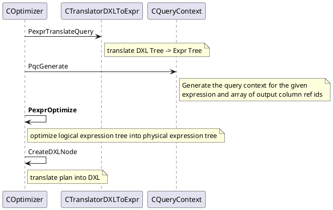
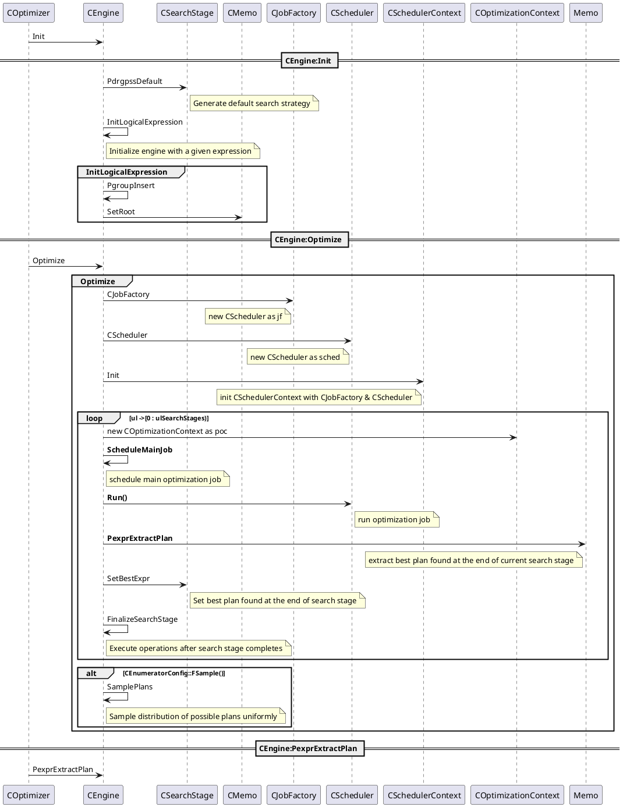

# 查询优化
入口函数是`libgpopt\include\gpopt\optimizer\COptimizer.h`的`static CDXLNode *PdxlnOptimiz`。
```c++
	static CDXLNode *PdxlnOptimize(
		CMemoryPool *mp,
		CMDAccessor *md_accessor,  // MD accessor
		const CDXLNode *query,
		const CDXLNodeArray
			*query_output_dxlnode_array,  // required output columns
		const CDXLNodeArray *cte_producers,
		IConstExprEvaluator *pceeval,  // constant expression evaluator
		ULONG ulHosts,		// number of hosts (data nodes) in the system
		ULONG ulSessionId,	// session id used for logging and minidumps
		ULONG ulCmdId,		// command id used for logging and minidumps
		CSearchStageArray *search_stage_array,	// search strategy
		COptimizerConfig *optimizer_config,		// optimizer configurations
		const CHAR *szMinidumpFileName =
			NULL  // name of minidump file to be created
	);
```
执行的主流程,从

查询优化主要的调用流程在`COptimizer::PexprOptimize`，执行流程

- `CEngine::ScheduleMainJob`中创建了`CJobGroupOptimization`,并将其添加到`m_listjlWaiting`等待队列中。
```C++
class CSchedulerContext {
private:
	CScheduler *m_psched{nullptr};  // scheduler
		......
public:
	// CScheduler通过Add接口将将Job添加到m_listjlWaiting
	CScheduler * Psched() const{ return m_psched; }
		......
};

class CScheduler {
private:
  // list of jobs waiting to execute
  CSyncList<SJobLink> m_listjlWaiting;
  ......
};
```
- `CScheduler::Run()`从WaitingList中取出Job并执行
```plantuml
CScheduler -> CScheduler:Run
CScheduler -> CScheduler:ExecuteJobs
note right of CScheduler : Main job processing task

group CScheduler:ExecuteJobs
    loop nullptr != (pj = PjRetrieve())
    	CScheduler -> CScheduler:PreExecute
    	note right of CScheduler : prepare for job execution
    	
		CScheduler -> CScheduler:FExecute
    	note right of CScheduler : execute job
    	
		CScheduler -> CScheduler:EjrPostExecute
    	note right of CScheduler : process job result
    end
end
```
- `Memo::PexprExtractPlan`从当前的SearchStage中提取最优的计划。

# 任务调度
任务调度的入口函数在`libgpopt\src\search\CScheduler.cpp`的`CScheduler::FExecute`
```C++
BOOL
CScheduler::FExecute(CJob *pj, CSchedulerContext *psc)
```