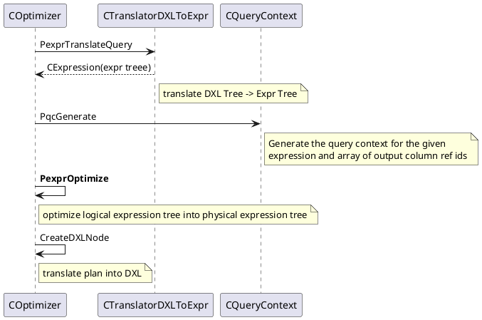
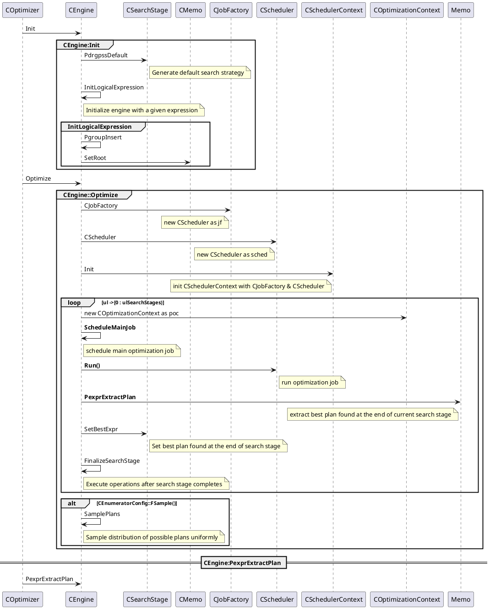
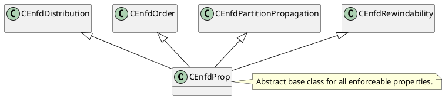
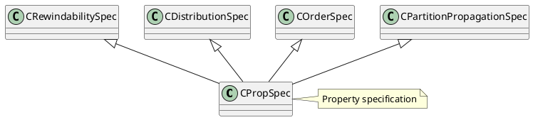
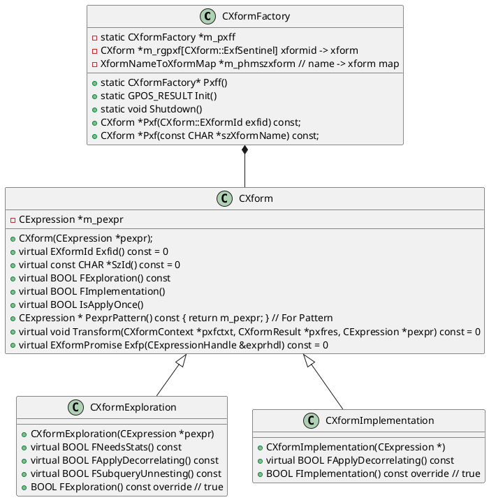

# 查询优化
入口函数是`libgpopt\include\gpopt\optimizer\COptimizer.h`的`static CDXLNode *PdxlnOptimiz`。
```c++
	static CDXLNode *PdxlnOptimize(
		CMemoryPool *mp,
		CMDAccessor *md_accessor,  // MD accessor
		const CDXLNode *query,
		const CDXLNodeArray
			*query_output_dxlnode_array,  // required output columns
		const CDXLNodeArray *cte_producers,
		IConstExprEvaluator *pceeval,  // constant expression evaluator
		ULONG ulHosts,		// number of hosts (data nodes) in the system
		ULONG ulSessionId,	// session id used for logging and minidumps
		ULONG ulCmdId,		// command id used for logging and minidumps
		CSearchStageArray *search_stage_array,	// search strategy
		COptimizerConfig *optimizer_config,		// optimizer configurations
		const CHAR *szMinidumpFileName =
			NULL  // name of minidump file to be created
	);
```

删除`COptimizer::PdxlnOptimize`的部分非主要代码来了解一下主流程。
```C++
// COptimizer的主要流程
CDXLNode* COptimizer::PdxlnOptimize(
    CMemoryPool *mp, CMDAccessor *md_accessor, const CDXLNode *query,
    ...) {
  // translate DXL Tree -> Expr Tree
  CTranslatorDXLToExpr dxltr(mp, md_accessor);
  CExpression *pexprTranslated =	dxltr.PexprTranslateQuery(query,
       query_output_dxlnode_array, cte_producers);
  
  // Expr Tree -> Query context
  // 在CQueryContext构造调用CExpressionPreprocessor::PexprPreprocess
  CQueryContext *pqc = CQueryContext::PqcGenerate(mp, pexprTranslated, pdrgpul, pdrgpmdname, true /*fDeriveStats*/);
  
  // optimize logical expression tree into physical expression tree.
  CExpression *pexprPlan = PexprOptimize(mp, pqc, search_stage_array);
  
  // translate plan into DXL
  CDXLNode *pdxlnPlan = NULL;
  pdxlnPlan = CreateDXLNode(mp, md_accessor, pexprPlan, pqc->PdrgPcr(), pdrgpmdname,ulHosts);
}
```
执行的主流程,从

查询优化主要的调用流程在`COptimizer::PexprOptimize`, 主要执行代码
```C++
// Optimize query in given query context
CExpression *
COptimizer::PexprOptimize(CMemoryPool *mp, CQueryContext *pqc,
        CSearchStageArray *search_stage_array)
{
    CEngine eng(mp);
    eng.Init(pqc, search_stage_array);
    eng.Optimize();

    CExpression *pexprPlan = eng.PexprExtractPlan();

    CheckCTEConsistency(mp, pexprPlan);

    PrintQueryOrPlan(mp, pexprPlan);
    return pexprPlan;
}
```

```C++
void
CEngine::Optimize()
{
    const ULONG ulJobs =
        std::min((ULONG) GPOPT_JOBS_CAP,
                    (ULONG)(m_pmemo->UlpGroups() * GPOPT_JOBS_PER_GROUP));
    CJobFactory jf(m_mp, ulJobs);
    CScheduler sched(m_mp, ulJobs);
    CSchedulerContext sc;
    sc.Init(m_mp, &jf, &sched, this);

    const ULONG ulSearchStages = m_search_stage_array->Size();
    for (ULONG ul = 0; !FSearchTerminated() && ul < ulSearchStages; ul++)
    {
        PssCurrent()->RestartTimer();

        // optimize root group
        m_pqc->Prpp()->AddRef();
        COptimizationContext *poc = GPOS_NEW(m_mp) COptimizationContext(
            m_mp, PgroupRoot(), m_pqc->Prpp(),
            // pass empty required relational properties initially
            GPOS_NEW(m_mp) CReqdPropRelational(GPOS_NEW(m_mp) CColRefSet(m_mp)),
            // pass empty stats context initially
            GPOS_NEW(m_mp) IStatisticsArray(m_mp),
            m_ulCurrSearchStage);

        // schedule main optimization job
        ScheduleMainJob(&sc, poc);

        // run optimization job
        CScheduler::Run(&sc);

        poc->Release();

        // extract best plan found at the end of current search stage
        CExpression *pexprPlan = m_pmemo->PexprExtractPlan(
            m_mp, m_pmemo->PgroupRoot(), m_pqc->Prpp(),
            m_search_stage_array->Size());
        PssCurrent()->SetBestExpr(pexprPlan);

        FinalizeSearchStage();
    }

    if (CEnumeratorConfig::FSample())
    {
        SamplePlans();
    }
}

```
执行流程

- `CEngine::ScheduleMainJob`中创建了`CJobGroupOptimization`,并将其添加到`m_listjlWaiting`等待队列中。
```C++
class CSchedulerContext {
private:
	CScheduler *m_psched{nullptr};  // scheduler
		......
public:
	// CScheduler通过Add接口将将Job添加到m_listjlWaiting
	CScheduler * Psched() const{ return m_psched; }
		......
};

class CScheduler {
private:
  // list of jobs waiting to execute
  CSyncList<SJobLink> m_listjlWaiting;
  ......
};
```
- `CScheduler::Run()`从WaitingList中取出Job并执行
```plantuml
CScheduler -> CScheduler:Run
CScheduler -> CScheduler:ExecuteJobs
note right of CScheduler : Main job processing task

group CScheduler:ExecuteJobs
    loop nullptr != (pj = PjRetrieve())
    	CScheduler -> CScheduler:PreExecute
    	note right of CScheduler : prepare for job execution
    	
		CScheduler -> CScheduler:FExecute
    	note right of CScheduler : execute job
    	
		CScheduler -> CScheduler:EjrPostExecute
    	note right of CScheduler : process job result
    end
end
```
- `Memo::PexprExtractPlan`从当前的SearchStage中提取最优的计划。

# CTranslatorDXLToExpr
```C++
CExpression *
CTranslatorDXLToExpr::PexprTranslateQuery(
	const CDXLNode *dxlnode, const CDXLNodeArray *query_output_dxlnode_array,
	const CDXLNodeArray *cte_producers)
{
        ......
	CExpression *pexpr =
		Pexpr(dxlnode, query_output_dxlnode_array, cte_producers);
	MarkUnknownColsAsUnused();
    return pexpr;
}
```
```C++
// Translate a DXL tree into an Expr Tree
CExpression *
CTranslatorDXLToExpr::Pexpr(const CDXLNode *dxlnode,
        const CDXLNodeArray *query_output_dxlnode_array,
        const CDXLNodeArray *cte_producers)
{
        .......
	// translate main DXL tree
	CExpression *pexpr = Pexpr(dxlnode);
        ......

	return pexpr;
}
```
```C++
// Translates a DXL tree into a Expr Tree
CExpression *
CTranslatorDXLToExpr::Pexpr(const CDXLNode *dxlnode)
{
	CDXLOperator *dxl_op = dxlnode->GetOperator();
	CExpression *pexpr = nullptr;
	switch (dxl_op->GetDXLOperatorType())
	{
		case EdxloptypeLogical:
			pexpr = PexprLogical(dxlnode);
			break;

		case EdxloptypeScalar:
			pexpr = PexprScalar(dxlnode);
			break;

		default:
			GPOS_RAISE(gpopt::ExmaGPOPT, gpopt::ExmiUnsupportedOp,
					   dxlnode->GetOperator()->GetOpNameStr()->GetBuffer());
	}

	return pexpr;
}
```
```plantuml
class CDXLNode {
	- CDXLOperator *m_dxl_op
	- CDXLProperties *m_dxl_properties
	- CDXLNodeArray *m_dxl_array
	- CDXLDirectDispatchInfo *m_direct_dispatch_info
}
```
# Property
EnfdProp负责增加属性算子，DrvdProp用来计算算子所能提供的属性，PropSpec为算子属性描述类，ReqdProp用来计算对孩子的属性请求

Enforceable Property


Derived Properties
```plantuml
@startuml
class CDrvdProp {
    + virtual EPropType Ept() = 0
    + virtual void Derive(CMemoryPool *mp, CExpressionHandle &exprhdl, CDrvdPropCtxt *pdppropctxt) = 0
    + virtual BOOL FSatisfies(const CReqdPropPlan *prpp) const = 0
}

class CDrvdPropScalar

note right of CDrvdProp : Abstract base class for all derived properties
note right of CDrvdPropRelational : Derived logical properties container
note right of CDrvdPropPlan : Derived plan properties container

CDrvdPropScalar <|-- CDrvdProp
CDrvdPropRelational <|-- CDrvdProp
CDrvdPropPlan <|-- CDrvdProp

CDrvdPropCtxtRelational <|-- CDrvdPropCtxt
CDrvdPropCtxtPlan <|-- CDrvdPropCtxt
@enduml
```
required properties
```plantuml
class CReqdProp {
    + virtual BOOL FRelational() const
    + virtual BOOL FPlan() const
    + virtual void Compute(CMemoryPool *mp, CExpressionHandle &exprhdl,
            CReqdProp *prpInput, ULONG child_index,
            CDrvdPropArray *pdrgpdpCtxt, ULONG ulOptReq) = 0;
}
class CReqdPropPlan
class CReqdPropRelational

note right of CReqdProp : Abstract base class for all required properties

CReqdPropPlan <|-- CReqdProp
CReqdPropRelational <|-- CReqdProp

```
Property specification

# Config
```C++
class CConfigParamMapping
{
private:
    // Unit describing the mapping of a single GPDB config param to a trace flag
    struct SConfigMappingElem
    {
        // trace flag
        EOptTraceFlag m_trace_flag;

        // config param address
        BOOL *m_is_param;
              
        // if true, we negate the config param value before setting traceflag value
        BOOL m_negate_param;
        const WCHAR *description_str;
    };
}
```
# Job Search
任务调度的入口函数在`libgpopt\src\search\CScheduler.cpp`的`CScheduler::FExecute`
```C++
BOOL
CScheduler::FExecute(CJob *pj, CSchedulerContext *psc)
```

# Transformation
利用转换规则生成等价的逻辑表达式，实现包含两步：
- Exploration，探索和补全计划空间，生成逻辑等价的表达式，例如`a INNER JOIN b`和`b INNER JOIN a`。`CXformExploration`作为表达基类，在其上派生出子类来表示相应的规则。
- Implementation,将逻辑算子转换成物理算子。例如`Join(A,B)-> HashJoin(A, B)`。`CXformImplementation`作为基类，对其派生出子类表示相应的转换规则。

`CXformExploration`和`CXformImplementation`都继承自`CXform`，每个XFrom都有一个唯一的EXformId和xformName，之后注册到`CXformFactory`,外界通过`EXformId`或`xformName`便可以获取到xform指针。每个负责具体的Trandformation主要实现`Transform`和`EXformPromise Exfp`计算Promise置信度，ORCA会选择Promise高的GroupExpression，对于promise为`ExfpNone`的不会调用`Transform`接口。

关于Promise在ORCA的论文中有如下相关的描述
> In order to derive statistics for a target group, Orca picks the group expression with the highest promise of delivering reliable statistics. Statistics promise computation is expression-specific. For example, an InnerJoin expression with a small number of join conditions is more promising than another equivalent InnerJoin expression with a larger number of join conditions (this situation could arise when generating multiple join orders). The rationale is that the larger the number of join conditions, the higher the chance that estimation errors are propagated and amplified. Computing a confidence score for cardinality estimation is challenging due to the need to aggregate confidence scores across all nodes of a given expression. We are currently exploring several methods to compute confidence scores in the compact Memo structure.
> 
> 有道翻译供参考：
> 
> 为了获得目标Group的统计信息，Orca选择了最有可能提供可靠统计信息的GroupExpression。 统计保证计算是特定于表达式的。 例如，具有少量连接条件的InnerJoin表达式比具有大量连接条件的另一个等效InnerJoin表达式更有希望(在生成多个JoinOrder时可能会出现这种情况)。 其基本原理是，连接条件的数量越多，估计误差被传播和放大的几率就越高。 由于需要在给定表达式的所有节点上聚合置信度得分，计算基数估计的置信度得分具有挑战性。 我们目前正在探索几种方法来计算紧凑的Memo结构中的置信度分数。

`CXform`主要的接口：
```C++
class CXform {
private:
    // 输入，内含COperator，通过构造函数赋值
    CExpression *m_pexpr

public:
    // XformID,唯一的，借此在CXformFactory的Pxf(CXform::EXformId)获取到CXform指针
    virtual EXformId Exfid() const = 0
    // xform name,借此可以在CXformFactory的Pxf(const CHAR*)获取到CXform指针
    virtual const CHAR *SzId() const = 0
    
    // 表示Tranformation的类型，Exploration为true，否则为false
    virtual BOOL FExploration() const
    // Implementation为true，否则为false
    virtual BOOL FImplementation() const
    
    // Pattren, 在CGroupExpression::Transform中被CBinding使用
    CExpression * PexprPattern() const { return m_pexpr; }

    // 实现Transform的接口，每个具体负责Transformation的类要实现它
    virtual void Transform(CXformContext *pxfctxt, CXformResult *pxfres, CExpression *pexpr) const = 0
    // compute xform promise for a given expression handle
    virtual EXformPromise Exfp(CExpressionHandle &exprhdl) const = 0
}
```

Xform的功能通过`CXformFactory`单例对外提供服务，借助xformID和xformName,来获取相应的`CXform`指针,进而调用相应的计算Promise和TranForm接口。
```C++
class CXformFactory {
public:
    // 初始化，通过CXformFactory::Add接口创建所有的xform
    // 构建基于xformID和CXform的数组映射m_rgpxf
    // <xformName, CXform*>的key-value组合的m_phmszxform
    void Instantiate();

    // 根据xformID获取CXform指针
    CXform *Pxf(CXform::EXformId exfid) const;
    // 根据xformName获取CXform指针
    CXform *Pxf(const CHAR *szXformName) const;

    // 对外的CXformFactory单例访问接口
    static CXformFactory *Pxff()
}
```
