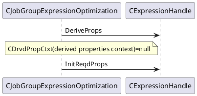
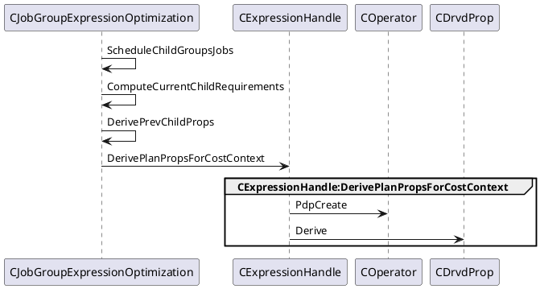
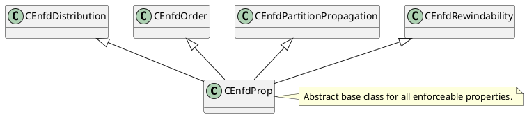
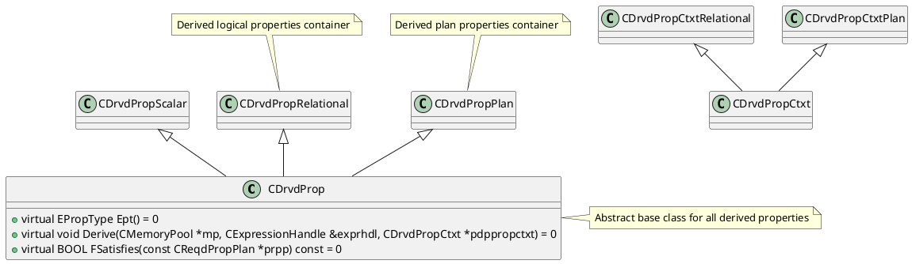
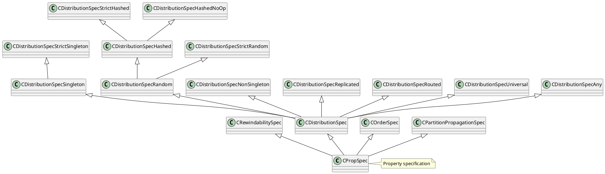

```C++
// Container of information passed among expression nodes during property derivation
class CDrvdPropCtxt : public CRefCount
```
```C++
class CMemo {
private:
    CGroup *m_pgroupRoot; // root group
    	// tree map of member group expressions
	MemoTreeMap *m_pmemotmap;
};

class CGroup {
    friend class CGroupProxy;
private:

};

class CGroupExpression {
private:
    CGroup *m_pgroup;  // back pointer to group

    // id of xform that generated group expression
    CXform::EXformId m_exfidOrigin{CXform::ExfInvalid};

    // group expression that generated current group expression via xform
    CGroupExpression *m_pgexprOrigin;
};
```

```C++
class CExpression {
    friend class CExpressionHandle;
private:
    COperator *m_pop; // operator class
    CExpressionArray *m_pdrgpexpr; // array of children
    CDrvdPropRelational *m_pdprel; // derived relational properties
    IStatistics *m_pstats;
    CReqdPropPlan *m_prpp; // required plan properties
    CDrvdPropPlan *m_pdpplan; // derived physical properties
    CDrvdPropScalar *m_pdpscalar; // derived scalar properties
    CGroupExpression *m_pgexpr; // group reference to Memo
}
```
```C++
class CExpressionHandle {
private:
    CGroupExpression *m_pgexpr; // attached group expression
    CCostContext *m_pcc; // attached cost context

    // required properties of attached expr/gexpr; set during required property computation
    CReqdProp *m_prp;
    // array of children's required properties
    CReqdPropArray *m_pdrgprp;


public:
    // recursive property derivation,
    void DeriveProps(CDrvdPropCtxt *pdpctxt);

    // initialize required properties container
    void InitReqdProps(CReqdProp *prpInput);
}

void CExpressionHandle::DerivePlanPropsForCostContext() {
        ......
    // create/derive local properties
    m_pdpplan = Pop()->PdpCreate(m_mp);
    m_pdpplan->Derive(m_mp, *this, pdpctxtplan);
}
```
## 算子
```C++
class COperator {
public:
    // create container for derived properties
    virtual CDrvdProp *PdpCreate(CMemoryPool *mp) const = 0;
};


CDrvdProp *CScalar::PdpCreate(CMemoryPool *mp) const {
    return GPOS_NEW(mp) CDrvdPropScalar(mp);
}

CDrvdProp *CLogical::PdpCreate(CMemoryPool *mp) const {
    return GPOS_NEW(mp) CDrvdPropRelational(mp);
}

CDrvdProp *CPattern::PdpCreate(CMemoryPool * mp) const {
    GPOS_ASSERT(!"Cannot derive properties on pattern");
    return nullptr;
}

CDrvdProp *CPhysical::PdpCreate(CMemoryPool *mp) const {
    return GPOS_NEW(mp) CDrvdPropPlan();
}
```

## Property
`CJobGroupExpressionOptimization::InitChildGroupsOptimization`调用属性drive流程


`CJobGroupExpressionOptimization::EevtOptimizeChildren`的调用流程

```C++
// Derived logical properties container
class CDrvdPropRelational : public CDrvdProp {}

// Derived scalar properties container.
class CDrvdPropScalar : public CDrvdProp {}

// Derived plan properties container.
class CDrvdPropPlan : public CDrvdProp
```

```C++
// Required relational properties container.
class CReqdPropRelational : public CReqdProp {}

// Required plan properties container.
class CReqdPropPlan : public CReqdProp {
private:
    CEnfdOrder *m_peo; // required sort order
    CEnfdDistribution *m_ped; // required distribution
    CEnfdRewindability *m_per; // required rewindability
    CEnfdPartitionPropagation *m_pepp; // required partition propagation
}
```

```C++
// Abstract base class for all enforceable properties.
class CEnfdProp {}

// Enforceable order property;
class CEnfdOrder : public CEnfdProp {}

// Enforceable distribution property;
class CEnfdDistribution : public CEnfdProp{}

// Enforceable distribution property
class CEnfdPartitionPropagation : public CEnfdProp {}

// Enforceable rewindability property;
class CEnfdRewindability : public CEnfdProp {}
```
EnfdProp负责增加属性算子，DrvdProp用来计算算子所能提供的属性，PropSpec为算子属性描述类，ReqdProp用来计算对孩子的属性请求

Enforceable Property


Derived Properties

required properties
```plantuml
class CReqdProp {
    + virtual BOOL FRelational() const
    + virtual BOOL FPlan() const
    + virtual void Compute(CMemoryPool *mp, CExpressionHandle &exprhdl,
            CReqdProp *prpInput, ULONG child_index,
            CDrvdPropArray *pdrgpdpCtxt, ULONG ulOptReq) = 0;
}
class CReqdPropPlan
class CReqdPropRelational

note right of CReqdProp : Abstract base class for all required properties

CReqdProp --|> CReqdPropPlan
CReqdPropPlan *-- CEnfdOrder
CReqdPropPlan *-- CEnfdRewindability
CReqdPropPlan *-- CEnfdDistribution
CReqdPropPlan *-- CEnfdPartitionPropagation
CReqdPropPlan *-- CCTEReq

CEnfdDistribution <|-- CEnfdProp
CEnfdOrder <|-- CEnfdProp
CEnfdPartitionPropagation <|-- CEnfdProp
CEnfdRewindability <|-- CEnfdProp
note right of CEnfdProp : Abstract base class for all enforceable properties.

CReqdProp --|> CReqdPropRelational

```
Property specification
